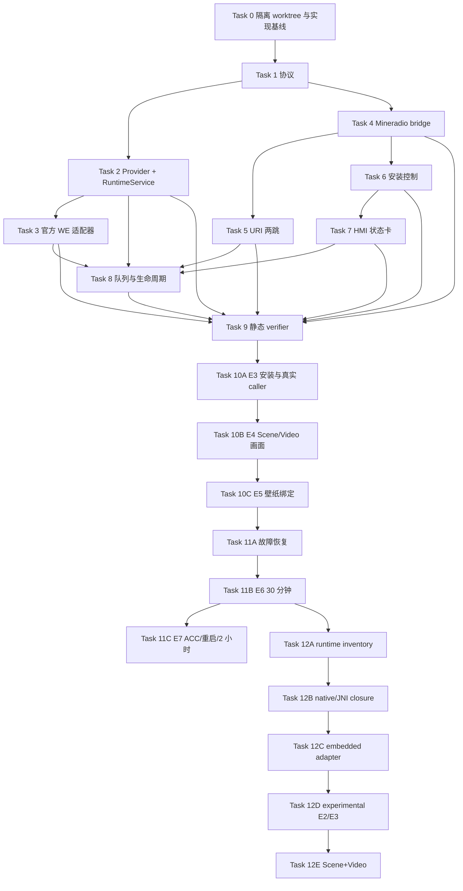

# Mineradio Wallpaper Engine 独立插件进程 Implementation Plan

> **For agentic workers:** REQUIRED SUB-SKILL: Use `subagent-driven-development`（推荐）或 `executing-plans`，按本文任务顺序逐项执行。所有执行项使用 checkbox 跟踪；每个循环都必须完成 RED → GREEN → REFACTOR → VERIFY → COMMIT。

**Goal:** 在华为 Android 12 车机沙盒中，让 Mineradio 完成 Wallpaper Engine 插件的检测、安装引导、`.mpkg` 投递、运行控制、状态查询与故障恢复，同时将实际壁纸运行隔离在独立插件 APK/进程中。

**Architecture:** Mineradio 继续采用 APKTool + Smali + MENC 资源补丁，不嵌入 Android Gradle 工程。独立插件 APK 使用 `/Users/anpple/Codex/WallpaperEngine` 的 Android 工程构建；插件用 `ContentProvider.call()` 提供版本化控制面，并把 Provider 放入 `:we_runtime` 独立进程。官方 `io.wallpaperengine.weclient` 先作为实际 SceneLib/WEWallpaperService 宿主；沙盒最大实现阶段再验证把官方运行时移入插件 APK。

**Tech Stack:** Android 12/API 31、Kotlin/JVM 17、Android Gradle Plugin、APKTool 3.0.2、Smali、Node.js `node:test`、FileProvider、`ContentProvider.call()`、显式 Intent、WallpaperManager/R3 ADB fallback、Lyra 安装链路、ADB。

## 执行总闸（fail-closed）

本文件当前仍是**待终审、待提交的纯开发计划**，不是实现完成证明。以下 Gate 必须按顺序全部由机器回读成立，才允许执行 WP-00：

1. `WP-PLAN-01=PLAN_COMMITTED/DONE`，计划双提交已 exact push/readback；
2. 计划 PR merged/readback 已完成，且 `refs/remotes/origin/huawei-android12-car` 包含该 merge SHA；
3. 不计权前置任务 `WP-INFRA=DONE`：runner/schema/catalog/bootstrap tests 已提交，runner commit 已 exact push/readback，权威 base 可读取该 runner SHA。

任一 Gate 缺失时不得启动或执行 WP-00。此时只允许继续 `WP-PLAN-01` 审查/基线提交或执行 `WP-INFRA`；**禁止创建 WP-00 transaction、禁止创建实现 worktree、禁止运行 WP-01～WP-12、禁止把脚本路径写成“已存在/已提交”，也禁止宣称 APK、插件、E3～E7 或实车能力已实现。** 当前计划状态保持未完成。

## Global Constraints

- 本计划仅适用于用户明确授权的**沙盒最大实现轨道**；版权和再分发许可不作为沙盒技术门禁。
- 生产/公开发布状态必须与沙盒技术状态分开；未经单独决策，不把插件入口设为车机默认主路径，不发布包含第三方 APK、`.so` 或 `.mpkg` 的产物。
- Mineradio 仓库只 push `origin`，禁止 push `upstream`；目标集成分支为 `huawei-android12-car`，短期实现分支使用 `codex/*`。
- `/Users/anpple/Codex/WallpaperEngine` 主工作区当前有大量未提交内容，只读参考；实现必须在独立 worktree 中重建，不清理、不覆盖主工作区。
- 禁止提交 APK、MPKG、JKS、密码、Token、Cookie、登录态、实车截图、原始 logcat 和官方闭源二进制；本地沙盒可以使用这些测试材料。
- 默认设备：`LD249H019625`，Android user `12`，Android 12/API 31，横屏 1920×1080 @ 320dpi。
- 构建、签名、安装、设备验收必须串行；架构、插件代码、Mineradio 桥、测试脚本、文档可按独占文件并行。
- 破坏性重装 Mineradio 仍要求 `CLEAN_REINSTALL=1` 与 `ALLOW_DATA_LOSS_REINSTALL=YES`；插件清数据或卸载必须单独记录并得到数据损失确认。
- 每个里程碑只在 Definition of Done 全部满足后计入进度；源码测试、APK 构建、安装、运行、实车验收不得互相替代。

---

## 1. 范围与最终形态

### 1.1 三包、至少四个运行实体

```mermaid
flowchart LR
    UI["Mineradio WebView\ncom.mineradio.app"]
    BR["CarWallpaperPluginBridge\nMineradio 主进程"]
    CP["PluginControlProvider + RuntimeService\ncom.motif.wallpaperengine:we_runtime"]
    APP["PluginActionActivity / Settings\ncom.motif.wallpaperengine"]
    WE["Official WE app process(es)\nBrowseActivity + WEWallpaperService"]
    SYS["system_server\nWallpaperManagerService"]
    LYRA["Lyra / R3 ADB / OEM"]

    UI -->|"JS interface"| BR
    BR -->|"ContentProvider.call + Mineradio sourceUri"| CP
    CP -->|"Bundle: native PendingIntent + metadata"| BR
    BR -->|"store native action token"| UI
    UI -->|"user click: confirmUserAction(token)"| BR
    BR -->|"PendingIntent.send()"| APP
    APP -->|"startForegroundService(operationId)"| CP
    CP -->|"staging complete: engineUri + action"| APP
    APP -->|"ACTION_VIEW + engineUri"| WE
    WE <-->|"bind wallpaper service"| SYS
    BR -->|"structured fallback request"| LYRA
    LYRA -->|"authorized apply request"| SYS
```



| 包/进程 | 固定标识 | 职责 |
| --- | --- | --- |
| Mineradio | `com.mineradio.app` | 车机 UI、插件检测、安装入口、命令发起、状态展示、`.mpkg` 来源暂存 |
| 插件 UI 进程 | `com.motif.wallpaperengine` | `PluginActionActivity`、设置、诊断和用户确认入口；由 Provider 返回的 `PendingIntent` 启动 |
| 插件 runtime 进程 | `com.motif.wallpaperengine:we_runtime` | Provider 作为按需 IPC 入口；`PluginRuntimeService` 执行有界任务；ledger/状态持久化；进程可被系统回收 |
| 官方 WE | `io.wallpaperengine.weclient` | 第一阶段负责 PKGM/SceneLib/PreviewActivity/WEWallpaperService；Service 属于官方应用组件，是否另设进程以目标 Manifest/设备 `dumpsys` 为准 |

### 1.2 “完全控制”的可验证定义

Mineradio 必须能够完成以下动作，且每个动作有结构化结果：

1. `ping`：确认插件 authority、协议版本、插件版本和 runtime PID。
2. `status`：返回插件、官方 WE、当前导入、壁纸绑定和最后错误状态。
3. `installPlugin`：Mineradio 本地 bridge 从已授权 `content://` URI 启动 PackageInstaller；它不是 Provider method，因为插件未安装时 Provider 不存在。需要用户确认时返回 `USER_ACTION_REQUIRED`。
4. `import_mpkg`：把 Mineradio FileProvider 的只读 `content://` sourceUri 投递给插件；插件复制后生成自己的 engineUri，再交给官方 WE。
5. `open_library`：显式打开官方 `BrowseActivity`。
6. `apply_current`：请求设置当前 WEWallpaperService；无权限时生成 R3/Lyra fallback 状态。
7. `next` / `previous`：切换插件维护的壁纸队列，并重新导入/应用目标项。
8. `stop`：停止插件正在执行的导入/控制任务，不强制杀死系统壁纸服务。
9. `diagnostics`：返回非敏感诊断摘要，不返回用户路径、Token、Cookie 或密钥。

### 1.3 非目标

- 不把 Wallpaper Engine 渲染画面覆盖在 Mineradio 播放页上方。
- 不让插件申请或持有媒体音频焦点。
- 不把任意 shell 命令暴露为 IPC 方法。
- 不允许 Mineradio 传入任意 `file://` 路径；跨包文件只使用一次性只读 `content://` URI。
- 第一阶段不直接构造官方私有 `WallpaperInfoSparse` 启动 `PreviewActivity`；先走公开可达的 `BrowseActivity` 导入链路。
- 不把“插件已安装”记为“.mpkg 已运行”，不把“预览成功”记为“系统壁纸已绑定”。

---

## 2. 仓库与 Git 工作流

### 2.1 Mineradio

```sh
set -euo pipefail
cd /Users/anpple/Codex/Mineradio
git fetch origin
git switch huawei-android12-car
git pull --ff-only origin huawei-android12-car
git switch -c codex/wallpaper-plugin-control
```

执行分支必须从已合并本文档的 `huawei-android12-car` 创建。基线提交门禁只运行当前存在的文件：

```sh
set -euo pipefail
cd /Users/anpple/Codex/Mineradio
node --test android-car/tests/*.test.js
bash -n android-car/scripts/build-car-apk.sh
bash -n android-car/scripts/install-huawei-car.sh
bash -n android-car/scripts/verify-huawei-car.sh
bash -n android-car/scripts/verify-stage-showcase.sh
node --check android-car/scripts/patch-car-hmi-assets.js
node --check android-car/scripts/car-visual-runtime.js
git diff --check
git status --short --branch
```

Task 4 创建 `patch-wallpaper-plugin-bridge.js`、`wallpaper-plugin-contract.js` 后，才把对应 `node --check` 加入后续提交门禁；Task 9 创建 `verify-wallpaper-plugin.sh` 后，才把 `bash -n` 加入门禁。缺失的新文件属于该任务 RED 基线，不得让当前基线门禁伪失败。

### 2.2 WallpaperEngine 插件

主工作区只读：

```text
/Users/anpple/Codex/WallpaperEngine
```

实现 worktree：

```sh
set -euo pipefail
cd /Users/anpple/Codex/WallpaperEngine
git worktree add \
  /Users/anpple/Codex/WallpaperEngine/.worktrees/mineradio-plugin-sandbox \
  -b codex/mineradio-plugin-sandbox \
  f16fee74c15c58307656548bc6082891790de5d0
```

禁止把主工作区脏改动整体复制进新 worktree。只允许按本文接口重新实现，主工作区的以下文件作为只读行为参考：

```text
/Users/anpple/Codex/WallpaperEngine/app/src/main/java/com/motif/wallpaperengine/importscan/WeMpkgDelivery.kt
/Users/anpple/Codex/WallpaperEngine/app/src/main/java/com/motif/wallpaperengine/importscan/WeLibrarySync.kt
/Users/anpple/Codex/WallpaperEngine/app/src/main/java/com/motif/wallpaperengine/importscan/SilentImportProvider.kt
/Users/anpple/Codex/WallpaperEngine/app/src/main/AndroidManifest.xml
```

插件每个提交前使用阶段感知门禁；Task 0-1 尚未引入 caller 证书属性时不传属性，Task 2 起检测到该属性即强制提供真实 64-hex 摘要：

```bash
set -euo pipefail
cd /Users/anpple/Codex/WallpaperEngine/.worktrees/mineradio-plugin-sandbox
if grep -Fq 'mineradioCallerCertSha256' app/build.gradle.kts; then
  : "${MINERADIO_DEBUG_CERT_SHA256:?Extract the matching Mineradio certificate first}"
  [[ "$MINERADIO_DEBUG_CERT_SHA256" =~ ^[0-9A-Fa-f]{64}$ ]]
  ./gradlew test "-PmineradioCallerCertSha256=$MINERADIO_DEBUG_CERT_SHA256"
  ./gradlew lint "-PmineradioCallerCertSha256=$MINERADIO_DEBUG_CERT_SHA256"
  ./gradlew assembleDebug "-PmineradioCallerCertSha256=$MINERADIO_DEBUG_CERT_SHA256"
else
  # macOS 自带 Bash 3.2 在 set -u 下不能安全展开空数组，因此明确走无参数分支。
  ./gradlew test
  ./gradlew lint
  ./gradlew assembleDebug
fi
git diff --check
git status --short --branch
```

插件仓当前没有可推送 remote；这不是可忽略状态。WP-00 开始前必须由用户提供其有写权限的 fork URL：

```bash
set -euo pipefail
cd /Users/anpple/Codex/WallpaperEngine
: "${PLUGIN_ORIGIN_URL:?Set to a user-owned writable WallpaperEngine fork URL}"
if git remote get-url origin >/dev/null 2>&1; then
  test "$(git remote get-url origin)" = "$PLUGIN_ORIGIN_URL"
else
  git remote add origin "$PLUGIN_ORIGIN_URL"
fi
test "$(git remote get-url --push origin)" = "$PLUGIN_ORIGIN_URL"
if git remote get-url --push upstream >/dev/null 2>&1; then
  test "$(git remote get-url --push upstream)" = 'DISABLED'
fi
```

`PLUGIN_ORIGIN_URL` 未提供、origin 不可写或 URL 不匹配时记录 `BLOCKED_PLUGIN_REMOTE`；不得把本地 plugin commit 宣称为 Git workflow 已闭环。

### 2.3 Commit、exact sync 与 PR

提交前缀：

```text
feat(we-plugin): ...
test(we-plugin): ...
fix(we-plugin): ...
docs(we-plugin): ...
feat(android-car): ...
test(android-car): ...
```

规则：

- 一个 commit 对应一个可回滚开发循环；测试与最小实现放在同一 implementation commit，证据与状态收口使用独立 evidence/closure leg。
- 两个仓库分别提交、分别以精确 SHA refspec 同步到各自 `origin`、分别 PR；不跨仓库伪造原子 commit。
- 主会话统一 push；subagent 不 push。Mineradio 与插件都禁止省略 remote 名称、禁止 push `upstream`、禁止 `--force`/`--force-with-lease`。
- 禁止使用未定义 shell helper、普通 `git push origin branch` 或手工 `gh pr create/edit/merge`。**受限的计划基线手工程序**只存在于 transaction runner 尚不存在之前的 WP-PLAN-01：它不是“执行接口例外”，只允许 §4.5 明列的 plan-only exact SHA refspec、`ls-remote` 与 plan PR create/readback，不能用于 WP-INFRA 之后的任何实现、证据、push 或 PR 动作。WP-INFRA 提交后，所有 implementation sync、PR OPEN/readback、merge/readback 与 base containment 都必须由持久 transaction CLI 执行；CLI 在外部操作前写入 `IN_FLIGHT`，恢复先 readback。
- WP-01～WP-08 只推进各自 implementation/checkpoint/closure leg，不创建占位 PR。WP-09 封存 E2 final manifest、完成双仓 exact origin readback 后，才能创建唯一 Plugin implementation PR；Plugin PR merged、Plugin base contains merge 后，才能创建 Mineradio implementation PR。
- PR 描述必须由 transaction 从冻结字段生成完整 body file，并记录对方仓库依赖 commit SHA、Run UUID、evidence manifest SHA-256 与尚未关闭的证据 Gate；回读必须比较 repo/base/head ref/head SHA/body SHA-256 全字段，禁止只搜索 SHA 子串。
- WP-11C 合并 Mineradio implementation PR 后，另建只修改进度表的 progress closure PR；在 implementation PR、progress closure PR 均 merged/readback 且 base containment 通过前，权威 base 状态仍为 `VERIFIED_LOCAL`、`EffectiveDone=false`。closure PR 中的 `DONE` 仅是 proposed DONE，不能提前计权。

PR 和 push 的唯一可执行入口分别在 §4.1.4、§4.1.5 与 §4.1.6 定义。任何绕过 transaction 的命令都属于计划违规，不得用作完成证据。

## 3. 控制协议冻结

### 3.1 Provider

```text
package:   com.motif.wallpaperengine
authority: com.motif.wallpaperengine.control
process:   :we_runtime
exported:  true
```

调用形式：

```kotlin
contentResolver.call(
    Uri.parse("content://com.motif.wallpaperengine.control"),
    method,
    null,
    extras,
)
```

### 3.2 方法与标识域

`callId`、`operationId`、`actionEpoch` 必须分开：

- `callId`：每次 IPC 调用的新 UUID，只用于 trace/响应关联；重试和 `status` 轮询都产生新值。
- `operationId`：一次业务操作的稳定 UUID；`import_mpkg/apply_current/next/previous/stop` 的重试必须复用原值，作为幂等键、URI grant/revoke 键和 evidence 主键。
- `actionEpoch`：同一 `operationId` 下用户动作的递增版本；只有当前 epoch 可消费。Activity/进程恢复不得因为一次 `status()` 轮询就生成新动作。

| method | 必填 extras | 行为 |
| --- | --- | --- |
| `ping` | `protocolVersion`, `callId` | 返回协议、版本、PID、能力列表 |
| `status` | `protocolVersion`, `callId`；可选 `operationId` | 返回当前 operation/binding 状态；指定操作时返回该操作和 source 消费结果；不得递增 `actionEpoch` |
| `renew_action` | `protocolVersion`, `callId`, `operationId`, `actionEpoch` | 仅对当前 `ACTION_PENDING/ENGINE_ACTION_PENDING/APPLY_ACTION_PENDING` 动作执行 compare-and-set 续期；原子生成下一 epoch 的同类用户动作；`ENGINE_ACTION_PENDING` 只能重投已封存的 `engineUri`，禁止再次读取/复制 `sourceUri` |
| `import_mpkg` | `protocolVersion`, `callId`, `operationId`, `sourceUri`, `displayName`, `bytes`, `sha256` | 复制到插件私有 staging；返回用户动作以投递官方 WE |
| `open_library` | `protocolVersion`, `callId`, `operationId` | 返回用户可启动的官方 BrowseActivity `PendingIntent` |
| `apply_current` | `protocolVersion`, `callId`, `operationId` | 请求绑定官方 WEWallpaperService |
| `next` | `protocolVersion`, `callId`, `operationId` | 选择下一项并执行导入/应用 |
| `previous` | `protocolVersion`, `callId`, `operationId` | 选择上一项并执行导入/应用 |
| `stop` | `protocolVersion`, `callId`, `operationId`, `targetOperationId` | 取消目标插件任务；不改变已绑定系统壁纸 |
| `diagnostics` | `protocolVersion`, `callId`；可选 `operationId` | 返回脱敏诊断 |

Mineradio 本地 JS/Smali bridge 冻结为 `ping()`、`status(operationId?)`、`renewAction(operationId, actionEpoch)`、`importMpkg(operationId, sourceUri)`、`openLibrary(operationId)`、`applyCurrent(operationId)`、`next(operationId)`、`previous(operationId)`、`stop(operationId, targetOperationId)`、`diagnostics(operationId?)`、`installPlugin(sourceUri)` 与 `confirmUserAction(actionToken)`；所有变更命令由 HMI 首次生成稳定 `operationId`，重试、恢复和证据链必须复用。`renewAction` 只负责调用 Provider `renew_action` 并把返回的原生动作重新登记到本地 registry。其中 `renewAction` 只负责调用 Provider `renew_action` 并把返回的原生动作重新登记到本地 registry。所有需要启动 Activity 的 Provider 命令返回 `code=20`，并在原生 `Bundle` 中携带 `KEY_USER_ACTION`（`PendingIntent`）、`operationId`、`actionEpoch` 以及可序列化的动作类型/过期信息。Smali bridge **不得**把 `PendingIntent` JSON 化，而是把它保存到进程内、有界、一次性的 action registry，只向 WebView 返回随机 `actionToken`。同一 `operationId + actionEpoch` 只能存在一个当前 token；重复 `status` 返回同一动作元数据，不创建新的 `PendingIntent`。

Mineradio 进程死亡后本地 token 失效：UI 先以原 `operationId` 调用 `status` 读取当前 `actionEpoch`，再显式调用 `renewAction(operationId, actionEpoch)`。Provider 只在 ledger 当前 epoch 与请求值相等、状态为 `ACTION_PENDING/ENGINE_ACTION_PENDING/APPLY_ACTION_PENDING` 且 operation 未完成时原子递增；动作 TTL 到期只使当前 token/epoch 失效，operation 保持原 pending 状态；只有显式取消、operation 总超时或业务失败才进入终态。成功返回 `code=20` 和新 epoch。并发/重试若请求的是刚被本次续期替换的旧 epoch，必须返回同一新 epoch 与同一已持久化动作描述，不再次递增；更旧 epoch、已消费动作、终态 operation 或动作类型漂移返回 `code=53 ACTION_TOKEN_EXPIRED`。因此 `renew_action` 以 `operationId + requested actionEpoch` 幂等，`status()` 永不隐式续期。

`actionToken` 只防重放/串线，**不证明真实用户手势**。JS bridge 只在冻结的本地车机页面顶层加载完成后挂载；该页面禁止 iframe，使用 CSP 禁止 frame/navigation 到外部来源。进入网易云/QQ/汽水等外部登录或任意非 allowlist URL 前必须移除 bridge，并在全新 WebView/Custom Tab 中打开。即使可信页面调用 `confirmUserAction`，安装和壁纸应用仍必须进入 Android 系统确认页或插件原生确认页，不能仅凭 JS token 完成敏感动作。

### 3.3 固定字段

```kotlin
object PluginContract {
    const val PROTOCOL_VERSION = 1
    const val AUTHORITY = "com.motif.wallpaperengine.control"
    const val ENGINE_PACKAGE = "io.wallpaperengine.weclient"
    const val ENGINE_BROWSE_ACTIVITY = "io.wallpaperengine.weclient.BrowseActivity"
    // 以下组件名是第一版固定基线；每个目标官方 APK 必须重新静态/设备解析。
    const val ENGINE_WALLPAPER_SERVICE = "io.wallpaperengine.weclient.WEWallpaperService"

    const val KEY_PROTOCOL_VERSION = "protocolVersion"
    const val KEY_CALL_ID = "callId"
    const val KEY_OPERATION_ID = "operationId"
    const val KEY_TARGET_OPERATION_ID = "targetOperationId"
    const val KEY_ACTION_EPOCH = "actionEpoch"
    const val KEY_ACTIVE_OPERATION_ID = "activeOperationId"
    const val KEY_COMPLETED_OPERATION_IDS = "completedOperationIds"
    const val KEY_CODE = "code"
    const val KEY_MESSAGE = "message"
    const val KEY_OPERATION_STATE = "operationState"
    const val KEY_BINDING_STATE = "bindingState"
    const val KEY_SOURCE_URI = "sourceUri"
    const val KEY_SOURCE_CONSUMED = "sourceConsumed"
    const val KEY_SOURCE_OPERATION_ID = "sourceOperationId"
    const val KEY_DISPLAY_NAME = "displayName"
    const val KEY_BYTES = "bytes"
    const val KEY_SHA256 = "sha256"
    const val KEY_RUNTIME_PID = "runtimePid"
    const val KEY_ENGINE_INSTALLED = "engineInstalled"
    const val KEY_ENGINE_VERSION = "engineVersion"
    const val KEY_ACTIVE_PACKAGE = "activePackage"
    const val KEY_ACTIVE_COMPONENT = "activeComponent"
    const val KEY_LAST_ERROR = "lastError"
    const val KEY_USER_ACTION = "userAction" // native Bundle only; never serialized to WebView
    const val KEY_USER_ACTION_KIND = "userActionKind"
    const val KEY_USER_ACTION_EXPIRES_AT = "userActionExpiresAt"
    const val KEY_FALLBACK_ACTION = "fallbackAction"
}
```

### 3.4 返回码

| code | 含义 | Mineradio 行为 |
| ---: | --- | --- |
| `0` | `OK` | 更新 UI，继续下一步 |
| `10` | `ACCEPTED` | 进入轮询，500ms 起步，最长 30s |
| `20` | `USER_ACTION_REQUIRED` | 打开系统安装/壁纸确认 UI |
| `40` | `BAD_REQUEST` | 显示文件或参数错误，不重试 |
| `41` | `CALLER_REJECTED` | 停止调用并记录包/签名配置错误 |
| `42` | `PROTOCOL_MISMATCH` | 提示插件升级，不发送其他命令 |
| `43` | `ENGINE_NOT_INSTALLED` | 显示安装官方 runtime 入口 |
| `44` | `SOURCE_UNREADABLE` | 重新授权 URI，不自动重复导入 |
| `45` | `PACKAGE_INVALID` | 显示损坏/版本不兼容 |
| `46` | `USER_LOCKED` | 由 Mineradio 解锁前本地 guard 返回；组件可达时插件再防御性返回，解锁后由真实调用懒恢复 |
| `50` | `BUSY` | 指数退避重试，最多 3 次 |
| `51` | `TIMEOUT` | 标记失败并允许用户重试 |
| `52` | `APPLY_PERMISSION_REQUIRED` | 切换至已授权 Lyra/R3 fallback |
| `53` | `ACTION_TOKEN_EXPIRED` | 以原 operationId 请求新的 actionEpoch |
| `54` | `STAGING_QUOTA_EXCEEDED` | 清理非活动缓存或停止导入 |
| `60` | `INTERNAL_ERROR` | 保留 callId/operationId，显示脱敏错误 |

### 3.5 正交状态、跨进程账本与外部证据

单一 `state` 禁止同时表达“正在执行什么”和“系统当前绑定什么”。协议固定返回两个正交状态：

```text
operationState:
  IDLE
  ACTION_PENDING
  IMPORTING
  STAGED
  ENGINE_ACTION_PENDING  # staging 完成、等待前台动作，仅可投递已封存 engineUri
  ENGINE_LAUNCHED
  PREVIEW_READY          # 仅在目标官方 Activity 有可靠成功回调时
  APPLY_ACTION_PENDING
  APPLY_ACTION_LAUNCHED
  FAILED
  CANCELLED

bindingState:
  UNKNOWN                # 查询失败/用户未解锁
  UNBOUND                # 当前没有动态壁纸
  ACTIVE_TARGET          # getWallpaperInfo() 为目标 WEWallpaperService
  ACTIVE_OTHER           # 已绑定其他动态壁纸
```

`stop(operationId, targetOperationId)` 只把目标未完成任务置为 `CANCELLED`/`IDLE`；插件撤销自己授予官方 WE 的 `engineUri` grant，并把 Mineradio 授予的 `sourceUri` 标记为 `sourceReleaseRequested=true`，由 Mineradio 在下一次 `status(targetOperationId)` 后执行实际 revoke 并回写 `sourceReleased=true`。它不停止、不杀死系统动态壁纸，因此 `bindingState=ACTIVE_TARGET` 可在 stop 后保持。`next/import_mpkg` 执行时也允许旧壁纸继续 `ACTIVE_TARGET`，不会再用一个状态机互相覆盖。

应用内状态与验收证据必须分开：`ENGINE_LAUNCHED` 只表示显式 Intent 已成功交给官方 WE，不能冒充 E4；目标版本若没有语义可靠的 Activity result，operation 保持 `ENGINE_LAUNCHED`，由外部 verifier 的双帧/窗口/Surface 证据判定 E4，但 verifier 不回写 `PREVIEW_READY`。`apply_current` 是新的显式 operation，可从已有 `STAGED/ENGINE_LAUNCHED/PREVIEW_READY` 项创建 `APPLY_ACTION_PENDING`。ADB `dumpsys wallpaper` 只作独立 E5 证据，不能驱动插件内部状态。

跨进程账本冻结为 Jetpack `MultiProcessDataStoreFactory` 创建的单一私有 ledger 文件；UI 进程和 `:we_runtime` 只能通过 `PluginOperationRepository` 访问，禁止普通 `SharedPreferences`、单进程 DataStore 或两个独立缓存写同一状态。所有迁移使用 `updateData` 原子事务，并实现：

```text
createOrReadOperation(operationId)
claimLaunch(operationId, actionEpoch, ownerNonce, leaseBootId, leaseUntilElapsedMs)
completeLaunch(operationId, actionEpoch, ownerNonce, leaseBootId, result)
markSourceConsumed(operationId, sha256, bytes)
markSourceReleaseRequested(operationId)
markSourceReleased(operationId)
reconcileBinding(targetComponent)
```

`claimLaunch` 只有当前 `actionEpoch`、当前 boot identity 且 lease 未被占用时成功；`leaseBootId` 变化会原子使旧 lease 失效，旧 owner 不得 `completeLaunch`，Activity 重建、并发实例和 500ms 轮询都不能重复启动官方 Activity。ledger 最多保留最近 100 个**终态** operation；活动 operation、lease、grant 与 pending action 不得淘汰，活动记录达到独立硬上限时返回 `BUSY`。`completedOperationIds` 有界返回。`sourceConsumed/sourceReleaseRequested/sourceReleased` 必须与 `sourceOperationId` 精确相等；插件只撤销自己签发的 `engineUri` grant，Mineradio 只撤销自己签发且对应 operation 的 `sourceUri` grant。

`PluginActionActivity` 必须在每次创建时以固定顺序、无条件注册 Activity Result launcher；启动系统确认页前原子持久化 `pendingApplyOperationId`、`targetComponent`、`actionEpoch`。Activity `onCreate/onStart/onResume`、插件冷启动以及每次 `status()` 都调用公开 `WallpaperManager.getWallpaperInfo()` 对账：目标组件则 `bindingState=ACTIVE_TARGET`，其他组件/null 则为 `ACTIVE_OTHER/UNBOUND`；外部更换壁纸会使旧 ACTIVE 立即失效。调用方在系统 Activity 前台期间被杀后，不依赖旧回调恢复，重建后根据持久化 pending operation 与公开查询收口为成功、取消或超时。

`callId` 只做调用相关性，不承担幂等；同一 `operationId` 才必须幂等：重复调用返回持久化状态，不重复复制文件、不重复启动 Activity。Provider 进程是按需进程，`runtimePid` 只代表本次调用所在 PID，不是常驻性承诺。Provider 只做 caller/参数校验、原子 ledger 写入和轻量结果生成，不复制大文件、不直接后台启动 Activity/Service。耗时链路固定为“原生/系统确认 → `PendingIntent.send()` → `PluginActionActivity` 前台可见 → `startForegroundService(operationId)` → Service 在 5 秒内 `startForeground()` → staging/engine delivery”；空闲后停止服务，系统回收后从 ledger 懒恢复。

---

## 4. 循环开发与进度控制

### 4.1 单循环固定节奏与持久化事务执行器

每个循环固定为 `RED → GREEN → REFACTOR → VERIFY → COMMIT`。阶段不是自然语言标签：每个阶段结束都必须由 transaction CLI 记录事件、命令、退出码、失败签名或验证摘要；`verify-done` 缺少任一阶段事件即返回非零。

#### 4.1.0 一次性事务框架 bootstrap（WP-INFRA，不计权）

计划 PR merged/base containment 通过后，**下一循环固定为 WP-INFRA**；WP-INFRA 未 `DONE` 时 WP-00 fail-closed。WP-INFRA 是不计权但不可跳过的独立任务，使用不依赖待创建 CLI 的人工双阶段 bootstrap，只允许在 Mineradio 实现分支创建以下文本文件：

```text
android-car/scripts/wallpaper-task.py
android-car/scripts/wp09-transaction.py
android-car/scripts/wp11c-transaction.py
android-car/scripts/wp12-bootstrap.py
android-car/scripts/generate-wallpaper-task-catalog.py
android-car/scripts/wallpaper-task.schema.json
android-car/scripts/wallpaper-plugin-tasks.json
android-car/tests/wallpaper-task.test.js
android-car/tests/wp09-transaction.test.js
android-car/tests/wp11c-transaction.test.js
android-car/tests/wp12-bootstrap.test.js
android-car/tests/wallpaper-task-catalog.test.js
```

唯一 bootstrap receipt 固定为 `/Users/anpple/Codex/Mineradio/android-car/verification/wallpaper-plugin/bootstrap/WP-INFRA.json`。首次写入必须 `exclusive-create`、`no-clobber`、mode `0600`；后续更新使用 advisory lock、`revision CAS`、同目录临时文件、file/parent fsync 和原子替换。receipt 至少冻结 `revision`、阶段事件、`APPROVED_INDEX_TREE`、`INFRA_SHA`、origin readback、infra PR exact identity、merge SHA、authoritative base SHA、`runnerSha256`、`catalogSha256`、`schemaSha256` 与 `EffectiveDone`。

WP-INFRA 自举循环必须机械记录 `RED → GREEN → REFACTOR → VERIFY → COMMIT`：RED 保存预期失败签名；GREEN 保存最小实现通过；REFACTOR 只能为 PASS 或 NO_CHANGE；VERIFY 保存完整 Node/静态检查结果；缺少任一事件不得 prepare。runner 创建自身之前只允许 receipt writer 记账，不得调用尚未提交的 transaction CLI 审计或提交它自己。

**Bootstrap prepare（临时 index，不污染当前 index）。** `GIT_INDEX_FILE` 必须指向 transaction-owned 临时文件；先 `git read-tree HEAD`，再对上面精确 allowlist 逐文件 `git add --`，最后 `git write-tree`。禁止 `git add .`、`git add -A` 和目录 pathspec。

```bash
set -euo pipefail
cd /Users/anpple/Codex/Mineradio
: "${INFRA_INDEX:?transaction-owned temporary index is required}"
export GIT_INDEX_FILE="$INFRA_INDEX"
APPROVED_PARENT_SHA="$(git rev-parse HEAD)"
CURRENT_REF="$(git symbolic-ref -q HEAD)"
test -n "$CURRENT_REF"
git read-tree "$APPROVED_PARENT_SHA"
git add -- android-car/scripts/wallpaper-task.py
git add -- android-car/scripts/wp09-transaction.py
git add -- android-car/scripts/wp11c-transaction.py
git add -- android-car/scripts/wp12-bootstrap.py
git add -- android-car/scripts/generate-wallpaper-task-catalog.py
git add -- android-car/scripts/wallpaper-task.schema.json
git add -- android-car/scripts/wallpaper-plugin-tasks.json
git add -- android-car/tests/wallpaper-task.test.js
git add -- android-car/tests/wp09-transaction.test.js
git add -- android-car/tests/wp11c-transaction.test.js
git add -- android-car/tests/wp12-bootstrap.test.js
git add -- android-car/tests/wallpaper-task-catalog.test.js
PREPARED_INDEX_TREE="$(git write-tree)"
printf 'APPROVED_PARENT_SHA=%s\nCURRENT_REF=%s\nAPPROVED_INDEX_TREE=%s\n' \
  "$APPROVED_PARENT_SHA" "$CURRENT_REF" "$PREPARED_INDEX_TREE"
```

操作者完整审阅临时 index diff 后，在**另一个** shell 粘贴 `APPROVED_PARENT_SHA`、`CURRENT_REF` 与 `APPROVED_INDEX_TREE`。三者必须先写入 bootstrap receipt；提交前当前 ref、HEAD、重新生成的 tree、subject 与 allowlist 必须精确相等。分支移动必须使用带 old-SHA 的 `git update-ref <ref> <new> <old>` CAS，禁止 `git reset --soft`、无 old-SHA 的 `update-ref` 或直接覆盖并发更新。提交标题固定为 `build(android-car): bootstrap wallpaper transaction runner`。

```bash
set -euo pipefail
cd /Users/anpple/Codex/Mineradio
: "${INFRA_INDEX:?transaction-owned temporary index is required}"
: "${APPROVED_PARENT_SHA:?paste the reviewed parent SHA}"
: "${CURRENT_REF:?paste the reviewed symbolic ref}"
: "${APPROVED_INDEX_TREE:?paste the reviewed tree}"
export GIT_INDEX_FILE="$INFRA_INDEX"
test "$(git symbolic-ref -q HEAD)" = "$CURRENT_REF"
test "$(git rev-parse HEAD)" = "$APPROVED_PARENT_SHA"
test "$(git write-tree)" = "$APPROVED_INDEX_TREE"
TREE_SHA="$(git write-tree)"
INFRA_SHA="$(printf '%s\n' 'build(android-car): bootstrap wallpaper transaction runner' | git commit-tree "$TREE_SHA" -p "$APPROVED_PARENT_SHA")"
git update-ref "$CURRENT_REF" "$INFRA_SHA" "$APPROVED_PARENT_SHA"
test "$(git rev-parse HEAD)" = "$INFRA_SHA"
test "$(git rev-parse "${INFRA_SHA}^")" = "$APPROVED_PARENT_SHA"
test "$(git show -s --format=%s "$INFRA_SHA")" = 'build(android-car): bootstrap wallpaper transaction runner'
```

提交后先运行 WP-INFRA 的 Node 测试与 `git diff --check`。随后仅允许下列一次 direct bootstrap exact push；runner 已经是 `INFRA_SHA` 的 commit blob，push/readback 后由该已提交 runner 接管 infra PR、merge 和权威 base 回读。

```bash
set -euo pipefail
cd /Users/anpple/Codex/Mineradio
INFRA_RUNNER=/Users/anpple/Codex/Mineradio/android-car/scripts/wallpaper-task.py
BOOTSTRAP_RECEIPT=/Users/anpple/Codex/Mineradio/android-car/verification/wallpaper-plugin/bootstrap/WP-INFRA.json
INFRA_SHA="$(git rev-parse HEAD)"
test "$(git show -s --format=%s "$INFRA_SHA")" = 'build(android-car): bootstrap wallpaper transaction runner'
git push origin "$INFRA_SHA:refs/heads/codex/wallpaper-plugin-control"
REMOTE_SHA="$(git ls-remote --refs origin refs/heads/codex/wallpaper-plugin-control | awk 'NR==1 {print $1}')"
test "$REMOTE_SHA" = "$INFRA_SHA"
python3 "$INFRA_RUNNER" bootstrap-readback --task WP-INFRA \
  --infra-sha "$INFRA_SHA" --remote-sha "$REMOTE_SHA" --receipt "$BOOTSTRAP_RECEIPT"
python3 "$INFRA_RUNNER" assert-state --task WP-INFRA --expected INFRA_REMOTE_VERIFIED \
  --receipt "$BOOTSTRAP_RECEIPT"
python3 "$INFRA_RUNNER" pr-open --task WP-INFRA --kind infra
python3 "$INFRA_RUNNER" assert-state --task WP-INFRA --expected INFRA_PR_OPEN_VERIFIED
python3 "$INFRA_RUNNER" pr-readback --task WP-INFRA --kind infra
python3 "$INFRA_RUNNER" assert-state --task WP-INFRA --expected INFRA_PR_FINAL_VERIFIED
python3 "$INFRA_RUNNER" merge-pr --task WP-INFRA --kind infra
python3 "$INFRA_RUNNER" assert-state --task WP-INFRA --expected INFRA_PR_MERGE_IN_FLIGHT
python3 "$INFRA_RUNNER" merged-readback --task WP-INFRA --kind infra
python3 "$INFRA_RUNNER" assert-state --task WP-INFRA --expected INFRA_PR_MERGED_VERIFIED
python3 "$INFRA_RUNNER" base-containment --task WP-INFRA --base-ref refs/remotes/origin/huawei-android12-car
python3 "$INFRA_RUNNER" assert-state --task WP-INFRA --expected INFRA_AUTHORITATIVE_BASE_VERIFIED
```

infra PR 的 exact identity、body hash、attempt/resumeState 与 merge SHA 必须进入 receipt。`merged/readback` 后从 `authoritative base` 的 commit blob 重算 runner/catalog/schema 三个 SHA-256；只有 origin SHA 精确、infra PR 唯一且已合并、base containment 成立、blob hash 等于 receipt、RED/GREEN/REFACTOR/VERIFY/COMMIT 全部闭合时才派生 `EffectiveDone=true`。在此之前 `WP-INFRA` 一律不计权且 WP-00 不可开始。

bootstrap runner 还必须生成并提交完整 `wallpaper-plugin-tasks.json`。生成器以本文每个任务的 `Files` 列表为输入，输出每个 task/leg 的 `repo`、`branch`、`baseBranch`、`exactFiles`、`fixtureBasenames`、`commitSubject`、`pushRequired`、`deviceEvidence`、`postMergeClosure`、`dependsOn`、`requiredEffectiveDone`、`phaseCommands`、`expectedExit`、`failureSignaturePolicy`、`scopeCheck`；任何通配符、目录 allowlist、缺失文件归属、重复 basename、未知依赖、依赖环、阶段缺失或 phase command 与 expectedExit/failureSignaturePolicy 不匹配都令生成失败。runner 必须对 `dependsOn` 做稳定拓扑排序并逐项验证 `requiredEffectiveDone=true`，发现环、缺失上游或只存在表面 DONE 时 fail-closed。测试固定断言 WP-00～WP-11C 以及 WP-12A～WP-12E 全部存在，且 Smali 只能命中 catalog 明列的文本源码。

#### 4.1.1 唯一执行接口、自动初始化与阶段记录

核心任务只允许使用：

```text
/Users/anpple/Codex/Mineradio/android-car/scripts/wallpaper-task.py
/Users/anpple/Codex/Mineradio/android-car/scripts/wp09-transaction.py
/Users/anpple/Codex/Mineradio/android-car/scripts/wp11c-transaction.py
```

固定 transaction 根：

```text
/Users/anpple/Codex/Mineradio/android-car/verification/wallpaper-plugin/transactions/
```

`reconcile --task TASK_ID` 具有严格的 create-if-missing 语义：文件不存在时等价于 `init`，在同一锁和原子写中校验 catalog、runner SHA、两仓 realpath/branch/origin/base/current HEAD、WallpaperEngine 主工作区 fingerprint，然后持久化 `INIT`；文件存在时只做 schema/CAS/Git/readback 对账。不得以“文件不存在”作为跳过 transaction 的理由。

catalog 与 phase receipt 是 runner 的唯一执行事实源，规范固定如下；schema 或全图验证失败时，任何 transaction 都不得开始：

- task 对象必填 `taskId`、`dependsOn`、`requiredEffectiveDone`、`phaseCommands`、`expectedExit`、`failureSignaturePolicy`、`scopeCheck`。`dependsOn` 与 `requiredEffectiveDone` 均为去重 task ID 数组，且 `requiredEffectiveDone ⊆ dependsOn`。
- loader 必须先 **reject unknown dependency**、self dependency、duplicate edge，再 **reject dependency cycle**；全图有效后执行 **stable topological** 排序，同层固定按 `taskId` 字典序 tie-break，输入 JSON 顺序不得改变结果。
- `phaseCommands` 恰好包含 `RED/GREEN/REFACTOR/VERIFY`。每条 command 有全 catalog 唯一 `commandId` 和 argv 数组；禁止自由 shell string、目录/glob allowlist、调用者追加 argv 或用环境变量覆盖 command。
- `expectedExit`：RED 只能为非零值或非零集合；GREEN/VERIFY 只能为 `0`；REFACTOR 只能为 `0`。`failureSignaturePolicy` 明确匹配 stdout、stderr 或二者的固定签名，RED 必须 required，GREEN/VERIFY 禁止 required failure signature。
- `scopeCheck` 冻结 repo role、精确文件 allowlist、pre parent/tree/diff digest 与 post parent/tree/diff digest；catalog 外路径、parent 漂移、worktree/index 漂移一律失败。
- phase receipt 必填 `phaseAttemptId`、`commandId`、`actualExitCode`、`stdoutSha256`、`stderrSha256`、`catalogCommandSha256`、`preScopeSha256`、`postScopeSha256`、`previousPhaseReceiptSha256`、`dependencyReceiptSha256`、`catalogSha256`、`startedAt`、`completedAt`。每个 SHA 必须为对 canonical bytes 重算所得的 64 位小写十六进制；调用者不得手填。
- `previousPhaseReceiptSha256` 把 RED→GREEN→REFACTOR→VERIFY 串成单任务哈希链；`dependencyReceiptSha256` 绑定稳定拓扑顺序下全部 required upstream receipt。catalog、依赖 receipt 或 scope 在 begin 后漂移时，旧 phase attempt 立即失效。

每个 RED/GREEN/REFACTOR/VERIFY 阶段必须在**独立 shell**执行下面唯一单阶段 fence。`begin-phase` 从 catalog 冻结该阶段的真实 argv、期望退出策略、失败签名策略、scope check、parent/tree/diff SHA；`run-phase` 只能执行该冻结 argv，并把真实退出码、stdout/stderr SHA-256、failure signature、结束时 parent/tree/diff SHA 写入 phase receipt；`complete-phase --from-receipt` 只消费 receipt，不接受调用者手填 `PASS`、退出码或摘要。一个 fence 只允许一次 `begin-phase`、一次 `run-phase`、一次 `complete-phase`，不得批量预记多个阶段。

```bash
set -euo pipefail
cd /Users/anpple/Codex/Mineradio
: "${TASK_ID:?TASK_ID is required}"
: "${PHASE:?PHASE is required: RED GREEN REFACTOR or VERIFY}"
case "$PHASE" in RED|GREEN|REFACTOR|VERIFY) ;; *) exit 64 ;; esac
TASK_TOOL=/Users/anpple/Codex/Mineradio/android-car/scripts/wallpaper-task.py
TXN_ROOT=/Users/anpple/Codex/Mineradio/android-car/verification/wallpaper-plugin/transactions
python3 "$TASK_TOOL" reconcile --task "$TASK_ID" --transactions "$TXN_ROOT"
python3 "$TASK_TOOL" assert-dependencies --task "$TASK_ID" \
  --required-effective-done --topological --reject-cycles --transactions "$TXN_ROOT"
PHASE_RECEIPT="$(python3 "$TASK_TOOL" begin-phase --task "$TASK_ID" \
  --phase "$PHASE" --from-catalog --single-line --transactions "$TXN_ROOT")"
test "${PHASE_RECEIPT#/}" != "$PHASE_RECEIPT"
set +e
python3 "$TASK_TOOL" run-phase --task "$TASK_ID" --phase "$PHASE" \
  --from-catalog --receipt "$PHASE_RECEIPT" --transactions "$TXN_ROOT"
ACTUAL_RC=$?
set -e
python3 "$TASK_TOOL" complete-phase --task "$TASK_ID" --phase "$PHASE" \
  --from-receipt "$PHASE_RECEIPT" --observed-exit "$ACTUAL_RC" --transactions "$TXN_ROOT"
python3 "$TASK_TOOL" assert-phase --task "$TASK_ID" --phase "$PHASE" \
  --from-receipt "$PHASE_RECEIPT" --transactions "$TXN_ROOT"
```

RED 的 catalog `expectedExit` 必须为非零或明确非零集合，且 `failureSignaturePolicy` 必须命中实际 stderr/stdout；GREEN/VERIFY 只能接受 0；REFACTOR 只能接受 0 并由 receipt 证明存在允许范围内 diff，或由 catalog 明示且 receipt 证明 `NO_CHANGE`。特别是 WP-00 RED 必须执行真实失败命令并得到真实非零退出码；`else RED_RC=1`、`true`、`echo` 或调用者硬编码结果都不构成 RED。`prepare` 会再次验证四个 receipt 的 argv/hash/exit/signature/scope、顺序与 transaction revision。

所有 bash fence 都按**独立进程**解释。每个 fence 必须自己声明 `set -euo pipefail`、绝对路径 CLI/transaction root、绝对 `cd` 或由 transaction 解析仓库；动态 SHA 必须从 Git/API/transaction 回读，禁止依赖上一 fence 的 shell 变量。文档中出现设备变量时禁止默认值，统一使用 `: "${SERIAL:?SERIAL is required}"` 与 `: "${TARGET_USER:?TARGET_USER is required}"` fail-closed；APK/密码变量同样只能使用 `${NAME:?message}`。

#### 4.1.2 双仓 immutable、leg 与主脏工作区保护

普通 transaction 至少保存：

```text
schemaVersion, revision, transactionId, runUuid, attemptNo, attemptEpoch, attempts[], taskId, state, next,
runnerSha, catalogSha256, phaseEvents,
collectorPid, hostBootId, leaseNonce, leaseUntil, heartbeatSha256,
immutable.pluginRoot, immutable.pluginInitialParentSha,
immutable.pluginBranch, immutable.pluginBaseBranch,
immutable.pluginOriginFetchUrl, immutable.pluginOriginPushUrl, immutable.pluginOriginRepo,
immutable.mineradioRoot, immutable.mineradioInitialParentSha,
immutable.mineradioBranch, immutable.mineradioBaseBranch,
immutable.mineradioOriginFetchUrl, immutable.mineradioOriginPushUrl, immutable.mineradioOriginRepo,
immutable.wallpaperMainRoot, immutable.wallpaperMainStatusSha256,
pluginCurrentHeadSha, mineradioCurrentHeadSha,
legs.implementation.repo, legs.implementation.parentSha,
legs.implementation.preparedTreeSha, legs.implementation.commitSha,
legs.checkpoint.repo, legs.checkpoint.parentSha,
legs.checkpoint.preparedTreeSha, legs.checkpoint.commitSha,
legs.closure.repo, legs.closure.parentSha,
legs.closure.preparedTreeSha, legs.closure.commitSha,
pushes, prs, blockers, events
```

`init/reconcile/prepare/commit/sync/retry/verify-done` 都必须根据 `legs.LEG.repo` 选择对应仓库并比较 realpath、branch、base、fetch URL、push URL、owner/repo identity、parent 和 current HEAD；禁止用单一 current HEAD 覆盖另一仓状态。每次 Plugin leg 的 prepare/commit 前必须运行 `assert-repo-context --expected-role plugin --forbid-main-worktree-index`，并机械核对：worktree realpath 等于 `immutable.pluginRoot`；`git symbolic-ref --short HEAD` 等于 `immutable.pluginBranch`；current HEAD 等于 transaction 预期 parent；per-worktree index 已解析；环境继承的 `GIT_INDEX_FILE` 被拒绝或清除；`plugin index != wallpaper main index`；prepared tree 等于批准值。

WallpaperEngine 主工作区 fingerprint 算法固定为 `git status --porcelain=v1 -uall | shasum -a 256`。transaction 同时冻结 WallpaperEngine main worktree 的 HEAD、index path/index SHA-256 与 status SHA-256。任何插件相关任务开始、prepare、commit 或 verify-done 时发现主工作区 fingerprint/index 漂移，或 plugin worktree/branch/index 不满足上面的 repo-context，进入 `BLOCKED_GIT_STATE`；只允许人工确认，禁止 clean/reset/restore/stash/prune，也禁止复用主工作区 index。

transaction 与锁权限为 `0600`。更新必须使用 advisory lock、revision CAS、同目录临时文件、`fsync(file)`、`os.replace()`、`fsync(parent)`。参数、schema、hash、lock 或 Git 结构错误返回非零；可恢复业务 blocker 持久化后返回 0，但调用方随后必须执行 `next`/`assert-state`，不能把“命令退出 0”当作任务完成。

`transactionId` 与 `runUuid` 只能由 transaction 在 `init` 时各生成一次并冻结；`attemptNo` 单调递增，`attemptEpoch` 每次 attempt 递增。collector 只能读取并回显 transaction `init` 冻结的 `transactionId/runUuid/attemptNo/attemptEpoch`，必须拒绝 caller-supplied Run UUID，禁止生成、替换或覆盖 Run UUID。任何不一致进入 `BLOCKED_EVIDENCE_STATE`。

设备 transaction 必须使用 append-only `attempts[]`，禁止用新 attempt 覆盖旧 attempt 的顶层结果。每项至少持久化：`attemptNo`、`attemptEpoch`、`status`、collector identity、writer fence token、`rawIndexSha256`、`pendingManifestSha256`、`finalManifestSha256`、`independentManifestReadbackSha256`、parent manifest identity、failure reason 与 lease closed state。`open-attempt` 只能 append 新项；`record-raw/seal-raw/release-collector/fail-attempt` 只能 CAS 更新当前项；旧项不可删除、重排或改写，恢复和 `verify-done` 必须逐项审计并只消费唯一成功且 lease 已关闭的最新 attempt。

证据目录只能由 transaction 分配。调用方不得从环境接收 `EVIDENCE_DIR`，必须先取得 canonical transaction file，再使用 `evidence-path --file ... --single-line`，并执行 `assert-evidence-path --contained`。collector 是 raw evidence 的唯一 writer；所有 raw 文件必须在 `EVIDENCE_ATTEMPT_OPEN` 且 writer lease 有效之后以 exclusive-create/no-clobber 写入。transaction 冻结 `collectorPid/hostBootId/leaseNonce/leaseUntil/heartbeatSha256`；崩溃恢复必须先 `fence-writer`，证明旧 PID 已退出、boot identity 已变化或 lease 已过期，再允许把旧 attempt 标为 `ATTEMPT_FAILED`。禁止在旧 writer 可能仍存活时启动新 collector。

E4～E7 final manifest 必须形成跨任务哈希链，包含 `parentTaskId`、`parentTransactionId`、`parentRunUuid`、`parentManifestSha256`。runner 从前置 transaction 回读 exact final manifest SHA-256，验证其 `EffectiveDone=true` 和任务依赖后传给 collector/sealer；不得由调用者手填。每次 `seal-evidence` 后必须立即执行 `evidence-manifest-sha` 回读 64 位小写 SHA-256，并把该值写回当前 transaction；checkpoint、PR body、进度表和下游任务只能消费这一回读值。

#### 4.1.3 prepare、人工批准、commit 与固定状态机

普通核心任务状态机：

```text
INIT
→ RED_RECORDED → GREEN_RECORDED → REFACTOR_RECORDED → VERIFIED
→ IMPLEMENTATION_PREPARED → IMPLEMENTATION_COMMITTED
→ CHECKPOINT_PREPARED → CHECKPOINT_COMMITTED
→ REQUIRED_ORIGINS_VERIFIED
→ CLOSURE_PREPARED → CLOSURE_COMMITTED
→ CLOSURE_ORIGIN_VERIFIED
→ DONE
```

只有 WP-00 可使用 catalog 明示的 `allowSkipImplementation=true`。合法 skip 状态机固定为 `VERIFIED → IMPLEMENTATION_SKIPPED → CHECKPOINT_PREPARED`，并仍须保留完整 RED/GREEN/REFACTOR/VERIFY 阶段账本。`skip-implementation` 执行前必须证明 implementation leg 从未 prepare/commit、两仓各自 scope 的 staged、unstaged、untracked 均为空、HEAD/branch/worktree/index/fingerprint 与 transaction immutable 相等；执行时持锁写 `IMPLEMENTATION_SKIPPED`，随后才允许 `PREPARE_CHECKPOINT`。相同 transactionId、revision、HEAD 和参数重复执行必须 idempotent；任一漂移、非 WP-00、或 catalog 未设 `allowSkipImplementation=true` 均 fail-closed 为 `BLOCKED_GIT_STATE`。`verify-done` 只接受上述合法 WP-00 skip，其他任务不得以 skip 替代 implementation leg。

设备任务在 `VERIFIED` 前增加 `EVIDENCE_ATTEMPT_OPEN → RAW_COLLECTED → RAW_SEALED`；implementation commit 后只允许一次 final `seal-evidence` 推进到 `EVIDENCE_SEALED`。失败 attempt 必须由 `fail-attempt --reason ... --failed-gate ...` 原子关闭并保存摘要；新 attempt 使用同 transaction ID/Run UUID 和下一连续编号，禁止覆盖旧目录。

所有 evidence 根、run/attempt 目录和 pending/final manifest 只能由 transaction 在持锁时分配。调用者不得传 `--evidence-dir`、不得 `mkdir -p`、不得用时间戳猜路径。分配必须做 ignored-root realpath containment，并对目录、`raw-index.json`、pending/final manifest 使用 exclusive-create；冲突进入 `BLOCKED_EVIDENCE_COLLISION`。调用者只能通过 `evidence-path` 只读取得路径。

统一中断恢复入口是 `resume --task TASK_ID`，先 reconcile/readback，再按状态路由唯一下一动作：

```text
EVIDENCE_ATTEMPT_OPEN / RAW_COLLECTED -> 先 fence-writer；仅在旧 writer 已退出或 lease 失效后 fail-close 为 ATTEMPT_FAILED
ATTEMPT_FAILED                         -> fence-writer 已完成后创建递增 attempt/attemptEpoch
RAW_SEALED                             -> 继续 implementation/checkpoint，不重采
EVIDENCE_SEALED                        -> 继续 checkpoint，不重复 final seal
*_PREPARED                             -> 校验 tree，等待 approved-tree
*_COMMITTED                            -> reconcile 后继续 exact sync，不重复 commit
*_IN_FLIGHT / BLOCKED_PUSH/BLOCKED_PR  -> remote/API readback 后恢复 resumeState
DONE                                   -> 只读 verify-done
```

runner 测试必须覆盖 OPEN、RAW、RAW_SEALED、EVIDENCE_SEALED、prepared、committed、push/PR in-flight 崩溃点；业务失败和 shell/主机中断都必须可恢复。

`prepare` 使用独立临时 index 计算候选树，只把 catalog 的 `exactFiles` 写入真实 index。完整 `name-status` 只允许文本 `A/M`；`D/R/C/T/U/X/B`、symlink、submodule、二进制、APK/JKS/MPKG/DEX/SO、`work/`、`app/build/`、秘密和大编码载荷全部拒绝。fixture 只能匹配精确 basename；目录不能作为 allowlist。

`prepare` 输出 `PREPARED_INDEX_TREE=40HEX` 后停止。操作者必须在 transaction 指定仓库执行 `git diff --cached --check`、`git diff --cached --stat`、`git diff --cached`，再把该 tree SHA 传给独立 `commit --approved-tree`。prepare 和 commit 禁止放在同一 shell 自动批准。`reconcile` 只接受 subject、parent、tree、allowlist、trailers全部匹配的唯一 commit；零个保持待提交，多个或任一不匹配进入 `BLOCKED_GIT_STATE`。

三 leg 的仓库归属固定：插件实现任务的 implementation 在 Plugin，checkpoint/closure 在 Mineradio；纯 Mineradio 任务三个 leg 都在 Mineradio。进度行在 checkpoint 记录 `VERIFIED_LOCAL` 与当前 tracked leg SHA；closure 只把状态推进为候选 `DONE`。`verify-done` 才是 EffectiveDone 的机器真相源。

#### 4.1.4 exact push/readback、BLOCKED_PUSH 与恢复

所有 origin 同步由 transaction CLI 完成：

1. 比较冻结的 fetch/push URL、repo identity、base 与当前 remote；漂移即 `BLOCKED_GIT_STATE`；
2. `git ls-remote --refs` 回读目标 ref；若 `remote == expectedSha`，恢复到持久化 `resumeState`，视为幂等成功并**禁止重复 push**；
3. 远端不存在或是 expected 的祖先时，只允许 `EXPECTED_SHA:refs/heads/CATALOG_BRANCH` fast-forward push；
4. 外部动作前先持久化 `attempt`、`repo`、`leg`、`expectedRef`、`expectedSha`、`observedRemoteSha`、`resumeState`、`failedGate`、`errorClass`、`startedAt`；
5. 远端分叉、权限、网络或响应丢失时进入 `BLOCKED_PUSH`；恢复必须先 reconcile/readback，只有远端不等于 expectedSha 时才按同一 attempt 的唯一动作重试，不保存自由文本命令；
6. push 后再次 `ls-remote --refs`，严格等于 expected 才推进状态。

每次 `sync` 后必须立即执行 `next` 或 `assert-state`。若为 `PREPARE_CONTROL_COMMIT`/`BLOCKED_PUSH`，当前业务管线立即停止，即使 `sync` 返回 0 也不得继续 closure。完整恢复顺序固定为：

```bash
set -euo pipefail
cd /Users/anpple/Codex/Mineradio
: "${TASK_ID:?TASK_ID is required}"
TASK_TOOL=/Users/anpple/Codex/Mineradio/android-car/scripts/wallpaper-task.py
TXN_ROOT=/Users/anpple/Codex/Mineradio/android-car/verification/wallpaper-plugin/transactions
python3 "$TASK_TOOL" reconcile --task "$TASK_ID" --transactions "$TXN_ROOT"
python3 "$TASK_TOOL" resume --task "$TASK_ID" --failed-gate push --transactions "$TXN_ROOT"
STATE="$(python3 "$TASK_TOOL" state --task "$TASK_ID" --single-line --transactions "$TXN_ROOT")"
case "$STATE" in
  REQUIRED_ORIGINS_VERIFIED|CLOSURE_ORIGIN_VERIFIED|DONE)
    # readback 已证明 remote == expectedSha；禁止重复 push。
    ;;
  BLOCKED_PUSH)
    python3 "$TASK_TOOL" retry --task "$TASK_ID" --gate push --same-attempt --transactions "$TXN_ROOT"
    python3 "$TASK_TOOL" sync --task "$TASK_ID" --transactions "$TXN_ROOT"
    python3 "$TASK_TOOL" assert-state --task "$TASK_ID" \
      --one-of REQUIRED_ORIGINS_VERIFIED,CLOSURE_ORIGIN_VERIFIED,DONE --transactions "$TXN_ROOT"
    ;;
  *)
    printf 'unexpected resume state: %s\n' "$STATE" >&2
    exit 1
    ;;
esac
```

PR 同样必须持久化 `attempt`、`resumeState`、`expectedHeadSha`、`prNumber`、`observedState` 及 repo/base/head/body 的 `exact identity`。恢复规则是 **readback before retry**：按 exact identity 查询结果严格区分 `0 / 1 / >1`；恰好 1 个则恢复并禁止重复 create，0 个才允许同 attempt 继续 create，超过 1 个进入 `BLOCKED_GIT_STATE`。已 merged 时保存 merge SHA/mergedAt 并禁止重复 merge；CLOSED 未 merged 保持 `BLOCKED_PR`。

`BLOCKED_PUSH/BLOCKED_PR/FAILED → DONE` 永远非法，只能回到保存的 `resumeState`。禁止 reset、rebase、amend、force push 或新建替代 transaction。

#### 4.1.5 WP-09 专用双仓、Evidence 与 PR 事务

WP-09 只有在 WP-INFRA runner commit 已从权威 base 回读且 `WP-INFRA=DONE` 后，才允许使用其中的 `wp09-transaction.py`；否则路径按前置依赖不存在处理。业务循环只允许修改它及其测试。WP-09 evidence 由 transaction exclusive-create 分配并受 containment/no-clobber 保护。状态机：

```text
INIT
→ PLUGIN_PREPARED → PLUGIN_COMMITTED
→ VERIFIER_PREPARED → VERIFIER_COMMITTED
→ EVIDENCE_ATTEMPT_OPEN → RAW_COLLECTED → EVIDENCE_SEALED
→ PROGRESS_PREPARED → PROGRESS_COMMITTED
→ PLUGIN_REMOTE_VERIFIED
→ MINERADIO_CHECKPOINT_REMOTE_VERIFIED
→ PLUGIN_PR_OPEN_VERIFIED
→ PLUGIN_PR_MERGE_IN_FLIGHT → PLUGIN_PR_MERGED_VERIFIED
→ PLUGIN_BASE_CONTAINS_MERGE_VERIFIED
→ MINERADIO_PR_OPEN_VERIFIED
→ CLOSURE_PREPARED → CLOSURE_COMMITTED
→ MINERADIO_CLOSURE_REMOTE_VERIFIED
→ MINERADIO_PR_FINAL_VERIFIED
→ DONE
```

schema 保存两仓 immutable、四个业务 leg、final evidence hash、push Gate，以及两个 PR 的 repo/base/head ref/head SHA/body SHA-256/number/url/state/mergedAt/merge SHA。Plugin merged readback 后必须 fetch 冻结 base，并用 API 与 `git merge-base --is-ancestor PLUGIN_MERGE_SHA PLUGIN_BASE_SHA` 双重验证；结果持久化为 `PLUGIN_BASE_CONTAINS_MERGE_VERIFIED`。Mineradio PR 只能在此后创建；WP-09 closure 推进 head 后，final readback 必须证明 PR 仍 OPEN、head SHA 等于 closure origin、body/evidence hash 和身份字段无漂移。

WP-09 **EffectiveDone**：transaction=`DONE`、E2 final manifest sealed/PASS、双仓 exact origin SHA readback、Plugin implementation PR merged/readback、Plugin base contains merge、Mineradio implementation PR OPEN 且 WP-09 closure-head/final E2 readback全部成立。少一项权重为 0。

#### 4.1.6 WP-11C 专用 PR、post-merge closure 与权威状态

WP-11C 只有在 WP-INFRA runner commit 已从权威 base 回读后才可使用 `wp11c-transaction.py`。唯一 canonical transaction 固定为 `/Users/anpple/Codex/Mineradio/android-car/verification/wallpaper-plugin/transactions/wp-11c.json`；大小写或 basename 不同必须拒绝。除普通双仓字段外，必须保存 `postMergeClosure` leg、implementation PR 与 progress closure PR 的完整身份、每次外部操作的 `IN_FLIGHT/attempt/resumeState/observedState`，以及两个 base containment readback。状态机至少为：

```text
E7_EVIDENCE_SEALED
→ CHECKPOINT_REMOTE_VERIFIED
→ IMPLEMENTATION_PR_FINAL_VERIFIED
→ IMPLEMENTATION_PR_MERGE_IN_FLIGHT
→ IMPLEMENTATION_PR_MERGED_VERIFIED
→ IMPLEMENTATION_BASE_CONTAINS_MERGE_VERIFIED
→ POST_MERGE_CLOSURE_PREPARED
→ POST_MERGE_CLOSURE_COMMITTED
→ POST_MERGE_CLOSURE_REMOTE_VERIFIED
→ PROGRESS_CLOSURE_PR_OPEN_VERIFIED
→ PROGRESS_CLOSURE_PR_MERGE_IN_FLIGHT
→ PROGRESS_CLOSURE_PR_MERGED_VERIFIED
→ BASE_CONTAINS_BOTH_MERGES_VERIFIED
→ AUTHORITATIVE_PROGRESS_PROPOSED_DONE_VERIFIED
→ DONE
```

merge 中断必须先 API/readback 对账；`BLOCKED_PR` 只能恢复到保存状态，禁止重复创建 PR 或直接 DONE。implementation PR 合并前，base 进度保持 `VERIFIED_LOCAL`。post-merge closure PR 中只允许提交 `status=DONE`、`proposedDone=true`、`EffectiveDone=false`；它合并/readback 且 base 包含两个 merge 后，工具从 `refs/remotes/origin/huawei-android12-car` 回读为 `AUTHORITATIVE_PROGRESS_PROPOSED_DONE_VERIFIED`，随后 transaction `verify-done` 成功才派生 transaction `DONE` 和 `EffectiveDone=true`。工具不能从未合并 closure branch 提前计权。

### 4.2 Definition of Ready

任务开始前必须满足：

- WP-00 及后续任务开始前，必须证明 `WP-PLAN-01=DONE`、计划 PR merged/base containment、`WP-INFRA=DONE`；
- WP-INFRA 的 runner commit SHA、catalog/schema SHA-256、runner/catalog/schema tests 与 exact origin readback 必须和权威 base blob 一致；
- 所有加权上游任务必须由各自 `verify-done` 证明 `EffectiveDone=true`；不得只读取进度表的表面 `DONE` 状态；
- 目标文件没有被其他 agent 占用；
- 当前分支、HEAD、工作树状态已记录；
- 需要设备时 `adb -s LD249H019625 get-state` 返回 `device`；
- 需要 APK 时已记录本地 APK SHA-256，APK 本身不进入 Git。

### 4.3 Definition of Done

任务完成必须同时满足：

- 任务列出的测试全部通过；
- `git diff --check` 通过；
- 没有 APK/JKS/MPKG/截图/logcat 被 stage；
- 变更已 commit；
- 进度表记录 commit SHA、证据等级、未验证项；
- 设备任务必须分别记录“安装”“入口”“运行”“壁纸绑定”结论。

### 4.4 证据等级

| 等级 | 证据 | 可宣称内容 |
| --- | --- | --- |
| `E0` | 文档/接口审查 | 方案已定义 |
| `E1` | 单元/契约测试 | 源码契约成立 |
| `E2` | 实际 APK 静态检查和 SHA-256 | Manifest、组件、签名、ABI 成立 |
| `E3` | user 12 三包安装、真实 Mineradio caller、Provider/PID | 目标用户上的安装和真实 app IPC 成立 |
| `E4` | Scene 与 Video 各一个真实 `.mpkg` 的画面证据 | `.mpkg` 实际被解析并出画面 |
| `E5` | 当前 user、当前系统壁纸组件和绑定后画面 | 当前组件确为 WEWallpaperService |
| `E6` | 在同一 E5 版本组合上通过 WP-11A 故障矩阵，并完成 30 分钟量化车机长稳 | 目标环境故障恢复与短期稳定成立 |
| `E7` | 同一 E6 版本组合的真实重启、ACC 和 2 小时长稳 | 目标环境发布候选稳定 |

证据必须连续升级：`E1` 建立在 `E0` 上，`E2` 必须有实际 APK hash，`E3` 必须有 user 12 和 Mineradio 真实调用方证据，`E4` 必须有真实画面，`E5` 必须有当前组件证据，`E6` 必须复用 E5 版本组合，`E7` 必须包含 E6。缺少任一中间层时，最高连续证据停在上一层，并记录 `E<n>-BLOCKED`；不得跨级。

### 4.5 计划基线双提交流程（WP-PLAN-01）

本节只把已审查计划落入 Git，不计入 WP-00 核心权重。执行前必须满足：`当前阶段=PLAN_READY_FOR_COMMIT`、`WP-PLAN-01=VERIFIED`、`Mineradio plan commit=none`，分支为 `codex/wallpaper-plugin-development-plan`，HEAD 精确为 `48b0387b759a90861fff913d6ce9fee3d3673c75`，`upstream` push URL 为 `DISABLED`。

#### 4.5.1 Plan-only receipt writer

transaction runner 尚未进入权威 base，因此 WP-PLAN-01 只能使用一个 **plan-only、ignored、非 WP-INFRA runner** 的持久化工具：`android-car/verification/wallpaper-plugin/bootstrap/wp-plan-receipt.py`。它仅服务 `WP-PLAN-01.json`，不得用于 WP-00～WP-12E，也不得据此宣称 transaction runner 已实现。

receipt schema 固定为 `wallpaper-plan-transaction/v1`。首次写入使用 `exclusive-create/no-clobber` 和 mode `0600`；后续 mutation 必须持有稳定的 `<receipt>.lock` advisory lock，比较 `expected_revision`，每次只允许 `revision + 1`，并通过同目录临时文件、file fsync、`os.replace`、parent-directory fsync 完成原子替换。除 `verify-done` 外，所有命令都强制 `EffectiveDone=false`。任何 CAS 失败均不得写盘或触发外部副作用。

下面的 bootstrap fence 生成真实可执行的 plan-only writer；生成位置被 `.gitignore` 排除。相同字节重跑幂等，不同字节 fail-closed：

```bash
set -euo pipefail
cd /Users/anpple/Codex/Mineradio
umask 077
PLAN_BOOTSTRAP_DIR=/Users/anpple/Codex/Mineradio/android-car/verification/wallpaper-plugin/bootstrap
PLAN_RECEIPT_TOOL="$PLAN_BOOTSTRAP_DIR/wp-plan-receipt.py"
PLAN_RECEIPT="$PLAN_BOOTSTRAP_DIR/WP-PLAN-01.json"
mkdir -p "$PLAN_BOOTSTRAP_DIR"
chmod 0700 "$PLAN_BOOTSTRAP_DIR"
python3 - "$PLAN_RECEIPT_TOOL" "$PLAN_RECEIPT" <<'PY2'
import os
import pathlib
import sys

tool_path = pathlib.Path(sys.argv[1])
receipt_path = pathlib.Path(sys.argv[2])
program = r'''#!/usr/bin/env python3
import argparse
import contextlib
import fcntl
import json
import os
import pathlib
import tempfile

SCHEMA = "wallpaper-plan-transaction/v1"


def canonical(value):
    return (json.dumps(value, ensure_ascii=False, sort_keys=True, separators=(",", ":")) + "\n").encode()


def fsync_parent(path):
    dir_fd = os.open(path.parent, os.O_RDONLY | getattr(os, "O_DIRECTORY", 0))
    try:
        os.fsync(dir_fd)
    finally:
        os.close(dir_fd)


def atomic_replace(path, payload, mode=0o600):
    path.parent.mkdir(parents=True, exist_ok=True, mode=0o700)
    fd, temporary = tempfile.mkstemp(prefix=f".{path.name}.", dir=path.parent)
    temporary_path = pathlib.Path(temporary)
    try:
        os.fchmod(fd, mode)
        with os.fdopen(fd, "wb") as stream:
            stream.write(payload)
            stream.flush()
            os.fsync(stream.fileno())
        os.replace(temporary_path, path)
        fsync_parent(path)
    finally:
        if temporary_path.exists():
            temporary_path.unlink()


@contextlib.contextmanager
def receipt_lock(receipt):
    lock_path = receipt.with_name(receipt.name + ".lock")
    lock_fd = os.open(lock_path, os.O_RDWR | os.O_CREAT, 0o600)
    try:
        os.fchmod(lock_fd, 0o600)
        fcntl.flock(lock_fd, fcntl.LOCK_EX)
        yield
    finally:
        fcntl.flock(lock_fd, fcntl.LOCK_UN)
        os.close(lock_fd)


def load(receipt):
    value = json.loads(receipt.read_text())
    if value.get("schema") != SCHEMA or value.get("taskId") != "WP-PLAN-01":
        raise SystemExit("BLOCKED_RECEIPT_SCHEMA")
    if (receipt.stat().st_mode & 0o777) != 0o600:
        raise SystemExit("BLOCKED_RECEIPT_MODE")
    return value


def require_revision(value, expected_revision):
    if value.get("revision") != expected_revision:
        raise SystemExit("BLOCKED_RECEIPT_REVISION_CAS")


def store(receipt, value):
    atomic_replace(receipt, canonical(value))
    readback = load(receipt)
    if readback != value:
        raise SystemExit("BLOCKED_RECEIPT_READBACK")


def init(args):
    receipt = pathlib.Path(args.receipt)
    with receipt_lock(receipt):
        initial = {
            "schema": SCHEMA,
            "taskId": "WP-PLAN-01",
            "taskStatus": "VERIFIED",
            "state": "PLAN_READY_FOR_COMMIT",
            "EffectiveDone": False,
            "revision": 1,
            "branch": args.branch,
            "baseHead": args.base_head,
            "planSha": args.plan_sha,
            "expectedRef": args.expected_ref,
            "attempts": [],
        }
        try:
            fd = os.open(receipt, os.O_WRONLY | os.O_CREAT | os.O_EXCL, 0o600)
        except FileExistsError:
            current = load(receipt)
            for key in ("schema", "taskId", "branch", "baseHead", "planSha", "expectedRef"):
                if current.get(key) != initial.get(key):
                    raise SystemExit("BLOCKED_RECEIPT_INIT_DRIFT")
        else:
            with os.fdopen(fd, "wb") as stream:
                stream.write(canonical(initial))
                stream.flush()
                os.fsync(stream.fileno())
            fsync_parent(receipt)
    print(canonical(load(receipt)).decode(), end="")


def cas(args):
    receipt = pathlib.Path(args.receipt)
    patch = json.loads(args.set_json)
    if patch.get("EffectiveDone") is True:
        raise SystemExit("ONLY_VERIFY_DONE_MAY_ENABLE_EFFECTIVE_DONE")
    with receipt_lock(receipt):
        value = load(receipt)
        require_revision(value, args.expected_revision)
        if value.get("state") != args.expected_state:
            raise SystemExit("BLOCKED_RECEIPT_STATE_CAS")
        value.update(patch)
        value["state"] = args.state
        value["EffectiveDone"] = False
        value["revision"] = args.expected_revision + 1
        store(receipt, value)
    print(canonical(value).decode(), end="")


def progress_replacements(plan_sha):
    return [
        ("**当前阶段：** `PLAN_READY_FOR_COMMIT`", "**当前阶段：** `PLAN_COMMITTED`"),
        ("状态：VERIFIED", "状态：COMMITTED"),
        ("Mineradio plan commit：none（提交后由独立进度 commit 回填）", f"Mineradio plan commit：{plan_sha}"),
        (
            "> **Fail-closed：** 当前为 `PLAN_READY_FOR_COMMIT`，`WP-PLAN-01=VERIFIED`。在计划双提交完成、计划 PR merged/readback、权威 base 回读成立且不计权 `WP-INFRA=DONE` 前，禁止启动 `WP-00`～`WP-12E`。当前唯一允许的下一动作是执行 `WP-PLAN-01 COMMIT`、exact SHA push/readback 与计划 PR Gate。",
            "> **Fail-closed：** 当前为 `PLAN_COMMITTED`，`WP-PLAN-01=COMMITTED`、`EffectiveDone=false`。在计划 PR merged/readback、authoritative base exact containment、implementation branch bootstrap 和不计权 `WP-INFRA=DONE` 前，禁止启动 `WP-00`～`WP-12E`。当前唯一允许的下一动作是执行 `WP-PLAN-01 PR Gate`。",
        ),
        (
            "下一循环：WP-PLAN-01 COMMIT（完成计划双提交、exact SHA push/readback、PR merged/readback 与 authoritative base 回读后方可切换 WP-INFRA）",
            "下一循环：WP-PLAN-01 PR Gate（exact SHA push/readback、唯一 PR merged/readback、authoritative base containment 与 implementation branch bootstrap）",
        ),
        (
            "进入条件：WP-PLAN-01 已 PLAN_COMMITTED/DONE，计划 PR merged/readback 且权威 base 包含 merge",
            "进入条件：WP-PLAN-01 receipt 已 DONE / EffectiveDone=true，计划 PR merged/readback、权威 base containment 与 implementation branch bootstrap 已闭合",
        ),
        (
            "下一循环：WP-INFRA（仅在上述计划 Gate 闭合后；当前仍执行 WP-PLAN-01 COMMIT）",
            "下一循环：WP-INFRA（仅在 WP-PLAN-01 receipt DONE / EffectiveDone=true 后）",
        ),
    ]


def prepare_baseline(args):
    receipt = pathlib.Path(args.receipt)
    progress = pathlib.Path(args.progress)
    with receipt_lock(receipt):
        value = load(receipt)
        require_revision(value, args.expected_revision)
        if value.get("state") == "PLAN_READY_FOR_COMMIT":
            value["state"] = "PLAN_BASELINE_RECORD_IN_FLIGHT"
            value["resumeState"] = "PLAN_READY_FOR_COMMIT"
            value["EffectiveDone"] = False
            value["revision"] = args.expected_revision + 1
            store(receipt, value)
        elif value.get("state") != "PLAN_BASELINE_RECORD_IN_FLIGHT":
            raise SystemExit("BLOCKED_BASELINE_STATE")
        source = progress.read_text()
        candidate = source
        replacements = progress_replacements(args.plan_sha)
        for old, new in replacements:
            old_count = source.count(old)
            new_count = source.count(new)
            if old_count == 0 and new_count == 1:
                continue
            if old_count != 1:
                raise SystemExit(f"BLOCKED_PROGRESS_PREIMAGE old_count != 1:{old_count}:{old}")
            if new_count != 0:
                raise SystemExit(f"BLOCKED_PROGRESS_PREIMAGE new_count != 0:{new_count}:{new}")
            candidate = candidate.replace(old, new, 1)
        for old, new in replacements:
            old_count = candidate.count(old)
            new_count = candidate.count(new)
            if old_count != 0:
                raise SystemExit(f"BLOCKED_PROGRESS_POSTIMAGE old_count != 0:{old_count}:{old}")
            if new_count != 1:
                raise SystemExit(f"BLOCKED_PROGRESS_POSTIMAGE new_count != 1:{new_count}:{new}")
        if candidate != source:
            atomic_replace(progress, candidate.encode(), mode=progress.stat().st_mode & 0o777)
        value = load(receipt)
        value["state"] = "PLAN_BASELINE_PREPARED"
        value["taskStatus"] = "COMMITTED"
        value["planSha"] = args.plan_sha
        value["EffectiveDone"] = False
        value["revision"] = value["revision"] + 1
        store(receipt, value)
    print(canonical(value).decode(), end="")


def read(args):
    value = load(pathlib.Path(args.receipt))
    if args.field:
        item = value
        for part in args.field.split("."):
            item = item[part]
        print(json.dumps(item, ensure_ascii=False) if not isinstance(item, str) else item)
    else:
        print(canonical(value).decode(), end="")


def assert_state(args):
    value = load(pathlib.Path(args.receipt))
    if value.get("state") != args.expected:
        raise SystemExit("BLOCKED_RECEIPT_ASSERT_STATE")
    required = args.require_effective_done == "true"
    if bool(value.get("EffectiveDone")) != required:
        raise SystemExit("BLOCKED_RECEIPT_ASSERT_EFFECTIVE_DONE")


def verify_done(args):
    receipt = pathlib.Path(args.receipt)
    with receipt_lock(receipt):
        value = load(receipt)
        require_revision(value, args.expected_revision)
        required = {
            "state": "PLAN_BOOTSTRAP_VERIFIED",
            "observedState": "MERGED",
            "merged": True,
            "mergeSha": args.merge_sha,
            "authoritativeBaseSha": args.authoritative_base_sha,
            "bootstrapBranch": "codex/wallpaper-plugin-control",
            "bootstrapSha": args.authoritative_base_sha,
        }
        for key, expected in required.items():
            if value.get(key) != expected:
                raise SystemExit(f"BLOCKED_VERIFY_DONE:{key}")
        if value.get("mergedAt") in (None, "", "null"):
            raise SystemExit("BLOCKED_VERIFY_DONE:mergedAt")
        value["taskStatus"] = "DONE"
        value["state"] = "DONE"
        value["EffectiveDone"] = True
        value["revision"] = args.expected_revision + 1
        store(receipt, value)
    print(canonical(value).decode(), end="")


def parser():
    root = argparse.ArgumentParser(description="WP-PLAN-01-only durable receipt writer; not the WP-INFRA transaction runner")
    commands = root.add_subparsers(dest="command", required=True)
    p = commands.add_parser("init")
    p.add_argument("--receipt", required=True); p.add_argument("--branch", required=True)
    p.add_argument("--base-head", required=True); p.add_argument("--plan-sha", required=True)
    p.add_argument("--expected-ref", required=True); p.set_defaults(handler=init)
    p = commands.add_parser("cas")
    p.add_argument("--receipt", required=True); p.add_argument("--expected-revision", type=int, required=True)
    p.add_argument("--expected-state", required=True); p.add_argument("--state", required=True)
    p.add_argument("--set-json", default="{}"); p.set_defaults(handler=cas)
    p = commands.add_parser("prepare-baseline")
    p.add_argument("--receipt", required=True); p.add_argument("--expected-revision", type=int, required=True)
    p.add_argument("--progress", required=True); p.add_argument("--plan-sha", required=True); p.set_defaults(handler=prepare_baseline)
    p = commands.add_parser("read")
    p.add_argument("--receipt", required=True); p.add_argument("--field"); p.set_defaults(handler=read)
    p = commands.add_parser("assert-state")
    p.add_argument("--receipt", required=True); p.add_argument("--expected", required=True)
    p.add_argument("--require-effective-done", choices=("true", "false"), required=True); p.set_defaults(handler=assert_state)
    p = commands.add_parser("verify-done")
    p.add_argument("--receipt", required=True); p.add_argument("--expected-revision", type=int, required=True)
    p.add_argument("--merge-sha", required=True); p.add_argument("--authoritative-base-sha", required=True); p.set_defaults(handler=verify_done)
    return root


if __name__ == "__main__":
    args = parser().parse_args()
    args.handler(args)
'''.encode()
try:
    fd = os.open(tool_path, os.O_WRONLY | os.O_CREAT | os.O_EXCL, 0o700)
except FileExistsError:
    if tool_path.read_bytes() != program:
        raise SystemExit("BLOCKED_PLAN_RECEIPT_TOOL_DRIFT")
else:
    with os.fdopen(fd, "wb") as stream:
        stream.write(program)
        stream.flush()
        os.fsync(stream.fileno())
    dir_fd = os.open(tool_path.parent, os.O_RDONLY | getattr(os, "O_DIRECTORY", 0))
    try:
        os.fsync(dir_fd)
    finally:
        os.close(dir_fd)
if (tool_path.stat().st_mode & 0o777) != 0o700:
    raise SystemExit("BLOCKED_PLAN_RECEIPT_TOOL_MODE")
print(receipt_path)
PY2
python3 "$PLAN_RECEIPT_TOOL" --help >/dev/null
test ! -e "$PLAN_RECEIPT" || test "$(stat -f '%Lp' "$PLAN_RECEIPT")" = 600
```

#### 4.5.2 Commit 1 — plan content

```bash
set -euo pipefail
cd /Users/anpple/Codex/Mineradio
test "$(git branch --show-current)" = codex/wallpaper-plugin-development-plan
test "$(git rev-parse HEAD)" = 48b0387b759a90861fff913d6ce9fee3d3673c75
test "$(git remote get-url origin)" = https://github.com/anpplex/Mineradio-AndroidAuto.git
test "$(git remote get-url --push upstream)" = DISABLED
test -z "$(git diff --cached --name-only)"
node --test android-car/tests/*.test.js
git diff --check
EXPECTED_FILES="$(printf '%s\n' \
  android-car/AGENTS.md \
  android-car/README.zh-CN.md \
  android-car/docs/ALIGNMENT-WINDOWS.zh-CN.md \
  android-car/docs/BOUNDARIES.zh-CN.md \
  android-car/docs/DEVELOPMENT.zh-CN.md \
  android-car/docs/FEATURE-MATRIX.zh-CN.md \
  android-car/docs/STAGE-GAPS.zh-CN.md \
  android-car/docs/WALLPAPER-PLUGIN-DEVELOPMENT.zh-CN.md \
  android-car/tests/wallpaper-plugin-development-doc.test.js | LC_ALL=C sort)"
git add -- \
  android-car/AGENTS.md \
  android-car/README.zh-CN.md \
  android-car/docs/ALIGNMENT-WINDOWS.zh-CN.md \
  android-car/docs/BOUNDARIES.zh-CN.md \
  android-car/docs/DEVELOPMENT.zh-CN.md \
  android-car/docs/FEATURE-MATRIX.zh-CN.md \
  android-car/docs/STAGE-GAPS.zh-CN.md \
  android-car/docs/WALLPAPER-PLUGIN-DEVELOPMENT.zh-CN.md \
  android-car/tests/wallpaper-plugin-development-doc.test.js
test "$(git diff --cached --name-only | LC_ALL=C sort)" = "$EXPECTED_FILES"
git diff --cached --check
git diff --cached --name-status
git diff --cached
PREPARED_INDEX_TREE="$(git write-tree)"
printf 'PREPARED_INDEX_TREE=%s\nSTOP: review cached diff before commit.\n' "$PREPARED_INDEX_TREE"
```

人工确认后，在独立命令中重新比对 tree、提交并回读精确文件集合：

```bash
set -euo pipefail
cd /Users/anpple/Codex/Mineradio
: "${APPROVED_INDEX_TREE:?Paste the reviewed PREPARED_INDEX_TREE}"
EXPECTED_FILES="$(printf '%s\n' \
  android-car/AGENTS.md \
  android-car/README.zh-CN.md \
  android-car/docs/ALIGNMENT-WINDOWS.zh-CN.md \
  android-car/docs/BOUNDARIES.zh-CN.md \
  android-car/docs/DEVELOPMENT.zh-CN.md \
  android-car/docs/FEATURE-MATRIX.zh-CN.md \
  android-car/docs/STAGE-GAPS.zh-CN.md \
  android-car/docs/WALLPAPER-PLUGIN-DEVELOPMENT.zh-CN.md \
  android-car/tests/wallpaper-plugin-development-doc.test.js | LC_ALL=C sort)"
test "$(git write-tree)" = "$APPROVED_INDEX_TREE"
test "$(git rev-parse HEAD)" = 48b0387b759a90861fff913d6ce9fee3d3673c75
git diff --quiet
git commit -m 'docs(android-car): plan isolated wallpaper plugin runtime'
PLAN_SHA="$(git rev-parse HEAD)"
test "$(git rev-parse "${PLAN_SHA}^")" = 48b0387b759a90861fff913d6ce9fee3d3673c75
test "$(git rev-parse "${PLAN_SHA}^{tree}")" = "$APPROVED_INDEX_TREE"
test "$(git diff-tree --no-commit-id --name-only -r "$PLAN_SHA" | LC_ALL=C sort)" = "$EXPECTED_FILES"
PLAN_RECEIPT_TOOL=/Users/anpple/Codex/Mineradio/android-car/verification/wallpaper-plugin/bootstrap/wp-plan-receipt.py
PLAN_RECEIPT=/Users/anpple/Codex/Mineradio/android-car/verification/wallpaper-plugin/bootstrap/WP-PLAN-01.json
python3 "$PLAN_RECEIPT_TOOL" init --receipt "$PLAN_RECEIPT" \
  --branch codex/wallpaper-plugin-development-plan \
  --base-head 48b0387b759a90861fff913d6ce9fee3d3673c75 \
  --plan-sha "$PLAN_SHA" \
  --expected-ref refs/heads/codex/wallpaper-plugin-development-plan
python3 "$PLAN_RECEIPT_TOOL" assert-state --receipt "$PLAN_RECEIPT" \
  --expected PLAN_READY_FOR_COMMIT --require-effective-done false
```

#### 4.5.3 Commit 2 — baseline record

Commit 2 只允许更新 `WALLPAPER-PLUGIN-PROGRESS.zh-CN.md`，把 stage 写成 `PLAN_COMMITTED`、任务状态写成 `COMMITTED`，并明确 `EffectiveDone=false`。不得提前写 `DONE`。进度文件改写必须由 plan-only writer 在 receipt lock 和 revision CAS 内完成；禁止 `Path.write_text` 或 truncate-in-place。

```bash
set -euo pipefail
cd /Users/anpple/Codex/Mineradio
PLAN_SHA="$(git rev-parse HEAD)"
test "$(git show -s --format=%s "$PLAN_SHA")" = 'docs(android-car): plan isolated wallpaper plugin runtime'
test "$(git rev-parse "${PLAN_SHA}^")" = 48b0387b759a90861fff913d6ce9fee3d3673c75
PLAN_RECEIPT_TOOL=/Users/anpple/Codex/Mineradio/android-car/verification/wallpaper-plugin/bootstrap/wp-plan-receipt.py
PLAN_RECEIPT=/Users/anpple/Codex/Mineradio/android-car/verification/wallpaper-plugin/bootstrap/WP-PLAN-01.json
REVISION="$(python3 "$PLAN_RECEIPT_TOOL" read --receipt "$PLAN_RECEIPT" --field revision)"
python3 "$PLAN_RECEIPT_TOOL" prepare-baseline --receipt "$PLAN_RECEIPT" \
  --expected-revision "$REVISION" \
  --progress /Users/anpple/Codex/Mineradio/android-car/docs/WALLPAPER-PLUGIN-PROGRESS.zh-CN.md \
  --plan-sha "$PLAN_SHA"
python3 "$PLAN_RECEIPT_TOOL" assert-state --receipt "$PLAN_RECEIPT" \
  --expected PLAN_BASELINE_PREPARED --require-effective-done false
test "$(git rev-parse HEAD)" = "$PLAN_SHA"
test "$(git status --porcelain | wc -l | tr -d ' ')" -eq 1
EXPECTED_FILES=android-car/docs/WALLPAPER-PLUGIN-PROGRESS.zh-CN.md
git add -- android-car/docs/WALLPAPER-PLUGIN-PROGRESS.zh-CN.md
test "$(git diff --cached --name-only | LC_ALL=C sort)" = "$EXPECTED_FILES"
git diff --cached --check
git diff --cached
PREPARED_INDEX_TREE="$(git write-tree)"
printf 'PREPARED_INDEX_TREE=%s\nSTOP: review cached diff before commit.\n' "$PREPARED_INDEX_TREE"
```

人工确认后独立提交；提交后必须执行真实 receipt revision CAS，状态只能是 `COMMITTED / EffectiveDone=false`：

```bash
set -euo pipefail
cd /Users/anpple/Codex/Mineradio
PLAN_SHA="$(git rev-parse HEAD)"
test "$(git show -s --format=%s "$PLAN_SHA")" = 'docs(android-car): plan isolated wallpaper plugin runtime'
test "$(git rev-parse "${PLAN_SHA}^")" = 48b0387b759a90861fff913d6ce9fee3d3673c75
: "${APPROVED_INDEX_TREE:?Paste the reviewed PREPARED_INDEX_TREE}"
EXPECTED_FILES=android-car/docs/WALLPAPER-PLUGIN-PROGRESS.zh-CN.md
test "$(git write-tree)" = "$APPROVED_INDEX_TREE"
git diff --quiet
git commit -m 'docs(android-car): record wallpaper plan baseline'
BASELINE_SHA="$(git rev-parse HEAD)"
test "$(git show -s --format=%s "$BASELINE_SHA")" = 'docs(android-car): record wallpaper plan baseline'
test "$(git rev-parse "${BASELINE_SHA}^")" = "$PLAN_SHA"
test "$(git rev-parse "${BASELINE_SHA}^{tree}")" = "$APPROVED_INDEX_TREE"
test "$(git diff-tree --no-commit-id --name-only -r "$BASELINE_SHA" | LC_ALL=C sort)" = "$EXPECTED_FILES"
PLAN_RECEIPT_TOOL=/Users/anpple/Codex/Mineradio/android-car/verification/wallpaper-plugin/bootstrap/wp-plan-receipt.py
PLAN_RECEIPT=/Users/anpple/Codex/Mineradio/android-car/verification/wallpaper-plugin/bootstrap/WP-PLAN-01.json
REVISION="$(python3 "$PLAN_RECEIPT_TOOL" read --receipt "$PLAN_RECEIPT" --field revision)"
python3 "$PLAN_RECEIPT_TOOL" cas --receipt "$PLAN_RECEIPT" \
  --expected-revision "$REVISION" --expected-state PLAN_BASELINE_PREPARED \
  --state PLAN_COMMITTED \
  --set-json "{\"taskStatus\":\"COMMITTED\",\"EffectiveDone\":false,\"baselineSha\":\"$BASELINE_SHA\"}"
python3 "$PLAN_RECEIPT_TOOL" assert-state --receipt "$PLAN_RECEIPT" \
  --expected PLAN_COMMITTED --require-effective-done false
```

#### 4.5.4 确定性 Plan PR body

schema 固定为 `wallpaper-plan-pr/v1`。`Plan-Run-UUID` 是 repo identity、`PLAN_SHA`、`BASELINE_SHA` 的 UUIDv5；正文只使用 commit blob，不读取可变工作树时间、随机数或设备状态。`plan-pr-body.md` 必须以 `exclusive-create/no-clobber`、mode `0600` 创建；同字节重跑幂等，不同字节进入 `BLOCKED_PR_BODY_DRIFT`，禁止覆盖。

```bash
set -euo pipefail
cd /Users/anpple/Codex/Mineradio
umask 077
PLAN_SHA="$(git rev-parse HEAD^)"
BASELINE_SHA="$(git rev-parse HEAD)"
BODY_DIR=/Users/anpple/Codex/Mineradio/android-car/verification/wallpaper-plugin
BODY_FILE="$BODY_DIR/plan-pr-body.md"
mkdir -p "$BODY_DIR"
chmod 0700 "$BODY_DIR"
python3 - "$PLAN_SHA" "$BASELINE_SHA" "$BODY_FILE" <<'PY2'
import hashlib
import os
import pathlib
import subprocess
import sys
import uuid

plan_sha, baseline_sha, body_path = sys.argv[1:]
repo = "anpplex/Mineradio-AndroidAuto"
def blob(commit, path):
    return subprocess.check_output(["git", "show", f"{commit}:{path}"])
plan_doc = blob(plan_sha, "android-car/docs/WALLPAPER-PLUGIN-DEVELOPMENT.zh-CN.md")
progress_doc = blob(baseline_sha, "android-car/docs/WALLPAPER-PLUGIN-PROGRESS.zh-CN.md")
run_uuid = uuid.uuid5(uuid.NAMESPACE_URL, f"https://github.com/{repo}/wallpaper-plan/{plan_sha}/{baseline_sha}")
body = (
    "Schema: wallpaper-plan-pr/v1\n"
    f"Plan-Run-UUID: {run_uuid}\n"
    f"Target-Repo: {repo}\n"
    "Base-Ref: huawei-android12-car\n"
    f"Head-Repo: {repo}\n"
    "Head-Ref: codex/wallpaper-plugin-development-plan\n"
    f"Source-Baseline-SHA: {baseline_sha}\n"
    f"PLAN_SHA: {plan_sha}\n"
    f"BASELINE_SHA: {baseline_sha}\n"
    f"Plan-Document-SHA-256: {hashlib.sha256(plan_doc).hexdigest()}\n"
    f"Progress-Document-SHA-256: {hashlib.sha256(progress_doc).hexdigest()}\n"
    "Scope: documentation and mechanical tests only\n"
    "Implementation-Status: NOT_STARTED\n"
    "Device-Evidence: E0\n"
).encode()
p = pathlib.Path(body_path)
try:
    fd = os.open(p, os.O_WRONLY | os.O_CREAT | os.O_EXCL, 0o600)
except FileExistsError:
    if p.read_bytes() != body:
        raise SystemExit("BLOCKED_PR_BODY_DRIFT")
else:
    with os.fdopen(fd, "wb") as stream:
        stream.write(body)
        stream.flush()
        os.fsync(stream.fileno())
if (p.stat().st_mode & 0o777) != 0o600:
    raise SystemExit("plan-pr-body.md must be 0600")
print(hashlib.sha256(body).hexdigest())
PY2
```

这里的 `commit blob` 绑定确保正文 hash 可由两个已提交 SHA 独立复算；冻结后的 `EXPECTED_BODY_SHA` 必须进入 PR recovery receipt。

#### 4.5.5 Exact push/readback 与 PR create/readback

response-loss 规则：任何 `*_IN_FLIGHT` CAS 输出丢失时先 `read`；任何 push/create/merge 响应丢失时先执行相应远端 readback。只有 readback 明确证明副作用未成立，才能在同一保存状态下重试；禁止重复 `begin`、重复 PR create、reset/rebase 或 force push。

```bash
set -euo pipefail
cd /Users/anpple/Codex/Mineradio
BRANCH=codex/wallpaper-plugin-development-plan
PLAN_SHA="$(git rev-parse HEAD^)"
BASELINE_SHA="$(git rev-parse HEAD)"
BODY_FILE=/Users/anpple/Codex/Mineradio/android-car/verification/wallpaper-plugin/plan-pr-body.md
PLAN_RECEIPT_TOOL=/Users/anpple/Codex/Mineradio/android-car/verification/wallpaper-plugin/bootstrap/wp-plan-receipt.py
PLAN_RECEIPT=/Users/anpple/Codex/Mineradio/android-car/verification/wallpaper-plugin/bootstrap/WP-PLAN-01.json
test "$(git show -s --format=%s "$PLAN_SHA")" = 'docs(android-car): plan isolated wallpaper plugin runtime'
test "$(git rev-parse "${PLAN_SHA}^")" = 48b0387b759a90861fff913d6ce9fee3d3673c75
test "$(git show -s --format=%s "$BASELINE_SHA")" = 'docs(android-car): record wallpaper plan baseline'
test "$(git rev-parse "${BASELINE_SHA}^")" = "$PLAN_SHA"
test "$(git diff-tree --no-commit-id --name-only -r "$BASELINE_SHA")" = android-car/docs/WALLPAPER-PLUGIN-PROGRESS.zh-CN.md
EXPECTED_BODY_SHA="$(shasum -a 256 "$BODY_FILE" | awk '{print $1}')"
REMOTE_BEFORE="$(git ls-remote --refs origin "refs/heads/$BRANCH" | awk 'NR==1 {print $1}')"
if test "$REMOTE_BEFORE" != "$BASELINE_SHA"; then
  STATE="$(python3 "$PLAN_RECEIPT_TOOL" read --receipt "$PLAN_RECEIPT" --field state)"
  if test "$STATE" = PLAN_COMMITTED; then
    REVISION="$(python3 "$PLAN_RECEIPT_TOOL" read --receipt "$PLAN_RECEIPT" --field revision)"
    python3 "$PLAN_RECEIPT_TOOL" cas --receipt "$PLAN_RECEIPT" \
      --expected-revision "$REVISION" --expected-state PLAN_COMMITTED \
      --state PLAN_PUSH_IN_FLIGHT \
      --set-json "{\"resumeState\":\"PLAN_COMMITTED\",\"expectedSha\":\"$BASELINE_SHA\",\"expectedRef\":\"refs/heads/$BRANCH\"}"
  else
    test "$STATE" = PLAN_PUSH_IN_FLIGHT
  fi
  git push --set-upstream origin "$BASELINE_SHA:refs/heads/$BRANCH"
fi
REMOTE_SHA="$(git ls-remote --exit-code --refs origin "refs/heads/$BRANCH" | awk 'NR==1 {print $1}')"
test "$REMOTE_SHA" = "$BASELINE_SHA"
STATE="$(python3 "$PLAN_RECEIPT_TOOL" read --receipt "$PLAN_RECEIPT" --field state)"
if test "$STATE" != PLAN_REMOTE_VERIFIED; then
  REVISION="$(python3 "$PLAN_RECEIPT_TOOL" read --receipt "$PLAN_RECEIPT" --field revision)"
  python3 "$PLAN_RECEIPT_TOOL" cas --receipt "$PLAN_RECEIPT" \
    --expected-revision "$REVISION" --expected-state "$STATE" \
    --state PLAN_REMOTE_VERIFIED \
    --set-json "{\"observedRemoteSha\":\"$REMOTE_SHA\",\"expectedBodySha256\":\"$EXPECTED_BODY_SHA\"}"
fi
ALL_PRS="$(gh api --paginate --method GET repos/anpplex/Mineradio-AndroidAuto/pulls \
  -f state=all -f head=anpplex:"$BRANCH" -f base=huawei-android12-car | jq -s 'add')"
MATCHING_PRS="$(jq --arg sha "$BASELINE_SHA" --arg branch "$BRANCH" '
  [.[] | select(
    .head.sha == $sha and .head.ref == $branch and
    .head.repo.full_name == "anpplex/Mineradio-AndroidAuto" and
    .base.ref == "huawei-android12-car" and
    .base.repo.full_name == "anpplex/Mineradio-AndroidAuto"
  )]' <<<"$ALL_PRS")"
MATCHING_COUNT="$(jq 'length' <<<"$MATCHING_PRS")"
if test "$MATCHING_COUNT" -eq 0; then
  REVISION="$(python3 "$PLAN_RECEIPT_TOOL" read --receipt "$PLAN_RECEIPT" --field revision)"
  python3 "$PLAN_RECEIPT_TOOL" cas --receipt "$PLAN_RECEIPT" \
    --expected-revision "$REVISION" --expected-state PLAN_REMOTE_VERIFIED \
    --state PLAN_PR_CREATE_IN_FLIGHT \
    --set-json "{\"resumeState\":\"PLAN_REMOTE_VERIFIED\",\"expectedBodySha256\":\"$EXPECTED_BODY_SHA\"}"
  gh pr create \
    --repo anpplex/Mineradio-AndroidAuto \
    --base huawei-android12-car \
    --head "$BRANCH" \
    --title 'docs(android-car): plan isolated wallpaper plugin runtime' \
    --body-file "$BODY_FILE" >/dev/null
elif test "$MATCHING_COUNT" -gt 1; then
  echo 'BLOCKED_PR: exact repo/base/head identity returned more than one PR' >&2
  exit 1
fi
ALL_PRS="$(gh api --paginate --method GET repos/anpplex/Mineradio-AndroidAuto/pulls \
  -f state=all -f head=anpplex:"$BRANCH" -f base=huawei-android12-car | jq -s 'add')"
MATCHING_PRS="$(jq --arg sha "$BASELINE_SHA" --arg branch "$BRANCH" '
  [.[] | select(
    .head.sha == $sha and .head.ref == $branch and
    .head.repo.full_name == "anpplex/Mineradio-AndroidAuto" and
    .base.ref == "huawei-android12-car" and
    .base.repo.full_name == "anpplex/Mineradio-AndroidAuto"
  )]' <<<"$ALL_PRS")"
test "$(jq 'length' <<<"$MATCHING_PRS")" -eq 1
PLAN_PR_NUMBER="$(jq -r 'first(.[]) | .number' <<<"$MATCHING_PRS")"
PLAN_PR_JSON="$(gh api "repos/anpplex/Mineradio-AndroidAuto/pulls/$PLAN_PR_NUMBER")"
ACTUAL_BODY_SHA="$(jq -j .body <<<"$PLAN_PR_JSON" | shasum -a 256 | awk '{print $1}')"
test "$ACTUAL_BODY_SHA" = "$EXPECTED_BODY_SHA"
OBSERVED_STATE="$(jq -r 'if .merged == true and .merged_at != null then "MERGED" elif .state == "closed" then "CLOSED_UNMERGED" elif .state == "open" then "OPEN" else "INVALID" end' <<<"$PLAN_PR_JSON")"
case "$OBSERVED_STATE" in OPEN|MERGED) ;; CLOSED_UNMERGED) echo 'BLOCKED_PR: exact PR is closed without merge' >&2; exit 1;; *) exit 1;; esac
test "$(jq -r .base.ref <<<"$PLAN_PR_JSON")" = huawei-android12-car
test "$(jq -r .base.repo.full_name <<<"$PLAN_PR_JSON")" = anpplex/Mineradio-AndroidAuto
test "$(jq -r .head.ref <<<"$PLAN_PR_JSON")" = "$BRANCH"
test "$(jq -r .head.repo.full_name <<<"$PLAN_PR_JSON")" = anpplex/Mineradio-AndroidAuto
test "$(jq -r .head.sha <<<"$PLAN_PR_JSON")" = "$BASELINE_SHA"
STATE="$(python3 "$PLAN_RECEIPT_TOOL" read --receipt "$PLAN_RECEIPT" --field state)"
if test "$STATE" != PLAN_PR_OPEN_VERIFIED && test "$STATE" != MERGED; then
  REVISION="$(python3 "$PLAN_RECEIPT_TOOL" read --receipt "$PLAN_RECEIPT" --field revision)"
  python3 "$PLAN_RECEIPT_TOOL" cas --receipt "$PLAN_RECEIPT" \
    --expected-revision "$REVISION" --expected-state "$STATE" \
    --state PLAN_PR_OPEN_VERIFIED \
    --set-json "{\"prNumber\":$PLAN_PR_NUMBER,\"observedState\":\"$OBSERVED_STATE\",\"expectedBodySha256\":\"$EXPECTED_BODY_SHA\"}"
fi
```

PR recovery 必须查询 `state=all` 并通过分页获取完整结果，严格执行 `0 / 1 / >1`：0 才能在 durable `PLAN_PR_CREATE_IN_FLIGHT` 后 create；1 只能 readback/resume；>1 立即 `BLOCKED_PR`。生命周期固定为 `OPEN`、`CLOSED_UNMERGED`、`MERGED`。任何 CLOSED 且 `merged_at == null` 的结果都归一化为 `CLOSED_UNMERGED`，禁止重建第二个 PR。

### 4.6 计划 merge Gate 与实现分支 bootstrap

权威状态机固定为：

```text
PLAN_COMMITTED
  → PLAN_PUSH_IN_FLIGHT → PLAN_REMOTE_VERIFIED
  → PLAN_PR_CREATE_IN_FLIGHT → PLAN_PR_OPEN_VERIFIED
  → PLAN_PR_MERGE_IN_FLIGHT → MERGED
  → PLAN_BASE_CONTAINS_MERGE_VERIFIED
  → PLAN_BOOTSTRAP_IN_FLIGHT → PLAN_BOOTSTRAP_VERIFIED
  → verify-done → DONE / EffectiveDone=true
```

`verify-done` 只能接受 `PLAN_BOOTSTRAP_VERIFIED`。仅有本地两次 commit、CLI push/create/merge 成功响应、孤立进度表 `COMMITTED`/`DONE`、本地分支包含 merge，均不得使 EffectiveDone 生效。

#### 4.6.1 唯一 PR merge 与严格 API readback

```bash
set -euo pipefail
cd /Users/anpple/Codex/Mineradio
PLAN_REPO=anpplex/Mineradio-AndroidAuto
BRANCH=codex/wallpaper-plugin-development-plan
PLAN_RECEIPT_TOOL=/Users/anpple/Codex/Mineradio/android-car/verification/wallpaper-plugin/bootstrap/wp-plan-receipt.py
PLAN_RECEIPT=/Users/anpple/Codex/Mineradio/android-car/verification/wallpaper-plugin/bootstrap/WP-PLAN-01.json
BASELINE_SHA="$(git rev-parse "$BRANCH")"
EXPECTED_BODY_SHA="$(python3 "$PLAN_RECEIPT_TOOL" read --receipt "$PLAN_RECEIPT" --field expectedBodySha256)"
ORIGIN_PLAN_SHA="$(git ls-remote --refs origin refs/heads/codex/wallpaper-plugin-development-plan | awk 'NR==1 {print $1}')"
test "$ORIGIN_PLAN_SHA" = "$BASELINE_SHA"
PLAN_PRS_JSON="$(gh api --paginate --method GET "repos/$PLAN_REPO/pulls" \
  -f state=all -f head=anpplex:"$BRANCH" -f base=huawei-android12-car | jq -s 'add')"
MATCHING_PRS="$(jq --arg sha "$BASELINE_SHA" --arg branch "$BRANCH" '
  [.[] | select(
    .head.sha == $sha and .head.ref == $branch and
    .head.repo.full_name == "anpplex/Mineradio-AndroidAuto" and
    .base.ref == "huawei-android12-car" and
    .base.repo.full_name == "anpplex/Mineradio-AndroidAuto"
  )]' <<<"$PLAN_PRS_JSON")"
MATCHING_PR_COUNT="$(jq 'length' <<<"$MATCHING_PRS")"
test "$MATCHING_PR_COUNT" -eq 1
PLAN_PR_NUMBER="$(jq -r 'first(.[]) | .number' <<<"$MATCHING_PRS")"
PLAN_PR_JSON="$(gh api "repos/$PLAN_REPO/pulls/$PLAN_PR_NUMBER")"
ACTUAL_BODY_SHA="$(jq -j .body <<<"$PLAN_PR_JSON" | shasum -a 256 | awk '{print $1}')"
test "$ACTUAL_BODY_SHA" = "$EXPECTED_BODY_SHA"
OBSERVED_STATE="$(jq -r 'if .merged == true and .merged_at != null then "MERGED" elif .state == "closed" then "CLOSED_UNMERGED" elif .state == "open" then "OPEN" else "INVALID" end' <<<"$PLAN_PR_JSON")"
case "$OBSERVED_STATE" in
  OPEN)
    STATE="$(python3 "$PLAN_RECEIPT_TOOL" read --receipt "$PLAN_RECEIPT" --field state)"
    if test "$STATE" = PLAN_PR_OPEN_VERIFIED; then
      REVISION="$(python3 "$PLAN_RECEIPT_TOOL" read --receipt "$PLAN_RECEIPT" --field revision)"
      python3 "$PLAN_RECEIPT_TOOL" cas --receipt "$PLAN_RECEIPT" \
        --expected-revision "$REVISION" --expected-state PLAN_PR_OPEN_VERIFIED \
        --state PLAN_PR_MERGE_IN_FLIGHT \
        --set-json "{\"resumeState\":\"PLAN_PR_OPEN_VERIFIED\",\"prNumber\":$PLAN_PR_NUMBER}"
    else
      test "$STATE" = PLAN_PR_MERGE_IN_FLIGHT
    fi
    gh pr merge "$PLAN_PR_NUMBER" --repo "$PLAN_REPO" --merge
    ;;
  CLOSED_UNMERGED)
    echo 'BLOCKED_PR: plan PR is CLOSED_UNMERGED' >&2
    exit 1
    ;;
  MERGED) ;;
  *) exit 1 ;;
esac
PLAN_PR_JSON="$(gh api "repos/$PLAN_REPO/pulls/$PLAN_PR_NUMBER")"
jq -e '.state == "closed" and .merged == true and .merged_at != null and (.merge_commit_sha | test("^[0-9a-f]{40}$"))' <<<"$PLAN_PR_JSON" >/dev/null # merged=true
PLAN_MERGE_SHA="$(jq -r .merge_commit_sha <<<"$PLAN_PR_JSON")"
PLAN_MERGED_AT="$(jq -r .merged_at <<<"$PLAN_PR_JSON")"
test "$PLAN_MERGED_AT" != null
STATE="$(python3 "$PLAN_RECEIPT_TOOL" read --receipt "$PLAN_RECEIPT" --field state)"
if test "$STATE" != MERGED; then
  REVISION="$(python3 "$PLAN_RECEIPT_TOOL" read --receipt "$PLAN_RECEIPT" --field revision)"
  python3 "$PLAN_RECEIPT_TOOL" cas --receipt "$PLAN_RECEIPT" \
    --expected-revision "$REVISION" --expected-state "$STATE" \
    --state MERGED \
    --set-json "{\"observedState\":\"MERGED\",\"merged\":true,\"mergeSha\":\"$PLAN_MERGE_SHA\",\"mergedAt\":\"$PLAN_MERGED_AT\"}"
fi
```

#### 4.6.2 authoritative base exact reconciliation

```bash
set -euo pipefail
cd /Users/anpple/Codex/Mineradio
PLAN_RECEIPT_TOOL=/Users/anpple/Codex/Mineradio/android-car/verification/wallpaper-plugin/bootstrap/wp-plan-receipt.py
PLAN_RECEIPT=/Users/anpple/Codex/Mineradio/android-car/verification/wallpaper-plugin/bootstrap/WP-PLAN-01.json
PLAN_MERGE_SHA="$(python3 "$PLAN_RECEIPT_TOOL" read --receipt "$PLAN_RECEIPT" --field mergeSha)"
git fetch origin huawei-android12-car
BASE_SHA="$(git rev-parse refs/remotes/origin/huawei-android12-car)"
AUTHORITATIVE_REMOTE_SHA="$(git ls-remote --exit-code --refs origin refs/heads/huawei-android12-car | awk 'NR==1 {print $1}')"
test "$AUTHORITATIVE_REMOTE_SHA" = "$BASE_SHA"
git merge-base --is-ancestor "$PLAN_MERGE_SHA" "$BASE_SHA"
REVISION="$(python3 "$PLAN_RECEIPT_TOOL" read --receipt "$PLAN_RECEIPT" --field revision)"
python3 "$PLAN_RECEIPT_TOOL" cas --receipt "$PLAN_RECEIPT" \
  --expected-revision "$REVISION" --expected-state MERGED \
  --state PLAN_BASE_CONTAINS_MERGE_VERIFIED \
  --set-json "{\"authoritativeBaseSha\":\"$BASE_SHA\",\"mergeSha\":\"$PLAN_MERGE_SHA\"}"
python3 "$PLAN_RECEIPT_TOOL" assert-state --receipt "$PLAN_RECEIPT" \
  --expected PLAN_BASE_CONTAINS_MERGE_VERIFIED --require-effective-done false
```

#### 4.6.3 implementation branch bootstrap 与唯一完成入口

任何 implementation branch 切换/创建前先持久化 `PLAN_BOOTSTRAP_IN_FLIGHT`；bootstrap 后独立回读 branch、HEAD 与 clean tree，最后 CAS 到 `PLAN_BOOTSTRAP_VERIFIED`。禁止删除、prune 或复用 `/private/tmp/mineradio-audit-20260731-b4A05r`、`/private/tmp/mineradio-car-audit-20260731-205046`。

```bash
set -euo pipefail
cd /Users/anpple/Codex/Mineradio
PLAN_RECEIPT_TOOL=/Users/anpple/Codex/Mineradio/android-car/verification/wallpaper-plugin/bootstrap/wp-plan-receipt.py
PLAN_RECEIPT=/Users/anpple/Codex/Mineradio/android-car/verification/wallpaper-plugin/bootstrap/WP-PLAN-01.json
BASE_SHA="$(python3 "$PLAN_RECEIPT_TOOL" read --receipt "$PLAN_RECEIPT" --field authoritativeBaseSha)"
REVISION="$(python3 "$PLAN_RECEIPT_TOOL" read --receipt "$PLAN_RECEIPT" --field revision)"
python3 "$PLAN_RECEIPT_TOOL" cas --receipt "$PLAN_RECEIPT" \
  --expected-revision "$REVISION" --expected-state PLAN_BASE_CONTAINS_MERGE_VERIFIED \
  --state PLAN_BOOTSTRAP_IN_FLIGHT \
  --set-json '{"resumeState":"PLAN_BASE_CONTAINS_MERGE_VERIFIED","bootstrapBranch":"codex/wallpaper-plugin-control"}'
if git show-ref --verify --quiet refs/heads/codex/wallpaper-plugin-control; then
  test "$(git rev-parse codex/wallpaper-plugin-control)" = "$BASE_SHA" || {
    echo 'BLOCKED_GIT_STATE: existing implementation branch is not authoritative base' >&2
    exit 1
  }
  git switch codex/wallpaper-plugin-control
else
  git switch -c codex/wallpaper-plugin-control "$BASE_SHA"
fi
test "$(git branch --show-current)" = codex/wallpaper-plugin-control
test "$(git rev-parse HEAD)" = "$BASE_SHA"
test -z "$(git status --porcelain=v1)"
REVISION="$(python3 "$PLAN_RECEIPT_TOOL" read --receipt "$PLAN_RECEIPT" --field revision)"
python3 "$PLAN_RECEIPT_TOOL" cas --receipt "$PLAN_RECEIPT" \
  --expected-revision "$REVISION" --expected-state PLAN_BOOTSTRAP_IN_FLIGHT \
  --state PLAN_BOOTSTRAP_VERIFIED \
  --set-json "{\"bootstrapBranch\":\"codex/wallpaper-plugin-control\",\"bootstrapSha\":\"$BASE_SHA\"}"
REVISION="$(python3 "$PLAN_RECEIPT_TOOL" read --receipt "$PLAN_RECEIPT" --field revision)"
PLAN_MERGE_SHA="$(python3 "$PLAN_RECEIPT_TOOL" read --receipt "$PLAN_RECEIPT" --field mergeSha)"
python3 "$PLAN_RECEIPT_TOOL" verify-done --receipt "$PLAN_RECEIPT" \
  --expected-revision "$REVISION" \
  --merge-sha "$PLAN_MERGE_SHA" \
  --authoritative-base-sha "$BASE_SHA"
python3 "$PLAN_RECEIPT_TOOL" assert-state --receipt "$PLAN_RECEIPT" \
  --expected DONE --require-effective-done true
```

只有唯一 PR exact identity/body SHA、origin plan ref exact readback、strict merged API readback、authoritative base 的 `ls-remote` 精确对账与 merge containment、implementation branch bootstrap readback、receipt `verify-done` 全部成功后，下一循环才是 WP-INFRA。任一身份漂移进入 `BLOCKED_PR` 或 `BLOCKED_GIT_STATE`，不得自动删除/prune worktree，也不得 merge/rebase 未复审历史。
---

## 5. 可执行任务

### Task 0: 冻结实现基线并创建隔离 worktree
**阶段账本（四条命令分别在对应阶段结束时执行；禁止整段预记）：**

> `WP-00` 的 RED、GREEN、REFACTOR、VERIFY 必须分别启动四个独立 shell，逐次执行 §4.1.1 的 catalog-bound 单阶段 fence；每次固定 `TASK_ID=WP-00`，且 `PHASE` 只能取当前一个阶段。禁止在同一 fence 中完成多个阶段或手工填写结果。


**Files:**
- Local worktree create: `/Users/anpple/Codex/WallpaperEngine/.worktrees/mineradio-plugin-sandbox`
- Modify: `/Users/anpple/Codex/Mineradio/android-car/docs/WALLPAPER-PLUGIN-PROGRESS.zh-CN.md`

**Interfaces:**
- Consumes: 已完成双提交的 WP-PLAN-01、Mineradio 集成基线、只读 WallpaperEngine 基线 `f16fee74c15c58307656548bc6082891790de5d0`。
- Produces: 干净分支 `codex/mineradio-plugin-sandbox`、两仓基线记录、WP-00 本地验证 checkpoint 与 origin-push 后的 DONE closure commit。

**DoR:** `当前阶段=PLAN_COMMITTED` 且 `WP-PLAN-01=DONE`；计划 PR merged/readback 且 base contains merge；**WP-INFRA=DONE**，runner SHA、`wallpaper-task-catalog.test.js` catalog tests、`wallpaper-task.schema.json` schema tests、runner/catalog/schema SHA-256 与 exact origin readback（`ls-remote`）均已记录，且从 `refs/remotes/origin/huawei-android12-car` 读取的 runner/catalog/schema blob 与 receipt 一致；当前实现 branch HEAD 等于合并后 base；Mineradio clean；WallpaperEngine 主工作区只读；Plugin origin Gate 通过。

- [ ] **RED：证明实现 worktree 尚未成立**

```bash
set -euo pipefail
cd /Users/anpple/Codex/Mineradio
TASK_TOOL=/Users/anpple/Codex/Mineradio/android-car/scripts/wallpaper-task.py
TXN_ROOT=/Users/anpple/Codex/Mineradio/android-car/verification/wallpaper-plugin/transactions
WT=/Users/anpple/Codex/WallpaperEngine/.worktrees/mineradio-plugin-sandbox
test "$(git branch --show-current)" = 'codex/wallpaper-plugin-control'
test -z "$(git status --porcelain=v1)"
python3 "$TASK_TOOL" init --task WP-00 --transactions "$TXN_ROOT"
python3 "$TASK_TOOL" assert-state --task WP-00 --one-of INIT --transactions "$TXN_ROOT"
if test -d "$WT"; then
  printf '%s\n' 'RED gate unexpectedly passed: target worktree already exists' >&2
  exit 1
else
  RED_RC=1
fi
```

首次执行 Expected: 最后一条失败，证明 WP-00 仍为 RED。若路径已存在，先检查它是否正是目标分支和基线；不得删除、覆盖或复用来源不明的目录。

- [ ] **GREEN：创建或恢复唯一目标 worktree**

```bash
set -euo pipefail
cd /Users/anpple/Codex/WallpaperEngine
REPO=/Users/anpple/Codex/WallpaperEngine
WT="$REPO/.worktrees/mineradio-plugin-sandbox"
BRANCH=codex/mineradio-plugin-sandbox
BRANCH_REF="refs/heads/$BRANCH"
BASE=f16fee74c15c58307656548bc6082891790de5d0
WT_LIST="$(git -C "$REPO" worktree list --porcelain)"
REGISTERED_PATH="$(printf '%s\n' "$WT_LIST" | awk -v target="$WT" '$1=="worktree" {p=$2} $1=="branch" && p==target {print p}')"
BRANCH_PATHS="$(printf '%s\n' "$WT_LIST" | awk -v ref="$BRANCH_REF" '$1=="worktree" {p=$2} $1=="branch" && $2==ref {print p}')"
test "$(printf '%s\n' "$BRANCH_PATHS" | sed '/^$/d' | wc -l | tr -d ' ')" -le 1

if test -n "$REGISTERED_PATH"; then
  test "$REGISTERED_PATH" = "$WT"
  test "$BRANCH_PATHS" = "$WT"
  test "$(git -C "$WT" branch --show-current)" = "$BRANCH"
  test "$(git -C "$WT" rev-parse HEAD)" = "$BASE"
elif test -e "$WT"; then
  echo 'Target path exists but is not a registered worktree' >&2
  exit 1
elif test -n "$BRANCH_PATHS"; then
  echo "Target branch is already checked out at $BRANCH_PATHS" >&2
  exit 1
elif git -C "$REPO" show-ref --verify --quiet "$BRANCH_REF"; then
  test "$(git -C "$REPO" rev-parse "$BRANCH_REF")" = "$BASE"
  git -C "$REPO" worktree add "$WT" "$BRANCH"
else
  git -C "$REPO" worktree add "$WT" -b "$BRANCH" "$BASE"
fi
```

- [ ] **REFACTOR：收口命名与引用**

只允许修正 worktree 内 README/ignore/构建配置中的路径与任务分支名；不得搬运主工作区未提交代码。若无需修改，进度记录写 `REFACTOR: NO_CHANGE；已核对 branch/path/base`。

- [ ] **VERIFY：证明主工作区未被触碰、worktree 可构建**

```bash
set -euo pipefail
cd /Users/anpple/Codex/Mineradio
TASK_TOOL=/Users/anpple/Codex/Mineradio/android-car/scripts/wallpaper-task.py
TXN_ROOT=/Users/anpple/Codex/Mineradio/android-car/verification/wallpaper-plugin/transactions
REPO=/Users/anpple/Codex/WallpaperEngine
WT="$REPO/.worktrees/mineradio-plugin-sandbox"
python3 "$TASK_TOOL" reconcile --task WP-00 --transactions "$TXN_ROOT"
python3 "$TASK_TOOL" assert-state --task WP-00 \
  --one-of RED_RECORDED,GREEN_RECORDED,REFACTOR_RECORDED,VERIFIED \
  --transactions "$TXN_ROOT"
test "$(git -C "$WT" branch --show-current)" = "codex/mineradio-plugin-sandbox"
test "$(git -C "$WT" rev-parse HEAD)" = "f16fee74c15c58307656548bc6082891790de5d0"
test -z "$(git -C "$WT" status --porcelain=v1)"
test -x "$WT/gradlew"
cd "$WT"
./gradlew test
./gradlew lint
./gradlew assembleDebug
```

若基线工程本身不能构建，记录 `BLOCKED_CODE`，不要把 WP-00 标为 DONE；不要为“变干净”而清理主工作区。

- [ ] **COMMIT：WP-00 基线 transaction、checkpoint、exact sync 与 closure**

```bash
set -euo pipefail
cd /Users/anpple/Codex/Mineradio
TASK_TOOL=/Users/anpple/Codex/Mineradio/android-car/scripts/wallpaper-task.py
TXN_ROOT=/Users/anpple/Codex/Mineradio/android-car/verification/wallpaper-plugin/transactions
python3 "$TASK_TOOL" reconcile --task WP-00 --transactions "$TXN_ROOT"
python3 "$TASK_TOOL" skip-implementation --task WP-00 \
  --reason worktree-and-baseline-record-only --transactions "$TXN_ROOT"
python3 "$TASK_TOOL" prepare-progress --task WP-00 --status VERIFIED_LOCAL \
  --next-action 'push baseline checkpoint with exact readback' --transactions "$TXN_ROOT"
python3 "$TASK_TOOL" prepare --task WP-00 --leg checkpoint --transactions "$TXN_ROOT"
```

人工审阅只包含进度表的 checkpoint cached diff 后，独立执行：

```bash
set -euo pipefail
cd /Users/anpple/Codex/Mineradio
TASK_TOOL=/Users/anpple/Codex/Mineradio/android-car/scripts/wallpaper-task.py
TXN_ROOT=/Users/anpple/Codex/Mineradio/android-car/verification/wallpaper-plugin/transactions
: "${APPROVED_INDEX_TREE:?Paste the reviewed checkpoint PREPARED_INDEX_TREE}"
python3 "$TASK_TOOL" commit --task WP-00 --leg checkpoint \
  --approved-tree "$APPROVED_INDEX_TREE" --transactions "$TXN_ROOT"
python3 "$TASK_TOOL" sync --task WP-00 --transactions "$TXN_ROOT"
python3 "$TASK_TOOL" next --task WP-00 --transactions "$TXN_ROOT" | grep -Fx PREPARE_CLOSURE
python3 "$TASK_TOOL" prepare-progress --task WP-00 --status DONE \
  --next-action 'WP-01 protocol RED' --transactions "$TXN_ROOT"
python3 "$TASK_TOOL" prepare --task WP-00 --leg closure --transactions "$TXN_ROOT"
```

人工审阅 closure cached diff 后，独立执行：

```bash
set -euo pipefail
cd /Users/anpple/Codex/Mineradio
TASK_TOOL=/Users/anpple/Codex/Mineradio/android-car/scripts/wallpaper-task.py
TXN_ROOT=/Users/anpple/Codex/Mineradio/android-car/verification/wallpaper-plugin/transactions
: "${APPROVED_INDEX_TREE:?Paste the reviewed closure PREPARED_INDEX_TREE}"
python3 "$TASK_TOOL" commit --task WP-00 --leg closure \
  --approved-tree "$APPROVED_INDEX_TREE" --transactions "$TXN_ROOT"
python3 "$TASK_TOOL" sync --task WP-00 --transactions "$TXN_ROOT"
python3 "$TASK_TOOL" assert-state --task WP-00 --one-of CLOSURE_ORIGIN_VERIFIED,DONE --transactions "$TXN_ROOT"
python3 "$TASK_TOOL" verify-done --task WP-00 --transactions "$TXN_ROOT"
python3 "$TASK_TOOL" assert-state --task WP-00 --one-of DONE --transactions "$TXN_ROOT"
```

WP-00 transaction 必须记录 Plugin reviewed base、worktree realpath/branch/HEAD、Mineradio implementation branch/HEAD、两仓 origin 和主 WallpaperEngine 工作区 dirty fingerprint；整个循环不得修改、清理或复制主工作区未提交内容。`next=PREPARE_CONTROL_COMMIT` 时执行 §4.1.4。

---

### Task 1: 插件协议模块与纯单元测试
**阶段账本（四条命令分别在对应阶段结束时执行；禁止整段预记）：**

> `WP-01` 的 RED、GREEN、REFACTOR、VERIFY 必须分别启动四个独立 shell，逐次执行 §4.1.1 的 catalog-bound 单阶段 fence；每次固定 `TASK_ID=WP-01`，且 `PHASE` 只能取当前一个阶段。禁止在同一 fence 中完成多个阶段或手工填写结果。


**Files:**
- Create: `/Users/anpple/Codex/WallpaperEngine/.worktrees/mineradio-plugin-sandbox/app/src/main/java/com/motif/wallpaperengine/plugin/PluginContract.kt`
- Create: `/Users/anpple/Codex/WallpaperEngine/.worktrees/mineradio-plugin-sandbox/app/src/main/java/com/motif/wallpaperengine/plugin/PluginResult.kt`
- Create: `/Users/anpple/Codex/WallpaperEngine/.worktrees/mineradio-plugin-sandbox/app/src/test/java/com/motif/wallpaperengine/plugin/PluginContractTest.kt`
- Modify: `/Users/anpple/Codex/WallpaperEngine/.worktrees/mineradio-plugin-sandbox/app/build.gradle.kts`

**Interfaces:**
- Consumes: §3 固定方法、字段、返回码。
- Produces: `PluginContract.validate(method: String, extras: Bundle): PluginResult`；后续 Provider 和 Mineradio JS 映射依赖该常量表。

- [ ] **RED：由 transaction 原子冻结 parent，再写失败测试**

```bash
set -euo pipefail
cd /Users/anpple/Codex/Mineradio
TASK_TOOL=/Users/anpple/Codex/Mineradio/android-car/scripts/wallpaper-task.py
TXN_ROOT=/Users/anpple/Codex/Mineradio/android-car/verification/wallpaper-plugin/transactions
python3 "$TASK_TOOL" reconcile --task WP-01 --transactions "$TXN_ROOT"
python3 "$TASK_TOOL" assert-state --task WP-01 --one-of INIT,RED_RECORDED --transactions "$TXN_ROOT"
```

测试必须覆盖：协议版本 1 通过、版本 2 返回 `42`、缺少 `callId` 返回 `40`、变更类命令缺少 `operationId` 返回 `40`、未知 method 返回 `40`、`import_mpkg` 缺 URI/名称/大小/SHA-256 返回 `40`；完整断言 §3.2 方法集合、§3.3 固定字段（含 `callId/operationId/actionEpoch/sourceOperationId` 和原生 `KEY_USER_ACTION`）、§3.4 返回码 `0/10/20/40-46/50-54/60`，以及 §3.5 的 `operationState` 与 `bindingState` 枚举，防止两仓协议常量漂移。

```sh
set -euo pipefail
cd /Users/anpple/Codex/WallpaperEngine/.worktrees/mineradio-plugin-sandbox
./gradlew test --tests '*PluginContractTest'
```

Expected: FAIL，原因是 `PluginContract` 尚不存在。

- [ ] **GREEN：实现固定契约**

`PluginContract.kt` 必须只包含 §3 中定义的 authority、方法、键、返回码和校验函数；不得访问 Android Context、文件系统或网络。

- [ ] **REFACTOR：收口协议常量与校验职责**

删除重复字面量并确保校验函数仍为纯函数，不扩大协议 1；无代码变化时记录 `REFACTOR: NO_CHANGE；已复核 contract constants/validation purity`。

- [ ] **VERIFY：运行精确测试与插件仓库门禁**

```sh
set -euo pipefail
cd /Users/anpple/Codex/WallpaperEngine/.worktrees/mineradio-plugin-sandbox
test -x ./gradlew
./gradlew test --tests '*PluginContractTest'
```

Expected: PASS。

再次执行仓库全量门禁：

```sh
set -euo pipefail
cd /Users/anpple/Codex/WallpaperEngine/.worktrees/mineradio-plugin-sandbox
test -x ./gradlew
./gradlew test
./gradlew lint
git diff --check
```

Expected: PASS。

- [ ] **COMMIT：`WP-01` 持久化 implementation → checkpoint → exact sync → closure**

先确认 RED/GREEN/REFACTOR/VERIFY 已在 transaction events 中登记，然后执行 implementation prepare：

```bash
set -euo pipefail
cd /Users/anpple/Codex/Mineradio
cd /Users/anpple/Codex/WallpaperEngine/.worktrees/mineradio-plugin-sandbox
TASK_TOOL=/Users/anpple/Codex/Mineradio/android-car/scripts/wallpaper-task.py
TXN_ROOT=/Users/anpple/Codex/Mineradio/android-car/verification/wallpaper-plugin/transactions
python3 "$TASK_TOOL" reconcile --task WP-01 --transactions "$TXN_ROOT"
python3 "$TASK_TOOL" prepare --task WP-01 --leg implementation --transactions "$TXN_ROOT"
```

人工审阅 transaction 指定仓库的完整 cached diff 后，独立执行：

```bash
set -euo pipefail
cd /Users/anpple/Codex/Mineradio
TASK_TOOL=/Users/anpple/Codex/Mineradio/android-car/scripts/wallpaper-task.py
TXN_ROOT=/Users/anpple/Codex/Mineradio/android-car/verification/wallpaper-plugin/transactions
: "${APPROVED_INDEX_TREE:?Paste the reviewed implementation PREPARED_INDEX_TREE}"
python3 "$TASK_TOOL" assert-repo-context --task WP-01 --expected-role plugin \
  --forbid-main-worktree-index --transactions "$TXN_ROOT"
python3 "$TASK_TOOL" commit --task WP-01 --leg implementation \
  --approved-tree "$APPROVED_INDEX_TREE" --transactions "$TXN_ROOT"
python3 "$TASK_TOOL" reconcile --task WP-01 --transactions "$TXN_ROOT"
python3 "$TASK_TOOL" prepare-progress --task WP-01 --status VERIFIED_LOCAL \
  --next-action 'push required origins with exact readback' --transactions "$TXN_ROOT"
python3 "$TASK_TOOL" prepare --task WP-01 --leg checkpoint --transactions "$TXN_ROOT"
```

再次人工审阅 checkpoint cached diff 后，独立执行：

```bash
set -euo pipefail
cd /Users/anpple/Codex/Mineradio
TASK_TOOL=/Users/anpple/Codex/Mineradio/android-car/scripts/wallpaper-task.py
TXN_ROOT=/Users/anpple/Codex/Mineradio/android-car/verification/wallpaper-plugin/transactions
: "${APPROVED_INDEX_TREE:?Paste the reviewed checkpoint PREPARED_INDEX_TREE}"
python3 "$TASK_TOOL" commit --task WP-01 --leg checkpoint \
  --approved-tree "$APPROVED_INDEX_TREE" --transactions "$TXN_ROOT"
python3 "$TASK_TOOL" sync --task WP-01 --transactions "$TXN_ROOT"
python3 "$TASK_TOOL" next --task WP-01 --transactions "$TXN_ROOT" | grep -Fx PREPARE_CLOSURE
python3 "$TASK_TOOL" prepare-progress --task WP-01 --status DONE \
  --next-action 'WP-02 Provider runtime loop' --transactions "$TXN_ROOT"
python3 "$TASK_TOOL" prepare --task WP-01 --leg closure --transactions "$TXN_ROOT"
```

最后一次人工审阅 closure cached diff 后，独立执行：

```bash
set -euo pipefail
cd /Users/anpple/Codex/Mineradio
TASK_TOOL=/Users/anpple/Codex/Mineradio/android-car/scripts/wallpaper-task.py
TXN_ROOT=/Users/anpple/Codex/Mineradio/android-car/verification/wallpaper-plugin/transactions
: "${APPROVED_INDEX_TREE:?Paste the reviewed closure PREPARED_INDEX_TREE}"
python3 "$TASK_TOOL" commit --task WP-01 --leg closure \
  --approved-tree "$APPROVED_INDEX_TREE" --transactions "$TXN_ROOT"
python3 "$TASK_TOOL" sync --task WP-01 --transactions "$TXN_ROOT"
python3 "$TASK_TOOL" assert-state --task WP-01 --one-of CLOSURE_ORIGIN_VERIFIED,DONE --transactions "$TXN_ROOT"
python3 "$TASK_TOOL" verify-done --task WP-01 --transactions "$TXN_ROOT"
python3 "$TASK_TOOL" assert-state --task WP-01 --one-of DONE --transactions "$TXN_ROOT"
```

若 `next` 返回 `PREPARE_CONTROL_COMMIT`，立即停止业务 leg，严格执行 §4.1.4 blocker/recovery 循环；只有 `verify-done` 同时确认进度行、业务 leg SHA、required origin exact readback 和 transaction=`DONE`，WP-01 才计权。

---

### Task 2: `:we_runtime` Provider、调用方校验与用户动作通道
**阶段账本（四条命令分别在对应阶段结束时执行；禁止整段预记）：**

> `WP-02` 的 RED、GREEN、REFACTOR、VERIFY 必须分别启动四个独立 shell，逐次执行 §4.1.1 的 catalog-bound 单阶段 fence；每次固定 `TASK_ID=WP-02`，且 `PHASE` 只能取当前一个阶段。禁止在同一 fence 中完成多个阶段或手工填写结果。


**Files:**
- Create: `/Users/anpple/Codex/WallpaperEngine/.worktrees/mineradio-plugin-sandbox/app/src/main/java/com/motif/wallpaperengine/plugin/PluginControlProvider.kt`
- Create: `/Users/anpple/Codex/WallpaperEngine/.worktrees/mineradio-plugin-sandbox/app/src/main/java/com/motif/wallpaperengine/plugin/CallerPolicy.kt`
- Create: `/Users/anpple/Codex/WallpaperEngine/.worktrees/mineradio-plugin-sandbox/app/src/main/java/com/motif/wallpaperengine/plugin/RequestLedger.kt`
- Create: `/Users/anpple/Codex/WallpaperEngine/.worktrees/mineradio-plugin-sandbox/app/src/main/java/com/motif/wallpaperengine/plugin/PluginOperationRepository.kt`
- Create: `/Users/anpple/Codex/WallpaperEngine/.worktrees/mineradio-plugin-sandbox/app/src/main/java/com/motif/wallpaperengine/plugin/PluginRuntimeService.kt`
- Create: `/Users/anpple/Codex/WallpaperEngine/.worktrees/mineradio-plugin-sandbox/app/src/main/java/com/motif/wallpaperengine/plugin/PluginActionActivity.kt`
- Create: `/Users/anpple/Codex/WallpaperEngine/.worktrees/mineradio-plugin-sandbox/app/src/test/java/com/motif/wallpaperengine/plugin/CallerPolicyTest.kt`
- Create: `/Users/anpple/Codex/WallpaperEngine/.worktrees/mineradio-plugin-sandbox/app/src/test/java/com/motif/wallpaperengine/plugin/RequestLedgerTest.kt`
- Create: `/Users/anpple/Codex/WallpaperEngine/.worktrees/mineradio-plugin-sandbox/app/src/test/java/com/motif/wallpaperengine/plugin/PluginOperationRepositoryTest.kt`
- Create: `/Users/anpple/Codex/WallpaperEngine/.worktrees/mineradio-plugin-sandbox/app/src/test/java/com/motif/wallpaperengine/plugin/PluginControlProviderTest.kt`
- Modify: `/Users/anpple/Codex/WallpaperEngine/.worktrees/mineradio-plugin-sandbox/app/src/main/AndroidManifest.xml`
- Modify: `/Users/anpple/Codex/WallpaperEngine/.worktrees/mineradio-plugin-sandbox/app/build.gradle.kts`

**Interfaces:**
- Consumes: `PluginContract`、`PluginResult`、由 Gradle 注入的 Mineradio caller certificate SHA-256。
- Produces: `content://com.motif.wallpaperengine.control`；按需 `PluginControlProvider.call()`；同进程 `PluginRuntimeService`；用户动作 `PluginActionActivity`；基于 `MultiProcessDataStoreFactory` 的 `PluginOperationRepository`、100 条有界 ledger、`renewAction` CAS 与 `claimLaunch` 基础 API。

Manifest 必须包含；沙盒变体声明前台服务权限并创建低干扰通知渠道：

```xml
<uses-permission android:name="android.permission.FOREGROUND_SERVICE" />

<provider
    android:name=".plugin.PluginControlProvider"
    android:authorities="com.motif.wallpaperengine.control"
    android:directBootAware="false"
    android:exported="true"
    android:process=":we_runtime" />

<service
    android:name=".plugin.PluginRuntimeService"
    android:exported="false"
    android:process=":we_runtime" />

<activity
    android:name=".plugin.PluginActionActivity"
    android:excludeFromRecents="true"
    android:exported="false"
    android:theme="@style/Theme.Transparent" />
```

调用方策略：

```text
Binder.getCallingUid() 是 Provider 进程内的调用方真值
任何 method dispatch、参数读取后的特权动作或 clearCallingIdentity 之前先完成 caller 校验
PackageManager.getPackagesForUid(uid) 必须包含 com.mineradio.app 或 com.motif.wallpaperengine
包名命中后还要匹配当前构建变体注入的 SHA-256 证书 allowlist；debug/release 分开配置
同 UID 多包时逐包校验证书，不能只因任一包名命中而放行
仅 debug 构建允许 UID 2000 shell，用于 adb shell content call 诊断
release 构建的 shell 调用必须返回 CALLER_REJECTED
其他调用方返回 CALLER_REJECTED，并只记录脱敏 UID/包名摘要
```

插件构建必须通过 `-PmineradioCallerCertSha256=<64 hex>` 或等价 CI 属性注入当前 Mineradio APK 的证书 SHA-256，并写入 variant-specific `BuildConfig` 与只读 Manifest meta-data，供 Task 9 静态 verifier 对照。属性缺失、格式错误、debug/release 混用都必须让构建失败；证书摘要不是秘密，但禁止硬编码未知历史值。

`directBootAware=false` 的实现采用**调用端解锁 guard + 解锁后懒恢复**，不声明 `LOCKED_BOOT_COMPLETED`/`USER_UNLOCKED` receiver。由于未解锁时 Provider/Activity 本身不可达，Mineradio 必须在任何 Provider 调用或 `PendingIntent.send()` 前先用当前 user 的 `UserManager.isUserUnlocked()` 检查并在本地映射 `USER_LOCKED`，不得把 Binder 不可达误报成插件崩溃；插件 `call()` 与 `PluginActionActivity` 在组件可达时仍做同样的防御性检查。解锁后的第一次真实 `status`/用户动作才清理残留临时文件、把中断任务归并为可恢复终态并重新调度。E7 不包含未解锁阶段可用性；未来若要求解锁前可调用，必须另建 direct-boot-aware 最小控制面、设备保护存储和 receiver 测试，不能修改本任务语义偷渡。

Provider 仅支持 `call()`；`query`、`insert`、`bulkInsert`、`update`、`delete`、`openFile`、`getType`、`canonicalize`、`uncanonicalize` 均 fail-closed，不暴露 Cursor、文件描述符或通用 CRUD。未知 method 返回 `BAD_REQUEST`，不得落入默认执行分支。

App 自建 `PendingIntent` 必须使用：

```text
FLAG_ONE_SHOT | FLAG_UPDATE_CURRENT | FLAG_IMMUTABLE
唯一 requestCode = `operationId + actionEpoch` 的稳定 31-bit hash
唯一 Intent action = com.motif.wallpaperengine.action.<ACTION_KIND>
唯一 Intent data = `motif-we-action://operation/<operationId>/<actionEpoch>`
显式 component = PluginActionActivity
```

Android 的 PendingIntent 匹配忽略 extras，因此 action/data/requestCode 三项必须共同唯一；测试必须覆盖两个并发 operationId 不复用 token、相同 operationId 的旧 actionEpoch 不能消费、轮询 status 不生成新 epoch。动作过期默认 10 分钟，发送、取消、过期后 ledger 终态和 URI grant 都要按 operationId 收口。

- [ ] **RED：由 transaction 原子冻结 parent，再执行 caller、ledger、Provider 非 `call()` 面和 PendingIntent 唯一性测试**

```bash
set -euo pipefail
cd /Users/anpple/Codex/Mineradio
TASK_TOOL=/Users/anpple/Codex/Mineradio/android-car/scripts/wallpaper-task.py
TXN_ROOT=/Users/anpple/Codex/Mineradio/android-car/verification/wallpaper-plugin/transactions
python3 "$TASK_TOOL" reconcile --task WP-02 --transactions "$TXN_ROOT"
python3 "$TASK_TOOL" assert-state --task WP-02 --one-of INIT,RED_RECORDED --transactions "$TXN_ROOT"
```

覆盖：包名与证书均允许的 Mineradio、拒绝未知包、拒绝同 UID 下证书不匹配包、debug-only shell、release 拒绝 shell、相同 operationId 跨进程恢复仍幂等、超过 100 条移除最旧记录、user locked、未知 method、所有非 `call()` API 拒绝、并发 `operationId/actionEpoch` 生成不同且 immutable/one-shot 的 PendingIntent；另覆盖 `status()` 不递增 epoch、`renew_action` CAS、同一旧 epoch 并发重试只得到同一个新 epoch、更旧/已消费/终态返回 `code=53`，以及并发 Activity 只有一个 `claimLaunch(operationId, actionEpoch)` 获得 lease。

```sh
set -euo pipefail
cd /Users/anpple/Codex/WallpaperEngine/.worktrees/mineradio-plugin-sandbox
test -x ./gradlew
./gradlew test --tests '*CallerPolicyTest' --tests '*RequestLedgerTest' --tests '*PluginOperationRepositoryTest' --tests '*PluginControlProviderTest'
```

Expected: FAIL。

- [ ] **GREEN：Provider 最小响应与 fail-closed surface**

`ping` 返回 `code=0`、`protocolVersion=1`、插件 versionName、`runtimePid=Process.myPid()`、能力数组。`status` 只从持久化 repository 返回当前状态、当前 `actionEpoch` 与动作元数据，绝不创建新 `PendingIntent` 或递增 epoch。`renew_action` 对 `operationId + requested actionEpoch` 执行原子 CAS：首次成功写入下一 epoch 与持久化动作描述；相同旧 epoch 的并发/重试返回同一个已生成结果，不再次递增；更旧、已消费、终态或动作类型漂移返回 `code=53`。其他已知命令只校验、原子持久化 request 并返回 `ACCEPTED` 或用户动作，不在 Provider Binder 调用栈复制文件、执行壁纸操作或直接启动 Activity/Service。`PluginOperationRepository` 必须从本任务开始使用 `MultiProcessDataStoreFactory`，并提供幂等 operation、renew CAS、100 条有界清理和 `claimLaunch(operationId, actionEpoch)` lease 基础 API。

继续 **GREEN**：冻结 Android 12 用户动作到 FGS 链

`PluginActionActivity` 校验 `operationId/actionEpoch`、动作类型和过期时间后，先显示可见的导入进度页，再调用显式 `startForegroundService()`；`PluginRuntimeService.onStartCommand()` 必须在 5 秒内 `startForeground()`，再由有界单线程 executor 执行 staging。Activity/Service 只通过持久化 operation ledger 与 `operationId/actionEpoch` 协调：Activity 使用 `savedInstanceState`/原 Intent 恢复这两个字段，并在 `STARTED/RESUMED` 时轮询结果；禁止依赖 Provider 对象内存或一次性内存 callback。只有 Activity 仍为 `RESUMED` 且本次 request 处于 `STAGED` 时，才允许它显式启动官方 Activity。若 Activity 在复制期间被停止、销毁或无法恢复，Service 只完成 staging、写入 `STAGED` 并停止 FGS，绝不从后台拉起官方 Activity；下一次 Mineradio `status()` 只返回当前动作元数据，随后 Mineradio 必须显式调用 `renewAction(operationId, actionEpoch)`，由 Provider `renew_action` CAS 续期后再登记新的本地 action token。取消、超时或异常写入终态、撤销对应 grant 并停止 FGS。

- [ ] **REFACTOR：收口 caller、ledger 与动作启动职责**

Provider 只保留校验和原子 ledger 事务，Activity/Service 不复制协议常量；无代码变化时记录 `REFACTOR: NO_CHANGE；已复核 provider surface/multiprocess ledger/action chain`。

- [ ] **VERIFY：独立进程、证书配置和 Manifest**

```sh
set -euo pipefail
cd /Users/anpple/Codex/WallpaperEngine/.worktrees/mineradio-plugin-sandbox
ANDROID_BUILD_TOOLS="${ANDROID_BUILD_TOOLS:-$HOME/Library/Android/sdk/build-tools/35.0.0}"
test -x ./gradlew
test -x "$ANDROID_BUILD_TOOLS/aapt"
: "${MINERADIO_DEBUG_CERT_SHA256:?Extract current Mineradio debug APK certificate first}"
./gradlew test lint assembleDebug -PmineradioCallerCertSha256="$MINERADIO_DEBUG_CERT_SHA256"
"$ANDROID_BUILD_TOOLS/aapt" dump xmltree \
  app/build/outputs/apk/debug/app-debug.apk AndroidManifest.xml \
  | grep -E 'PluginControlProvider|PluginRuntimeService|PluginActionActivity|we_runtime|wallpaperengine.control|mineradioCallerCertSha256'
git diff --check
```

Expected: Provider/Service 位于 `:we_runtime`，Activity 位于默认插件进程，caller cert meta-data 与传入值一致，测试/lint/build 全绿。

- [ ] **COMMIT：`WP-02` 持久化 implementation → checkpoint → exact sync → closure**

先确认 RED/GREEN/REFACTOR/VERIFY 已在 transaction events 中登记，然后执行 implementation prepare：

```bash
set -euo pipefail
cd /Users/anpple/Codex/Mineradio
cd /Users/anpple/Codex/WallpaperEngine/.worktrees/mineradio-plugin-sandbox
TASK_TOOL=/Users/anpple/Codex/Mineradio/android-car/scripts/wallpaper-task.py
TXN_ROOT=/Users/anpple/Codex/Mineradio/android-car/verification/wallpaper-plugin/transactions
python3 "$TASK_TOOL" reconcile --task WP-02 --transactions "$TXN_ROOT"
python3 "$TASK_TOOL" prepare --task WP-02 --leg implementation --transactions "$TXN_ROOT"
```

人工审阅 transaction 指定仓库的完整 cached diff 后，独立执行：

```bash
set -euo pipefail
cd /Users/anpple/Codex/Mineradio
TASK_TOOL=/Users/anpple/Codex/Mineradio/android-car/scripts/wallpaper-task.py
TXN_ROOT=/Users/anpple/Codex/Mineradio/android-car/verification/wallpaper-plugin/transactions
: "${APPROVED_INDEX_TREE:?Paste the reviewed implementation PREPARED_INDEX_TREE}"
python3 "$TASK_TOOL" assert-repo-context --task WP-02 --expected-role plugin \
  --forbid-main-worktree-index --transactions "$TXN_ROOT"
python3 "$TASK_TOOL" commit --task WP-02 --leg implementation \
  --approved-tree "$APPROVED_INDEX_TREE" --transactions "$TXN_ROOT"
python3 "$TASK_TOOL" reconcile --task WP-02 --transactions "$TXN_ROOT"
python3 "$TASK_TOOL" prepare-progress --task WP-02 --status VERIFIED_LOCAL \
  --next-action 'push required origins with exact readback' --transactions "$TXN_ROOT"
python3 "$TASK_TOOL" prepare --task WP-02 --leg checkpoint --transactions "$TXN_ROOT"
```

再次人工审阅 checkpoint cached diff 后，独立执行：

```bash
set -euo pipefail
cd /Users/anpple/Codex/Mineradio
TASK_TOOL=/Users/anpple/Codex/Mineradio/android-car/scripts/wallpaper-task.py
TXN_ROOT=/Users/anpple/Codex/Mineradio/android-car/verification/wallpaper-plugin/transactions
: "${APPROVED_INDEX_TREE:?Paste the reviewed checkpoint PREPARED_INDEX_TREE}"
python3 "$TASK_TOOL" commit --task WP-02 --leg checkpoint \
  --approved-tree "$APPROVED_INDEX_TREE" --transactions "$TXN_ROOT"
python3 "$TASK_TOOL" sync --task WP-02 --transactions "$TXN_ROOT"
python3 "$TASK_TOOL" next --task WP-02 --transactions "$TXN_ROOT" | grep -Fx PREPARE_CLOSURE
python3 "$TASK_TOOL" prepare-progress --task WP-02 --status DONE \
  --next-action 'WP-03 official adapter loop' --transactions "$TXN_ROOT"
python3 "$TASK_TOOL" prepare --task WP-02 --leg closure --transactions "$TXN_ROOT"
```

最后一次人工审阅 closure cached diff 后，独立执行：

```bash
set -euo pipefail
cd /Users/anpple/Codex/Mineradio
TASK_TOOL=/Users/anpple/Codex/Mineradio/android-car/scripts/wallpaper-task.py
TXN_ROOT=/Users/anpple/Codex/Mineradio/android-car/verification/wallpaper-plugin/transactions
: "${APPROVED_INDEX_TREE:?Paste the reviewed closure PREPARED_INDEX_TREE}"
python3 "$TASK_TOOL" commit --task WP-02 --leg closure \
  --approved-tree "$APPROVED_INDEX_TREE" --transactions "$TXN_ROOT"
python3 "$TASK_TOOL" sync --task WP-02 --transactions "$TXN_ROOT"
python3 "$TASK_TOOL" assert-state --task WP-02 --one-of CLOSURE_ORIGIN_VERIFIED,DONE --transactions "$TXN_ROOT"
python3 "$TASK_TOOL" verify-done --task WP-02 --transactions "$TXN_ROOT"
python3 "$TASK_TOOL" assert-state --task WP-02 --one-of DONE --transactions "$TXN_ROOT"
```

若 `next` 返回 `PREPARE_CONTROL_COMMIT`，立即停止业务 leg，严格执行 §4.1.4 blocker/recovery 循环；只有 `verify-done` 同时确认进度行、业务 leg SHA、required origin exact readback 和 transaction=`DONE`，WP-02 才计权。

---

### Task 3: 官方 WE 适配器、URI 两跳与 `.mpkg` staging
**阶段账本（四条命令分别在对应阶段结束时执行；禁止整段预记）：**

> `WP-03` 的 RED、GREEN、REFACTOR、VERIFY 必须分别启动四个独立 shell，逐次执行 §4.1.1 的 catalog-bound 单阶段 fence；每次固定 `TASK_ID=WP-03`，且 `PHASE` 只能取当前一个阶段。禁止在同一 fence 中完成多个阶段或手工填写结果。


**Files:**
- Create: `/Users/anpple/Codex/WallpaperEngine/.worktrees/mineradio-plugin-sandbox/app/src/main/java/com/motif/wallpaperengine/plugin/EngineAdapter.kt`
- Create: `/Users/anpple/Codex/WallpaperEngine/.worktrees/mineradio-plugin-sandbox/app/src/main/java/com/motif/wallpaperengine/plugin/MpkgStager.kt`
- Create: `/Users/anpple/Codex/WallpaperEngine/.worktrees/mineradio-plugin-sandbox/app/src/main/java/com/motif/wallpaperengine/plugin/StagingPolicy.kt`
- Create: `/Users/anpple/Codex/WallpaperEngine/.worktrees/mineradio-plugin-sandbox/app/src/test/java/com/motif/wallpaperengine/plugin/MpkgStagerTest.kt`
- Create: `/Users/anpple/Codex/WallpaperEngine/.worktrees/mineradio-plugin-sandbox/app/src/test/java/com/motif/wallpaperengine/plugin/EngineAdapterTest.kt`
- Modify: `/Users/anpple/Codex/WallpaperEngine/.worktrees/mineradio-plugin-sandbox/app/src/main/java/com/motif/wallpaperengine/plugin/PluginRuntimeService.kt`
- Modify: `/Users/anpple/Codex/WallpaperEngine/.worktrees/mineradio-plugin-sandbox/app/src/main/java/com/motif/wallpaperengine/plugin/PluginActionActivity.kt`
- Modify: `/Users/anpple/Codex/WallpaperEngine/.worktrees/mineradio-plugin-sandbox/app/src/main/AndroidManifest.xml`
- Modify: `/Users/anpple/Codex/WallpaperEngine/.worktrees/mineradio-plugin-sandbox/app/src/main/res/xml/file_paths.xml`

**Interfaces:**
- Consumes: `import_mpkg` extras、已由 Mineradio grant 给插件的 sourceUri、官方包/Activity 常量。
- Produces: `MpkgStager.stage(sourceUri, displayName, bytes, sha256): StagedMpkg`；`EngineAdapter.createLaunchIntent(staged)`；插件 `engineUri`。

固定校验与配额：

```text
文件名必须以 .mpkg 结尾
单文件 bytes 必须为 1 KiB 至 2 GiB
SHA-256 必须为 64 位小写十六进制
复制后重新计算 SHA-256，必须完全一致
staging 根目录固定为 files/plugin_stage/
最终 basename 使用 displayName 清洗结果
最多 8 个条目，总配额 4 GiB；不得驱逐 in-flight/current 条目
容量不足且无安全可清理项时返回 STAGING_QUOTA_EXCEEDED
只向 io.wallpaperengine.weclient 授予 engineUri 读权限
```

合法执行链固定为：

```text
Mineradio grant sourceUri 给 com.motif.wallpaperengine
→ Provider 校验 caller/metadata，写 ledger，返回用户动作
→ 用户点击 confirmUserAction(token)
→ PluginActionActivity 启动 :we_runtime FGS
→ Service 在后台线程复制 sourceUri 到 .part
→ 校验 bytes/hash 后原子改名为插件私有 staging
→ ledger 标记 sourceConsumed=true
→ Mineradio status 轮询收到 sourceConsumed 后撤销自己授予的 sourceUri 权限
→ FileProvider 生成 engineUri 并只 grant 官方 WE
→ Service 写入 STAGED 并停止耗时工作
→ 仅当 PluginActionActivity 仍为 RESUMED，Activity 才显式启动官方 BrowseActivity
→ 若 Activity 已停止/销毁，保持 STAGED；Mineradio 下次 status/用户点击取得新 action token 后再启动
```

Provider 不复制文件；`PluginActionActivity` 不在主线程复制文件。FGS 必须在 5 秒内进入前台，最大任务时间和超时由 ledger 记录。Service 不能因为自己是 FGS 就绕过后台 Activity 启动限制；Activity 可见性、重建、进度恢复和 `STAGED` 重入必须有单测。

官方 Intent：

```kotlin
Intent(Intent.ACTION_VIEW).apply {
    setDataAndType(uri, "application/octet-stream")
    component = ComponentName(
        "io.wallpaperengine.weclient",
        "io.wallpaperengine.weclient.BrowseActivity",
    )
    addFlags(Intent.FLAG_GRANT_READ_URI_PERMISSION)
}
```

`PluginActionActivity` 启动前使用 `resolveActivity()` 校验实际组件，不使用 `FLAG_ACTIVITY_CLEAR_TASK`；如设备证据要求去重，只在目标版本 adapter 内选择 `CLEAR_TOP`/`SINGLE_TOP`。安装后通过 `dumpsys package`/`cmd package` 核对实际 Activity 类名、`exported` 和 intent-filter；组件漂移记为 `BLOCKED_APK`。

状态顺序：

```text
IDLE → ACTION_PENDING → IMPORTING → STAGED → ENGINE_LAUNCHED
```

只有目标官方版本提供且实测语义可靠的成功回调，才允许 `ENGINE_LAUNCHED → PREVIEW_READY`；用户取消、Activity 不可解析、PKGM/SceneLib 错误均进入 `FAILED` 或保持 `STAGED` 以便显式重试，不能伪报 `PREVIEW_READY`。

URI 与 staging 生命周期：

- `.part` 在失败/取消/进程恢复时立即删除；启动时清理超过 30 分钟的孤立 `.part`。
- sourceUri 属于 Mineradio FileProvider，只有 grantor/owner Mineradio 负责撤权：插件在复制终态返回 `sourceConsumed=true`，Mineradio 收到后调用 `revokeUriPermission(pluginPackage, sourceUri, READ)`；若进程中断，Mineradio 启动清理在 24 小时内撤权并删除本地 staging。插件不申请 persistable grant。
- engineUri grant 在官方 Activity 明确结束、用户取消或 24 小时 TTL 到期时撤销；没有可靠回调时以 TTL 收口。
- 成功导入后的 staging 条目按 LRU 管理；停止/移除后可删，当前项和 in-flight 项不可驱逐。
- 每次启动与每次导入前执行配额回收；清理结果写脱敏 ledger，不记录原 URI。

- [ ] **RED：staging、Intent、配额与撤权测试，并记录 `EXPECTED_PARENT`**

```bash
set -euo pipefail
cd /Users/anpple/Codex/Mineradio
TASK_TOOL=/Users/anpple/Codex/Mineradio/android-car/scripts/wallpaper-task.py
TXN_ROOT=/Users/anpple/Codex/Mineradio/android-car/verification/wallpaper-plugin/transactions
python3 "$TASK_TOOL" reconcile --task WP-03 --transactions "$TXN_ROOT"
python3 "$TASK_TOOL" assert-state --task WP-03 --one-of INIT,RED_RECORDED --transactions "$TXN_ROOT"
```

覆盖合法包、扩展名错误、字节数不一致、SHA-256 不一致、basename 路径穿越、官方包缺失、2 GiB 上限、4 GiB 总配额、in-flight 不可驱逐、`.part` 恢复清理、`sourceConsumed` 回执、engineUri 撤权、Activity 取消/重建/复制期间转后台、后台不得启动官方 Activity、恢复后从 `STAGED` 重新生成动作、无可靠回调不得进入 `PREVIEW_READY`、`apply_current` 可从 `STAGED/ENGINE_LAUNCHED/PREVIEW_READY` 进入 `APPLY_ACTION_PENDING`。

```sh
set -euo pipefail
cd /Users/anpple/Codex/WallpaperEngine/.worktrees/mineradio-plugin-sandbox
test -x ./gradlew
./gradlew test --tests '*MpkgStagerTest' --tests '*EngineAdapterTest'
```

Expected: FAIL。

- [ ] **GREEN：Service staging 与 engineUri**

使用 `ContentResolver.openInputStream()`、`.part` 临时文件和原子重命名；所有复制在 `PluginRuntimeService` executor 中完成。Manifest 注册 FileProvider authority `com.motif.wallpaperengine.files`，只暴露 `files/plugin_stage/`。

继续 **GREEN**：官方 adapter 与状态收口

生成显式官方 Intent，Activity 可解析后才启动；启动成功只写 `ENGINE_LAUNCHED`。失败保留 `operationId/actionEpoch` 与固定错误类别，并按上表撤销 grant/清理临时文件。

- [ ] **REFACTOR：收口 staging、grant 与 adapter 边界**

把 URI 生命周期、配额和错误映射集中到单一策略层，禁止 Provider/Activity/Service 各自复制；无变化时记录 `REFACTOR: NO_CHANGE；已复核 staging/grant/adapter boundary`。

- [ ] **VERIFY：精确测试、lint、构建与 diff 门禁**

```sh
set -euo pipefail
cd /Users/anpple/Codex/WallpaperEngine/.worktrees/mineradio-plugin-sandbox
test -x ./gradlew
: "${MINERADIO_DEBUG_CERT_SHA256:?Extract the matching Mineradio certificate first}"
test "${#MINERADIO_DEBUG_CERT_SHA256}" -eq 64
./gradlew test
./gradlew lint
./gradlew assembleDebug -PmineradioCallerCertSha256="$MINERADIO_DEBUG_CERT_SHA256"
git diff --check
```

Expected: PASS。

- [ ] **COMMIT：`WP-03` 持久化 implementation → checkpoint → exact sync → closure**

先确认 RED/GREEN/REFACTOR/VERIFY 已在 transaction events 中登记，然后执行 implementation prepare：

```bash
set -euo pipefail
cd /Users/anpple/Codex/Mineradio
cd /Users/anpple/Codex/WallpaperEngine/.worktrees/mineradio-plugin-sandbox
TASK_TOOL=/Users/anpple/Codex/Mineradio/android-car/scripts/wallpaper-task.py
TXN_ROOT=/Users/anpple/Codex/Mineradio/android-car/verification/wallpaper-plugin/transactions
python3 "$TASK_TOOL" reconcile --task WP-03 --transactions "$TXN_ROOT"
python3 "$TASK_TOOL" prepare --task WP-03 --leg implementation --transactions "$TXN_ROOT"
```

人工审阅 transaction 指定仓库的完整 cached diff 后，独立执行：

```bash
set -euo pipefail
cd /Users/anpple/Codex/Mineradio
TASK_TOOL=/Users/anpple/Codex/Mineradio/android-car/scripts/wallpaper-task.py
TXN_ROOT=/Users/anpple/Codex/Mineradio/android-car/verification/wallpaper-plugin/transactions
: "${APPROVED_INDEX_TREE:?Paste the reviewed implementation PREPARED_INDEX_TREE}"
python3 "$TASK_TOOL" assert-repo-context --task WP-03 --expected-role plugin \
  --forbid-main-worktree-index --transactions "$TXN_ROOT"
python3 "$TASK_TOOL" commit --task WP-03 --leg implementation \
  --approved-tree "$APPROVED_INDEX_TREE" --transactions "$TXN_ROOT"
python3 "$TASK_TOOL" reconcile --task WP-03 --transactions "$TXN_ROOT"
python3 "$TASK_TOOL" prepare-progress --task WP-03 --status VERIFIED_LOCAL \
  --next-action 'push required origins with exact readback' --transactions "$TXN_ROOT"
python3 "$TASK_TOOL" prepare --task WP-03 --leg checkpoint --transactions "$TXN_ROOT"
```

再次人工审阅 checkpoint cached diff 后，独立执行：

```bash
set -euo pipefail
cd /Users/anpple/Codex/Mineradio
TASK_TOOL=/Users/anpple/Codex/Mineradio/android-car/scripts/wallpaper-task.py
TXN_ROOT=/Users/anpple/Codex/Mineradio/android-car/verification/wallpaper-plugin/transactions
: "${APPROVED_INDEX_TREE:?Paste the reviewed checkpoint PREPARED_INDEX_TREE}"
python3 "$TASK_TOOL" commit --task WP-03 --leg checkpoint \
  --approved-tree "$APPROVED_INDEX_TREE" --transactions "$TXN_ROOT"
python3 "$TASK_TOOL" sync --task WP-03 --transactions "$TXN_ROOT"
python3 "$TASK_TOOL" next --task WP-03 --transactions "$TXN_ROOT" | grep -Fx PREPARE_CLOSURE
python3 "$TASK_TOOL" prepare-progress --task WP-03 --status DONE \
  --next-action 'WP-04 Mineradio contract mirror loop' --transactions "$TXN_ROOT"
python3 "$TASK_TOOL" prepare --task WP-03 --leg closure --transactions "$TXN_ROOT"
```

最后一次人工审阅 closure cached diff 后，独立执行：

```bash
set -euo pipefail
cd /Users/anpple/Codex/Mineradio
TASK_TOOL=/Users/anpple/Codex/Mineradio/android-car/scripts/wallpaper-task.py
TXN_ROOT=/Users/anpple/Codex/Mineradio/android-car/verification/wallpaper-plugin/transactions
: "${APPROVED_INDEX_TREE:?Paste the reviewed closure PREPARED_INDEX_TREE}"
python3 "$TASK_TOOL" commit --task WP-03 --leg closure \
  --approved-tree "$APPROVED_INDEX_TREE" --transactions "$TXN_ROOT"
python3 "$TASK_TOOL" sync --task WP-03 --transactions "$TXN_ROOT"
python3 "$TASK_TOOL" assert-state --task WP-03 --one-of CLOSURE_ORIGIN_VERIFIED,DONE --transactions "$TXN_ROOT"
python3 "$TASK_TOOL" verify-done --task WP-03 --transactions "$TXN_ROOT"
python3 "$TASK_TOOL" assert-state --task WP-03 --one-of DONE --transactions "$TXN_ROOT"
```

若 `next` 返回 `PREPARE_CONTROL_COMMIT`，立即停止业务 leg，严格执行 §4.1.4 blocker/recovery 循环；只有 `verify-done` 同时确认进度行、业务 leg SHA、required origin exact readback 和 transaction=`DONE`，WP-03 才计权。

---

### Task 4: Mineradio 插件协议镜像与 Smali bridge
**阶段账本（四条命令分别在对应阶段结束时执行；禁止整段预记）：**

> `WP-04` 的 RED、GREEN、REFACTOR、VERIFY 必须分别启动四个独立 shell，逐次执行 §4.1.1 的 catalog-bound 单阶段 fence；每次固定 `TASK_ID=WP-04`，且 `PHASE` 只能取当前一个阶段。禁止在同一 fence 中完成多个阶段或手工填写结果。


**Files:**
- Create: `/Users/anpple/Codex/Mineradio/android-car/scripts/wallpaper-plugin-contract.js`
- Create: `/Users/anpple/Codex/Mineradio/android-car/scripts/patch-wallpaper-plugin-bridge.js`
- Create: `/Users/anpple/Codex/Mineradio/android-car/scripts/smali/com/mineradio/app/car/CarWallpaperPluginBridge.smali`
- Create: `/Users/anpple/Codex/Mineradio/android-car/tests/wallpaper-plugin-bridge.test.js`
- Modify: `/Users/anpple/Codex/Mineradio/android-car/scripts/build-car-apk.sh`

**Interfaces:**
- Consumes: 插件协议版本 1、authority 和方法表。
- Produces: WebView JS interface 名称 `WallpaperPlugin`；唯一原生方法集合 `ping()`、`status(operationId?)`、`renewAction(operationId, actionEpoch)`、`importMpkg(operationId, sourceUri)`、`installPlugin(sourceUri)`、`confirmUserAction(actionToken)`、`openLibrary(operationId)`、`applyCurrent(operationId)`、`next(operationId)`、`previous(operationId)`、`stop(operationId, targetOperationId)`、`diagnostics(operationId?)`。`installPlugin` 与 `confirmUserAction` 是 Mineradio 本地动作；`renewAction` 固定映射 Provider `renew_action`，其余方法映射协议 1。

`wallpaper-plugin-contract.js` 固定导出：

```js
module.exports = Object.freeze({
  protocolVersion: 1,
  authority: 'com.motif.wallpaperengine.control',
  pluginPackage: 'com.motif.wallpaperengine',
  enginePackage: 'io.wallpaperengine.weclient',
  methods: Object.freeze([
    'ping', 'status', 'renew_action', 'import_mpkg', 'open_library',
    'apply_current', 'next', 'previous', 'stop', 'diagnostics',
  ]),
});
```

- [ ] **RED：写失败契约测试并记录 `EXPECTED_PARENT`**

```bash
set -euo pipefail
cd /Users/anpple/Codex/Mineradio
TASK_TOOL=/Users/anpple/Codex/Mineradio/android-car/scripts/wallpaper-task.py
TXN_ROOT=/Users/anpple/Codex/Mineradio/android-car/verification/wallpaper-plugin/transactions
python3 "$TASK_TOOL" reconcile --task WP-04 --transactions "$TXN_ROOT"
python3 "$TASK_TOOL" assert-state --task WP-04 --one-of INIT,RED_RECORDED --transactions "$TXN_ROOT"
```

fixture decoded tree 必须包含最小 `LandscapeWebActivity.smali`；测试断言 `TrustedWallpaperBridgePolicy` 只允许固定本地 asset URL、顶层 frame 与匹配页面 nonce，导航开始先移除 `WallpaperPlugin`，外部登录使用不注册 bridge 的新 WebView/Custom Tab，非 allowlist、iframe、redirect、history restore 和进程恢复默认 fail-closed；同时断言 bridge 文件被复制、`WallpaperPlugin` 注册在 `KeepApp` 之后、重复执行幂等、缺少注入点 fail-closed；同时断言 `PendingIntent` 不进入 JSON、并发 action token 唯一、过期/二次发送失败、只有 `confirmUserAction` 才调用 `PendingIntent.send()`；还必须断言 `status()` 不隐式续期，`renewAction(operationId, actionEpoch)` 精确发送 `renew_action`，并把 `code=20` 返回动作登记为新 token。

```sh
set -euo pipefail
cd /Users/anpple/Codex/Mineradio
node --test android-car/tests/wallpaper-plugin-bridge.test.js
```

Expected: FAIL。

- [ ] **GREEN：实现 Smali bridge 和 patcher**

`TrustedWallpaperBridgePolicy` 必须先验证固定本地 asset URL、顶层 frame、页面 nonce 与 CSP；`onPageStarted`/redirect/history restore 先调用 `removeJavascriptInterface("WallpaperPlugin")`，网易云/QQ/汽水登录固定进入不注册高权限 bridge 的新 WebView/Custom Tab。验证失败不得挂载或恢复 bridge。Bridge 每次 Provider 调用生成新的 UUID `callId` 并构造 Bundle；变更类命令必须接收 HMI 生成并在重试中保持稳定的 `operationId`，用户动作递增 `actionEpoch`、调用 `ContentResolver.call()`，只序列化允许的 primitive/String/String[] 字段。若原生 Bundle 含 `KEY_USER_ACTION: PendingIntent`，将其放入最多 16 条、TTL 10 分钟、进程内的一次性 registry，返回随机 128-bit `actionToken`、`userActionKind` 与过期时间；不得尝试 JSON 序列化 Parcelable。`confirmUserAction(token)` 必须由 HMI 点击事件调用，原子取出并删除 token 后执行 `send()`；未知/过期/已使用 token 返回 `ACTION_TOKEN_EXPIRED`。Mineradio 进程重启清空 registry；HMI 以原 `operationId` 调用 `status()` 读取当前 epoch，再显式调用 `renewAction(operationId, actionEpoch)`。禁止通过重发 `import_mpkg/apply_current/next/previous` 代替动作续期。任何异常返回：

```json
{"code":60,"operationState":"FAILED","bindingState":"UNKNOWN","message":"PLUGIN_CALL_FAILED"}
```

不得把 Java exception stack、文件路径或 URI 返回给 WebView。

继续 **GREEN**：接入构建顺序

在 `patch-audio-focus-bridge.js` 之后、apktool build 之前执行：

```text
# android-car/scripts/build-car-apk.sh 内部片段；SCRIPT_DIR 与 WORK_DIR 必须已由该脚本绝对初始化并通过目录检查。
node "$SCRIPT_DIR/patch-wallpaper-plugin-bridge.js" "$WORK_DIR"
```

- [ ] **REFACTOR：收口 JS/Smali 协议镜像**

协议常量只从 `wallpaper-plugin-contract.js` 生成/校验，Smali bridge 不新增第二套状态机；无变化时记录 `REFACTOR: NO_CHANGE；已复核 JS/Smali contract mirror`。

- [ ] **VERIFY：精确测试与 Mineradio 全量门禁**

```sh
set -euo pipefail
cd /Users/anpple/Codex/Mineradio
node --test android-car/tests/wallpaper-plugin-bridge.test.js
node --test android-car/tests/*.test.js
node --check android-car/scripts/wallpaper-plugin-contract.js
node --check android-car/scripts/patch-wallpaper-plugin-bridge.js
bash -n android-car/scripts/build-car-apk.sh
git diff --check
```

Expected: PASS。

- [ ] **COMMIT：`WP-04` 持久化 implementation → checkpoint → exact sync → closure**

先确认 RED/GREEN/REFACTOR/VERIFY 已在 transaction events 中登记，然后执行 implementation prepare：

```bash
set -euo pipefail
cd /Users/anpple/Codex/Mineradio
TASK_TOOL=/Users/anpple/Codex/Mineradio/android-car/scripts/wallpaper-task.py
TXN_ROOT=/Users/anpple/Codex/Mineradio/android-car/verification/wallpaper-plugin/transactions
python3 "$TASK_TOOL" reconcile --task WP-04 --transactions "$TXN_ROOT"
python3 "$TASK_TOOL" prepare --task WP-04 --leg implementation --transactions "$TXN_ROOT"
```

人工审阅 transaction 指定仓库的完整 cached diff 后，独立执行：

```bash
set -euo pipefail
cd /Users/anpple/Codex/Mineradio
TASK_TOOL=/Users/anpple/Codex/Mineradio/android-car/scripts/wallpaper-task.py
TXN_ROOT=/Users/anpple/Codex/Mineradio/android-car/verification/wallpaper-plugin/transactions
: "${APPROVED_INDEX_TREE:?Paste the reviewed implementation PREPARED_INDEX_TREE}"
python3 "$TASK_TOOL" commit --task WP-04 --leg implementation \
  --approved-tree "$APPROVED_INDEX_TREE" --transactions "$TXN_ROOT"
python3 "$TASK_TOOL" reconcile --task WP-04 --transactions "$TXN_ROOT"
python3 "$TASK_TOOL" prepare-progress --task WP-04 --status VERIFIED_LOCAL \
  --next-action 'push required origins with exact readback' --transactions "$TXN_ROOT"
python3 "$TASK_TOOL" prepare --task WP-04 --leg checkpoint --transactions "$TXN_ROOT"
```

再次人工审阅 checkpoint cached diff 后，独立执行：

```bash
set -euo pipefail
cd /Users/anpple/Codex/Mineradio
TASK_TOOL=/Users/anpple/Codex/Mineradio/android-car/scripts/wallpaper-task.py
TXN_ROOT=/Users/anpple/Codex/Mineradio/android-car/verification/wallpaper-plugin/transactions
: "${APPROVED_INDEX_TREE:?Paste the reviewed checkpoint PREPARED_INDEX_TREE}"
python3 "$TASK_TOOL" commit --task WP-04 --leg checkpoint \
  --approved-tree "$APPROVED_INDEX_TREE" --transactions "$TXN_ROOT"
python3 "$TASK_TOOL" sync --task WP-04 --transactions "$TXN_ROOT"
python3 "$TASK_TOOL" next --task WP-04 --transactions "$TXN_ROOT" | grep -Fx PREPARE_CLOSURE
python3 "$TASK_TOOL" prepare-progress --task WP-04 --status DONE \
  --next-action 'WP-05 FileProvider import loop' --transactions "$TXN_ROOT"
python3 "$TASK_TOOL" prepare --task WP-04 --leg closure --transactions "$TXN_ROOT"
```

最后一次人工审阅 closure cached diff 后，独立执行：

```bash
set -euo pipefail
cd /Users/anpple/Codex/Mineradio
TASK_TOOL=/Users/anpple/Codex/Mineradio/android-car/scripts/wallpaper-task.py
TXN_ROOT=/Users/anpple/Codex/Mineradio/android-car/verification/wallpaper-plugin/transactions
: "${APPROVED_INDEX_TREE:?Paste the reviewed closure PREPARED_INDEX_TREE}"
python3 "$TASK_TOOL" commit --task WP-04 --leg closure \
  --approved-tree "$APPROVED_INDEX_TREE" --transactions "$TXN_ROOT"
python3 "$TASK_TOOL" sync --task WP-04 --transactions "$TXN_ROOT"
python3 "$TASK_TOOL" assert-state --task WP-04 --one-of CLOSURE_ORIGIN_VERIFIED,DONE --transactions "$TXN_ROOT"
python3 "$TASK_TOOL" verify-done --task WP-04 --transactions "$TXN_ROOT"
python3 "$TASK_TOOL" assert-state --task WP-04 --one-of DONE --transactions "$TXN_ROOT"
```

若 `next` 返回 `PREPARE_CONTROL_COMMIT`，立即停止业务 leg，严格执行 §4.1.4 blocker/recovery 循环；只有 `verify-done` 同时确认进度行、业务 leg SHA、required origin exact readback 和 transaction=`DONE`，WP-04 才计权。

---

### Task 5: Mineradio FileProvider 与 `importMpkg(contentUri)`
**阶段账本（四条命令分别在对应阶段结束时执行；禁止整段预记）：**

> `WP-05` 的 RED、GREEN、REFACTOR、VERIFY 必须分别启动四个独立 shell，逐次执行 §4.1.1 的 catalog-bound 单阶段 fence；每次固定 `TASK_ID=WP-05`，且 `PHASE` 只能取当前一个阶段。禁止在同一 fence 中完成多个阶段或手工填写结果。


**Files:**
- Create: `/Users/anpple/Codex/Mineradio/android-car/scripts/resources/xml/wallpaper_plugin_paths.xml`
- Create: `/Users/anpple/Codex/Mineradio/android-car/scripts/smali/com/mineradio/app/car/CarWallpaperMpkgStager.smali`
- Modify: `/Users/anpple/Codex/Mineradio/android-car/scripts/patch-wallpaper-plugin-bridge.js`
- Modify: `/Users/anpple/Codex/Mineradio/android-car/scripts/patch-apk-manifest.js`
- Modify: `/Users/anpple/Codex/Mineradio/android-car/scripts/smali/com/mineradio/app/car/CarWallpaperPluginBridge.smali`
- Create: `/Users/anpple/Codex/Mineradio/android-car/tests/wallpaper-plugin-file-provider.test.js`

**Interfaces:**
- Consumes: 用户通过 Android 文件选择器得到且 Mineradio 已获读权限的 `content://` URI；插件 `import_mpkg` 方法。
- Produces: authority `com.mineradio.app.wallpaperplugin.files`；Mineradio sourceUri；JS `importMpkg(operationId, sourceUri)` JSON 结果。禁止 JS 传入绝对路径或 `file://`。

Manifest Provider：

```xml
<provider
    android:name="androidx.core.content.FileProvider"
    android:authorities="com.mineradio.app.wallpaperplugin.files"
    android:exported="false"
    android:grantUriPermissions="true">
    <meta-data
        android:name="android.support.FILE_PROVIDER_PATHS"
        android:resource="@xml/wallpaper_plugin_paths" />
</provider>
```

路径 XML 只允许：

```xml
<paths xmlns:android="http://schemas.android.com/apk/res/android">
    <cache-path name="wallpaper_plugin_stage" path="wallpaper_plugin_stage/" />
</paths>
```

- [ ] **RED：由 transaction 原子冻结 parent，再写失败测试**

```bash
set -euo pipefail
cd /Users/anpple/Codex/Mineradio
TASK_TOOL=/Users/anpple/Codex/Mineradio/android-car/scripts/wallpaper-task.py
TXN_ROOT=/Users/anpple/Codex/Mineradio/android-car/verification/wallpaper-plugin/transactions
python3 "$TASK_TOOL" reconcile --task WP-05 --transactions "$TXN_ROOT"
python3 "$TASK_TOOL" assert-state --task WP-05 --one-of INIT,RED_RECORDED --transactions "$TXN_ROOT"
```

断言构建脚本把 `scripts/resources/xml/wallpaper_plugin_paths.xml` 复制到 decoded APK 的 `res/xml/wallpaper_plugin_paths.xml`，并验证 Manifest Provider、authority、meta-data、路径 XML、`importMpkg` 注解、URI grant、`content://` scheme、扩展名/大小/SHA-256 校验均存在。复用 APK 中已有 AndroidX `FileProvider` 类，不重复注入库代码。

```sh
set -euo pipefail
cd /Users/anpple/Codex/Mineradio
node --test android-car/tests/wallpaper-plugin-file-provider.test.js
```

Expected: FAIL。

- [ ] **GREEN：实现本地 staging**

只接受 Mineradio 已授权可读的本地文件；复制到 `cache/wallpaper_plugin_stage/`，计算 bytes 和 SHA-256，调用 `grantUriPermission("com.motif.wallpaperengine", uri, FLAG_GRANT_READ_URI_PERMISSION)`。该授权只覆盖 Mineradio → 插件；插件不得把 Mineradio 的 URI 直接转授官方 WE。插件必须先复制到自身私有 staging，再用插件自己的 FileProvider 生成新 URI，并只向 `io.wallpaperengine.weclient` 授予只读权限。

继续 **GREEN**：调用插件

`importMpkg(operationId, sourceUri)` 要求 HMI 提供稳定 UUID，且只接受 `content://`。Smali stager 读取并复制后计算 `displayName`、`bytes`、`sha256`，再把 Mineradio sourceUri 和这些字段放入 Bundle 调用 `import_mpkg`。Mineradio 保存 `operationId → sourceUri` 的本地撤权记录；`status` 返回 `sourceConsumed=true` 后立即撤销对插件的读授权并按策略删除本地 staging。中断记录按 24 小时或下次启动 fail-closed 清理。

- [ ] **REFACTOR：收口 sourceUri staging 与撤权所有权**

复制、摘要、grant/revoke 与 24 小时清理由单一 stager/ledger 路径负责，禁止 WebView 或 JS 持有文件路径；无变化时记录 `REFACTOR: NO_CHANGE；已复核 sourceUri staging/grant ownership`。

- [ ] **VERIFY：精确测试与 Mineradio 全量门禁**

```sh
set -euo pipefail
cd /Users/anpple/Codex/Mineradio
node --test android-car/tests/wallpaper-plugin-file-provider.test.js
node --test android-car/tests/*.test.js
node --check android-car/scripts/patch-apk-manifest.js
node --check android-car/scripts/patch-wallpaper-plugin-bridge.js
git diff --check
```

Expected: PASS。

- [ ] **COMMIT：`WP-05` 持久化 implementation → checkpoint → exact sync → closure**

先确认 RED/GREEN/REFACTOR/VERIFY 已在 transaction events 中登记，然后执行 implementation prepare：

```bash
set -euo pipefail
cd /Users/anpple/Codex/Mineradio
TASK_TOOL=/Users/anpple/Codex/Mineradio/android-car/scripts/wallpaper-task.py
TXN_ROOT=/Users/anpple/Codex/Mineradio/android-car/verification/wallpaper-plugin/transactions
python3 "$TASK_TOOL" reconcile --task WP-05 --transactions "$TXN_ROOT"
python3 "$TASK_TOOL" prepare --task WP-05 --leg implementation --transactions "$TXN_ROOT"
```

人工审阅 transaction 指定仓库的完整 cached diff 后，独立执行：

```bash
set -euo pipefail
cd /Users/anpple/Codex/Mineradio
TASK_TOOL=/Users/anpple/Codex/Mineradio/android-car/scripts/wallpaper-task.py
TXN_ROOT=/Users/anpple/Codex/Mineradio/android-car/verification/wallpaper-plugin/transactions
: "${APPROVED_INDEX_TREE:?Paste the reviewed implementation PREPARED_INDEX_TREE}"
python3 "$TASK_TOOL" commit --task WP-05 --leg implementation \
  --approved-tree "$APPROVED_INDEX_TREE" --transactions "$TXN_ROOT"
python3 "$TASK_TOOL" reconcile --task WP-05 --transactions "$TXN_ROOT"
python3 "$TASK_TOOL" prepare-progress --task WP-05 --status VERIFIED_LOCAL \
  --next-action 'push required origins with exact readback' --transactions "$TXN_ROOT"
python3 "$TASK_TOOL" prepare --task WP-05 --leg checkpoint --transactions "$TXN_ROOT"
```

再次人工审阅 checkpoint cached diff 后，独立执行：

```bash
set -euo pipefail
cd /Users/anpple/Codex/Mineradio
TASK_TOOL=/Users/anpple/Codex/Mineradio/android-car/scripts/wallpaper-task.py
TXN_ROOT=/Users/anpple/Codex/Mineradio/android-car/verification/wallpaper-plugin/transactions
: "${APPROVED_INDEX_TREE:?Paste the reviewed checkpoint PREPARED_INDEX_TREE}"
python3 "$TASK_TOOL" commit --task WP-05 --leg checkpoint \
  --approved-tree "$APPROVED_INDEX_TREE" --transactions "$TXN_ROOT"
python3 "$TASK_TOOL" sync --task WP-05 --transactions "$TXN_ROOT"
python3 "$TASK_TOOL" next --task WP-05 --transactions "$TXN_ROOT" | grep -Fx PREPARE_CLOSURE
python3 "$TASK_TOOL" prepare-progress --task WP-05 --status DONE \
  --next-action 'WP-06 package install loop' --transactions "$TXN_ROOT"
python3 "$TASK_TOOL" prepare --task WP-05 --leg closure --transactions "$TXN_ROOT"
```

最后一次人工审阅 closure cached diff 后，独立执行：

```bash
set -euo pipefail
cd /Users/anpple/Codex/Mineradio
TASK_TOOL=/Users/anpple/Codex/Mineradio/android-car/scripts/wallpaper-task.py
TXN_ROOT=/Users/anpple/Codex/Mineradio/android-car/verification/wallpaper-plugin/transactions
: "${APPROVED_INDEX_TREE:?Paste the reviewed closure PREPARED_INDEX_TREE}"
python3 "$TASK_TOOL" commit --task WP-05 --leg closure \
  --approved-tree "$APPROVED_INDEX_TREE" --transactions "$TXN_ROOT"
python3 "$TASK_TOOL" sync --task WP-05 --transactions "$TXN_ROOT"
python3 "$TASK_TOOL" assert-state --task WP-05 --one-of CLOSURE_ORIGIN_VERIFIED,DONE --transactions "$TXN_ROOT"
python3 "$TASK_TOOL" verify-done --task WP-05 --transactions "$TXN_ROOT"
python3 "$TASK_TOOL" assert-state --task WP-05 --one-of DONE --transactions "$TXN_ROOT"
```

若 `next` 返回 `PREPARE_CONTROL_COMMIT`，立即停止业务 leg，严格执行 §4.1.4 blocker/recovery 循环；只有 `verify-done` 同时确认进度行、业务 leg SHA、required origin exact readback 和 transaction=`DONE`，WP-05 才计权。

---

### Task 6: 插件安装控制与 Package Visibility
**阶段账本（四条命令分别在对应阶段结束时执行；禁止整段预记）：**

> `WP-06` 的 RED、GREEN、REFACTOR、VERIFY 必须分别启动四个独立 shell，逐次执行 §4.1.1 的 catalog-bound 单阶段 fence；每次固定 `TASK_ID=WP-06`，且 `PHASE` 只能取当前一个阶段。禁止在同一 fence 中完成多个阶段或手工填写结果。


**Files:**
- Create: `/Users/anpple/Codex/Mineradio/android-car/scripts/smali/com/mineradio/app/car/CarWallpaperPluginInstaller.smali`
- Modify: `/Users/anpple/Codex/Mineradio/android-car/scripts/patch-apk-manifest.js`
- Modify: `/Users/anpple/Codex/Mineradio/android-car/scripts/patch-wallpaper-plugin-bridge.js`
- Modify: `/Users/anpple/Codex/Mineradio/android-car/scripts/smali/com/mineradio/app/car/CarWallpaperPluginBridge.smali`
- Create: `/Users/anpple/Codex/Mineradio/android-car/tests/wallpaper-plugin-installer.test.js`

**Interfaces:**
- Consumes: 用户通过 Android 文件选择器得到且 Mineradio 已获读权限的插件 APK `content://` URI；`PackageManager`。
- Produces: `isInstalled()`、`getPluginVersion()`、`installPlugin(sourceUri)`。禁止绝对路径和 `file://`。

Manifest 必须添加 `<uses-permission android:name="android.permission.REQUEST_INSTALL_PACKAGES" />`（仅沙盒变体）和：

```xml
<queries>
    <package android:name="com.motif.wallpaperengine" />
    <package android:name="io.wallpaperengine.weclient" />
</queries>
```

安装结果：

```text
已安装且协议兼容 → code 0
未安装、已打开 PackageInstaller → code 20
没有 REQUEST_INSTALL_PACKAGES/未知来源权限 → code 20 + SETTINGS_REQUIRED
APK 不可读或包名错误 → code 40
系统拒绝安装 → code 60
```

- [ ] **RED：由 transaction 原子冻结 parent，再写失败测试**

```bash
set -euo pipefail
cd /Users/anpple/Codex/Mineradio
TASK_TOOL=/Users/anpple/Codex/Mineradio/android-car/scripts/wallpaper-task.py
TXN_ROOT=/Users/anpple/Codex/Mineradio/android-car/verification/wallpaper-plugin/transactions
python3 "$TASK_TOOL" reconcile --task WP-06 --transactions "$TXN_ROOT"
python3 "$TASK_TOOL" assert-state --task WP-06 --one-of INIT,RED_RECORDED --transactions "$TXN_ROOT"
```

覆盖 package queries、包名校验、APK MIME、`FLAG_GRANT_READ_URI_PERMISSION`、Android 8+ 未知来源设置 Intent、禁止静默宣称安装成功。

```sh
set -euo pipefail
cd /Users/anpple/Codex/Mineradio
node --test android-car/tests/wallpaper-plugin-installer.test.js
```

Expected: FAIL。

- [ ] **GREEN：实现检测和安装入口**

安装使用 `application/vnd.android.package-archive`、`FLAG_GRANT_READ_URI_PERMISSION` 和系统 PackageInstaller UI；未知来源未授权时，把设置/安装动作放入与 Task 4 相同的一次性 action registry，只向 WebView 返回 `actionToken`，由 `confirmUserAction(actionToken)` 在真实点击后启动。不得把 `PendingIntent` JSON 化，也不得在 `installPlugin()` 调用栈直接弹界面。启动安装界面不等于成功；回到 Mineradio 后必须通过 `PackageManager` 回查 `com.motif.wallpaperengine` 的版本和签名。若 Lyra/OEM 允许后台安装，只作为设备层能力记录，Bridge 返回仍以回查为准。

- [ ] **REFACTOR：收口 package visibility 与安装结果映射**

检测、安装 Intent 和结果码只保留单一实现；无变化时记录 `REFACTOR: NO_CHANGE；已复核 package visibility/install result mapping`。

- [ ] **VERIFY：精确测试与 Mineradio 全量门禁**

```sh
set -euo pipefail
cd /Users/anpple/Codex/Mineradio
node --test android-car/tests/wallpaper-plugin-installer.test.js
node --test android-car/tests/*.test.js
node --check android-car/scripts/patch-apk-manifest.js
node --check android-car/scripts/patch-wallpaper-plugin-bridge.js
git diff --check
```

Expected: PASS。

- [ ] **COMMIT：`WP-06` 持久化 implementation → checkpoint → exact sync → closure**

先确认 RED/GREEN/REFACTOR/VERIFY 已在 transaction events 中登记，然后执行 implementation prepare：

```bash
set -euo pipefail
cd /Users/anpple/Codex/Mineradio
TASK_TOOL=/Users/anpple/Codex/Mineradio/android-car/scripts/wallpaper-task.py
TXN_ROOT=/Users/anpple/Codex/Mineradio/android-car/verification/wallpaper-plugin/transactions
python3 "$TASK_TOOL" reconcile --task WP-06 --transactions "$TXN_ROOT"
python3 "$TASK_TOOL" prepare --task WP-06 --leg implementation --transactions "$TXN_ROOT"
```

人工审阅 transaction 指定仓库的完整 cached diff 后，独立执行：

```bash
set -euo pipefail
cd /Users/anpple/Codex/Mineradio
TASK_TOOL=/Users/anpple/Codex/Mineradio/android-car/scripts/wallpaper-task.py
TXN_ROOT=/Users/anpple/Codex/Mineradio/android-car/verification/wallpaper-plugin/transactions
: "${APPROVED_INDEX_TREE:?Paste the reviewed implementation PREPARED_INDEX_TREE}"
python3 "$TASK_TOOL" commit --task WP-06 --leg implementation \
  --approved-tree "$APPROVED_INDEX_TREE" --transactions "$TXN_ROOT"
python3 "$TASK_TOOL" reconcile --task WP-06 --transactions "$TXN_ROOT"
python3 "$TASK_TOOL" prepare-progress --task WP-06 --status VERIFIED_LOCAL \
  --next-action 'push required origins with exact readback' --transactions "$TXN_ROOT"
python3 "$TASK_TOOL" prepare --task WP-06 --leg checkpoint --transactions "$TXN_ROOT"
```

再次人工审阅 checkpoint cached diff 后，独立执行：

```bash
set -euo pipefail
cd /Users/anpple/Codex/Mineradio
TASK_TOOL=/Users/anpple/Codex/Mineradio/android-car/scripts/wallpaper-task.py
TXN_ROOT=/Users/anpple/Codex/Mineradio/android-car/verification/wallpaper-plugin/transactions
: "${APPROVED_INDEX_TREE:?Paste the reviewed checkpoint PREPARED_INDEX_TREE}"
python3 "$TASK_TOOL" commit --task WP-06 --leg checkpoint \
  --approved-tree "$APPROVED_INDEX_TREE" --transactions "$TXN_ROOT"
python3 "$TASK_TOOL" sync --task WP-06 --transactions "$TXN_ROOT"
python3 "$TASK_TOOL" next --task WP-06 --transactions "$TXN_ROOT" | grep -Fx PREPARE_CLOSURE
python3 "$TASK_TOOL" prepare-progress --task WP-06 --status DONE \
  --next-action 'WP-07 HMI control loop' --transactions "$TXN_ROOT"
python3 "$TASK_TOOL" prepare --task WP-06 --leg closure --transactions "$TXN_ROOT"
```

最后一次人工审阅 closure cached diff 后，独立执行：

```bash
set -euo pipefail
cd /Users/anpple/Codex/Mineradio
TASK_TOOL=/Users/anpple/Codex/Mineradio/android-car/scripts/wallpaper-task.py
TXN_ROOT=/Users/anpple/Codex/Mineradio/android-car/verification/wallpaper-plugin/transactions
: "${APPROVED_INDEX_TREE:?Paste the reviewed closure PREPARED_INDEX_TREE}"
python3 "$TASK_TOOL" commit --task WP-06 --leg closure \
  --approved-tree "$APPROVED_INDEX_TREE" --transactions "$TXN_ROOT"
python3 "$TASK_TOOL" sync --task WP-06 --transactions "$TXN_ROOT"
python3 "$TASK_TOOL" assert-state --task WP-06 --one-of CLOSURE_ORIGIN_VERIFIED,DONE --transactions "$TXN_ROOT"
python3 "$TASK_TOOL" verify-done --task WP-06 --transactions "$TXN_ROOT"
python3 "$TASK_TOOL" assert-state --task WP-06 --one-of DONE --transactions "$TXN_ROOT"
```

若 `next` 返回 `PREPARE_CONTROL_COMMIT`，立即停止业务 leg，严格执行 §4.1.4 blocker/recovery 循环；只有 `verify-done` 同时确认进度行、业务 leg SHA、required origin exact readback 和 transaction=`DONE`，WP-06 才计权。

---

### Task 7: 车机 HMI 状态卡与命令队列
**阶段账本（四条命令分别在对应阶段结束时执行；禁止整段预记）：**

> `WP-07` 的 RED、GREEN、REFACTOR、VERIFY 必须分别启动四个独立 shell，逐次执行 §4.1.1 的 catalog-bound 单阶段 fence；每次固定 `TASK_ID=WP-07`，且 `PHASE` 只能取当前一个阶段。禁止在同一 fence 中完成多个阶段或手工填写结果。


**Files:**
- Create: `/Users/anpple/Codex/Mineradio/android-car/scripts/wallpaper-plugin-runtime.js`
- Modify: `/Users/anpple/Codex/Mineradio/android-car/scripts/patch-car-hmi-assets.js`
- Create: `/Users/anpple/Codex/Mineradio/android-car/tests/wallpaper-plugin-runtime.test.js`
- Modify: `/Users/anpple/Codex/Mineradio/android-car/docs/VISUAL-LAYER.zh-CN.md`

**Interfaces:**
- Consumes: `window.WallpaperPlugin` JS interface。
- Produces: `window.MineradioWallpaperPlugin`，方法 `refresh(operationId?)`、`importMpkg(operationId, sourceUri)`、`installPlugin(sourceUri)`、`confirmUserAction(actionToken)`、`renewAction(operationId, actionEpoch)`、`openLibrary(operationId)`、`applyCurrent(operationId)`、`next(operationId)`、`previous(operationId)`、`stop(operationId, targetOperationId)`、`diagnostics(operationId?)`；只做与原生 bridge 一一对应的名称映射，不定义第二套协议。

UI 状态只允许：

```text
未安装
需要安装确认
插件可用
等待用户确认
正在导入
已投递到壁纸引擎
可预览（仅可靠回调）
正在应用
动态壁纸已运行（公开 API 已确认）
需要 Lyra/R3 授权
失败，可重试
```

交互约束：

- 入口只在设置/实验功能区，不进入默认播放主操作区。
- 按钮最小 `48×48 CSS px`，主操作最小 `64×64 CSS px`。
- 行车态不弹连续模态框；安装和壁纸系统确认必须在用户主动点击后发生。
- `status` 轮询：前台执行态 500ms，空闲 5s，页面隐藏后停止。

- [ ] **RED：由 transaction 原子冻结 parent，再写失败测试**

```bash
set -euo pipefail
cd /Users/anpple/Codex/Mineradio
TASK_TOOL=/Users/anpple/Codex/Mineradio/android-car/scripts/wallpaper-task.py
TXN_ROOT=/Users/anpple/Codex/Mineradio/android-car/verification/wallpaper-plugin/transactions
python3 "$TASK_TOOL" reconcile --task WP-07 --transactions "$TXN_ROOT"
python3 "$TASK_TOOL" assert-state --task WP-07 --one-of INIT,RED_RECORDED --transactions "$TXN_ROOT"
```

使用 fake bridge 覆盖未安装、协议不匹配、导入成功、BUSY 退避 3 次、TIMEOUT、页面隐藏停止轮询、错误文案不包含文件路径；覆盖稳定 operationId 在重试/恢复中不变，`stop` 同时携带新 stop operationId 与 targetOperationId；覆盖顶层本地 allowlist 页面才可调用，外部登录、iframe、redirect、history restore、页面 nonce 漂移和进程恢复均不可访问高权限 bridge；并覆盖 `code=20 + actionToken` 渲染、用户点击只调用一次 `confirmUserAction(actionToken)`、token 过期/二次点击返回 `ACTION_TOKEN_EXPIRED` 后执行 `status(originalOperationId) → renewAction(originalOperationId, currentActionEpoch) → confirmUserAction(newActionToken)`，禁止重新发起原变更命令，以及 `ENGINE_LAUNCHED` 不得显示“可预览”。

```sh
set -euo pipefail
cd /Users/anpple/Codex/Mineradio
node --test android-car/tests/wallpaper-plugin-runtime.test.js
```

Expected: FAIL。

- [ ] **GREEN：实现纯 JS runtime**

runtime 不直接访问 Android 文件系统，不执行 shell，不依赖 Electron API。

继续 **GREEN**：注入 HMI

`patch-car-hmi-assets.js` 将 runtime 和状态卡注入 MENC 资源；构建后的明文 decoded 工作目录仅用于本地构建，最终 APK 继续重新加密。

- [ ] **REFACTOR：收口 HMI 状态投影与命令队列**

WebView 只渲染原生 bridge 的结构化状态，去重/重试/节流只保留一个队列实现；无变化时记录 `REFACTOR: NO_CHANGE；已复核 HMI state projection/command queue`。

- [ ] **VERIFY：精确测试与 Mineradio 全量门禁**

```sh
set -euo pipefail
cd /Users/anpple/Codex/Mineradio
node --test android-car/tests/wallpaper-plugin-runtime.test.js
node --test android-car/tests/car-hmi-assets.test.js
node --test android-car/tests/*.test.js
node --check android-car/scripts/wallpaper-plugin-runtime.js
node --check android-car/scripts/patch-car-hmi-assets.js
git diff --check
```

Expected: PASS。

- [ ] **COMMIT：`WP-07` 持久化 implementation → checkpoint → exact sync → closure**

先确认 RED/GREEN/REFACTOR/VERIFY 已在 transaction events 中登记，然后执行 implementation prepare：

```bash
set -euo pipefail
cd /Users/anpple/Codex/Mineradio
TASK_TOOL=/Users/anpple/Codex/Mineradio/android-car/scripts/wallpaper-task.py
TXN_ROOT=/Users/anpple/Codex/Mineradio/android-car/verification/wallpaper-plugin/transactions
python3 "$TASK_TOOL" reconcile --task WP-07 --transactions "$TXN_ROOT"
python3 "$TASK_TOOL" prepare --task WP-07 --leg implementation --transactions "$TXN_ROOT"
```

人工审阅 transaction 指定仓库的完整 cached diff 后，独立执行：

```bash
set -euo pipefail
cd /Users/anpple/Codex/Mineradio
TASK_TOOL=/Users/anpple/Codex/Mineradio/android-car/scripts/wallpaper-task.py
TXN_ROOT=/Users/anpple/Codex/Mineradio/android-car/verification/wallpaper-plugin/transactions
: "${APPROVED_INDEX_TREE:?Paste the reviewed implementation PREPARED_INDEX_TREE}"
python3 "$TASK_TOOL" commit --task WP-07 --leg implementation \
  --approved-tree "$APPROVED_INDEX_TREE" --transactions "$TXN_ROOT"
python3 "$TASK_TOOL" reconcile --task WP-07 --transactions "$TXN_ROOT"
python3 "$TASK_TOOL" prepare-progress --task WP-07 --status VERIFIED_LOCAL \
  --next-action 'push required origins with exact readback' --transactions "$TXN_ROOT"
python3 "$TASK_TOOL" prepare --task WP-07 --leg checkpoint --transactions "$TXN_ROOT"
```

再次人工审阅 checkpoint cached diff 后，独立执行：

```bash
set -euo pipefail
cd /Users/anpple/Codex/Mineradio
TASK_TOOL=/Users/anpple/Codex/Mineradio/android-car/scripts/wallpaper-task.py
TXN_ROOT=/Users/anpple/Codex/Mineradio/android-car/verification/wallpaper-plugin/transactions
: "${APPROVED_INDEX_TREE:?Paste the reviewed checkpoint PREPARED_INDEX_TREE}"
python3 "$TASK_TOOL" commit --task WP-07 --leg checkpoint \
  --approved-tree "$APPROVED_INDEX_TREE" --transactions "$TXN_ROOT"
python3 "$TASK_TOOL" sync --task WP-07 --transactions "$TXN_ROOT"
python3 "$TASK_TOOL" next --task WP-07 --transactions "$TXN_ROOT" | grep -Fx PREPARE_CLOSURE
python3 "$TASK_TOOL" prepare-progress --task WP-07 --status DONE \
  --next-action 'WP-08 live wallpaper binding loop' --transactions "$TXN_ROOT"
python3 "$TASK_TOOL" prepare --task WP-07 --leg closure --transactions "$TXN_ROOT"
```

最后一次人工审阅 closure cached diff 后，独立执行：

```bash
set -euo pipefail
cd /Users/anpple/Codex/Mineradio
TASK_TOOL=/Users/anpple/Codex/Mineradio/android-car/scripts/wallpaper-task.py
TXN_ROOT=/Users/anpple/Codex/Mineradio/android-car/verification/wallpaper-plugin/transactions
: "${APPROVED_INDEX_TREE:?Paste the reviewed closure PREPARED_INDEX_TREE}"
python3 "$TASK_TOOL" commit --task WP-07 --leg closure \
  --approved-tree "$APPROVED_INDEX_TREE" --transactions "$TXN_ROOT"
python3 "$TASK_TOOL" sync --task WP-07 --transactions "$TXN_ROOT"
python3 "$TASK_TOOL" assert-state --task WP-07 --one-of CLOSURE_ORIGIN_VERIFIED,DONE --transactions "$TXN_ROOT"
python3 "$TASK_TOOL" verify-done --task WP-07 --transactions "$TXN_ROOT"
python3 "$TASK_TOOL" assert-state --task WP-07 --one-of DONE --transactions "$TXN_ROOT"
```

若 `next` 返回 `PREPARE_CONTROL_COMMIT`，立即停止业务 leg，严格执行 §4.1.4 blocker/recovery 循环；只有 `verify-done` 同时确认进度行、业务 leg SHA、required origin exact readback 和 transaction=`DONE`，WP-07 才计权。

---

### Task 8: 公开动态壁纸绑定、队列与生命周期
**阶段账本（四条命令分别在对应阶段结束时执行；禁止整段预记）：**

> `WP-08` 的 RED、GREEN、REFACTOR、VERIFY 必须分别启动四个独立 shell，逐次执行 §4.1.1 的 catalog-bound 单阶段 fence；每次固定 `TASK_ID=WP-08`，且 `PHASE` 只能取当前一个阶段。禁止在同一 fence 中完成多个阶段或手工填写结果。


**Files:**
- Create: `/Users/anpple/Codex/WallpaperEngine/.worktrees/mineradio-plugin-sandbox/app/src/main/java/com/motif/wallpaperengine/plugin/WallpaperApplyController.kt`
- Create: `/Users/anpple/Codex/WallpaperEngine/.worktrees/mineradio-plugin-sandbox/app/src/main/java/com/motif/wallpaperengine/plugin/WallpaperQueue.kt`
- Create: `/Users/anpple/Codex/WallpaperEngine/.worktrees/mineradio-plugin-sandbox/app/src/main/java/com/motif/wallpaperengine/plugin/PluginRuntimeState.kt`
- Create: `/Users/anpple/Codex/WallpaperEngine/.worktrees/mineradio-plugin-sandbox/app/src/test/java/com/motif/wallpaperengine/plugin/WallpaperQueueTest.kt`
- Create: `/Users/anpple/Codex/WallpaperEngine/.worktrees/mineradio-plugin-sandbox/app/src/test/java/com/motif/wallpaperengine/plugin/PluginRuntimeStateTest.kt`
- Modify: `/Users/anpple/Codex/WallpaperEngine/.worktrees/mineradio-plugin-sandbox/app/src/main/java/com/motif/wallpaperengine/plugin/PluginControlProvider.kt`
- Modify: `/Users/anpple/Codex/WallpaperEngine/.worktrees/mineradio-plugin-sandbox/app/src/main/java/com/motif/wallpaperengine/plugin/PluginActionActivity.kt`

**Interfaces:**
- Consumes: `apply_current`、`next`、`previous`、`stop`。
- Produces: 队列索引、当前 `.mpkg`、正交 `operationState/bindingState`、可执行的系统用户确认动作、结构化 Lyra/R3 fallback 请求。

Android 12 普通应用的基线路径只使用公开 API：

```text
1. PackageManager 解析目标 WEWallpaperService，记录实际 ComponentName
2. Provider 返回指向 PluginActionActivity 的一次性 PendingIntent
3. 用户点击后 Activity 启动 WallpaperManager.ACTION_CHANGE_LIVE_WALLPAPER
4. Intent 携带 WallpaperManager.EXTRA_LIVE_WALLPAPER_COMPONENT
5. 启动前持久化 pendingApplyOperationId/targetComponent/actionEpoch
6. Activity 重建、onStart/onResume、冷启动与每次 status 都查询 WallpaperManager.getWallpaperInfo()
7. 目标组件设 bindingState=ACTIVE_TARGET，其他/null 设 ACTIVE_OTHER/UNBOUND
8. ADB dumpsys wallpaper 只做外部 E5 验收，不向插件回写状态
```

普通应用路径禁止把隐藏 setter、反射或 shell 当作常规实现。仅当公开系统 Activity 不存在、抛出 `SecurityException`/`ActivityNotFoundException`，且设备上明确探测到已授权的 Lyra/R3 OEM capability 时，返回 `APPLY_PERMISSION_REQUIRED` 与结构化 fallback；fallback 由 Mineradio/Lyra 显式处理，Provider 不执行任意 shell。

- [ ] **RED：状态、队列与公开 API 测试，并记录 `EXPECTED_PARENT`**

```bash
set -euo pipefail
cd /Users/anpple/Codex/Mineradio
TASK_TOOL=/Users/anpple/Codex/Mineradio/android-car/scripts/wallpaper-task.py
TXN_ROOT=/Users/anpple/Codex/Mineradio/android-car/verification/wallpaper-plugin/transactions
python3 "$TASK_TOOL" reconcile --task WP-08 --transactions "$TXN_ROOT"
python3 "$TASK_TOOL" assert-state --task WP-08 --one-of INIT,RED_RECORDED --transactions "$TXN_ROOT"
```

覆盖空队列、单项循环、多项 next/previous、损坏项跳过、stop 幂等且不改变 `bindingState`、`apply_current` 从 `STAGED/ENGINE_LAUNCHED/PREVIEW_READY` 创建独立 operation、系统确认取消保持原 item 状态、`getWallpaperInfo()` 为 null/其他组件不得 `ACTIVE_TARGET`、目标组件匹配才 `ACTIVE_TARGET`、公开 Activity 不可达时才生成 fallback、无 OEM capability 时 fail-closed；另覆盖确认页期间 kill UI process 后恢复、外部更换壁纸使旧绑定失效、并发 Activity 只有一个 `claimLaunch` 成功。

```sh
set -euo pipefail
cd /Users/anpple/Codex/WallpaperEngine/.worktrees/mineradio-plugin-sandbox
test -x ./gradlew
./gradlew test --tests '*WallpaperQueueTest' --tests '*PluginRuntimeStateTest'
```

Expected: FAIL。

- [ ] **GREEN：控制器与 Activity result**

运行态数据只消费 WP-02 已建立的 `MultiProcessDataStoreFactory` + `PluginOperationRepository`；禁止在 WP-08 新建第二套 repository，也禁止普通 SharedPreferences/单进程 DataStore 跨进程共享。WP-08 在既有原子 operation、renew CAS 与 `claimLaunch(operationId, actionEpoch)` lease 上增加 queue/apply/lifecycle 状态转换；不保存 Mineradio 登录态，不持有外部 URI 永久权限。`PluginActionActivity` 每次创建都先无条件、固定顺序注册 Activity Result launcher，再读取持久化 pending operation；返回、重建和 `onResume` 都通过 `WallpaperManager.getWallpaperInfo()` 对账，不能只依赖 `RESULT_OK`。

继续 **GREEN**：Service、队列和恢复

Provider 只原子持久化 operation 并生成用户动作。只有前台可见的用户动作 Activity 可启动 FGS；Service 使用有界单线程 executor，同一时刻最多一个导入任务。`stop(targetOperationId)` 取消未完成 future、撤销该 operation 的 URI grant并写 `CANCELLED/IDLE`，不得改变当前 `bindingState`。系统杀 runtime/UI 进程后，解锁后的下一次 `status`/真实用户调用从多进程 ledger 懒恢复；每次 status 还必须重新对账系统壁纸，不依赖内存缓存或旧 Activity result。

- [ ] **REFACTOR：收口 operation/binding 对账与恢复入口**

状态转换只经 repository/controller，Activity lifecycle 与外部壁纸查询不维护第二份真相；无变化时记录 `REFACTOR: NO_CHANGE；已复核 operation/binding reconciliation`。

- [ ] **VERIFY：精确测试、lint、构建与恢复门禁**

```sh
set -euo pipefail
cd /Users/anpple/Codex/WallpaperEngine/.worktrees/mineradio-plugin-sandbox
test -x ./gradlew
: "${MINERADIO_DEBUG_CERT_SHA256:?Extract the matching Mineradio certificate first}"
test "${#MINERADIO_DEBUG_CERT_SHA256}" -eq 64
./gradlew test
./gradlew lint
./gradlew assembleDebug -PmineradioCallerCertSha256="$MINERADIO_DEBUG_CERT_SHA256"
git diff --check
```

Expected: PASS；确认页期间 UI 进程死亡恢复、外部更换壁纸对账和并发 `claimLaunch` 均通过。

- [ ] **COMMIT：`WP-08` 持久化 implementation → checkpoint → exact sync → closure**

先确认 RED/GREEN/REFACTOR/VERIFY 已在 transaction events 中登记，然后执行 implementation prepare：

```bash
set -euo pipefail
cd /Users/anpple/Codex/Mineradio
cd /Users/anpple/Codex/WallpaperEngine/.worktrees/mineradio-plugin-sandbox
TASK_TOOL=/Users/anpple/Codex/Mineradio/android-car/scripts/wallpaper-task.py
TXN_ROOT=/Users/anpple/Codex/Mineradio/android-car/verification/wallpaper-plugin/transactions
python3 "$TASK_TOOL" reconcile --task WP-08 --transactions "$TXN_ROOT"
python3 "$TASK_TOOL" prepare --task WP-08 --leg implementation --transactions "$TXN_ROOT"
```

人工审阅 transaction 指定仓库的完整 cached diff 后，独立执行：

```bash
set -euo pipefail
cd /Users/anpple/Codex/Mineradio
TASK_TOOL=/Users/anpple/Codex/Mineradio/android-car/scripts/wallpaper-task.py
TXN_ROOT=/Users/anpple/Codex/Mineradio/android-car/verification/wallpaper-plugin/transactions
: "${APPROVED_INDEX_TREE:?Paste the reviewed implementation PREPARED_INDEX_TREE}"
python3 "$TASK_TOOL" assert-repo-context --task WP-08 --expected-role plugin \
  --forbid-main-worktree-index --transactions "$TXN_ROOT"
python3 "$TASK_TOOL" commit --task WP-08 --leg implementation \
  --approved-tree "$APPROVED_INDEX_TREE" --transactions "$TXN_ROOT"
python3 "$TASK_TOOL" reconcile --task WP-08 --transactions "$TXN_ROOT"
python3 "$TASK_TOOL" prepare-progress --task WP-08 --status VERIFIED_LOCAL \
  --next-action 'push required origins with exact readback' --transactions "$TXN_ROOT"
python3 "$TASK_TOOL" prepare --task WP-08 --leg checkpoint --transactions "$TXN_ROOT"
```

再次人工审阅 checkpoint cached diff 后，独立执行：

```bash
set -euo pipefail
cd /Users/anpple/Codex/Mineradio
TASK_TOOL=/Users/anpple/Codex/Mineradio/android-car/scripts/wallpaper-task.py
TXN_ROOT=/Users/anpple/Codex/Mineradio/android-car/verification/wallpaper-plugin/transactions
: "${APPROVED_INDEX_TREE:?Paste the reviewed checkpoint PREPARED_INDEX_TREE}"
python3 "$TASK_TOOL" commit --task WP-08 --leg checkpoint \
  --approved-tree "$APPROVED_INDEX_TREE" --transactions "$TXN_ROOT"
python3 "$TASK_TOOL" sync --task WP-08 --transactions "$TXN_ROOT"
python3 "$TASK_TOOL" next --task WP-08 --transactions "$TXN_ROOT" | grep -Fx PREPARE_CLOSURE
python3 "$TASK_TOOL" prepare-progress --task WP-08 --status DONE \
  --next-action 'WP-09 package verification loop' --transactions "$TXN_ROOT"
python3 "$TASK_TOOL" prepare --task WP-08 --leg closure --transactions "$TXN_ROOT"
```

最后一次人工审阅 closure cached diff 后，独立执行：

```bash
set -euo pipefail
cd /Users/anpple/Codex/Mineradio
TASK_TOOL=/Users/anpple/Codex/Mineradio/android-car/scripts/wallpaper-task.py
TXN_ROOT=/Users/anpple/Codex/Mineradio/android-car/verification/wallpaper-plugin/transactions
: "${APPROVED_INDEX_TREE:?Paste the reviewed closure PREPARED_INDEX_TREE}"
python3 "$TASK_TOOL" commit --task WP-08 --leg closure \
  --approved-tree "$APPROVED_INDEX_TREE" --transactions "$TXN_ROOT"
python3 "$TASK_TOOL" sync --task WP-08 --transactions "$TXN_ROOT"
python3 "$TASK_TOOL" assert-state --task WP-08 --one-of CLOSURE_ORIGIN_VERIFIED,DONE --transactions "$TXN_ROOT"
python3 "$TASK_TOOL" verify-done --task WP-08 --transactions "$TXN_ROOT"
python3 "$TASK_TOOL" assert-state --task WP-08 --one-of DONE --transactions "$TXN_ROOT"
```

若 `next` 返回 `PREPARE_CONTROL_COMMIT`，立即停止业务 leg，严格执行 §4.1.4 blocker/recovery 循环；只有 `verify-done` 同时确认进度行、业务 leg SHA、required origin exact readback 和 transaction=`DONE`，WP-08 才计权。

---

### Task 9: 双仓签名闭环、三包 APK 构建与静态 verifier

> `WP-09` 的 RED、GREEN、REFACTOR、VERIFY 必须分别启动四个独立 shell，逐次执行 §4.1.1 的 catalog-bound 单阶段 fence；每次固定 `TASK_ID=WP-09`，且 `PHASE` 只能取当前一个阶段。禁止在同一 fence 中完成多个阶段或手工填写结果。`wp09-transaction.py` 只负责 WP-09 双仓/PR 状态机，不提供 `record-phase` 写接口；阶段结果只能由通用 runner 从 catalog command receipt 派生。


**Files:**
- Create: `/Users/anpple/Codex/Mineradio/android-car/scripts/verify-wallpaper-plugin.js`
- Create: `/Users/anpple/Codex/Mineradio/android-car/scripts/verify-wallpaper-plugin.sh`
- Create: `/Users/anpple/Codex/Mineradio/android-car/tests/verify-wallpaper-plugin.test.js`
- Modify: `/Users/anpple/Codex/Mineradio/android-car/scripts/wp09-transaction.py`
- Modify: `/Users/anpple/Codex/Mineradio/android-car/tests/wp09-transaction.test.js`
- Modify: `/Users/anpple/Codex/Mineradio/android-car/README.zh-CN.md`
- Modify in plugin worktree: `app/build.gradle.kts`
- Modify in plugin worktree: `app/src/main/AndroidManifest.xml`

**Interfaces:**
- Consumes: Mineradio source commit/keystore environment、插件 source commit、官方 WE APK 或目标 user 已安装包。
- Produces: 同一循环构建的 Mineradio APK 与插件 APK；三包版本/哈希/签名/ABI/组件静态 JSON；双仓 commit 与 APK hash 组合记录；非破坏性 ADB 查询。

环境变量前置校验（密码只从本机环境读取，不在文档、日志、transaction 或 Git 中保存）：

```bash
set -euo pipefail
cd /Users/anpple/Codex/Mineradio
: "${SERIAL:?SERIAL is required}"
: "${TARGET_USER:?TARGET_USER is required}"
ANDROID_BUILD_TOOLS="${ANDROID_BUILD_TOOLS:-$HOME/Library/Android/sdk/build-tools/35.0.0}"
: "${MINERADIO_APK:?Set absolute Mineradio APK path}"
: "${PLUGIN_APK:?Set absolute plugin APK path}"
: "${MINERADIO_CAR_KEYSTORE_PASSWORD:?Set only in the local environment}"
WE_SOURCE_COUNT=$((0${WE_OFFICIAL_APK:+1} + 0${WE_OFFICIAL_APKS_FILE:+1})); test "$WE_SOURCE_COUNT" -eq 1
for file in "$MINERADIO_APK" "$PLUGIN_APK"; do case "$file" in /*) ;; *) exit 1;; esac; test -f "$file"; done
if [[ -n "${WE_OFFICIAL_APK:-}" && -z "${WE_OFFICIAL_APKS_FILE:-}" ]]; then
  case "$WE_OFFICIAL_APK" in /*) ;; *) exit 1;; esac; test -f "$WE_OFFICIAL_APK"
elif [[ -z "${WE_OFFICIAL_APK:-}" && -n "${WE_OFFICIAL_APKS_FILE:-}" ]]; then
  case "$WE_OFFICIAL_APKS_FILE" in /*) ;; *) exit 1;; esac; test -s "$WE_OFFICIAL_APKS_FILE"
else
  echo 'Set exactly one of WE_OFFICIAL_APK or WE_OFFICIAL_APKS_FILE' >&2; exit 1
fi
```

静态检查必须确认：

```text
Mineradio package=com.mineradio.app
Plugin package=com.motif.wallpaperengine
Plugin Provider authority 正确且 process=:we_runtime
Plugin 内嵌 caller cert meta-data 等于本轮 Mineradio APK 实际签名证书 SHA-256
Official package=io.wallpaperengine.weclient
官方 BrowseActivity/WEWallpaperService 的实际类名、exported、permission 与进程已记录
三包 arm64-v8a 兼容；split APK 必须把 base 与全部必需 split 一起检查
每包 versionName/versionCode、APK SHA-256、签名证书 SHA-256、target user、installer、是否 split 已记录
APK ZIP/apksigner/zipalign 通过
同一 split 集的 base/split 证书 SHA-256 去重后必须恰好一个值
```

- [ ] **RED：先原子冻结 transaction，再证明 verifier 与签名错配测试失败**

```bash
set -euo pipefail
cd /Users/anpple/Codex/Mineradio
TXN_TOOL=/Users/anpple/Codex/Mineradio/android-car/scripts/wp09-transaction.py
TXN_FILE=/Users/anpple/Codex/Mineradio/android-car/verification/wallpaper-plugin/transactions/WP-09.json
EVIDENCE_ROOT=/Users/anpple/Codex/Mineradio/android-car/verification/wallpaper-plugin/runs
: "${PLUGIN_BASE_BRANCH:?confirm the reviewed WallpaperEngine base branch}"
git -C /Users/anpple/Codex/Mineradio check-ignore -q "$TXN_FILE"
python3 "$TXN_TOOL" reconcile --create-if-missing --file "$TXN_FILE" \
  --plugin-repo /Users/anpple/Codex/WallpaperEngine/.worktrees/mineradio-plugin-sandbox \
  --plugin-branch codex/mineradio-plugin-sandbox --plugin-base "$PLUGIN_BASE_BRANCH" \
  --mineradio-repo /Users/anpple/Codex/Mineradio \
  --mineradio-branch codex/wallpaper-plugin-control --mineradio-base huawei-android12-car
python3 "$TXN_TOOL" allocate-evidence --file "$TXN_FILE" --root "$EVIDENCE_ROOT" --exclusive-create
EVIDENCE_DIR="$(
  python3 - "$TXN_TOOL" "$TXN_FILE" <<'PY2'
import subprocess
import sys
result = subprocess.run(
    [sys.executable, sys.argv[1], "evidence-path", "--file", sys.argv[2]],
    check=True,
    stdout=subprocess.PIPE,
    stderr=None,
    text=True,
)
lines = result.stdout.splitlines()
if len(lines) != 1 or not lines[0]:
    raise SystemExit("stdout exactly one line is required")
print(lines[0])
PY2
)"
case "$EVIDENCE_DIR" in /*) ;; *) exit 1;; esac
python3 "$TXN_TOOL" assert-evidence-path --file "$TXN_FILE" \
  --root "$EVIDENCE_ROOT" --path "$EVIDENCE_DIR"
test -d "$EVIDENCE_DIR"
test ! -L "$EVIDENCE_DIR"
python3 "$TXN_TOOL" status --file "$TXN_FILE"
```

`reconcile --create-if-missing` 仅在文件不存在时原子初始化；已存在时复用并严格对账，不得覆盖。fake aapt/apksigner 输出覆盖正确三包、错误包名、缺 Provider、缺 `:we_runtime`、错误 user、APK 路径不存在、官方 APK 缺失、官方包仅存在设备、split 不完整、split 签名不一致、BrowseActivity/WEWallpaperService 漂移、插件 allowlist 与 Mineradio APK 证书错配；transaction tests 还必须覆盖 commit 后中断、push 前后中断、PR 创建后中断、revision 冲突和 final manifest no-clobber。

```bash
set -euo pipefail
cd /Users/anpple/Codex/Mineradio
node --test \
  android-car/tests/verify-wallpaper-plugin.test.js \
  android-car/tests/wp09-transaction.test.js
```

Expected: FAIL。

- [ ] **GREEN：固定同循环构建/签名顺序**

```bash
set -euo pipefail
cd /Users/anpple/Codex/Mineradio
ANDROID_BUILD_TOOLS="${ANDROID_BUILD_TOOLS:-$HOME/Library/Android/sdk/build-tools/35.0.0}"
test -x "$ANDROID_BUILD_TOOLS/aapt"
test -x "$ANDROID_BUILD_TOOLS/apksigner"
test -x "$ANDROID_BUILD_TOOLS/zipalign"
: "${MINERADIO_CAR_KEYSTORE_PASSWORD:?Set locally; never print or commit it}"

# 1. 构建并签名 Mineradio；从脚本的机器可解析 Built: 行取得本轮唯一 APK。
: "${MINERADIO_SOURCE_APK:?Set the absolute path to the original Mineradio APK}"
BUILD_LOG="$(mktemp)"
bash android-car/scripts/build-car-apk.sh "$MINERADIO_SOURCE_APK" | tee "$BUILD_LOG"
BUILT_COUNT="$(grep -c '^Built: ' "$BUILD_LOG" || true)"
test "$BUILT_COUNT" -eq 1
MINERADIO_APK="$(sed -n 's/^Built: //p' "$BUILD_LOG")"
rm -f "$BUILD_LOG"
test -n "$MINERADIO_APK"
test -f "$MINERADIO_APK"
MINERADIO_APK="$(
  cd "$(dirname "$MINERADIO_APK")"
  printf '%s/%s\n' "$(pwd -P)" "$(basename "$MINERADIO_APK")"
)"
MINERADIO_CERT_SHA256="$("$ANDROID_BUILD_TOOLS/apksigner" verify --print-certs "$MINERADIO_APK" \
  | awk -F': ' '/Signer #1 certificate SHA-256 digest/ {gsub(/[^0-9A-Fa-f]/, "", $2); print tolower($2); exit}')"
test "${#MINERADIO_CERT_SHA256}" -eq 64

# 2. 把本轮真实摘要注入匹配变体并重建插件；禁止沿用历史硬编码值。
cd /Users/anpple/Codex/WallpaperEngine/.worktrees/mineradio-plugin-sandbox
./gradlew clean test lint assembleDebug \
  -PmineradioCallerCertSha256="$MINERADIO_CERT_SHA256"
PLUGIN_APK="$PWD/app/build/outputs/apk/debug/app-debug.apk"
```

若构建 release，先签名 Mineradio release，再把其实际证书摘要注入 plugin release；debug/release 产物和证书值不可混用。任一 APK 重签名后必须重建并重验插件。

继续 **GREEN**：实现静态与 ADB verifier

Shell 默认只执行查询，不得包含 uninstall、`pm clear` 或 `disable-user`。官方 APK 已提供时执行完整 E2；若只在 user 12 已安装，则从 `pm path --user 12` 拉取 base/全部 split 到 ignored evidence 目录后执行相同静态检查。拉取失败时可记录设备观察，但不得升级连续 E2。

每个 APK 至少执行；官方输入必须在单 APK与完整 split 清单之间二选一：

```bash
set -euo pipefail
cd /Users/anpple/Codex/Mineradio
ANDROID_BUILD_TOOLS="${ANDROID_BUILD_TOOLS:-$HOME/Library/Android/sdk/build-tools/35.0.0}"
test -x "$ANDROID_BUILD_TOOLS/aapt"
test -x "$ANDROID_BUILD_TOOLS/apksigner"
test -x "$ANDROID_BUILD_TOOLS/zipalign"
: "${MINERADIO_APK:?}"
: "${PLUGIN_APK:?}"
APKS=("$MINERADIO_APK" "$PLUGIN_APK")
WE_APKS=()
if [[ -n "${WE_OFFICIAL_APK:-}" && -z "${WE_OFFICIAL_APKS_FILE:-}" ]]; then
  WE_APKS+=("$WE_OFFICIAL_APK")
elif [[ -z "${WE_OFFICIAL_APK:-}" && -n "${WE_OFFICIAL_APKS_FILE:-}" ]]; then
  while IFS= read -r apk; do [[ -z "$apk" ]] || WE_APKS+=("$apk"); done < "$WE_OFFICIAL_APKS_FILE"
  test "${#WE_APKS[@]}" -gt 0
else
  echo 'Set exactly one of WE_OFFICIAL_APK or WE_OFFICIAL_APKS_FILE' >&2
  exit 1
fi
APKS+=("${WE_APKS[@]}")
for APK in "${APKS[@]}"; do
  test -f "$APK"
  unzip -tqq "$APK"
  "$ANDROID_BUILD_TOOLS/aapt" dump badging "$APK"
  "$ANDROID_BUILD_TOOLS/apksigner" verify --verbose --print-certs "$APK"
  "$ANDROID_BUILD_TOOLS/zipalign" -c -P 16 4 "$APK"
  shasum -a 256 "$APK"
done
```

split 集逐 APK 运行 ZIP/签名/alignment/aapt；只对 `WE_APKS` 收集证书 SHA-256 并执行 `sort -u`，结果行数必须等于 1。WP-09 使用唯一 `WP09_TXN_ID=<UUID>`；Commit A/B/C 与后续 closure 都写入同一 trailer：

```text
Wallpaper-Txn: <WP09_TXN_ID>
Wallpaper-Leg: plugin|verifier|progress|closure
```

- [ ] **REFACTOR：收口签名摘要、split 与 evidence schema**

构建脚本与 verifier 共用同一证书摘要/包清单解析规则，设备观察不得混入 E2 判定；无变化时记录 `REFACTOR: NO_CHANGE；已复核 signer/split/evidence schema`。

- [ ] **VERIFY：生成 pending manifest，完成精确测试与全量门禁**

先通过 `wp09-transaction.py evidence-path --file "$TXN_FILE"` 取得 transaction 固定的 ignored run 目录。命令 stdout exactly one line，所有诊断写 stderr；路径必须与 receipt 的 `transactionId` 绑定，经 `realpath` containment 和 `assert-evidence-path` 校验后，才可对目录与 `evidence.pending.json` 执行 `exclusive-create`、`no-clobber`；字段必须包含：`schemaVersion`、`transactionId`、`runUuid`、两仓 branch、两仓 RED parent SHA、两仓 staged tree SHA、`pluginCommitSha:null`、`verifierCommitSha:null`、三包/全部 split SHA-256、证书 SHA-256、注入 allowlist、raw evidence 文件 SHA-256、工具版本与 UTC 时间。此时禁止伪填尚未产生的 Commit A/B SHA。

```bash
set -euo pipefail
cd /Users/anpple/Codex/Mineradio
node --test android-car/tests/verify-wallpaper-plugin.test.js
node --test android-car/tests/*.test.js
node --check android-car/scripts/verify-wallpaper-plugin.js
bash -n android-car/scripts/verify-wallpaper-plugin.sh
git diff --check
```

Expected: PASS；实际 APK、拉取 split、raw evidence 与 JSON 都保持 ignored，不进入 Git。

- [ ] **COMMIT：按 WP-09 transaction 执行四个业务 leg、双 origin 与双 PR Gate**

`wp09-transaction.py` 的 `prepare-leg/commit-leg` 内部执行 §4.1.2 同一套源码门禁、catalog allowlist、持久化 prepared metadata 与人工批准校验；不依赖跨命令 shell 状态。

**Leg A — Plugin implementation：**

```bash
set -euo pipefail
cd /Users/anpple/Codex/Mineradio
TXN_TOOL=/Users/anpple/Codex/Mineradio/android-car/scripts/wp09-transaction.py
TXN_FILE=/Users/anpple/Codex/Mineradio/android-car/verification/wallpaper-plugin/transactions/WP-09.json
python3 "$TXN_TOOL" reconcile --file "$TXN_FILE"
python3 "$TXN_TOOL" next --file "$TXN_FILE" | grep -Fx PLUGIN_PREPARE
python3 "$TXN_TOOL" prepare-leg --file "$TXN_FILE" --leg plugin
```

人工审阅 Plugin worktree 的完整 cached diff 后，独立执行：

```bash
set -euo pipefail
cd /Users/anpple/Codex/Mineradio
TXN_TOOL=/Users/anpple/Codex/Mineradio/android-car/scripts/wp09-transaction.py
TXN_FILE=/Users/anpple/Codex/Mineradio/android-car/verification/wallpaper-plugin/transactions/WP-09.json
: "${APPROVED_INDEX_TREE:?Paste the reviewed plugin PREPARED_INDEX_TREE}"
python3 "$TXN_TOOL" assert-repo-context --file "$TXN_FILE" --expected-role plugin \
  --forbid-main-worktree-index
python3 "$TXN_TOOL" commit-leg --file "$TXN_FILE" --leg plugin \
  --approved-tree "$APPROVED_INDEX_TREE"
python3 "$TXN_TOOL" reconcile-leg --file "$TXN_FILE" --leg plugin
```

**Leg B — Mineradio verifier implementation：**

```bash
set -euo pipefail
cd /Users/anpple/Codex/Mineradio
TXN_TOOL=/Users/anpple/Codex/Mineradio/android-car/scripts/wp09-transaction.py
TXN_FILE=/Users/anpple/Codex/Mineradio/android-car/verification/wallpaper-plugin/transactions/WP-09.json
python3 "$TXN_TOOL" next --file "$TXN_FILE" | grep -Fx VERIFIER_PREPARE
python3 "$TXN_TOOL" prepare-leg --file "$TXN_FILE" --leg verifier
```

人工审阅 Mineradio 的完整 cached diff 后，独立执行：

```bash
set -euo pipefail
cd /Users/anpple/Codex/Mineradio
TXN_TOOL=/Users/anpple/Codex/Mineradio/android-car/scripts/wp09-transaction.py
TXN_FILE=/Users/anpple/Codex/Mineradio/android-car/verification/wallpaper-plugin/transactions/WP-09.json
: "${APPROVED_INDEX_TREE:?Paste the reviewed verifier PREPARED_INDEX_TREE}"
python3 "$TXN_TOOL" commit-leg --file "$TXN_FILE" --leg verifier \
  --approved-tree "$APPROVED_INDEX_TREE"
python3 "$TXN_TOOL" reconcile-leg --file "$TXN_FILE" --leg verifier
```

**Evidence no-clobber sealing：**

```bash
set -euo pipefail
cd /Users/anpple/Codex/Mineradio
TXN_TOOL=/Users/anpple/Codex/Mineradio/android-car/scripts/wp09-transaction.py
TXN_FILE=/Users/anpple/Codex/Mineradio/android-car/verification/wallpaper-plugin/transactions/WP-09.json
python3 "$TXN_TOOL" resume --file "$TXN_FILE" --scope evidence
python3 "$TXN_TOOL" open-attempt --file "$TXN_FILE"
python3 "$TXN_TOOL" assert-state --file "$TXN_FILE" --expected EVIDENCE_ATTEMPT_OPEN
python3 "$TXN_TOOL" collect-static-evidence --file "$TXN_FILE"
python3 "$TXN_TOOL" record-raw --file "$TXN_FILE" --exclusive-create
python3 "$TXN_TOOL" assert-state --file "$TXN_FILE" --expected RAW_COLLECTED
python3 "$TXN_TOOL" seal-evidence --file "$TXN_FILE" --exclusive-create
python3 "$TXN_TOOL" assert-state --file "$TXN_FILE" --expected EVIDENCE_SEALED
EVIDENCE_MANIFEST_SHA256="$(python3 "$TXN_TOOL" get --file "$TXN_FILE" --field evidence.manifestSha256)"
[[ "$EVIDENCE_MANIFEST_SHA256" =~ ^[0-9a-f]{64}$ ]]
```

sealer 只从 transaction 读取 Leg A/B commit，复验 parent/tree/subject/trailers/allowlist、三包及全部 split hash/签名/alignment、caller allowlist、rawFiles 精确集合与 bytes/hash。final 已存在时只允许内容 hash 完全一致的幂等恢复，禁止覆盖。

**Leg C — `VERIFIED_LOCAL` checkpoint：**

```bash
set -euo pipefail
cd /Users/anpple/Codex/Mineradio
TXN_TOOL=/Users/anpple/Codex/Mineradio/android-car/scripts/wp09-transaction.py
TXN_FILE=/Users/anpple/Codex/Mineradio/android-car/verification/wallpaper-plugin/transactions/WP-09.json
python3 "$TXN_TOOL" prepare-progress --file "$TXN_FILE" \
  --status VERIFIED_LOCAL --next-action 'push origins and close PR gates'
python3 "$TXN_TOOL" prepare-leg --file "$TXN_FILE" --leg progress
```

人工审阅进度表 cached diff 后，独立执行：

```bash
set -euo pipefail
cd /Users/anpple/Codex/Mineradio
TXN_TOOL=/Users/anpple/Codex/Mineradio/android-car/scripts/wp09-transaction.py
TXN_FILE=/Users/anpple/Codex/Mineradio/android-car/verification/wallpaper-plugin/transactions/WP-09.json
: "${APPROVED_INDEX_TREE:?Paste the reviewed progress PREPARED_INDEX_TREE}"
python3 "$TXN_TOOL" commit-leg --file "$TXN_FILE" --leg progress \
  --approved-tree "$APPROVED_INDEX_TREE"
python3 "$TXN_TOOL" reconcile-leg --file "$TXN_FILE" --leg progress
python3 "$TXN_TOOL" sync --file "$TXN_FILE"
python3 "$TXN_TOOL" assert-state --file "$TXN_FILE" --expected MINERADIO_CHECKPOINT_REMOTE_VERIFIED
```

`sync` 依次完成 Plugin exact push/readback 和 Mineradio checkpoint exact push/readback。失败时以成功退出保存 `BLOCKED_PUSH`，`next=PREPARE_CONTROL_COMMIT`；控制 commit 必须走：

```bash
set -euo pipefail
cd /Users/anpple/Codex/Mineradio
TXN_TOOL=/Users/anpple/Codex/Mineradio/android-car/scripts/wp09-transaction.py
TXN_FILE=/Users/anpple/Codex/Mineradio/android-car/verification/wallpaper-plugin/transactions/WP-09.json
python3 "$TXN_TOOL" prepare-control --file "$TXN_FILE" --kind blocked-push
python3 "$TXN_TOOL" prepare-leg --file "$TXN_FILE" --leg control
```

人工批准后完整执行 control commit/sync：

```bash
set -euo pipefail
cd /Users/anpple/Codex/Mineradio
TXN_TOOL=/Users/anpple/Codex/Mineradio/android-car/scripts/wp09-transaction.py
TXN_FILE=/Users/anpple/Codex/Mineradio/android-car/verification/wallpaper-plugin/transactions/WP-09.json
: "${APPROVED_INDEX_TREE:?Paste reviewed control tree}"
python3 "$TXN_TOOL" commit-leg --file "$TXN_FILE" --leg control --approved-tree "$APPROVED_INDEX_TREE"
python3 "$TXN_TOOL" reconcile-leg --file "$TXN_FILE" --leg control
python3 "$TXN_TOOL" sync-control --file "$TXN_FILE"
python3 "$TXN_TOOL" assert-state --file "$TXN_FILE" --expected BLOCKED_PUSH
```

恢复 fence 必须 `reconcile → readback → assert BLOCKED_PUSH → prepare-control recover-push → prepare/approve/commit control → sync-control → retry push → sync/readback`；不得从 blocker 直接跳 `DONE`，不得递归创建新 blocker。

**Plugin PR OPEN/merged 与 Mineradio implementation PR OPEN：**

```bash
set -euo pipefail
cd /Users/anpple/Codex/Mineradio
TXN_TOOL=/Users/anpple/Codex/Mineradio/android-car/scripts/wp09-transaction.py
TXN_FILE=/Users/anpple/Codex/Mineradio/android-car/verification/wallpaper-plugin/transactions/WP-09.json
python3 "$TXN_TOOL" pr-open-or-readback --file "$TXN_FILE" --kind plugin
python3 "$TXN_TOOL" assert-state --file "$TXN_FILE" --expected PLUGIN_PR_OPEN_VERIFIED
python3 "$TXN_TOOL" merge-pr --file "$TXN_FILE" --kind plugin
python3 "$TXN_TOOL" assert-state --file "$TXN_FILE" --expected PLUGIN_PR_MERGE_IN_FLIGHT
python3 "$TXN_TOOL" pr-merged-readback --file "$TXN_FILE" --kind plugin
python3 "$TXN_TOOL" assert-state --file "$TXN_FILE" --expected PLUGIN_PR_MERGED_VERIFIED
python3 "$TXN_TOOL" verify-base-contains --file "$TXN_FILE" --kind plugin
python3 "$TXN_TOOL" assert-state --file "$TXN_FILE" --expected PLUGIN_BASE_CONTAINS_MERGE_VERIFIED
python3 "$TXN_TOOL" pr-open-or-readback --file "$TXN_FILE" --kind mineradio
python3 "$TXN_TOOL" assert-state --file "$TXN_FILE" --expected MINERADIO_PR_OPEN_VERIFIED
```

PR 参数、body file 与 body SHA-256 全部来自 transaction；工具严格回读 repo/base/head ref/head SHA/state/merged/body，不接受 grep。Plugin PR 未合并或冻结 base 不包含 merge SHA 时保持 `BLOCKED_PR`，不得创建 Mineradio PR。

**Leg D — DONE closure：**

```bash
set -euo pipefail
cd /Users/anpple/Codex/Mineradio
TXN_TOOL=/Users/anpple/Codex/Mineradio/android-car/scripts/wp09-transaction.py
TXN_FILE=/Users/anpple/Codex/Mineradio/android-car/verification/wallpaper-plugin/transactions/WP-09.json
python3 "$TXN_TOOL" prepare-progress --file "$TXN_FILE" \
  --status DONE --next-action 'WP-10A E3 device loop'
python3 "$TXN_TOOL" prepare-leg --file "$TXN_FILE" --leg closure
```

人工审阅 closure cached diff 后，独立执行：

```bash
set -euo pipefail
cd /Users/anpple/Codex/Mineradio
TXN_TOOL=/Users/anpple/Codex/Mineradio/android-car/scripts/wp09-transaction.py
TXN_FILE=/Users/anpple/Codex/Mineradio/android-car/verification/wallpaper-plugin/transactions/WP-09.json
: "${APPROVED_INDEX_TREE:?Paste the reviewed closure PREPARED_INDEX_TREE}"
python3 "$TXN_TOOL" commit-leg --file "$TXN_FILE" --leg closure \
  --approved-tree "$APPROVED_INDEX_TREE"
python3 "$TXN_TOOL" reconcile-leg --file "$TXN_FILE" --leg closure
python3 "$TXN_TOOL" sync --file "$TXN_FILE"
python3 "$TXN_TOOL" assert-state --file "$TXN_FILE" --expected MINERADIO_CLOSURE_REMOTE_VERIFIED
python3 "$TXN_TOOL" pr-final-readback --file "$TXN_FILE" --kind mineradio
python3 "$TXN_TOOL" assert-state --file "$TXN_FILE" --expected MINERADIO_PR_FINAL_VERIFIED
python3 "$TXN_TOOL" verify-done --file "$TXN_FILE"
python3 "$TXN_TOOL" assert-state --file "$TXN_FILE" --expected DONE
```

WP-09 的 **EffectiveDone** 必须同时满足：transaction=`DONE`、E2 PASS、双仓 exact origin readback、Plugin implementation PR merged/readback、Plugin base contains merge、Mineradio implementation PR OPEN 且 WP-09 closure-head/final E2 readback。任一 Gate 缺失时权重为 0；raw APK、截图、logcat、token 和 JSON 均不进入 Git。

---

### Task 10: ADB 集成闭环

**Files:**
- Local only: `/Users/anpple/Codex/Mineradio/android-car/verification/wallpaper-plugin/runs/`
- Modify after each weighted checkpoint: `/Users/anpple/Codex/Mineradio/android-car/docs/WALLPAPER-PLUGIN-PROGRESS.zh-CN.md`

**Interfaces:**
- Consumes: Mineradio APK、插件 APK、官方 WE 单 APK或完整 split 集、Scene/Video 各一个真实 `.mpkg`、设备 `LD249H019625` user 12。
- Produces: WP-10A/E3、WP-10B/E4、WP-10C/E5 三段独立证据和三个独立进度 commit。

所有本节命令均在 `/bin/bash` 执行，首段必须启用：

```bash
set -euo pipefail
cd /Users/anpple/Codex/Mineradio
: "${SERIAL:?SERIAL is required}"
: "${TARGET_USER:?TARGET_USER is required}"
test "$TARGET_USER" = "12"
```

- [ ] **Step 1: transaction 独占分配证据目录并执行 canonical device context**

```bash
set -euo pipefail
cd /Users/anpple/Codex/Mineradio
TASK_TOOL=/Users/anpple/Codex/Mineradio/android-car/scripts/wallpaper-task.py
TXN_ROOT=/Users/anpple/Codex/Mineradio/android-car/verification/wallpaper-plugin/transactions
: "${SERIAL:?SERIAL is required}"
: "${TARGET_USER:?TARGET_USER is required}"
python3 "$TASK_TOOL" reconcile --task WP-10A --transactions "$TXN_ROOT"
python3 "$TASK_TOOL" allocate-evidence --task WP-10A --exclusive-create --transactions "$TXN_ROOT"
TXN_FILE="$(python3 "$TASK_TOOL" transaction-file --task WP-10A --transactions "$TXN_ROOT" --single-line)"
EVIDENCE_DIR="$(python3 "$TASK_TOOL" evidence-path --file "$TXN_FILE" --single-line)"
python3 "$TASK_TOOL" assert-evidence-path --file "$TXN_FILE" --path "$EVIDENCE_DIR" --contained
python3 "$TASK_TOOL" assert-device-context --task WP-10A --serial "$SERIAL" --android-release 12 --api-level 31 --abi arm64-v8a --user "$TARGET_USER" --current-user 12 --require-unlocked --evidence "$EVIDENCE_DIR" --transactions "$TXN_ROOT"
python3 "$TASK_TOOL" assert-state --task WP-10A --one-of DEVICE_CONTEXT_VERIFIED,EVIDENCE_ATTEMPT_OPEN --transactions "$TXN_ROOT"
```

Expected: `device`、Android 12/API 31、user 12 存在且当前用户为 12、包含 arm64-v8a。设备离线、序列号不匹配或当前用户不是 12 时记录 `BLOCKED_DEVICE`，不继续安装。

- [ ] **Step 2: 固定三包输入并补齐官方 APK 的 E2**

先记录 package、versionName/versionCode、单 APK/split 列表、每个 APK SHA-256、签名证书 SHA-256、target user 和 installer。

若本地没有官方 APK，但 user 12 已安装官方 WE，必须把该 user 的 base 和全部 split 拉到 ignored 证据目录，再执行与本地输入完全相同的 ZIP、签名、ABI、Manifest、组件、SHA-256 静态检查：

```bash
set -euo pipefail
cd /Users/anpple/Codex/Mineradio
: "${SERIAL:?SERIAL is required}"
: "${TARGET_USER:?TARGET_USER is required}"
: "${EVIDENCE_DIR:?Use the transaction-owned absolute evidence directory}"
test "${EVIDENCE_DIR#/}" != "$EVIDENCE_DIR"
OFFICIAL_PULL_DIR="$EVIDENCE_DIR/official-we-installed-apks"
mkdir -p "$OFFICIAL_PULL_DIR"
adb -s "$SERIAL" shell pm path --user "$TARGET_USER" io.wallpaperengine.weclient \
  | tr -d '\r' | sed -n 's/^package://p' \
  > "$EVIDENCE_DIR/official-we-remote-paths.txt"
test -s "$EVIDENCE_DIR/official-we-remote-paths.txt"

while IFS= read -r remote_apk; do
  test -n "$remote_apk"
  adb -s "$SERIAL" pull "$remote_apk" "$OFFICIAL_PULL_DIR/"
done < "$EVIDENCE_DIR/official-we-remote-paths.txt"

find "$OFFICIAL_PULL_DIR" -type f -name '*.apk' -print | sort \
  > "$EVIDENCE_DIR/official-we-local-apks.txt"
test -s "$EVIDENCE_DIR/official-we-local-apks.txt"
```

若不能取得完整官方 base/split 或不能完成静态检查，最高连续证据保持 E1，记录 `E2-BLOCKED`；后续设备行为只能标成 `E3-OBSERVED`，不得把 WP-10A 标为 DONE、不得计入权重或把最高连续证据升为 E3。

- [ ] **Step 3: 通过 Lyra/授权安装器安装三包**

默认复用 Lyra 的授权安装逻辑。仅在当前车机明确允许 ADB sideload 的沙盒中使用 fallback：

```bash
set -euo pipefail
cd /Users/anpple/Codex/Mineradio
: "${SERIAL:?SERIAL is required}"
: "${TARGET_USER:?TARGET_USER is required}"
: "${MINERADIO_APK:?Set absolute Mineradio APK path}"
: "${PLUGIN_APK:?Set absolute Plugin APK path}"
adb -s "$SERIAL" install --user "$TARGET_USER" -r "$MINERADIO_APK"
adb -s "$SERIAL" install --user "$TARGET_USER" -r "$PLUGIN_APK"

# 官方 WE 必须在单 APK 与完整 split 清单之间严格二选一；macOS Bash 3 兼容。
if [[ -n "${WE_OFFICIAL_APK:-}" && -z "${WE_OFFICIAL_APKS_FILE:-}" ]]; then
  adb -s "$SERIAL" install --user "$TARGET_USER" -r "$WE_OFFICIAL_APK"
elif [[ -z "${WE_OFFICIAL_APK:-}" && -n "${WE_OFFICIAL_APKS_FILE:-}" ]]; then
  # macOS Bash 3.2 + set -u 下避免空数组；用位置参数保留每个 APK 路径边界。
  set --
  while IFS= read -r apk; do [[ -z "$apk" ]] || set -- "$@" "$apk"; done < "$WE_OFFICIAL_APKS_FILE"
  test "$#" -gt 0
  adb -s "$SERIAL" install-multiple --user "$TARGET_USER" -r "$@"
else
  echo 'Set exactly one of WE_OFFICIAL_APK or WE_OFFICIAL_APKS_FILE' >&2
  exit 1
fi
```

签名不匹配、版本降级受阻或 split 不完整时停止并记录 `BLOCKED_APK`；禁止自动 `uninstall`、`pm clear` 或带 `-d` 覆盖。

- [ ] **Step 4: 安装后重新查询三包、版本和官方组件**

```bash
set -euo pipefail
cd /Users/anpple/Codex/Mineradio
: "${SERIAL:?SERIAL is required}"
: "${TARGET_USER:?TARGET_USER is required}"
: "${EVIDENCE_DIR:?Use the transaction-owned absolute evidence directory}"
test "${EVIDENCE_DIR#/}" != "$EVIDENCE_DIR"
for pkg in com.mineradio.app com.motif.wallpaperengine io.wallpaperengine.weclient; do
  adb -s "$SERIAL" shell pm path --user "$TARGET_USER" "$pkg" \
    > "$EVIDENCE_DIR/${pkg}.paths.txt"
  test -s "$EVIDENCE_DIR/${pkg}.paths.txt"
  adb -s "$SERIAL" shell dumpsys package "$pkg" \
    > "$EVIDENCE_DIR/${pkg}.dumpsys-package.txt"
done

adb -s "$SERIAL" shell cmd package resolve-activity \
  --brief --user "$TARGET_USER" io.wallpaperengine.weclient \
  > "$EVIDENCE_DIR/official-we-resolved-activity.txt"

grep -E 'BrowseActivity|WEWallpaperService|android.permission.BIND_WALLPAPER|processName|exported' \
  "$EVIDENCE_DIR/io.wallpaperengine.weclient.dumpsys-package.txt" \
  > "$EVIDENCE_DIR/official-we-components-filtered.txt" || true
```

Expected: 三个 `pm path` 文件均至少一行 `package:`；split 全部保存。官方组件类名、exported、permission 和进程以本次 APK/设备输出为准；漂移时记 `BLOCKED_APK`，先修适配器。

每个 WP-10 子循环开始 RED 前都必须在 Mineradio 实现分支记录该子循环自己的不可变 parent（`WP10A_PARENT_SHA`、`WP10B_PARENT_SHA`、`WP10C_PARENT_SHA`）；前一 checkpoint commit 后禁止复用旧 SHA。若 RED 暴露源码缺陷，先用独立实现循环完成并提交修复，再以新 HEAD 重新开始该证据子循环，禁止让同一证据 checkpoint 混入源码变化。

#### Task 10 设备 fence 与 evidence attempt 统一约束

WP-10A/B/C 每个包含 `adb` 的 fence，第一条 ADB 前必须在同一 fence执行当前 task 的 `reconcile`、读取 transaction-owned `EVIDENCE_DIR`，再执行 `assert-device-context --serial LD249H019625 --android-release 12 --api 31 --abi arm64-v8a --user 12 --require-current-user --require-unlocked`。禁止 serial/user 默认值，禁止调用者创建或替换 evidence 目录。

每个子任务 VERIFY 后、checkpoint 前必须完整执行 `resume/readback → open-attempt → EVIDENCE_ATTEMPT_OPEN → collector → record-raw --exclusive-create → RAW_COLLECTED → seal-evidence --exclusive-create → EVIDENCE_SEALED`。collector/sealer 失败必须 `fail-attempt` 并保留原退出码；重启后只允许 `resume` 路由，SEALED/committed/sync 中断不得重复采集或 commit。

#### WP-10A（6%）：安装、真实 caller、action token 与 PID 隔离
**阶段账本（四条命令分别在对应阶段结束时执行；禁止整段预记）：**

> `WP-10A` 的 RED、GREEN、REFACTOR、VERIFY 必须分别启动四个独立 shell，逐次执行 §4.1.1 的 catalog-bound 单阶段 fence；每次固定 `TASK_ID=WP-10A`，且 `PHASE` 只能取当前一个阶段。禁止在同一 fence 中完成多个阶段或手工填写结果。


**DoR:** WP-01 至 WP-09 的 transaction `verify-done` 全部通过且 `EffectiveDone=true`；WP-09 的 Plugin PR merged/readback、Plugin base contains merge、Mineradio PR OPEN 与 WP-09 closure-head/final E2 readback 全部闭合；E2 连续通过；同循环三包 hash/签名组合已冻结；目标设备为 `device`、当前 user=12。

- [ ] **RED：记录 `WP10A_PARENT_SHA` 并证明 E3 fixture 先失败**

```bash
set -euo pipefail
cd /Users/anpple/Codex/Mineradio
TASK_TOOL=/Users/anpple/Codex/Mineradio/android-car/scripts/wallpaper-task.py
TXN_ROOT=/Users/anpple/Codex/Mineradio/android-car/verification/wallpaper-plugin/transactions
python3 "$TASK_TOOL" reconcile --task WP-10A --transactions "$TXN_ROOT"
python3 "$TASK_TOOL" assert-state --task WP-10A --one-of INIT,RED_RECORDED --transactions "$TXN_ROOT"
```

在 `verify-wallpaper-plugin.test.js` 增加并先运行失败 fixtures：缺 user 12、只用 shell caller、`actionToken` 缺失/可重放、未调用 `confirmUserAction`、`sourceConsumed` 缺失、sourceUri 未撤权、runtime PID 为空/重复/等于 Mineradio PID。
- [ ] **GREEN：执行前检、E2 复核、三包安装和真实 UI 链路**

执行本节 Step 1-4 的前检、E2 复核和三包安装，然后执行下面真实 UI 链路。

- [ ] **Step 5 / WP-10A GREEN: Mineradio 真实 caller 与 PID 隔离**

`adb shell content call` 只用于 debug 诊断，不能代替 Mineradio 调用链：

```bash
set -euo pipefail
cd /Users/anpple/Codex/Mineradio
TASK_TOOL=/Users/anpple/Codex/Mineradio/android-car/scripts/wallpaper-task.py
TXN_ROOT=/Users/anpple/Codex/Mineradio/android-car/verification/wallpaper-plugin/transactions
: "${SERIAL:?SERIAL is required}"
: "${TARGET_USER:?TARGET_USER is required}"
python3 "$TASK_TOOL" reconcile --task WP-10A --transactions "$TXN_ROOT"
python3 "$TASK_TOOL" assert-device-context --task WP-10A --serial "$SERIAL" --android-release 12 --api-level 31 --abi arm64-v8a --user "$TARGET_USER" --current-user 12 --require-unlocked --transactions "$TXN_ROOT"
TXN_FILE="$(python3 "$TASK_TOOL" transaction-file --task WP-10A --transactions "$TXN_ROOT" --single-line)"
DIAGNOSTIC_DIR="$(mktemp -d /private/tmp/wp-10a-diagnostic.XXXXXX)"
case "$DIAGNOSTIC_DIR" in /private/tmp/wp-10a-diagnostic.*) ;; *) exit 1 ;; esac
adb -s "$SERIAL" shell content call \
  --user "$TARGET_USER" \
  --uri content://com.motif.wallpaperengine.control \
  --method ping \
  --extra protocolVersion:i:1 \
  --extra callId:s:00000000-0000-4000-8000-000000000001 \
  > "$DIAGNOSTIC_DIR/shell-provider-ping.txt"
```

`verify-wallpaper-plugin.js` 必须把 Bundle 输出解析成结构化 JSON，提取 `code`、`callId`、`operationId`、`actionEpoch`、`runtimePid`、`operationState`、`bindingState`；空 Bundle、`code=10`、超时和冷启动分别判定，禁止用整行 grep 作为 Gate。正式 E3 必须从 Mineradio 真实 UI/JS bridge 完整执行：`ping()` → HMI 生成稳定 `operationId` → `importMpkg(operationId, sourceUri)` → 收到 `code=20` 与随机 `actionToken` → 用户点击 → `confirmUserAction(actionToken)` → 状态轮询确认 `sourceConsumed=true` → Mineradio 撤销自己授予插件的 sourceUri 读权限。保存每一步 bridge JSON、token 只含随机值且不含 `PendingIntent` 序列化内容的检查结果，以及 ledger 中脱敏的 caller UID/package/certificate allowlist 命中结果；只调用 `import_mpkg` 或只用 shell caller 不得通过 E3。

```bash
set -euo pipefail
cd /Users/anpple/Codex/Mineradio
TASK_TOOL=/Users/anpple/Codex/Mineradio/android-car/scripts/wallpaper-task.py
TXN_ROOT=/Users/anpple/Codex/Mineradio/android-car/verification/wallpaper-plugin/transactions
: "${TARGET_USER:?TARGET_USER is required}"
: "${SERIAL:?SERIAL is required}"
python3 "$TASK_TOOL" reconcile --task WP-10A --transactions "$TXN_ROOT"
python3 "$TASK_TOOL" assert-device-context --task WP-10A --serial "$SERIAL" --android-release 12 --api-level 31 --abi arm64-v8a --user "$TARGET_USER" --current-user 12 --require-unlocked --transactions "$TXN_ROOT"
MINERADIO_PID="$(adb -s "$SERIAL" shell pidof com.mineradio.app | tr -d '\r')"
PLUGIN_PID="$(adb -s "$SERIAL" shell pidof 'com.motif.wallpaperengine:we_runtime' | tr -d '\r')"
WE_PIDS="$(adb -s "$SERIAL" shell pidof io.wallpaperengine.weclient | tr -d '\r')"
test "$(wc -w <<<"$MINERADIO_PID")" -eq 1
test "$(wc -w <<<"$PLUGIN_PID")" -eq 1
test "$MINERADIO_PID" != "$PLUGIN_PID"
TXN_FILE="$(python3 "$TASK_TOOL" transaction-file --task WP-10A --transactions "$TXN_ROOT" --single-line)"
DIAGNOSTIC_DIR="$(mktemp -d /private/tmp/wp-10a-diagnostic.XXXXXX)"
case "$DIAGNOSTIC_DIR" in /private/tmp/wp-10a-diagnostic.*) ;; *) exit 1 ;; esac
printf 'Mineradio=%s\nPlugin=%s\nOfficialWE=%s\n' \
  "$MINERADIO_PID" "$PLUGIN_PID" "$WE_PIDS" > "$DIAGNOSTIC_DIR/pids.txt"
adb -s "$SERIAL" shell dumpsys activity processes \
  > "$DIAGNOSTIC_DIR/activity-processes.txt"
```

WP-10A 只有在 E2 连续通过、三包均在 user 12、Mineradio 真实 caller 成功、runtime PID 唯一且隔离时才可 DONE。

- [ ] **REFACTOR：收口 E3 evidence schema 与 PID 解析**

统一 E3 evidence JSON 的 `callId/operationId/actionEpoch` 字段和 PID 解析；不得在此阶段改变协议。若无需源码变化，记录 `REFACTOR: NO_CHANGE；已复核 evidence schema`。
- [ ] **VERIFY：重跑 E3 fixtures、全量测试与真实 verifier**

重跑 RED fixtures 与 `node --test android-car/tests/*.test.js`。本阶段只验证 fixture、解析器和非 canonical 诊断；不得向 transaction evidence directory 写文件。正式 E3 verifier 必须在下方 EVIDENCE ATTEMPT 中对本 attempt 的 sealed raw 重跑，摘要明确 action token 一次性消费、`sourceConsumed=true` 和 Mineradio 撤权。

- [ ] **EVIDENCE ATTEMPT：`WP-10A` 完整采集、raw 登记与 seal**

```bash
set -euo pipefail
cd /Users/anpple/Codex/Mineradio
TASK_TOOL=/Users/anpple/Codex/Mineradio/android-car/scripts/wallpaper-task.py
TXN_ROOT=/Users/anpple/Codex/Mineradio/android-car/verification/wallpaper-plugin/transactions
: "${SERIAL:?SERIAL is required}"
: "${TARGET_USER:?TARGET_USER is required}"
python3 "$TASK_TOOL" resume --task WP-10A --scope evidence --transactions "$TXN_ROOT"
python3 "$TASK_TOOL" assert-device-context --task WP-10A --serial "$SERIAL" --android-release 12 --api-level 31 --abi arm64-v8a --user "$TARGET_USER" --current-user 12 --require-unlocked --transactions "$TXN_ROOT"
python3 "$TASK_TOOL" open-attempt --task WP-10A --transactions "$TXN_ROOT"
python3 "$TASK_TOOL" assert-state --task WP-10A --expected EVIDENCE_ATTEMPT_OPEN --transactions "$TXN_ROOT"
FAILED_GATE=claim-collector
attempt_error() {
  rc=$?
  trap - ERR
  set +e
  python3 "$TASK_TOOL" fail-attempt --task WP-10A --reason evidence-pipeline-error --failed-gate "$FAILED_GATE" --tool-exit-code "$rc" --transactions "$TXN_ROOT"
  python3 "$TASK_TOOL" release-collector --task WP-10A --allow-unclaimed --allow-already-closed --failed-attempt --transactions "$TXN_ROOT"
  python3 "$TASK_TOOL" assert-state --task WP-10A --expected ATTEMPT_FAILED --transactions "$TXN_ROOT"
  exit "$rc"
}
trap attempt_error ERR
python3 "$TASK_TOOL" claim-collector --task WP-10A --exclusive-writer --transactions "$TXN_ROOT"
FAILED_GATE=writer-lease-before-collect
python3 "$TASK_TOOL" assert-writer-lease --task WP-10A --require-live --require-current-attempt --transactions "$TXN_ROOT"
FAILED_GATE=collect-device-evidence
python3 "$TASK_TOOL" collect-device-evidence --task WP-10A --mode e3 --renew-writer-lease --heartbeat-interval-seconds 15 --transactions "$TXN_ROOT"
FAILED_GATE=writer-lease-after-collect
python3 "$TASK_TOOL" assert-writer-lease --task WP-10A --require-live --require-current-attempt --transactions "$TXN_ROOT"
FAILED_GATE=record-raw
python3 "$TASK_TOOL" record-raw --task WP-10A --exclusive-create --transactions "$TXN_ROOT"
python3 "$TASK_TOOL" assert-state --task WP-10A --expected RAW_COLLECTED --transactions "$TXN_ROOT"
FAILED_GATE=writer-lease-before-seal
python3 "$TASK_TOOL" assert-writer-lease --task WP-10A --require-live --require-current-attempt --transactions "$TXN_ROOT"
FAILED_GATE=seal-raw
python3 "$TASK_TOOL" seal-raw --task WP-10A --exclusive-create --transactions "$TXN_ROOT"
python3 "$TASK_TOOL" assert-state --task WP-10A --expected RAW_SEALED --transactions "$TXN_ROOT"
FAILED_GATE=release-collector
python3 "$TASK_TOOL" release-collector --task WP-10A --require-raw-sealed --transactions "$TXN_ROOT"
python3 "$TASK_TOOL" assert-writer-lease-closed --task WP-10A --require-current-attempt --transactions "$TXN_ROOT"
FAILED_GATE=verify-sealed-raw
python3 "$TASK_TOOL" verify-sealed-raw --task WP-10A --mode e3 --require-source device --no-write-raw --transactions "$TXN_ROOT"
python3 "$TASK_TOOL" assert-evidence-verdict --task WP-10A --expected PASS --require-current-attempt --transactions "$TXN_ROOT"
trap - ERR
```

Crash-resume Gate（OPEN/RAW fail-close；RAW_SEALED 继续且不重采）：

```bash
set -euo pipefail
cd /Users/anpple/Codex/Mineradio
TASK_TOOL=/Users/anpple/Codex/Mineradio/android-car/scripts/wallpaper-task.py
TXN_ROOT=/Users/anpple/Codex/Mineradio/android-car/verification/wallpaper-plugin/transactions
: "${SERIAL:?SERIAL is required}"
: "${TARGET_USER:?TARGET_USER is required}"
python3 "$TASK_TOOL" reconcile --task WP-10A --transactions "$TXN_ROOT"
python3 "$TASK_TOOL" fence-writer --task WP-10A --require-dead-pid-or-boot-change-or-expired-lease --transactions "$TXN_ROOT"
python3 "$TASK_TOOL" assert-state --task WP-10A --expected WRITER_FENCED --transactions "$TXN_ROOT"
python3 "$TASK_TOOL" assert-device-context --task WP-10A --serial "$SERIAL" --android-release 12 --api-level 31 --abi arm64-v8a --user "$TARGET_USER" --current-user 12 --require-unlocked --transactions "$TXN_ROOT"
python3 "$TASK_TOOL" resume-attempt --task WP-10A --recover-open-as ATTEMPT_FAILED --recover-raw-as ATTEMPT_FAILED --continue-raw-sealed --transactions "$TXN_ROOT"
python3 "$TASK_TOOL" assert-state --task WP-10A --one-of ATTEMPT_FAILED,RAW_SEALED --transactions "$TXN_ROOT"
```

- [ ] **COMMIT：`WP-10A` implementation → sealed E3 → checkpoint → exact sync → closure**

RED/REFACTOR 修改 verifier、collector、test 或 fixture 时，必须先完成 implementation leg；本轮完全复用已提交工具且实现 allowlist 机械为空时，必须执行 `prepare-noop-implementation`；`skip-implementation` 仅允许 WP-00。

```bash
set -euo pipefail
cd /Users/anpple/Codex/Mineradio
TASK_TOOL=/Users/anpple/Codex/Mineradio/android-car/scripts/wallpaper-task.py
TXN_ROOT=/Users/anpple/Codex/Mineradio/android-car/verification/wallpaper-plugin/transactions
python3 "$TASK_TOOL" reconcile --task WP-10A --transactions "$TXN_ROOT"
python3 "$TASK_TOOL" prepare --task WP-10A --leg implementation --transactions "$TXN_ROOT"
```

人工审阅 implementation cached diff 后，独立执行：

```bash
set -euo pipefail
cd /Users/anpple/Codex/Mineradio
TASK_TOOL=/Users/anpple/Codex/Mineradio/android-car/scripts/wallpaper-task.py
TXN_ROOT=/Users/anpple/Codex/Mineradio/android-car/verification/wallpaper-plugin/transactions
: "${APPROVED_INDEX_TREE:?Paste the reviewed implementation PREPARED_INDEX_TREE}"
python3 "$TASK_TOOL" commit --task WP-10A --leg implementation \
  --approved-tree "$APPROVED_INDEX_TREE" --transactions "$TXN_ROOT"
python3 "$TASK_TOOL" reconcile --task WP-10A --transactions "$TXN_ROOT"
TXN_FILE="$(python3 "$TASK_TOOL" transaction-file --task WP-10A --transactions "$TXN_ROOT" --single-line)"
EVIDENCE_DIR="$(python3 "$TASK_TOOL" evidence-path --file "$TXN_FILE" --single-line)"
python3 "$TASK_TOOL" assert-evidence-path --file "$TXN_FILE" --path "$EVIDENCE_DIR" --contained
python3 "$TASK_TOOL" seal-evidence --task WP-10A \
  --pending "$EVIDENCE_DIR/evidence.pending.json" \
  --final "$EVIDENCE_DIR/evidence.final.json" \
  --transactions "$TXN_ROOT"
MANIFEST_SHA="$(python3 "$TASK_TOOL" evidence-manifest-sha --file "$TXN_FILE" --single-line --recompute-from-final --require-current-successful-attempt)"
[[ "$MANIFEST_SHA" =~ ^[0-9a-f]{64}$ ]]
python3 "$TASK_TOOL" record-manifest-readback --file "$TXN_FILE" --sha256 "$MANIFEST_SHA"
python3 "$TASK_TOOL" assert-manifest-readback --file "$TXN_FILE" --sha256 "$MANIFEST_SHA" --recompute-from-final --require-current-successful-attempt
python3 "$TASK_TOOL" prepare-progress --task WP-10A --status VERIFIED_LOCAL \
  --next-action 'push Mineradio checkpoint with exact readback' --transactions "$TXN_ROOT"
python3 "$TASK_TOOL" prepare --task WP-10A --leg checkpoint --transactions "$TXN_ROOT"
```

人工审阅 checkpoint cached diff 后，独立执行：

```bash
set -euo pipefail
cd /Users/anpple/Codex/Mineradio
TASK_TOOL=/Users/anpple/Codex/Mineradio/android-car/scripts/wallpaper-task.py
TXN_ROOT=/Users/anpple/Codex/Mineradio/android-car/verification/wallpaper-plugin/transactions
: "${APPROVED_INDEX_TREE:?Paste the reviewed checkpoint PREPARED_INDEX_TREE}"
python3 "$TASK_TOOL" commit --task WP-10A --leg checkpoint \
  --approved-tree "$APPROVED_INDEX_TREE" --transactions "$TXN_ROOT"
python3 "$TASK_TOOL" sync --task WP-10A --transactions "$TXN_ROOT"
python3 "$TASK_TOOL" next --task WP-10A --transactions "$TXN_ROOT" | grep -Fx PREPARE_CLOSURE
python3 "$TASK_TOOL" prepare-progress --task WP-10A --status DONE \
  --next-action 'WP-10B E4 device loop' --transactions "$TXN_ROOT"
python3 "$TASK_TOOL" prepare --task WP-10A --leg closure --transactions "$TXN_ROOT"
```

人工审阅 closure cached diff 后，独立执行：

```bash
set -euo pipefail
cd /Users/anpple/Codex/Mineradio
TASK_TOOL=/Users/anpple/Codex/Mineradio/android-car/scripts/wallpaper-task.py
TXN_ROOT=/Users/anpple/Codex/Mineradio/android-car/verification/wallpaper-plugin/transactions
: "${APPROVED_INDEX_TREE:?Paste the reviewed closure PREPARED_INDEX_TREE}"
python3 "$TASK_TOOL" commit --task WP-10A --leg closure \
  --approved-tree "$APPROVED_INDEX_TREE" --transactions "$TXN_ROOT"
python3 "$TASK_TOOL" sync --task WP-10A --transactions "$TXN_ROOT"
python3 "$TASK_TOOL" assert-state --task WP-10A --one-of CLOSURE_ORIGIN_VERIFIED,DONE --transactions "$TXN_ROOT"
python3 "$TASK_TOOL" verify-done --task WP-10A --transactions "$TXN_ROOT"
python3 "$TASK_TOOL" assert-state --task WP-10A --expected DONE --transactions "$TXN_ROOT"
```

`seal-evidence` 必须把真实 implementation SHA、Run UUID、serial/current user、APK sets、任务特定 E3 Gate 与 rawFiles hash 固定到 final manifest。任一步出现 `next=PREPARE_CONTROL_COMMIT` 时停止并执行 §4.1.4；禁止用旧 run、失败窗口或 fixture 代替设备证据。
#### WP-10B（8%）：Scene/Video 真实画面
**阶段账本（四条命令分别在对应阶段结束时执行；禁止整段预记）：**

> `WP-10B` 的 RED、GREEN、REFACTOR、VERIFY 必须分别启动四个独立 shell，逐次执行 §4.1.1 的 catalog-bound 单阶段 fence；每次固定 `TASK_ID=WP-10B`，且 `PHASE` 只能取当前一个阶段。禁止在同一 fence 中完成多个阶段或手工填写结果。


**DoR:** WP-10A DONE 且最高连续证据为 E3；Scene/Video 样例 basename/type/bytes/SHA-256 已记录；截图与 logcat 目录 ignored。

**上游证据 manifest hash chain（WP-10B ← WP-10A）。** 当前 transaction 必须只从依赖 transaction 回读并冻结以下字段：`parentTaskId=WP-10A`、`parentTransactionId`、`parentRunUuid`、`parentManifestSha256`、`requiredEffectiveDone=true`。`requiredEffectiveDone` 必须属于 catalog 的 `dependsOn` 且依赖已由 transaction 派生 `EffectiveDone=true`；调用者、环境变量和进度表不得手填 parent SHA。collector、verifier 与 `seal-evidence` 必须消费 transaction 中已冻结的 parent chain；依赖 receipt、final manifest 或 readback SHA 漂移时，当前 attempt 立即失效并 fail-closed。

```bash
set -euo pipefail
cd /Users/anpple/Codex/Mineradio
TASK_TOOL=/Users/anpple/Codex/Mineradio/android-car/scripts/wallpaper-task.py
TXN_ROOT=/Users/anpple/Codex/Mineradio/android-car/verification/wallpaper-plugin/transactions
python3 "$TASK_TOOL" reconcile --task WP-10B --transactions "$TXN_ROOT"
TXN_FILE="$(python3 "$TASK_TOOL" transaction-file --task WP-10B --transactions "$TXN_ROOT" --single-line)"
python3 "$TASK_TOOL" parent-evidence --task WP-10B \
  --from-dependency-transaction \
  --required-task WP-10A \
  --require-effective-done \
  --file "$TXN_FILE"
python3 "$TASK_TOOL" assert-parent-evidence --task WP-10B \
  --parent-task WP-10A \
  --require-fields parentTaskId,parentTransactionId,parentRunUuid,parentManifestSha256,requiredEffectiveDone \
  --file "$TXN_FILE"
```


- [ ] **RED：记录 `WP10B_PARENT_SHA` 并证明 E4 fixture 先失败**

```bash
set -euo pipefail
cd /Users/anpple/Codex/Mineradio
TASK_TOOL=/Users/anpple/Codex/Mineradio/android-car/scripts/wallpaper-task.py
TXN_ROOT=/Users/anpple/Codex/Mineradio/android-car/verification/wallpaper-plugin/transactions
python3 "$TASK_TOOL" reconcile --task WP-10B --transactions "$TXN_ROOT"
python3 "$TASK_TOOL" assert-state --task WP-10B --one-of INIT,RED_RECORDED --transactions "$TXN_ROOT"
```

verifier fixtures 对黑屏、纯色、只有 Activity/日志、缺窗口/Surface、两帧缺失、动态样例两帧相同、状态只到 `STAGED`、伪造 `PREVIEW_READY` 必须失败。
- [ ] **GREEN：执行 Scene 与 Video 两轮真实 UI 导入**

按下面步骤分别执行 Scene 与 Video 两轮真实 UI 导入。

- [ ] **Step 6 / WP-10B GREEN: Scene 与 Video 分别导入并证明持续渲染**

每个样例记录 basename/type/bytes/SHA-256、`callId/operationId/actionEpoch`、bridge 返回、状态迁移、窗口/Surface、人工非黑/非纯色结论。至少保存相隔 3 秒的两帧：

```bash
set -euo pipefail
cd /Users/anpple/Codex/Mineradio
TASK_TOOL=/Users/anpple/Codex/Mineradio/android-car/scripts/wallpaper-task.py
TXN_ROOT=/Users/anpple/Codex/Mineradio/android-car/verification/wallpaper-plugin/transactions
: "${TARGET_USER:?TARGET_USER is required}"
: "${SERIAL:?SERIAL is required}"
TYPE=scene # 第二轮设为 video
python3 "$TASK_TOOL" reconcile --task WP-10B --transactions "$TXN_ROOT"
python3 "$TASK_TOOL" assert-device-context --task WP-10B --serial "$SERIAL" --android-release 12 --api-level 31 --abi arm64-v8a --user "$TARGET_USER" --current-user 12 --require-unlocked --transactions "$TXN_ROOT"
adb -s "$SERIAL" logcat -b all -c
# 在 Mineradio UI 中执行 importMpkg；无可靠官方回调时只等待 ENGINE_LAUNCHED，实际画面由以下外部证据判定。
TXN_FILE="$(python3 "$TASK_TOOL" transaction-file --task WP-10B --transactions "$TXN_ROOT" --single-line)"
DIAGNOSTIC_DIR="$(mktemp -d /private/tmp/wp-10b-diagnostic.XXXXXX)"
case "$DIAGNOSTIC_DIR" in /private/tmp/wp-10b-diagnostic.*) ;; *) exit 1 ;; esac
adb -s "$SERIAL" logcat -b all -d -v threadtime \
  > "$DIAGNOSTIC_DIR/${TYPE}-logcat.txt"
adb -s "$SERIAL" shell dumpsys window windows \
  > "$DIAGNOSTIC_DIR/${TYPE}-windows.txt"
adb -s "$SERIAL" shell dumpsys SurfaceFlinger --list \
  > "$DIAGNOSTIC_DIR/${TYPE}-surfaces.txt"
for frame in 1 2; do
  adb -s "$SERIAL" exec-out screencap -p \
    > "$DIAGNOSTIC_DIR/${TYPE}-frame-${frame}.png"
  [ "$frame" -eq 2 ] || sleep 3
done
shasum -a 256 "$DIAGNOSTIC_DIR/${TYPE}-frame-1.png" \
  "$DIAGNOSTIC_DIR/${TYPE}-frame-2.png" \
  | tee "$DIAGNOSTIC_DIR/${TYPE}-frame-sha256.txt"
sips -g pixelWidth -g pixelHeight \
  "$DIAGNOSTIC_DIR/${TYPE}-frame-1.png" "$DIAGNOSTIC_DIR/${TYPE}-frame-2.png" \
  > "$DIAGNOSTIC_DIR/${TYPE}-dimensions.txt"
```

两帧 hash 不同只证明像素变化，仍必须结合状态迁移、窗口/Surface 和人工可辨认画面。Scene 和 Video 都满足后才能完成 WP-10B/E4。

- [ ] **REFACTOR：收口 Scene/Video evidence manifest**

归一化 Scene/Video evidence manifest 和人工判定字段，删除 verifier 重复分支；不得让 verifier 回写插件 `PREVIEW_READY`。
- [ ] **VERIFY：重跑 E4 fixtures、全量测试与真实 verifier**

重跑 E4 RED fixtures 与全量 Node tests；此处只允许 fixture 和 `/private/tmp` 非 canonical 诊断。正式 E4 verifier 在 EVIDENCE ATTEMPT 中对 sealed raw 重跑；Scene、Video 任一失败则 WP-10B 保持 0%。

- [ ] **EVIDENCE ATTEMPT：`WP-10B` 完整采集、raw 登记与 seal**

```bash
set -euo pipefail
cd /Users/anpple/Codex/Mineradio
TASK_TOOL=/Users/anpple/Codex/Mineradio/android-car/scripts/wallpaper-task.py
TXN_ROOT=/Users/anpple/Codex/Mineradio/android-car/verification/wallpaper-plugin/transactions
: "${SERIAL:?SERIAL is required}"
: "${TARGET_USER:?TARGET_USER is required}"
python3 "$TASK_TOOL" resume --task WP-10B --scope evidence --transactions "$TXN_ROOT"
python3 "$TASK_TOOL" assert-device-context --task WP-10B --serial "$SERIAL" --android-release 12 --api-level 31 --abi arm64-v8a --user "$TARGET_USER" --current-user 12 --require-unlocked --transactions "$TXN_ROOT"
python3 "$TASK_TOOL" open-attempt --task WP-10B --transactions "$TXN_ROOT" --revalidate-parent --require-effective-done
python3 "$TASK_TOOL" assert-state --task WP-10B --expected EVIDENCE_ATTEMPT_OPEN --transactions "$TXN_ROOT"
FAILED_GATE=claim-collector
attempt_error() {
  rc=$?
  trap - ERR
  set +e
  python3 "$TASK_TOOL" fail-attempt --task WP-10B --reason evidence-pipeline-error --failed-gate "$FAILED_GATE" --tool-exit-code "$rc" --transactions "$TXN_ROOT"
  python3 "$TASK_TOOL" release-collector --task WP-10B --allow-unclaimed --allow-already-closed --failed-attempt --transactions "$TXN_ROOT"
  python3 "$TASK_TOOL" assert-state --task WP-10B --expected ATTEMPT_FAILED --transactions "$TXN_ROOT"
  exit "$rc"
}
trap attempt_error ERR
python3 "$TASK_TOOL" claim-collector --task WP-10B --exclusive-writer --transactions "$TXN_ROOT"
FAILED_GATE=writer-lease-before-collect
python3 "$TASK_TOOL" assert-writer-lease --task WP-10B --require-live --require-current-attempt --transactions "$TXN_ROOT"
python3 "$TASK_TOOL" assert-parent-evidence --task WP-10B --parent-task WP-10A --refresh-from-dependency --require-effective-done --require-unchanged --transactions "$TXN_ROOT"
FAILED_GATE=collect-device-evidence
python3 "$TASK_TOOL" collect-device-evidence --task WP-10B --mode e4 --renew-writer-lease --heartbeat-interval-seconds 15 --transactions "$TXN_ROOT"
FAILED_GATE=writer-lease-after-collect
python3 "$TASK_TOOL" assert-writer-lease --task WP-10B --require-live --require-current-attempt --transactions "$TXN_ROOT"
FAILED_GATE=record-raw
python3 "$TASK_TOOL" record-raw --task WP-10B --exclusive-create --transactions "$TXN_ROOT"
python3 "$TASK_TOOL" assert-state --task WP-10B --expected RAW_COLLECTED --transactions "$TXN_ROOT"
FAILED_GATE=writer-lease-before-seal
python3 "$TASK_TOOL" assert-writer-lease --task WP-10B --require-live --require-current-attempt --transactions "$TXN_ROOT"
FAILED_GATE=seal-raw
python3 "$TASK_TOOL" seal-raw --task WP-10B --exclusive-create --transactions "$TXN_ROOT"
python3 "$TASK_TOOL" assert-state --task WP-10B --expected RAW_SEALED --transactions "$TXN_ROOT"
FAILED_GATE=release-collector
python3 "$TASK_TOOL" release-collector --task WP-10B --require-raw-sealed --transactions "$TXN_ROOT"
python3 "$TASK_TOOL" assert-writer-lease-closed --task WP-10B --require-current-attempt --transactions "$TXN_ROOT"
FAILED_GATE=verify-sealed-raw
python3 "$TASK_TOOL" verify-sealed-raw --task WP-10B --mode e4 --require-source device --no-write-raw --transactions "$TXN_ROOT"
python3 "$TASK_TOOL" assert-evidence-verdict --task WP-10B --expected PASS --require-current-attempt --transactions "$TXN_ROOT"
trap - ERR
```

Crash-resume Gate（OPEN/RAW fail-close；RAW_SEALED 继续且不重采）：

```bash
set -euo pipefail
cd /Users/anpple/Codex/Mineradio
TASK_TOOL=/Users/anpple/Codex/Mineradio/android-car/scripts/wallpaper-task.py
TXN_ROOT=/Users/anpple/Codex/Mineradio/android-car/verification/wallpaper-plugin/transactions
: "${SERIAL:?SERIAL is required}"
: "${TARGET_USER:?TARGET_USER is required}"
python3 "$TASK_TOOL" reconcile --task WP-10B --transactions "$TXN_ROOT"
python3 "$TASK_TOOL" fence-writer --task WP-10B --require-dead-pid-or-boot-change-or-expired-lease --transactions "$TXN_ROOT"
python3 "$TASK_TOOL" assert-state --task WP-10B --expected WRITER_FENCED --transactions "$TXN_ROOT"
python3 "$TASK_TOOL" assert-device-context --task WP-10B --serial "$SERIAL" --android-release 12 --api-level 31 --abi arm64-v8a --user "$TARGET_USER" --current-user 12 --require-unlocked --transactions "$TXN_ROOT"
python3 "$TASK_TOOL" resume-attempt --task WP-10B --recover-open-as ATTEMPT_FAILED --recover-raw-as ATTEMPT_FAILED --continue-raw-sealed --transactions "$TXN_ROOT"
python3 "$TASK_TOOL" assert-state --task WP-10B --one-of ATTEMPT_FAILED,RAW_SEALED --transactions "$TXN_ROOT"
```

- [ ] **COMMIT：`WP-10B` implementation → sealed E4 → checkpoint → exact sync → closure**

RED/REFACTOR 修改 verifier、collector、test 或 fixture 时，必须先完成 implementation leg；本轮完全复用已提交工具且实现 allowlist 机械为空时，必须执行 `prepare-noop-implementation`；`skip-implementation` 仅允许 WP-00。

```bash
set -euo pipefail
cd /Users/anpple/Codex/Mineradio
TASK_TOOL=/Users/anpple/Codex/Mineradio/android-car/scripts/wallpaper-task.py
TXN_ROOT=/Users/anpple/Codex/Mineradio/android-car/verification/wallpaper-plugin/transactions
python3 "$TASK_TOOL" reconcile --task WP-10B --transactions "$TXN_ROOT"
python3 "$TASK_TOOL" prepare --task WP-10B --leg implementation --transactions "$TXN_ROOT"
```

人工审阅 implementation cached diff 后，独立执行：

```bash
set -euo pipefail
cd /Users/anpple/Codex/Mineradio
TASK_TOOL=/Users/anpple/Codex/Mineradio/android-car/scripts/wallpaper-task.py
TXN_ROOT=/Users/anpple/Codex/Mineradio/android-car/verification/wallpaper-plugin/transactions
: "${APPROVED_INDEX_TREE:?Paste the reviewed implementation PREPARED_INDEX_TREE}"
python3 "$TASK_TOOL" commit --task WP-10B --leg implementation \
  --approved-tree "$APPROVED_INDEX_TREE" --transactions "$TXN_ROOT"
python3 "$TASK_TOOL" reconcile --task WP-10B --transactions "$TXN_ROOT"
TXN_FILE="$(python3 "$TASK_TOOL" transaction-file --task WP-10B --transactions "$TXN_ROOT" --single-line)"
EVIDENCE_DIR="$(python3 "$TASK_TOOL" evidence-path --file "$TXN_FILE" --single-line)"
python3 "$TASK_TOOL" assert-evidence-path --file "$TXN_FILE" --path "$EVIDENCE_DIR" --contained
python3 "$TASK_TOOL" seal-evidence --task WP-10B \
  --pending "$EVIDENCE_DIR/evidence.pending.json" \
  --final "$EVIDENCE_DIR/evidence.final.json" \
  --transactions "$TXN_ROOT"
MANIFEST_SHA="$(python3 "$TASK_TOOL" evidence-manifest-sha --file "$TXN_FILE" --single-line --recompute-from-final --require-current-successful-attempt)"
[[ "$MANIFEST_SHA" =~ ^[0-9a-f]{64}$ ]]
python3 "$TASK_TOOL" record-manifest-readback --file "$TXN_FILE" --sha256 "$MANIFEST_SHA"
python3 "$TASK_TOOL" assert-manifest-readback --file "$TXN_FILE" --sha256 "$MANIFEST_SHA" --recompute-from-final --require-current-successful-attempt
python3 "$TASK_TOOL" prepare-progress --task WP-10B --status VERIFIED_LOCAL \
  --next-action 'push Mineradio checkpoint with exact readback' --transactions "$TXN_ROOT"
python3 "$TASK_TOOL" prepare --task WP-10B --leg checkpoint --transactions "$TXN_ROOT"
```

人工审阅 checkpoint cached diff 后，独立执行：

```bash
set -euo pipefail
cd /Users/anpple/Codex/Mineradio
TASK_TOOL=/Users/anpple/Codex/Mineradio/android-car/scripts/wallpaper-task.py
TXN_ROOT=/Users/anpple/Codex/Mineradio/android-car/verification/wallpaper-plugin/transactions
: "${APPROVED_INDEX_TREE:?Paste the reviewed checkpoint PREPARED_INDEX_TREE}"
python3 "$TASK_TOOL" commit --task WP-10B --leg checkpoint \
  --approved-tree "$APPROVED_INDEX_TREE" --transactions "$TXN_ROOT"
python3 "$TASK_TOOL" sync --task WP-10B --transactions "$TXN_ROOT"
python3 "$TASK_TOOL" next --task WP-10B --transactions "$TXN_ROOT" | grep -Fx PREPARE_CLOSURE
python3 "$TASK_TOOL" prepare-progress --task WP-10B --status DONE \
  --next-action 'WP-10C E5 device loop' --transactions "$TXN_ROOT"
python3 "$TASK_TOOL" prepare --task WP-10B --leg closure --transactions "$TXN_ROOT"
```

人工审阅 closure cached diff 后，独立执行：

```bash
set -euo pipefail
cd /Users/anpple/Codex/Mineradio
TASK_TOOL=/Users/anpple/Codex/Mineradio/android-car/scripts/wallpaper-task.py
TXN_ROOT=/Users/anpple/Codex/Mineradio/android-car/verification/wallpaper-plugin/transactions
: "${APPROVED_INDEX_TREE:?Paste the reviewed closure PREPARED_INDEX_TREE}"
python3 "$TASK_TOOL" commit --task WP-10B --leg closure \
  --approved-tree "$APPROVED_INDEX_TREE" --transactions "$TXN_ROOT"
python3 "$TASK_TOOL" sync --task WP-10B --transactions "$TXN_ROOT"
python3 "$TASK_TOOL" assert-state --task WP-10B --one-of CLOSURE_ORIGIN_VERIFIED,DONE --transactions "$TXN_ROOT"
python3 "$TASK_TOOL" verify-done --task WP-10B --transactions "$TXN_ROOT"
python3 "$TASK_TOOL" assert-state --task WP-10B --expected DONE --transactions "$TXN_ROOT"
```

`seal-evidence` 必须把真实 implementation SHA、Run UUID、serial/current user、APK sets、任务特定 E4 Gate 与 rawFiles hash 固定到 final manifest。任一步出现 `next=PREPARE_CONTROL_COMMIT` 时停止并执行 §4.1.4；禁止用旧 run、失败窗口或 fixture 代替设备证据。
#### WP-10C（6%）：当前 user 系统壁纸绑定
**阶段账本（四条命令分别在对应阶段结束时执行；禁止整段预记）：**

> `WP-10C` 的 RED、GREEN、REFACTOR、VERIFY 必须分别启动四个独立 shell，逐次执行 §4.1.1 的 catalog-bound 单阶段 fence；每次固定 `TASK_ID=WP-10C`，且 `PHASE` 只能取当前一个阶段。禁止在同一 fence 中完成多个阶段或手工填写结果。


**DoR:** WP-10B DONE 且最高连续证据为 E4；公开 `WallpaperManager` 确认页已由真实用户动作打开；目标 WEWallpaperService 实际组件已从本轮 APK/设备解析。

**上游证据 manifest hash chain（WP-10C ← WP-10B）。** 当前 transaction 必须只从依赖 transaction 回读并冻结以下字段：`parentTaskId=WP-10B`、`parentTransactionId`、`parentRunUuid`、`parentManifestSha256`、`requiredEffectiveDone=true`。`requiredEffectiveDone` 必须属于 catalog 的 `dependsOn` 且依赖已由 transaction 派生 `EffectiveDone=true`；调用者、环境变量和进度表不得手填 parent SHA。collector、verifier 与 `seal-evidence` 必须消费 transaction 中已冻结的 parent chain；依赖 receipt、final manifest 或 readback SHA 漂移时，当前 attempt 立即失效并 fail-closed。

```bash
set -euo pipefail
cd /Users/anpple/Codex/Mineradio
TASK_TOOL=/Users/anpple/Codex/Mineradio/android-car/scripts/wallpaper-task.py
TXN_ROOT=/Users/anpple/Codex/Mineradio/android-car/verification/wallpaper-plugin/transactions
python3 "$TASK_TOOL" reconcile --task WP-10C --transactions "$TXN_ROOT"
TXN_FILE="$(python3 "$TASK_TOOL" transaction-file --task WP-10C --transactions "$TXN_ROOT" --single-line)"
python3 "$TASK_TOOL" parent-evidence --task WP-10C \
  --from-dependency-transaction \
  --required-task WP-10B \
  --require-effective-done \
  --file "$TXN_FILE"
python3 "$TASK_TOOL" assert-parent-evidence --task WP-10C \
  --parent-task WP-10B \
  --require-fields parentTaskId,parentTransactionId,parentRunUuid,parentManifestSha256,requiredEffectiveDone \
  --file "$TXN_FILE"
```


- [ ] **RED：记录 `WP10C_PARENT_SHA` 并证明 E5 fixture 先失败**

```bash
set -euo pipefail
cd /Users/anpple/Codex/Mineradio
TASK_TOOL=/Users/anpple/Codex/Mineradio/android-car/scripts/wallpaper-task.py
TXN_ROOT=/Users/anpple/Codex/Mineradio/android-car/verification/wallpaper-plugin/transactions
python3 "$TASK_TOOL" reconcile --task WP-10C --transactions "$TXN_ROOT"
python3 "$TASK_TOOL" assert-state --task WP-10C --one-of INIT,RED_RECORDED --transactions "$TXN_ROOT"
```

verifier fixtures 对 current user 非 12、仅候选组件、历史包名、Activity 仍前台、connection/engine inactive、只有预览画面、缺 Mineradio 真实 caller 的内部 `bindingState=ACTIVE_TARGET`、插件内部用 `dumpsys` 驱动绑定状态 必须失败。
- [ ] **GREEN：完成公开系统确认、内部对账与外部证据采集**

用户在公开系统确认页完成绑定；返回 Mineradio 后由真实 JS/Smali bridge 调用 `status()`，保存插件通过公开 `getWallpaperInfo()` 得到的内部 `bindingState=ACTIVE_TARGET` JSON，再执行下面当前 user/壁纸/桌面外部证据采集。

- [ ] **Step 7 / WP-10C GREEN: 验证当前 user 的系统壁纸绑定**

```bash
set -euo pipefail
cd /Users/anpple/Codex/Mineradio
TASK_TOOL=/Users/anpple/Codex/Mineradio/android-car/scripts/wallpaper-task.py
TXN_ROOT=/Users/anpple/Codex/Mineradio/android-car/verification/wallpaper-plugin/transactions
: "${TARGET_USER:?TARGET_USER is required}"
: "${SERIAL:?SERIAL is required}"
# 先在 Mineradio UI 返回后执行一次真实 bridge status()；诊断导出必须保存完整结构化结果。
TXN_FILE="$(python3 "$TASK_TOOL" transaction-file --task WP-10C --transactions "$TXN_ROOT" --single-line)"
DIAGNOSTIC_DIR="$(mktemp -d /private/tmp/wp-10c-diagnostic.XXXXXX)"
case "$DIAGNOSTIC_DIR" in /private/tmp/wp-10c-diagnostic.*) ;; *) exit 1 ;; esac
test -s "$DIAGNOSTIC_DIR/mineradio-status-active-target.json"
node -e '''const fs=require("fs");const v=JSON.parse(fs.readFileSync(process.argv[1],"utf8"));if(v.code!==0||v.bindingState!=="ACTIVE_TARGET"||!v.callId||!v.operationId||!Number.isInteger(v.actionEpoch)||!v.activePackage||!v.activeComponent)process.exit(1)''' \
  "$DIAGNOSTIC_DIR/mineradio-status-active-target.json"
python3 "$TASK_TOOL" reconcile --task WP-10C --transactions "$TXN_ROOT"
python3 "$TASK_TOOL" assert-device-context --task WP-10C --serial "$SERIAL" --android-release 12 --api-level 31 --abi arm64-v8a --user "$TARGET_USER" --current-user 12 --require-unlocked --transactions "$TXN_ROOT"
adb -s "$SERIAL" shell am get-current-user \
  > "$DIAGNOSTIC_DIR/current-user-before-wallpaper.txt"
adb -s "$SERIAL" shell dumpsys wallpaper \
  > "$DIAGNOSTIC_DIR/dumpsys-wallpaper.txt"
adb -s "$SERIAL" shell input keyevent KEYCODE_HOME
sleep 3
adb -s "$SERIAL" shell dumpsys window windows \
  > "$DIAGNOSTIC_DIR/wallpaper-bound-windows.txt"
adb -s "$SERIAL" exec-out screencap -p \
  > "$DIAGNOSTIC_DIR/wallpaper-bound-screen.png"
shasum -a 256 "$DIAGNOSTIC_DIR/wallpaper-bound-screen.png" \
  | tee "$DIAGNOSTIC_DIR/wallpaper-bound-screen.sha256"
sips -g pixelWidth -g pixelHeight "$DIAGNOSTIC_DIR/wallpaper-bound-screen.png" \
  > "$DIAGNOSTIC_DIR/wallpaper-bound-screen-dimensions.txt"
```

若 OEM Home 不接受 `KEYCODE_HOME`，记录人工返回桌面的绝对时间和前台窗口。E5 必须同时满足：Mineradio 真实 caller 的 `status()` 返回 `code=0`、`bindingState=ACTIVE_TARGET` 且 `activePackage/activeComponent` 来自插件公开 `getWallpaperInfo()`；当前 user 为 12；外部系统当前活动壁纸明确指向实测官方 `WEWallpaperService`；connection/engine active 或 OEM 等价；桌面有真实绑定画面。内部状态和外部证据必须同时存在但互不回写；历史记录、候选组件、只打开预览或仅 grep 包名不得升级 E5。

- [ ] **REFACTOR：分离内部绑定状态与外部系统证据**

统一公开 `getWallpaperInfo()` 状态与外部 `dumpsys wallpaper` 证据字段；两者职责保持分离。
- [ ] **VERIFY：重跑 E5 fixtures、全量测试与真实 verifier**

重跑 E5 RED fixtures 与全量 Node tests；此处只允许 fixture 和 `/private/tmp` 非 canonical 诊断。正式 E5 verifier 在 EVIDENCE ATTEMPT 中对 sealed raw 重跑。

- [ ] **EVIDENCE ATTEMPT：`WP-10C` 完整采集、raw 登记与 seal**

```bash
set -euo pipefail
cd /Users/anpple/Codex/Mineradio
TASK_TOOL=/Users/anpple/Codex/Mineradio/android-car/scripts/wallpaper-task.py
TXN_ROOT=/Users/anpple/Codex/Mineradio/android-car/verification/wallpaper-plugin/transactions
: "${SERIAL:?SERIAL is required}"
: "${TARGET_USER:?TARGET_USER is required}"
python3 "$TASK_TOOL" resume --task WP-10C --scope evidence --transactions "$TXN_ROOT"
python3 "$TASK_TOOL" assert-device-context --task WP-10C --serial "$SERIAL" --android-release 12 --api-level 31 --abi arm64-v8a --user "$TARGET_USER" --current-user 12 --require-unlocked --transactions "$TXN_ROOT"
python3 "$TASK_TOOL" open-attempt --task WP-10C --transactions "$TXN_ROOT" --revalidate-parent --require-effective-done
python3 "$TASK_TOOL" assert-state --task WP-10C --expected EVIDENCE_ATTEMPT_OPEN --transactions "$TXN_ROOT"
FAILED_GATE=claim-collector
attempt_error() {
  rc=$?
  trap - ERR
  set +e
  python3 "$TASK_TOOL" fail-attempt --task WP-10C --reason evidence-pipeline-error --failed-gate "$FAILED_GATE" --tool-exit-code "$rc" --transactions "$TXN_ROOT"
  python3 "$TASK_TOOL" release-collector --task WP-10C --allow-unclaimed --allow-already-closed --failed-attempt --transactions "$TXN_ROOT"
  python3 "$TASK_TOOL" assert-state --task WP-10C --expected ATTEMPT_FAILED --transactions "$TXN_ROOT"
  exit "$rc"
}
trap attempt_error ERR
python3 "$TASK_TOOL" claim-collector --task WP-10C --exclusive-writer --transactions "$TXN_ROOT"
FAILED_GATE=writer-lease-before-collect
python3 "$TASK_TOOL" assert-writer-lease --task WP-10C --require-live --require-current-attempt --transactions "$TXN_ROOT"
python3 "$TASK_TOOL" assert-parent-evidence --task WP-10C --parent-task WP-10B --refresh-from-dependency --require-effective-done --require-unchanged --transactions "$TXN_ROOT"
FAILED_GATE=collect-device-evidence
python3 "$TASK_TOOL" collect-device-evidence --task WP-10C --mode e5 --renew-writer-lease --heartbeat-interval-seconds 15 --transactions "$TXN_ROOT"
FAILED_GATE=writer-lease-after-collect
python3 "$TASK_TOOL" assert-writer-lease --task WP-10C --require-live --require-current-attempt --transactions "$TXN_ROOT"
FAILED_GATE=record-raw
python3 "$TASK_TOOL" record-raw --task WP-10C --exclusive-create --transactions "$TXN_ROOT"
python3 "$TASK_TOOL" assert-state --task WP-10C --expected RAW_COLLECTED --transactions "$TXN_ROOT"
FAILED_GATE=writer-lease-before-seal
python3 "$TASK_TOOL" assert-writer-lease --task WP-10C --require-live --require-current-attempt --transactions "$TXN_ROOT"
FAILED_GATE=seal-raw
python3 "$TASK_TOOL" seal-raw --task WP-10C --exclusive-create --transactions "$TXN_ROOT"
python3 "$TASK_TOOL" assert-state --task WP-10C --expected RAW_SEALED --transactions "$TXN_ROOT"
FAILED_GATE=release-collector
python3 "$TASK_TOOL" release-collector --task WP-10C --require-raw-sealed --transactions "$TXN_ROOT"
python3 "$TASK_TOOL" assert-writer-lease-closed --task WP-10C --require-current-attempt --transactions "$TXN_ROOT"
FAILED_GATE=verify-sealed-raw
python3 "$TASK_TOOL" verify-sealed-raw --task WP-10C --mode e5 --require-source device --no-write-raw --transactions "$TXN_ROOT"
python3 "$TASK_TOOL" assert-evidence-verdict --task WP-10C --expected PASS --require-current-attempt --transactions "$TXN_ROOT"
trap - ERR
```

Crash-resume Gate（OPEN/RAW fail-close；RAW_SEALED 继续且不重采）：

```bash
set -euo pipefail
cd /Users/anpple/Codex/Mineradio
TASK_TOOL=/Users/anpple/Codex/Mineradio/android-car/scripts/wallpaper-task.py
TXN_ROOT=/Users/anpple/Codex/Mineradio/android-car/verification/wallpaper-plugin/transactions
: "${SERIAL:?SERIAL is required}"
: "${TARGET_USER:?TARGET_USER is required}"
python3 "$TASK_TOOL" reconcile --task WP-10C --transactions "$TXN_ROOT"
python3 "$TASK_TOOL" fence-writer --task WP-10C --require-dead-pid-or-boot-change-or-expired-lease --transactions "$TXN_ROOT"
python3 "$TASK_TOOL" assert-state --task WP-10C --expected WRITER_FENCED --transactions "$TXN_ROOT"
python3 "$TASK_TOOL" assert-device-context --task WP-10C --serial "$SERIAL" --android-release 12 --api-level 31 --abi arm64-v8a --user "$TARGET_USER" --current-user 12 --require-unlocked --transactions "$TXN_ROOT"
python3 "$TASK_TOOL" resume-attempt --task WP-10C --recover-open-as ATTEMPT_FAILED --recover-raw-as ATTEMPT_FAILED --continue-raw-sealed --transactions "$TXN_ROOT"
python3 "$TASK_TOOL" assert-state --task WP-10C --one-of ATTEMPT_FAILED,RAW_SEALED --transactions "$TXN_ROOT"
```

- [ ] **COMMIT：`WP-10C` implementation → sealed E5 → checkpoint → exact sync → closure**

RED/REFACTOR 修改 verifier、collector、test 或 fixture 时，必须先完成 implementation leg；本轮完全复用已提交工具且实现 allowlist 机械为空时，必须执行 `prepare-noop-implementation`；`skip-implementation` 仅允许 WP-00。

```bash
set -euo pipefail
cd /Users/anpple/Codex/Mineradio
TASK_TOOL=/Users/anpple/Codex/Mineradio/android-car/scripts/wallpaper-task.py
TXN_ROOT=/Users/anpple/Codex/Mineradio/android-car/verification/wallpaper-plugin/transactions
python3 "$TASK_TOOL" reconcile --task WP-10C --transactions "$TXN_ROOT"
python3 "$TASK_TOOL" prepare --task WP-10C --leg implementation --transactions "$TXN_ROOT"
```

人工审阅 implementation cached diff 后，独立执行：

```bash
set -euo pipefail
cd /Users/anpple/Codex/Mineradio
TASK_TOOL=/Users/anpple/Codex/Mineradio/android-car/scripts/wallpaper-task.py
TXN_ROOT=/Users/anpple/Codex/Mineradio/android-car/verification/wallpaper-plugin/transactions
: "${APPROVED_INDEX_TREE:?Paste the reviewed implementation PREPARED_INDEX_TREE}"
python3 "$TASK_TOOL" commit --task WP-10C --leg implementation \
  --approved-tree "$APPROVED_INDEX_TREE" --transactions "$TXN_ROOT"
python3 "$TASK_TOOL" reconcile --task WP-10C --transactions "$TXN_ROOT"
TXN_FILE="$(python3 "$TASK_TOOL" transaction-file --task WP-10C --transactions "$TXN_ROOT" --single-line)"
EVIDENCE_DIR="$(python3 "$TASK_TOOL" evidence-path --file "$TXN_FILE" --single-line)"
python3 "$TASK_TOOL" assert-evidence-path --file "$TXN_FILE" --path "$EVIDENCE_DIR" --contained
python3 "$TASK_TOOL" seal-evidence --task WP-10C \
  --pending "$EVIDENCE_DIR/evidence.pending.json" \
  --final "$EVIDENCE_DIR/evidence.final.json" \
  --transactions "$TXN_ROOT"
MANIFEST_SHA="$(python3 "$TASK_TOOL" evidence-manifest-sha --file "$TXN_FILE" --single-line --recompute-from-final --require-current-successful-attempt)"
[[ "$MANIFEST_SHA" =~ ^[0-9a-f]{64}$ ]]
python3 "$TASK_TOOL" record-manifest-readback --file "$TXN_FILE" --sha256 "$MANIFEST_SHA"
python3 "$TASK_TOOL" assert-manifest-readback --file "$TXN_FILE" --sha256 "$MANIFEST_SHA" --recompute-from-final --require-current-successful-attempt
python3 "$TASK_TOOL" prepare-progress --task WP-10C --status VERIFIED_LOCAL \
  --next-action 'push Mineradio checkpoint with exact readback' --transactions "$TXN_ROOT"
python3 "$TASK_TOOL" prepare --task WP-10C --leg checkpoint --transactions "$TXN_ROOT"
```

人工审阅 checkpoint cached diff 后，独立执行：

```bash
set -euo pipefail
cd /Users/anpple/Codex/Mineradio
TASK_TOOL=/Users/anpple/Codex/Mineradio/android-car/scripts/wallpaper-task.py
TXN_ROOT=/Users/anpple/Codex/Mineradio/android-car/verification/wallpaper-plugin/transactions
: "${APPROVED_INDEX_TREE:?Paste the reviewed checkpoint PREPARED_INDEX_TREE}"
python3 "$TASK_TOOL" commit --task WP-10C --leg checkpoint \
  --approved-tree "$APPROVED_INDEX_TREE" --transactions "$TXN_ROOT"
python3 "$TASK_TOOL" sync --task WP-10C --transactions "$TXN_ROOT"
python3 "$TASK_TOOL" next --task WP-10C --transactions "$TXN_ROOT" | grep -Fx PREPARE_CLOSURE
python3 "$TASK_TOOL" prepare-progress --task WP-10C --status DONE \
  --next-action 'WP-11A recovery fault loop' --transactions "$TXN_ROOT"
python3 "$TASK_TOOL" prepare --task WP-10C --leg closure --transactions "$TXN_ROOT"
```

人工审阅 closure cached diff 后，独立执行：

```bash
set -euo pipefail
cd /Users/anpple/Codex/Mineradio
TASK_TOOL=/Users/anpple/Codex/Mineradio/android-car/scripts/wallpaper-task.py
TXN_ROOT=/Users/anpple/Codex/Mineradio/android-car/verification/wallpaper-plugin/transactions
: "${APPROVED_INDEX_TREE:?Paste the reviewed closure PREPARED_INDEX_TREE}"
python3 "$TASK_TOOL" commit --task WP-10C --leg closure \
  --approved-tree "$APPROVED_INDEX_TREE" --transactions "$TXN_ROOT"
python3 "$TASK_TOOL" sync --task WP-10C --transactions "$TXN_ROOT"
python3 "$TASK_TOOL" assert-state --task WP-10C --one-of CLOSURE_ORIGIN_VERIFIED,DONE --transactions "$TXN_ROOT"
python3 "$TASK_TOOL" verify-done --task WP-10C --transactions "$TXN_ROOT"
python3 "$TASK_TOOL" assert-state --task WP-10C --expected DONE --transactions "$TXN_ROOT"
```

`seal-evidence` 必须把真实 implementation SHA、Run UUID、serial/current user、APK sets、任务特定 E5 Gate 与 rawFiles hash 固定到 final manifest。任一步出现 `next=PREPARE_CONTROL_COMMIT` 时停止并执行 §4.1.4；禁止用旧 run、失败窗口或 fixture 代替设备证据。
### Task 11: 故障注入与车机长稳

**Files:**
- Modify: `/Users/anpple/Codex/Mineradio/android-car/scripts/verify-wallpaper-plugin.js`
- Create: `/Users/anpple/Codex/Mineradio/android-car/scripts/collect-wallpaper-plugin-evidence.sh`
- Modify: `/Users/anpple/Codex/Mineradio/android-car/tests/verify-wallpaper-plugin.test.js`
- Create: `/Users/anpple/Codex/Mineradio/android-car/tests/fixtures/wallpaper-plugin/recovery-package-missing.json`
- Create: `/Users/anpple/Codex/Mineradio/android-car/tests/fixtures/wallpaper-plugin/recovery-auto-recoverable.json`
- Create: `/Users/anpple/Codex/Mineradio/android-car/tests/fixtures/wallpaper-plugin/recovery-caller-mismatch.json`
- Create: `/Users/anpple/Codex/Mineradio/android-car/tests/fixtures/wallpaper-plugin/recovery-crash-anr.json`
- Create: `/Users/anpple/Codex/Mineradio/android-car/tests/fixtures/wallpaper-plugin/e6-stable-pass.json`
- Create: `/Users/anpple/Codex/Mineradio/android-car/tests/fixtures/wallpaper-plugin/e6-pss-growth.json`
- Create: `/Users/anpple/Codex/Mineradio/android-car/tests/fixtures/wallpaper-plugin/e6-cpu-spike.json`
- Create: `/Users/anpple/Codex/Mineradio/android-car/tests/fixtures/wallpaper-plugin/e7-reboot-pass.json`
- Create: `/Users/anpple/Codex/Mineradio/android-car/tests/fixtures/wallpaper-plugin/e7-acc-ambiguous.json`
- Create: `/Users/anpple/Codex/Mineradio/android-car/tests/fixtures/wallpaper-plugin/e7-sample-drift.json`
- Modify: `/Users/anpple/Codex/Mineradio/android-car/scripts/wp11c-transaction.py`
- Modify: `/Users/anpple/Codex/Mineradio/android-car/tests/wp11c-transaction.test.js`
- Local only: `/Users/anpple/Codex/Mineradio/android-car/verification/wallpaper-plugin/runs/`
- Modify after each weighted checkpoint: `/Users/anpple/Codex/Mineradio/android-car/docs/WALLPAPER-PLUGIN-PROGRESS.zh-CN.md`

**Interfaces:**
- Consumes: 已连续通过 E5 的同一 Mineradio/插件/官方 WE/APK/样例组合。
- Produces: WP-11A 故障恢复、WP-11B/E6、WP-11C/E7 三个可单独回滚的循环，以及结构化 JSON 摘要。

统一量化门禁是项目沙盒预算，不是华为 OEM 官方指标：

```text
恢复 SLA：bridge requestStartedElapsedMs → responseElapsedMs ≤10 秒
PID：旧 runtime PID 消失；新 runtime PID 非空且唯一；不同于旧 PID/Mineradio PID
崩溃/ANR：目标包 FATAL EXCEPTION、am_crash、ANR in、am_anr 为 0
PSS：E6 三包合计末值 ≤ 首值 +64 MiB；E7 ≤ 首值 +96 MiB
PSS 趋势：连续 3 个相邻采样每次增量均 ≥8 MiB 时失败
CPU：任一目标进程连续 3 个采样点 >80% 时失败；场景稳定后总和目标 <150%
交互：采样窗口内 play、pause_resume、next 各至少一次且 result=ok；返回主界面至少一次
```

每个 WP-11 子循环开始 RED 前必须记录自己的 Mineradio HEAD（`WP11A_PARENT_SHA`、`WP11B_PARENT_SHA`、`WP11C_PARENT_SHA`），前一循环提交后禁止复用旧 SHA。WP-11A 的实现提交使用 A parent，进度提交使用实现 SHA；WP-11B/C 若 RED 暴露源码缺陷，先单独提交修复并重新开始完整证据窗口，再记录新的 parent。

#### Task 11 canonical device/evidence 约束

WP-11A/B/C 的所有 ADB fence 使用同一 canonical device context：`LD249H019625`、Android 12/API 31、arm64-v8a、user/current user 12、unlocked。evidence/attempt 路径只能由 transaction exclusive-create 分配。每项都必须完成 OPEN→RAW→SEALED，并由 `resume` 覆盖 shell/主机中断；失败 attempt 永久保留且编号递增。

#### WP-11A（8%）：故障注入、恢复 SLA 与证据采集器
**阶段账本（四条命令分别在对应阶段结束时执行；禁止整段预记）：**

> `WP-11A` 的 RED、GREEN、REFACTOR、VERIFY 必须分别启动四个独立 shell，逐次执行 §4.1.1 的 catalog-bound 单阶段 fence；每次固定 `TASK_ID=WP-11A`，且 `PHASE` 只能取当前一个阶段。禁止在同一 fence 中完成多个阶段或手工填写结果。


**DoR:** WP-10C DONE；最高连续证据为 E5；Mineradio/插件/官方 WE/APK/Scene/Video 的 SHA 与 E5 完全一致；目标设备在线且 current user=12；`android-car/verification/` 已 ignored；当前 staged 区为空。缺包检测优先使用 fixture 或 `pm disable-user`/恢复启用等不删除数据的注入；若必须 `pm clear` 或卸载，执行前必须同时设置 `ALLOW_WALLPAPER_PLUGIN_DATA_LOSS=YES`，涉及官方 WE 时再设置 `ALLOW_OFFICIAL_WE_DATA_LOSS=YES`，并记录版本、数据损失确认、恢复 APK/hash 和恢复 E5 步骤，否则该用例保持 `BLOCKED_DESTRUCTIVE_OPT_IN`。

**上游证据 manifest hash chain（WP-11A ← WP-10C）。** 当前 transaction 必须只从依赖 transaction 回读并冻结以下字段：`parentTaskId=WP-10C`、`parentTransactionId`、`parentRunUuid`、`parentManifestSha256`、`requiredEffectiveDone=true`。`requiredEffectiveDone` 必须属于 catalog 的 `dependsOn` 且依赖已由 transaction 派生 `EffectiveDone=true`；调用者、环境变量和进度表不得手填 parent SHA。collector、verifier 与 `seal-evidence` 必须消费 transaction 中已冻结的 parent chain；依赖 receipt、final manifest 或 readback SHA 漂移时，当前 attempt 立即失效并 fail-closed。

```bash
set -euo pipefail
cd /Users/anpple/Codex/Mineradio
TASK_TOOL=/Users/anpple/Codex/Mineradio/android-car/scripts/wallpaper-task.py
TXN_ROOT=/Users/anpple/Codex/Mineradio/android-car/verification/wallpaper-plugin/transactions
python3 "$TASK_TOOL" reconcile --task WP-11A --transactions "$TXN_ROOT"
TXN_FILE="$(python3 "$TASK_TOOL" transaction-file --task WP-11A --transactions "$TXN_ROOT" --single-line)"
python3 "$TASK_TOOL" parent-evidence --task WP-11A \
  --from-dependency-transaction \
  --required-task WP-10C \
  --require-effective-done \
  --file "$TXN_FILE"
python3 "$TASK_TOOL" assert-parent-evidence --task WP-11A \
  --parent-task WP-10C \
  --require-fields parentTaskId,parentTransactionId,parentRunUuid,parentManifestSha256,requiredEffectiveDone \
  --file "$TXN_FILE"
```


- [ ] **RED：由 transaction 原子冻结 parent，量化 verifier fixtures 先失败**

```bash
set -euo pipefail
cd /Users/anpple/Codex/Mineradio
TASK_TOOL=/Users/anpple/Codex/Mineradio/android-car/scripts/wallpaper-task.py
TXN_ROOT=/Users/anpple/Codex/Mineradio/android-car/verification/wallpaper-plugin/transactions
python3 "$TASK_TOOL" reconcile --task WP-11A --transactions "$TXN_ROOT"
python3 "$TASK_TOOL" assert-state --task WP-11A --one-of INIT,RED_RECORDED --transactions "$TXN_ROOT"
```

先创建最小 fixture，并把用例分成两类：`package_presence` 只校验缺包检测，插件缺失时要求 Mineradio 本地返回 `PLUGIN_NOT_INSTALLED` 且明确“Provider 不可达/无 runtime PID”；官方 WE 缺失时要求插件返回 `ENGINE_NOT_INSTALLED`，二者均不得要求 `operationState=IDLE` 或新 PID。`auto_recoverable` 才校验旧 PID 唯一、新 PID 非空且不同于旧 PID/Mineradio PID、`code=0`、`operationState=IDLE`、`bindingState=ACTIVE_TARGET` 和恢复 ≤10 秒。另证明缺恢复请求、caller package/certificate 不匹配、`operationId/actionEpoch` 不一致、目标包崩溃/ANR、缺原始日志会失败，同时无关进程崩溃不会误报；URI 撤权、损坏 MPKG、协议版本不支持、应用权限拒绝等预期业务错误必须匹配固定错误码，不能被误算为自动恢复失败。

```bash
set -euo pipefail
cd /Users/anpple/Codex/Mineradio
node --test \
  --test-name-pattern='WP-11A|recovery' \
  android-car/tests/verify-wallpaper-plugin.test.js
```

Expected: 新 fixture 或断言尚未支持，非零退出；把失败测试名和原因写入进度记录，不得用已有 PASS 冒充 RED。

- [ ] **GREEN：实现 collector、verifier 和恢复矩阵**

`collect-wallpaper-plugin-evidence.sh` 必须：

- `/bin/bash` + `set -euo pipefail`；
- 以目标时间轴调度采样，避免“命令耗时 + 固定 sleep”漂移；
- 每个采样点保存独立目录和原始 `pidof`、完整 `cpuinfo`、完整 `wallpaper`、三个包所有 PID 的完整 `meminfo`、`am get-current-user`、user 解锁状态、`bootId` 与设备 `/proc/uptime`；任一点不是 current user 12 或未解锁时整窗失败；
- 从开始持续采集 `main/system/crash/events` buffer，使用 trap 可靠停止，禁止只在结束时 `logcat -d`；
- 把用户交互保存为 JSONL，包含 UTC、elapsed time、action、result、`callId/operationId/actionEpoch`；
- collector 只能从 canonical transaction 读取并回显 `transactionId/runUuid/attemptNo/attemptEpoch` 与不可变参数摘要；必须拒绝 CLI、环境变量或调用者传入的 Run UUID，不得生成、替换或覆盖 transaction `init` 冻结的 `runUuid`。collector 只可生成 attempt 内的 `sampleNonce/eventId`；`evidence-metadata.json` 固定写入 `source=device`、transactionId、runUuid、attemptNo、attemptEpoch、serial、user、采集器 commit、三包版本/证书/APK SHA-256、样例 SHA-256、主机 UTC 与主机单调时钟。每个 `sample.json` 必须包含 runUuid、sampleIndex、计划/实际 `hostRunElapsedMs`、`deviceElapsedMs`、bootId、currentUser、unlocked、随机 sampleNonce、前一样本摘要和所有原始文件 SHA-256；manifest 末尾形成哈希链并拒绝断链、重复 sample 元数据、未登记文件或采样后改写。fixture 固定为 `source=fixture`，真实 E6/E7 模式必须拒绝 fixture、旧 runUuid、复制目录或人工补造原始文件；
- 除 WP-11C 已武装的 reboot/ACC 事件窗口外，任何原始 ADB 命令失败必须非零退出；仅对二次筛选 grep 使用 `|| true`。

CLI 固定为：

```text
collect-wallpaper-plugin-evidence.sh recovery --serial ... --user 12 --out ...
collect-wallpaper-plugin-evidence.sh e6 --serial ... --user 12 --out ... --duration 1800 --interval 300
collect-wallpaper-plugin-evidence.sh e7 --serial ... --user 12 --out ... --duration 7200 --interval 600
verify-wallpaper-plugin.js --mode recovery|e6|e7 --evidence "$DIAGNOSTIC_DIR" --output "$DIAGNOSTIC_DIR/summary.json"
```

恢复前先由 collector 验证旧 PID 唯一且 `/proc/<oldPid>` 存在，再执行无清数据的进程终止。`killSeconds` 只证明旧 PID 消失，不计入恢复 SLA；真实 SLA 只使用 Mineradio bridge 的单调时钟：

```json
{"callId":"<uuid>","operationId":"<stable-uuid>","actionEpoch":1,"requestStartedElapsedMs":123456,"responseElapsedMs":126112,"code":0,"operationState":"IDLE","bindingState":"ACTIVE_TARGET","runtimePid":2345,"callerPackage":"com.mineradio.app"}
```

逐项执行并保存 `faultClass`、输入、预期/实际 code、恢复步骤、连续 logcat 和结果：插件未安装、官方 WE 未安装、URI 权限撤销、损坏 MPKG、协议版本 2、重复 `operationId/actionEpoch`、连续 BUSY、壁纸权限拒绝、Mineradio force-stop、插件进程终止、Activity 在 staging 期间转后台、熄屏/恢复。`package_presence` 只要求稳定的缺包错误和恢复安装/启用后回到原 E5 组合；`expected_error` 只要求固定业务错误码且无崩溃/状态伪报；只有 `auto_recoverable` 进程终止类用例要求新 PID、`operationState=IDLE`、`bindingState=ACTIVE_TARGET` 与 ≤10 秒。Activity 不可见时 staging 完成后只能进入 `ENGINE_ACTION_PENDING`，不得由 FGS 后台启动官方 Activity。

- [ ] **REFACTOR：收口证据 schema 和重复解析**

统一 recovery/e6/e7 的包名、PID、时间戳、`callId/operationId/actionEpoch`、交互和错误字段；collector 只收原始证据，verifier 只做判定。若无需源码调整，进度记录必须写 `REFACTOR: NO_CHANGE；已复核 collector/verifier 职责与 evidence schema`。

- [ ] **VERIFY：fixture、全量源码门禁与真实 recovery**

```bash
set -euo pipefail
cd /Users/anpple/Codex/Mineradio
TASK_TOOL=/Users/anpple/Codex/Mineradio/android-car/scripts/wallpaper-task.py
TXN_ROOT=/Users/anpple/Codex/Mineradio/android-car/verification/wallpaper-plugin/transactions
: "${SERIAL:?SERIAL is required}"
: "${TARGET_USER:?TARGET_USER is required}"
node --test \
  --test-name-pattern='WP-11A|recovery' \
  android-car/tests/verify-wallpaper-plugin.test.js
node --test android-car/tests/*.test.js
python3 "$TASK_TOOL" reconcile --task WP-11A --transactions "$TXN_ROOT"
python3 "$TASK_TOOL" assert-device-context --task WP-11A --serial "$SERIAL" --android-release 12 --api-level 31 --abi arm64-v8a --user "$TARGET_USER" --current-user 12 --require-unlocked --transactions "$TXN_ROOT"
bash -n android-car/scripts/collect-wallpaper-plugin-evidence.sh
node --check android-car/scripts/verify-wallpaper-plugin.js

TXN_FILE="$(python3 "$TASK_TOOL" transaction-file --task WP-11A --transactions "$TXN_ROOT" --single-line)"
DIAGNOSTIC_DIR="$(mktemp -d /private/tmp/wp-11a-diagnostic.XXXXXX)"
case "$DIAGNOSTIC_DIR" in /private/tmp/wp-11a-diagnostic.*) ;; *) exit 1 ;; esac
./android-car/scripts/collect-wallpaper-plugin-evidence.sh recovery \
  --serial "$SERIAL" --user "$TARGET_USER" --out "$DIAGNOSTIC_DIR/wp-11a"
node android-car/scripts/verify-wallpaper-plugin.js \
  --mode recovery --evidence "$DIAGNOSTIC_DIR/wp-11a" \
  --output "$DIAGNOSTIC_DIR/wp-11a-summary.json"
```

只有所有故障项都有明确 `faultClass` 和预期/实际结果，缺包检测与预期业务错误正确，且全部 `auto_recoverable` 用例满足恢复 ≤10 秒、PID、crash/ANR 门禁时，WP-11A 才能 DONE；不得要求未安装包自行恢复。WP-11A 不提升最高连续证据，仍保持 E5。

- [ ] **EVIDENCE ATTEMPT：`WP-11A` 完整采集、raw 登记与 seal**

```bash
set -euo pipefail
cd /Users/anpple/Codex/Mineradio
TASK_TOOL=/Users/anpple/Codex/Mineradio/android-car/scripts/wallpaper-task.py
TXN_ROOT=/Users/anpple/Codex/Mineradio/android-car/verification/wallpaper-plugin/transactions
: "${SERIAL:?SERIAL is required}"
: "${TARGET_USER:?TARGET_USER is required}"
python3 "$TASK_TOOL" resume --task WP-11A --scope evidence --transactions "$TXN_ROOT"
python3 "$TASK_TOOL" assert-device-context --task WP-11A --serial "$SERIAL" --android-release 12 --api-level 31 --abi arm64-v8a --user "$TARGET_USER" --current-user 12 --require-unlocked --transactions "$TXN_ROOT"
adb -s "$SERIAL" get-state | grep -Fx device
python3 "$TASK_TOOL" open-attempt --task WP-11A --transactions "$TXN_ROOT" --revalidate-parent --require-effective-done
python3 "$TASK_TOOL" assert-state --task WP-11A --expected EVIDENCE_ATTEMPT_OPEN --transactions "$TXN_ROOT"
FAILED_GATE=claim-collector
attempt_error() {
  rc=$?
  trap - ERR
  set +e
  python3 "$TASK_TOOL" fail-attempt --task WP-11A --reason evidence-pipeline-error --failed-gate "$FAILED_GATE" --tool-exit-code "$rc" --transactions "$TXN_ROOT"
  python3 "$TASK_TOOL" release-collector --task WP-11A --allow-unclaimed --allow-already-closed --failed-attempt --transactions "$TXN_ROOT"
  python3 "$TASK_TOOL" assert-state --task WP-11A --expected ATTEMPT_FAILED --transactions "$TXN_ROOT"
  exit "$rc"
}
trap attempt_error ERR
python3 "$TASK_TOOL" claim-collector --task WP-11A --exclusive-writer --transactions "$TXN_ROOT"
FAILED_GATE=writer-lease-before-collect
python3 "$TASK_TOOL" assert-writer-lease --task WP-11A --require-live --require-current-attempt --transactions "$TXN_ROOT"
python3 "$TASK_TOOL" assert-parent-evidence --task WP-11A --parent-task WP-10C --refresh-from-dependency --require-effective-done --require-unchanged --transactions "$TXN_ROOT"
FAILED_GATE=collect-device-evidence
python3 "$TASK_TOOL" collect-device-evidence --task WP-11A --mode recovery --renew-writer-lease --heartbeat-interval-seconds 15 --transactions "$TXN_ROOT"
FAILED_GATE=writer-lease-after-collect
python3 "$TASK_TOOL" assert-writer-lease --task WP-11A --require-live --require-current-attempt --transactions "$TXN_ROOT"
FAILED_GATE=record-raw
python3 "$TASK_TOOL" record-raw --task WP-11A --exclusive-create --transactions "$TXN_ROOT"
python3 "$TASK_TOOL" assert-state --task WP-11A --expected RAW_COLLECTED --transactions "$TXN_ROOT"
FAILED_GATE=writer-lease-before-seal
python3 "$TASK_TOOL" assert-writer-lease --task WP-11A --require-live --require-current-attempt --transactions "$TXN_ROOT"
FAILED_GATE=seal-raw
python3 "$TASK_TOOL" seal-raw --task WP-11A --exclusive-create --transactions "$TXN_ROOT"
python3 "$TASK_TOOL" assert-state --task WP-11A --expected RAW_SEALED --transactions "$TXN_ROOT"
FAILED_GATE=release-collector
python3 "$TASK_TOOL" release-collector --task WP-11A --require-raw-sealed --transactions "$TXN_ROOT"
python3 "$TASK_TOOL" assert-writer-lease-closed --task WP-11A --require-current-attempt --transactions "$TXN_ROOT"
FAILED_GATE=verify-sealed-raw
python3 "$TASK_TOOL" verify-sealed-raw --task WP-11A --mode recovery --require-source device --no-write-raw --transactions "$TXN_ROOT"
python3 "$TASK_TOOL" assert-evidence-verdict --task WP-11A --expected PASS --require-current-attempt --transactions "$TXN_ROOT"
trap - ERR
```

Crash-resume Gate（OPEN/RAW fail-close；RAW_SEALED 继续且不重采）：

```bash
set -euo pipefail
cd /Users/anpple/Codex/Mineradio
TASK_TOOL=/Users/anpple/Codex/Mineradio/android-car/scripts/wallpaper-task.py
TXN_ROOT=/Users/anpple/Codex/Mineradio/android-car/verification/wallpaper-plugin/transactions
: "${SERIAL:?SERIAL is required}"
: "${TARGET_USER:?TARGET_USER is required}"
python3 "$TASK_TOOL" reconcile --task WP-11A --transactions "$TXN_ROOT"
python3 "$TASK_TOOL" fence-writer --task WP-11A --require-dead-pid-or-boot-change-or-expired-lease --transactions "$TXN_ROOT"
python3 "$TASK_TOOL" assert-state --task WP-11A --expected WRITER_FENCED --transactions "$TXN_ROOT"
python3 "$TASK_TOOL" assert-device-context --task WP-11A --serial "$SERIAL" --android-release 12 --api-level 31 --abi arm64-v8a --user "$TARGET_USER" --current-user 12 --require-unlocked --transactions "$TXN_ROOT"
python3 "$TASK_TOOL" resume-attempt --task WP-11A --recover-open-as ATTEMPT_FAILED --recover-raw-as ATTEMPT_FAILED --continue-raw-sealed --transactions "$TXN_ROOT"
python3 "$TASK_TOOL" assert-state --task WP-11A --one-of ATTEMPT_FAILED,RAW_SEALED --transactions "$TXN_ROOT"
```

- [ ] **COMMIT：`WP-11A` implementation → sealed recovery → checkpoint → exact sync → closure**

RED/REFACTOR 修改 verifier、collector、test 或 fixture 时，必须先完成 implementation leg；本轮完全复用已提交工具且实现 allowlist 机械为空时，必须执行 `prepare-noop-implementation`；`skip-implementation` 仅允许 WP-00。

```bash
set -euo pipefail
cd /Users/anpple/Codex/Mineradio
TASK_TOOL=/Users/anpple/Codex/Mineradio/android-car/scripts/wallpaper-task.py
TXN_ROOT=/Users/anpple/Codex/Mineradio/android-car/verification/wallpaper-plugin/transactions
python3 "$TASK_TOOL" reconcile --task WP-11A --transactions "$TXN_ROOT"
python3 "$TASK_TOOL" prepare --task WP-11A --leg implementation --transactions "$TXN_ROOT"
```

人工审阅 implementation cached diff 后，独立执行：

```bash
set -euo pipefail
cd /Users/anpple/Codex/Mineradio
TASK_TOOL=/Users/anpple/Codex/Mineradio/android-car/scripts/wallpaper-task.py
TXN_ROOT=/Users/anpple/Codex/Mineradio/android-car/verification/wallpaper-plugin/transactions
: "${APPROVED_INDEX_TREE:?Paste the reviewed implementation PREPARED_INDEX_TREE}"
python3 "$TASK_TOOL" commit --task WP-11A --leg implementation \
  --approved-tree "$APPROVED_INDEX_TREE" --transactions "$TXN_ROOT"
python3 "$TASK_TOOL" reconcile --task WP-11A --transactions "$TXN_ROOT"
TXN_FILE="$(python3 "$TASK_TOOL" transaction-file --task WP-11A --transactions "$TXN_ROOT" --single-line)"
EVIDENCE_DIR="$(python3 "$TASK_TOOL" evidence-path --file "$TXN_FILE" --single-line)"
python3 "$TASK_TOOL" assert-evidence-path --file "$TXN_FILE" --path "$EVIDENCE_DIR" --contained
python3 "$TASK_TOOL" seal-evidence --task WP-11A \
  --pending "$EVIDENCE_DIR/evidence.pending.json" \
  --final "$EVIDENCE_DIR/evidence.final.json" \
  --transactions "$TXN_ROOT"
MANIFEST_SHA="$(python3 "$TASK_TOOL" evidence-manifest-sha --file "$TXN_FILE" --single-line --recompute-from-final --require-current-successful-attempt)"
[[ "$MANIFEST_SHA" =~ ^[0-9a-f]{64}$ ]]
python3 "$TASK_TOOL" record-manifest-readback --file "$TXN_FILE" --sha256 "$MANIFEST_SHA"
python3 "$TASK_TOOL" assert-manifest-readback --file "$TXN_FILE" --sha256 "$MANIFEST_SHA" --recompute-from-final --require-current-successful-attempt
python3 "$TASK_TOOL" prepare-progress --task WP-11A --status VERIFIED_LOCAL \
  --next-action 'push Mineradio checkpoint with exact readback' --transactions "$TXN_ROOT"
python3 "$TASK_TOOL" prepare --task WP-11A --leg checkpoint --transactions "$TXN_ROOT"
```

人工审阅 checkpoint cached diff 后，独立执行：

```bash
set -euo pipefail
cd /Users/anpple/Codex/Mineradio
TASK_TOOL=/Users/anpple/Codex/Mineradio/android-car/scripts/wallpaper-task.py
TXN_ROOT=/Users/anpple/Codex/Mineradio/android-car/verification/wallpaper-plugin/transactions
: "${APPROVED_INDEX_TREE:?Paste the reviewed checkpoint PREPARED_INDEX_TREE}"
python3 "$TASK_TOOL" commit --task WP-11A --leg checkpoint \
  --approved-tree "$APPROVED_INDEX_TREE" --transactions "$TXN_ROOT"
python3 "$TASK_TOOL" sync --task WP-11A --transactions "$TXN_ROOT"
python3 "$TASK_TOOL" next --task WP-11A --transactions "$TXN_ROOT" | grep -Fx PREPARE_CLOSURE
python3 "$TASK_TOOL" prepare-progress --task WP-11A --status DONE \
  --next-action 'WP-11B E6 soak loop' --transactions "$TXN_ROOT"
python3 "$TASK_TOOL" prepare --task WP-11A --leg closure --transactions "$TXN_ROOT"
```

人工审阅 closure cached diff 后，独立执行：

```bash
set -euo pipefail
cd /Users/anpple/Codex/Mineradio
TASK_TOOL=/Users/anpple/Codex/Mineradio/android-car/scripts/wallpaper-task.py
TXN_ROOT=/Users/anpple/Codex/Mineradio/android-car/verification/wallpaper-plugin/transactions
: "${APPROVED_INDEX_TREE:?Paste the reviewed closure PREPARED_INDEX_TREE}"
python3 "$TASK_TOOL" commit --task WP-11A --leg closure \
  --approved-tree "$APPROVED_INDEX_TREE" --transactions "$TXN_ROOT"
python3 "$TASK_TOOL" sync --task WP-11A --transactions "$TXN_ROOT"
python3 "$TASK_TOOL" assert-state --task WP-11A --one-of CLOSURE_ORIGIN_VERIFIED,DONE --transactions "$TXN_ROOT"
python3 "$TASK_TOOL" verify-done --task WP-11A --transactions "$TXN_ROOT"
python3 "$TASK_TOOL" assert-state --task WP-11A --expected DONE --transactions "$TXN_ROOT"
```

`seal-evidence` 必须把真实 implementation SHA、Run UUID、serial/current user、APK sets、任务特定 recovery Gate 与 rawFiles hash 固定到 final manifest。任一步出现 `next=PREPARE_CONTROL_COMMIT` 时停止并执行 §4.1.4；禁止用旧 run、失败窗口或 fixture 代替设备证据。
#### WP-11B（8%）：30 分钟量化长稳与 E6
**阶段账本（四条命令分别在对应阶段结束时执行；禁止整段预记）：**

> `WP-11B` 的 RED、GREEN、REFACTOR、VERIFY 必须分别启动四个独立 shell，逐次执行 §4.1.1 的 catalog-bound 单阶段 fence；每次固定 `TASK_ID=WP-11B`，且 `PHASE` 只能取当前一个阶段。禁止在同一 fence 中完成多个阶段或手工填写结果。


**DoR:** WP-11A DONE；同一版本组合仍保持 E5；WP-11A 所有故障恢复后重新安装/清理到已记录基线；设备供电稳定；采样期间可完成四种交互；staged 区为空。

**上游证据 manifest hash chain（WP-11B ← WP-11A）。** 当前 transaction 必须只从依赖 transaction 回读并冻结以下字段：`parentTaskId=WP-11A`、`parentTransactionId`、`parentRunUuid`、`parentManifestSha256`、`requiredEffectiveDone=true`。`requiredEffectiveDone` 必须属于 catalog 的 `dependsOn` 且依赖已由 transaction 派生 `EffectiveDone=true`；调用者、环境变量和进度表不得手填 parent SHA。collector、verifier 与 `seal-evidence` 必须消费 transaction 中已冻结的 parent chain；依赖 receipt、final manifest 或 readback SHA 漂移时，当前 attempt 立即失效并 fail-closed。

```bash
set -euo pipefail
cd /Users/anpple/Codex/Mineradio
TASK_TOOL=/Users/anpple/Codex/Mineradio/android-car/scripts/wallpaper-task.py
TXN_ROOT=/Users/anpple/Codex/Mineradio/android-car/verification/wallpaper-plugin/transactions
python3 "$TASK_TOOL" reconcile --task WP-11B --transactions "$TXN_ROOT"
TXN_FILE="$(python3 "$TASK_TOOL" transaction-file --task WP-11B --transactions "$TXN_ROOT" --single-line)"
python3 "$TASK_TOOL" parent-evidence --task WP-11B \
  --from-dependency-transaction \
  --required-task WP-11A \
  --require-effective-done \
  --file "$TXN_FILE"
python3 "$TASK_TOOL" assert-parent-evidence --task WP-11B \
  --parent-task WP-11A \
  --require-fields parentTaskId,parentTransactionId,parentRunUuid,parentManifestSha256,requiredEffectiveDone \
  --file "$TXN_FILE"
```


- [ ] **RED：由 transaction 原子冻结 parent，E6 fixture 拒绝不完整或超限证据**

```bash
set -euo pipefail
cd /Users/anpple/Codex/Mineradio
TASK_TOOL=/Users/anpple/Codex/Mineradio/android-car/scripts/wallpaper-task.py
TXN_ROOT=/Users/anpple/Codex/Mineradio/android-car/verification/wallpaper-plugin/transactions
python3 "$TASK_TOOL" reconcile --task WP-11B --transactions "$TXN_ROOT"
python3 "$TASK_TOOL" assert-state --task WP-11B --one-of INIT,RED_RECORDED --transactions "$TXN_ROOT"
```

fixture 必须覆盖：不是 7 个采样点、主机窗口 <1800 秒、任一点相对 `sampleIndex × 300000ms` 提前超过 2 秒或延迟超过 15 秒、单点采集耗时 >60 秒、漏点后追赶补采样、哈希链断裂/重复 runUuid 或 sample 元数据、任一点 current user 不是 12 或未解锁、PSS 末值增长 >64 MiB、连续 3 次各增 ≥8 MiB、任一目标进程连续 3 点 CPU >80%、稳定后总 CPU ≥150%、目标包 FATAL/ANR、runtime PID 重复/漂移成 Mineradio PID、缺 play/pause_resume/next/return_main 或任一 `result!=ok`。

```bash
set -euo pipefail
cd /Users/anpple/Codex/Mineradio
node --test \
  --test-name-pattern='WP-11B|E6' \
  android-car/tests/verify-wallpaper-plugin.test.js
```

Expected: 新 E6 fixture 尚未被严格拒绝，非零退出。

- [ ] **GREEN：采集 30 分钟、7 个采样点和真实交互**

E6 使用 **30 分钟观测窗口、5 分钟采样间隔、包含起止点的精确 7 个采样点**：目标 `hostRunElapsedMs=0/300000/600000/900000/1200000/1500000/1800000`。verifier 必须断言 `sampleIndex=0..6` 连续且唯一、主机观测窗口 `hostObservedWindowMs>=1800000`；每点相对目标最多提前 2000ms、延迟 15000ms，单点采集耗时 ≤60000ms，错过即整窗失败，禁止追赶式补采样。每点必须有原始 PID/cpuinfo/wallpaper/三包所有 PID meminfo、current user=12、unlocked=true、bootId 和设备 uptime，且三包版本/证书/APK SHA-256 在窗口内不变、样本哈希链完整。采样期间执行 play、pause_resume、next、return_main，均写入 `interactions.jsonl`；任何命令失败或采样缺失立即停止并登记，不补造、复制或在末尾追加替代样本。

```bash
set -euo pipefail
cd /Users/anpple/Codex/Mineradio
TASK_TOOL=/Users/anpple/Codex/Mineradio/android-car/scripts/wallpaper-task.py
TXN_ROOT=/Users/anpple/Codex/Mineradio/android-car/verification/wallpaper-plugin/transactions
: "${SERIAL:?SERIAL is required}"
: "${TARGET_USER:?TARGET_USER is required}"
python3 "$TASK_TOOL" reconcile --task WP-11B --transactions "$TXN_ROOT"
python3 "$TASK_TOOL" assert-device-context --task WP-11B --serial "$SERIAL" --android-release 12 --api-level 31 --abi arm64-v8a --user "$TARGET_USER" --current-user 12 --require-unlocked --transactions "$TXN_ROOT"
TXN_FILE="$(python3 "$TASK_TOOL" transaction-file --task WP-11B --transactions "$TXN_ROOT" --single-line)"
DIAGNOSTIC_DIR="$(mktemp -d /private/tmp/wp-11b-diagnostic.XXXXXX)"
case "$DIAGNOSTIC_DIR" in /private/tmp/wp-11b-diagnostic.*) ;; *) exit 1 ;; esac
./android-car/scripts/collect-wallpaper-plugin-evidence.sh e6 \
  --serial "$SERIAL" --user "$TARGET_USER" --out "$DIAGNOSTIC_DIR/wp-11b-e6" \
  --duration 1800 --interval 300
```

- [ ] **REFACTOR：仅归一化 E6 汇总，不改变阈值**

删除 fixture/真实证据的重复解析，确保阈值只在一个模块定义并写入 summary；不得为了让本次设备通过而修改预算。若无修改，记录 `REFACTOR: NO_CHANGE；已复核 7 samples/PSS/CPU/crash/interaction gates`。

- [ ] **VERIFY：精确 fixture、全量测试和真实 E6**

```bash
set -euo pipefail
cd /Users/anpple/Codex/Mineradio
TASK_TOOL=/Users/anpple/Codex/Mineradio/android-car/scripts/wallpaper-task.py
TXN_ROOT=/Users/anpple/Codex/Mineradio/android-car/verification/wallpaper-plugin/transactions
: "${SERIAL:?SERIAL is required}"
: "${TARGET_USER:?TARGET_USER is required}"
node --test \
  --test-name-pattern='WP-11B|E6' \
  android-car/tests/verify-wallpaper-plugin.test.js
node --test android-car/tests/*.test.js
python3 "$TASK_TOOL" reconcile --task WP-11B --transactions "$TXN_ROOT"
python3 "$TASK_TOOL" assert-device-context --task WP-11B --serial "$SERIAL" --android-release 12 --api-level 31 --abi arm64-v8a --user "$TARGET_USER" --current-user 12 --require-unlocked --transactions "$TXN_ROOT"
bash -n android-car/scripts/collect-wallpaper-plugin-evidence.sh
node --check android-car/scripts/verify-wallpaper-plugin.js
TXN_FILE="$(python3 "$TASK_TOOL" transaction-file --task WP-11B --transactions "$TXN_ROOT" --single-line)"
DIAGNOSTIC_DIR="$(mktemp -d /private/tmp/wp-11b-diagnostic.XXXXXX)"
case "$DIAGNOSTIC_DIR" in /private/tmp/wp-11b-diagnostic.*) ;; *) exit 1 ;; esac
node android-car/scripts/verify-wallpaper-plugin.js \
  --mode e6 --evidence "$DIAGNOSTIC_DIR/wp-11b-e6" \
  --output "$DIAGNOSTIC_DIR/e6-summary.json"
```

只有同一版本组合满足 7 点/PID/PSS/CPU/FATAL/ANR/交互门禁后，WP-11B 才能 DONE，最高连续证据升级 E6，Vehicle readiness 从 `BLOCKED` 改为 `CONDITIONAL`。源码若因 RED 暴露缺陷而修改，先用独立 `fix/test(android-car)` 提交闭环，再重新开始完整 30 分钟窗口；禁止把中途失败窗口拼接成 E6。

- [ ] **EVIDENCE ATTEMPT：`WP-11B` 完整采集、raw 登记与 seal**

```bash
set -euo pipefail
cd /Users/anpple/Codex/Mineradio
TASK_TOOL=/Users/anpple/Codex/Mineradio/android-car/scripts/wallpaper-task.py
TXN_ROOT=/Users/anpple/Codex/Mineradio/android-car/verification/wallpaper-plugin/transactions
: "${SERIAL:?SERIAL is required}"
: "${TARGET_USER:?TARGET_USER is required}"
python3 "$TASK_TOOL" resume --task WP-11B --scope evidence --transactions "$TXN_ROOT"
python3 "$TASK_TOOL" assert-device-context --task WP-11B --serial "$SERIAL" --android-release 12 --api-level 31 --abi arm64-v8a --user "$TARGET_USER" --current-user 12 --require-unlocked --transactions "$TXN_ROOT"
adb -s "$SERIAL" get-state | grep -Fx device
python3 "$TASK_TOOL" open-attempt --task WP-11B --transactions "$TXN_ROOT" --revalidate-parent --require-effective-done
python3 "$TASK_TOOL" assert-state --task WP-11B --expected EVIDENCE_ATTEMPT_OPEN --transactions "$TXN_ROOT"
FAILED_GATE=claim-collector
attempt_error() {
  rc=$?
  trap - ERR
  set +e
  python3 "$TASK_TOOL" fail-attempt --task WP-11B --reason evidence-pipeline-error --failed-gate "$FAILED_GATE" --tool-exit-code "$rc" --transactions "$TXN_ROOT"
  python3 "$TASK_TOOL" release-collector --task WP-11B --allow-unclaimed --allow-already-closed --failed-attempt --transactions "$TXN_ROOT"
  python3 "$TASK_TOOL" assert-state --task WP-11B --expected ATTEMPT_FAILED --transactions "$TXN_ROOT"
  exit "$rc"
}
trap attempt_error ERR
python3 "$TASK_TOOL" claim-collector --task WP-11B --exclusive-writer --transactions "$TXN_ROOT"
FAILED_GATE=writer-lease-before-collect
python3 "$TASK_TOOL" assert-writer-lease --task WP-11B --require-live --require-current-attempt --transactions "$TXN_ROOT"
python3 "$TASK_TOOL" assert-parent-evidence --task WP-11B --parent-task WP-11A --refresh-from-dependency --require-effective-done --require-unchanged --transactions "$TXN_ROOT"
FAILED_GATE=collect-device-evidence
python3 "$TASK_TOOL" collect-device-evidence --task WP-11B --mode e6 --renew-writer-lease --heartbeat-interval-seconds 15 --transactions "$TXN_ROOT"
FAILED_GATE=writer-lease-after-collect
python3 "$TASK_TOOL" assert-writer-lease --task WP-11B --require-live --require-current-attempt --transactions "$TXN_ROOT"
FAILED_GATE=record-raw
python3 "$TASK_TOOL" record-raw --task WP-11B --exclusive-create --transactions "$TXN_ROOT"
python3 "$TASK_TOOL" assert-state --task WP-11B --expected RAW_COLLECTED --transactions "$TXN_ROOT"
FAILED_GATE=writer-lease-before-seal
python3 "$TASK_TOOL" assert-writer-lease --task WP-11B --require-live --require-current-attempt --transactions "$TXN_ROOT"
FAILED_GATE=seal-raw
python3 "$TASK_TOOL" seal-raw --task WP-11B --exclusive-create --transactions "$TXN_ROOT"
python3 "$TASK_TOOL" assert-state --task WP-11B --expected RAW_SEALED --transactions "$TXN_ROOT"
FAILED_GATE=release-collector
python3 "$TASK_TOOL" release-collector --task WP-11B --require-raw-sealed --transactions "$TXN_ROOT"
python3 "$TASK_TOOL" assert-writer-lease-closed --task WP-11B --require-current-attempt --transactions "$TXN_ROOT"
FAILED_GATE=verify-sealed-raw
python3 "$TASK_TOOL" verify-sealed-raw --task WP-11B --mode e6 --require-source device --no-write-raw --transactions "$TXN_ROOT"
python3 "$TASK_TOOL" assert-evidence-verdict --task WP-11B --expected PASS --require-current-attempt --transactions "$TXN_ROOT"
trap - ERR
```

Crash-resume Gate（OPEN/RAW fail-close；RAW_SEALED 继续且不重采）：

```bash
set -euo pipefail
cd /Users/anpple/Codex/Mineradio
TASK_TOOL=/Users/anpple/Codex/Mineradio/android-car/scripts/wallpaper-task.py
TXN_ROOT=/Users/anpple/Codex/Mineradio/android-car/verification/wallpaper-plugin/transactions
: "${SERIAL:?SERIAL is required}"
: "${TARGET_USER:?TARGET_USER is required}"
python3 "$TASK_TOOL" reconcile --task WP-11B --transactions "$TXN_ROOT"
python3 "$TASK_TOOL" fence-writer --task WP-11B --require-dead-pid-or-boot-change-or-expired-lease --transactions "$TXN_ROOT"
python3 "$TASK_TOOL" assert-state --task WP-11B --expected WRITER_FENCED --transactions "$TXN_ROOT"
python3 "$TASK_TOOL" assert-device-context --task WP-11B --serial "$SERIAL" --android-release 12 --api-level 31 --abi arm64-v8a --user "$TARGET_USER" --current-user 12 --require-unlocked --transactions "$TXN_ROOT"
python3 "$TASK_TOOL" resume-attempt --task WP-11B --recover-open-as ATTEMPT_FAILED --recover-raw-as ATTEMPT_FAILED --continue-raw-sealed --transactions "$TXN_ROOT"
python3 "$TASK_TOOL" assert-state --task WP-11B --one-of ATTEMPT_FAILED,RAW_SEALED --transactions "$TXN_ROOT"
```

- [ ] **COMMIT：`WP-11B` implementation → sealed E6 → checkpoint → exact sync → closure**

RED/REFACTOR 修改 verifier、collector、test 或 fixture 时，必须先完成 implementation leg；本轮完全复用已提交工具且实现 allowlist 机械为空时，必须执行 `prepare-noop-implementation`；`skip-implementation` 仅允许 WP-00。

```bash
set -euo pipefail
cd /Users/anpple/Codex/Mineradio
TASK_TOOL=/Users/anpple/Codex/Mineradio/android-car/scripts/wallpaper-task.py
TXN_ROOT=/Users/anpple/Codex/Mineradio/android-car/verification/wallpaper-plugin/transactions
python3 "$TASK_TOOL" reconcile --task WP-11B --transactions "$TXN_ROOT"
python3 "$TASK_TOOL" prepare --task WP-11B --leg implementation --transactions "$TXN_ROOT"
```

人工审阅 implementation cached diff 后，独立执行：

```bash
set -euo pipefail
cd /Users/anpple/Codex/Mineradio
TASK_TOOL=/Users/anpple/Codex/Mineradio/android-car/scripts/wallpaper-task.py
TXN_ROOT=/Users/anpple/Codex/Mineradio/android-car/verification/wallpaper-plugin/transactions
: "${APPROVED_INDEX_TREE:?Paste the reviewed implementation PREPARED_INDEX_TREE}"
python3 "$TASK_TOOL" commit --task WP-11B --leg implementation \
  --approved-tree "$APPROVED_INDEX_TREE" --transactions "$TXN_ROOT"
python3 "$TASK_TOOL" reconcile --task WP-11B --transactions "$TXN_ROOT"
TXN_FILE="$(python3 "$TASK_TOOL" transaction-file --task WP-11B --transactions "$TXN_ROOT" --single-line)"
EVIDENCE_DIR="$(python3 "$TASK_TOOL" evidence-path --file "$TXN_FILE" --single-line)"
python3 "$TASK_TOOL" assert-evidence-path --file "$TXN_FILE" --path "$EVIDENCE_DIR" --contained
python3 "$TASK_TOOL" seal-evidence --task WP-11B \
  --pending "$EVIDENCE_DIR/evidence.pending.json" \
  --final "$EVIDENCE_DIR/evidence.final.json" \
  --transactions "$TXN_ROOT"
MANIFEST_SHA="$(python3 "$TASK_TOOL" evidence-manifest-sha --file "$TXN_FILE" --single-line --recompute-from-final --require-current-successful-attempt)"
[[ "$MANIFEST_SHA" =~ ^[0-9a-f]{64}$ ]]
python3 "$TASK_TOOL" record-manifest-readback --file "$TXN_FILE" --sha256 "$MANIFEST_SHA"
python3 "$TASK_TOOL" assert-manifest-readback --file "$TXN_FILE" --sha256 "$MANIFEST_SHA" --recompute-from-final --require-current-successful-attempt
python3 "$TASK_TOOL" prepare-progress --task WP-11B --status VERIFIED_LOCAL \
  --next-action 'push Mineradio checkpoint with exact readback' --transactions "$TXN_ROOT"
python3 "$TASK_TOOL" prepare --task WP-11B --leg checkpoint --transactions "$TXN_ROOT"
```

人工审阅 checkpoint cached diff 后，独立执行：

```bash
set -euo pipefail
cd /Users/anpple/Codex/Mineradio
TASK_TOOL=/Users/anpple/Codex/Mineradio/android-car/scripts/wallpaper-task.py
TXN_ROOT=/Users/anpple/Codex/Mineradio/android-car/verification/wallpaper-plugin/transactions
: "${APPROVED_INDEX_TREE:?Paste the reviewed checkpoint PREPARED_INDEX_TREE}"
python3 "$TASK_TOOL" commit --task WP-11B --leg checkpoint \
  --approved-tree "$APPROVED_INDEX_TREE" --transactions "$TXN_ROOT"
python3 "$TASK_TOOL" sync --task WP-11B --transactions "$TXN_ROOT"
python3 "$TASK_TOOL" next --task WP-11B --transactions "$TXN_ROOT" | grep -Fx PREPARE_CLOSURE
python3 "$TASK_TOOL" prepare-progress --task WP-11B --status DONE \
  --next-action 'WP-11C E7 reboot and ACC loop' --transactions "$TXN_ROOT"
python3 "$TASK_TOOL" prepare --task WP-11B --leg closure --transactions "$TXN_ROOT"
```

人工审阅 closure cached diff 后，独立执行：

```bash
set -euo pipefail
cd /Users/anpple/Codex/Mineradio
TASK_TOOL=/Users/anpple/Codex/Mineradio/android-car/scripts/wallpaper-task.py
TXN_ROOT=/Users/anpple/Codex/Mineradio/android-car/verification/wallpaper-plugin/transactions
: "${APPROVED_INDEX_TREE:?Paste the reviewed closure PREPARED_INDEX_TREE}"
python3 "$TASK_TOOL" commit --task WP-11B --leg closure \
  --approved-tree "$APPROVED_INDEX_TREE" --transactions "$TXN_ROOT"
python3 "$TASK_TOOL" sync --task WP-11B --transactions "$TXN_ROOT"
python3 "$TASK_TOOL" assert-state --task WP-11B --one-of CLOSURE_ORIGIN_VERIFIED,DONE --transactions "$TXN_ROOT"
python3 "$TASK_TOOL" verify-done --task WP-11B --transactions "$TXN_ROOT"
python3 "$TASK_TOOL" assert-state --task WP-11B --expected DONE --transactions "$TXN_ROOT"
```

`seal-evidence` 必须把真实 implementation SHA、Run UUID、serial/current user、APK sets、任务特定 E6 Gate 与 rawFiles hash 固定到 final manifest。任一步出现 `next=PREPARE_CONTROL_COMMIT` 时停止并执行 §4.1.4；禁止用旧 run、失败窗口或 fixture 代替设备证据。
#### WP-11C（4%）：真实重启、ACC 与 2 小时 E7
**阶段账本（四条命令分别在对应阶段结束时执行；禁止整段预记）：**

> `WP-11C` 的 RED、GREEN、REFACTOR、VERIFY 必须分别启动四个独立 shell，逐次执行 §4.1.1 的 catalog-bound 单阶段 fence；每次固定 `TASK_ID=WP-11C`，且 `PHASE` 只能取当前一个阶段。禁止在同一 fence 中完成多个阶段或手工填写结果。


本节每个 shell fence 都必须声明 canonical `TXN_FILE=/Users/anpple/Codex/Mineradio/android-car/verification/wallpaper-plugin/transactions/wp-11c.json`，runner 必须拒绝其他 basename。proposed `DONE` 与权威状态机器分离；最终必须从 `refs/remotes/origin/huawei-android12-car` 进度 blob 回读字面 `DONE/EffectiveDone=false/proposedDone=true`，再由 transaction `verify-done` 派生 `EffectiveDone=true`。

**DoR:** WP-11B DONE 且最高连续证据为 E6；版本组合和签名 hash 未变化；具备真实车机重启与 ACC OFF/ON 条件；可记录 boot ID、绝对时间、elapsed time、user 12 解锁时间；staged 区为空。

**上游证据 manifest hash chain（WP-11C ← WP-11B）。** 当前 transaction 必须只从依赖 transaction 回读并冻结以下字段：`parentTaskId=WP-11B`、`parentTransactionId`、`parentRunUuid`、`parentManifestSha256`、`requiredEffectiveDone=true`。`requiredEffectiveDone` 必须属于 catalog 的 `dependsOn` 且依赖已由 transaction 派生 `EffectiveDone=true`；调用者、环境变量和进度表不得手填 parent SHA。collector、verifier 与 `seal-evidence` 必须消费 transaction 中已冻结的 parent chain；依赖 receipt、final manifest 或 readback SHA 漂移时，当前 attempt 立即失效并 fail-closed。

```bash
set -euo pipefail
cd /Users/anpple/Codex/Mineradio
TASK_TOOL=/Users/anpple/Codex/Mineradio/android-car/scripts/wp11c-transaction.py
TXN_ROOT=/Users/anpple/Codex/Mineradio/android-car/verification/wallpaper-plugin/transactions
TXN_FILE=/Users/anpple/Codex/Mineradio/android-car/verification/wallpaper-plugin/transactions/wp-11c.json
python3 "$TASK_TOOL" reconcile --task WP-11C --file "$TXN_FILE"
RESOLVED_TXN_FILE="$(python3 "$TASK_TOOL" transaction-file --task WP-11C --transactions "$TXN_ROOT" --single-line)"
test "$RESOLVED_TXN_FILE" = "$TXN_FILE"
python3 "$TASK_TOOL" parent-evidence --task WP-11C \
  --from-dependency-transaction \
  --required-task WP-11B \
  --require-effective-done \
  --file "$TXN_FILE"
python3 "$TASK_TOOL" assert-parent-evidence --task WP-11C \
  --parent-task WP-11B \
  --require-fields parentTaskId,parentTransactionId,parentRunUuid,parentManifestSha256,requiredEffectiveDone \
  --file "$TXN_FILE"
```


- [ ] **RED：由 transaction 原子冻结 parent，E7 fixture 拒绝伪重启、缺 ACC 和自启风暴**

```bash
set -euo pipefail
cd /Users/anpple/Codex/Mineradio
TASK_TOOL=/Users/anpple/Codex/Mineradio/android-car/scripts/wp11c-transaction.py
TXN_FILE=/Users/anpple/Codex/Mineradio/android-car/verification/wallpaper-plugin/transactions/wp-11c.json
TXN_ROOT=/Users/anpple/Codex/Mineradio/android-car/verification/wallpaper-plugin/transactions
python3 "$TASK_TOOL" reconcile --task WP-11C --file "$TXN_FILE"
python3 "$TASK_TOOL" assert-state --task WP-11C --one-of INIT,RED_RECORDED --file "$TXN_FILE"
```

fixture 必须覆盖：只使用 `KEYCODE_POWER`、缺 `/proc/sys/kernel/random/boot_id` 前后变化、把跨 boot 的 `deviceElapsedMs` 当作连续时钟、缺真实 ACC OFF/ON 事件、ACC 佐证未绑定本次 eventId/runUuid/时间窗、缺 user 12 解锁时间、解锁前错误启动导入/恢复、不是 13 个采样点、主机窗口 <7200 秒、任一点相对 `sampleIndex × 600000ms` 提前超过 2 秒或延迟超过 30 秒、单点采集耗时 >90 秒、任一点 current user 不是 12 或未解锁、哈希链断裂/重复样本、PSS 增长 >96 MiB、PID/CPU/crash/ANR/交互任一失败、同一 `operationId/actionEpoch` 或 runtime 进程反复自启形成风暴。

```bash
set -euo pipefail
cd /Users/anpple/Codex/Mineradio
node --test \
  --test-name-pattern='WP-11C|E7|ACC|reboot' \
  android-car/tests/verify-wallpaper-plugin.test.js
```

Expected: 新 E7 fixture 尚未被严格拒绝，非零退出。

- [ ] **GREEN：真实重启、ACC 和 2 小时窗口**

人工执行至少 1 次真实车机重启和 1 次 ACC OFF/ON；`KEYCODE_POWER` 只能作熄屏预检。真实 reboot/ACC 会造成预期 ADB 断开，因此 collector 只能在已成功写入 `event-begin` 后武装有限事件窗口：冻结 eventId/runUuid/eventType/serial/主机开始时间/最大断开时长，等待同一 serial 重连，重新确认 current user=12、boot completed、解锁状态并写入 `event-end`；事件必须安排在两个采样门限之间且不得覆盖下一采样允许窗口，窗口外、超时或因此漏掉采样均立即失败。跨重启的总窗口、事件和采样计划只使用 collector 主机 `CLOCK_MONOTONIC` 派生的 `hostRunElapsedMs`；设备 `deviceElapsedMs` 必须与 bootId 成对记录，只允许在同一 bootId 段内递增，重启后可归零，禁止跨 boot 比较。把操作类型、UTC、hostRunElapsedMs、deviceElapsedMs、重启前后 boot ID、user 12 解锁时间、前后 PID、首次真实 `status()`、恢复耗时、播放/壁纸结果写入 `vehicle-events.jsonl`。

ACC 不能只靠人工填写 `"type":"acc"`：若设备没有可读取的车辆 power signal，必须使用 `source=operator_attested_physical_acc`、`operatorAttested=true`、`keycodePower=false`，并把 ignored 目录中的车辆日志/视频/照片佐证以 SHA-256、eventId、runUuid、采集 UTC/主机时间范围绑定到同一次 `event-begin/event-end`；人工审核必须记录 `reviewed=true` 和结论，佐证时间不落在事件窗、hash 不匹配或缺佐证时记录 `BLOCKED_ACC_EVIDENCE`，不得升级 E7。重启必须证明前后 boot ID 不同；重连到其他 serial/user、只有 `KEYCODE_POWER` 或只有人工 JSON 都失败。

Direct Boot 固定为 `directBootAware=false`，且不声明 `USER_UNLOCKED` receiver；未解锁阶段 Provider/Activity 不保证可达，也不启动导入/恢复任务。Mineradio 在发起 Provider 调用前本地检查 user 12 解锁状态并映射 `USER_LOCKED`；user 12 解锁后，由 Mineradio 第一次真实 `status()` 或用户动作触发插件侧防御检查与懒恢复。未解锁可用性不属于 E7。

E7 使用 **120 分钟观测窗口、10 分钟采样间隔、包含起止点的精确 13 个采样点**：目标 `hostRunElapsedMs=sampleIndex × 600000ms`。verifier 必须断言 `sampleIndex=0..12` 连续且唯一、主机观测窗口 `hostObservedWindowMs>=7200000`；每点相对目标最多提前 2000ms、延迟 30000ms，单点采集耗时 ≤90000ms，错过即整窗失败且禁止追赶补点。每点原始文件、current user=12、unlocked=true、bootId/deviceElapsedMs 齐全，版本/签名/APK hash 不漂移，runUuid 与样本哈希链完整且不存在补写/复制/fixture 替代；`deviceElapsedMs` 只在相同 bootId 内递增，跨 boot 连续性只看 `hostRunElapsedMs`。窗口覆盖 play、pause_resume、next、return_main 和一次 runtime recovery：

```bash
set -euo pipefail
cd /Users/anpple/Codex/Mineradio
TASK_TOOL=/Users/anpple/Codex/Mineradio/android-car/scripts/wp11c-transaction.py
TXN_FILE=/Users/anpple/Codex/Mineradio/android-car/verification/wallpaper-plugin/transactions/wp-11c.json
TXN_ROOT=/Users/anpple/Codex/Mineradio/android-car/verification/wallpaper-plugin/transactions
: "${SERIAL:?SERIAL is required}"
: "${TARGET_USER:?TARGET_USER is required}"
python3 "$TASK_TOOL" reconcile --task WP-11C --file "$TXN_FILE"
python3 "$TASK_TOOL" assert-device-context --task WP-11C --serial "$SERIAL" --android-release 12 --api-level 31 --abi arm64-v8a --user "$TARGET_USER" --current-user 12 --require-unlocked --file "$TXN_FILE"
RESOLVED_TXN_FILE="$(python3 "$TASK_TOOL" transaction-file --task WP-11C --transactions "$TXN_ROOT" --single-line)"
test "$RESOLVED_TXN_FILE" = "$TXN_FILE"
DIAGNOSTIC_DIR="$(mktemp -d /private/tmp/wp-11c-diagnostic.XXXXXX)"
case "$DIAGNOSTIC_DIR" in /private/tmp/wp-11c-diagnostic.*) ;; *) exit 1 ;; esac
./android-car/scripts/collect-wallpaper-plugin-evidence.sh e7 \
  --serial "$SERIAL" --user "$TARGET_USER" --out "$DIAGNOSTIC_DIR/wp-11c-e7" \
  --duration 7200 --interval 600
```

- [ ] **REFACTOR：收口 boot/ACC 事件关联和风暴判定**

统一 boot ID、ACC、unlock、PID、`callId/operationId/actionEpoch` 的时间关联；verifier 以主机单调 `hostRunElapsedMs` 做跨 boot 窗口计算，以 `bootId + deviceElapsedMs` 做 boot 内关联，以 UTC 做人类审计；不得把人工描述当作 boot ID/ACC 的机器证据。若无修改，记录 `REFACTOR: NO_CHANGE；已复核 13 samples/reboot/ACC/unlock/storm gates`。

- [ ] **VERIFY：精确 fixture、全量测试和真实 E7**

```bash
set -euo pipefail
cd /Users/anpple/Codex/Mineradio
TASK_TOOL=/Users/anpple/Codex/Mineradio/android-car/scripts/wp11c-transaction.py
TXN_FILE=/Users/anpple/Codex/Mineradio/android-car/verification/wallpaper-plugin/transactions/wp-11c.json
TXN_ROOT=/Users/anpple/Codex/Mineradio/android-car/verification/wallpaper-plugin/transactions
: "${SERIAL:?SERIAL is required}"
: "${TARGET_USER:?TARGET_USER is required}"
node --test \
  --test-name-pattern='WP-11C|E7|ACC|reboot' \
  android-car/tests/verify-wallpaper-plugin.test.js
node --test android-car/tests/*.test.js
python3 "$TASK_TOOL" reconcile --task WP-11C --file "$TXN_FILE"
python3 "$TASK_TOOL" assert-device-context --task WP-11C --serial "$SERIAL" --android-release 12 --api-level 31 --abi arm64-v8a --user "$TARGET_USER" --current-user 12 --require-unlocked --file "$TXN_FILE"
bash -n android-car/scripts/collect-wallpaper-plugin-evidence.sh
node --check android-car/scripts/verify-wallpaper-plugin.js
RESOLVED_TXN_FILE="$(python3 "$TASK_TOOL" transaction-file --task WP-11C --transactions "$TXN_ROOT" --single-line)"
test "$RESOLVED_TXN_FILE" = "$TXN_FILE"
DIAGNOSTIC_DIR="$(mktemp -d /private/tmp/wp-11c-diagnostic.XXXXXX)"
case "$DIAGNOSTIC_DIR" in /private/tmp/wp-11c-diagnostic.*) ;; *) exit 1 ;; esac
node android-car/scripts/verify-wallpaper-plugin.js \
  --mode e7 --evidence "$DIAGNOSTIC_DIR/wp-11c-e7" \
  --output "$DIAGNOSTIC_DIR/e7-summary.json"
```

只有 `source=device` 且 runUuid/不可变参数/逐样本哈希链完整的真实证据、真实重启、绑定本次事件窗并经审核的 ACC 佐证、解锁后懒恢复、13 点采样偏差/current-user/PID/PSS/CPU/FATAL/ANR/交互全部通过且无自启风暴，WP-11C 才能进入 `VERIFIED_LOCAL`，最高连续证据升级 E7；在 implementation PR 与 post-merge progress closure PR 都合并并严格回读前不得 DONE，核心有效完成度最高 96%。此时 Vehicle readiness 仅在无未关闭 P0/P1 车机缺陷时可改为 `READY`；Release readiness 仍按来源、签名、发布物和回滚门禁单独判定。

- [ ] **EVIDENCE ATTEMPT：`WP-11C` 完整采集、raw 登记与 seal**

```bash
set -euo pipefail
cd /Users/anpple/Codex/Mineradio
TASK_TOOL=/Users/anpple/Codex/Mineradio/android-car/scripts/wp11c-transaction.py
TXN_ROOT=/Users/anpple/Codex/Mineradio/android-car/verification/wallpaper-plugin/transactions
TXN_FILE=/Users/anpple/Codex/Mineradio/android-car/verification/wallpaper-plugin/transactions/wp-11c.json
: "${SERIAL:?SERIAL is required}"
: "${TARGET_USER:?TARGET_USER is required}"
python3 "$TASK_TOOL" resume --task WP-11C --scope evidence --file "$TXN_FILE"
python3 "$TASK_TOOL" assert-device-context --task WP-11C --serial "$SERIAL" --android-release 12 --api-level 31 --abi arm64-v8a --user "$TARGET_USER" --current-user 12 --require-unlocked --file "$TXN_FILE"
adb -s "$SERIAL" get-state | grep -Fx device
python3 "$TASK_TOOL" open-attempt --task WP-11C --file "$TXN_FILE" --revalidate-parent --require-effective-done
python3 "$TASK_TOOL" assert-state --task WP-11C --expected EVIDENCE_ATTEMPT_OPEN --file "$TXN_FILE"
FAILED_GATE=claim-collector
attempt_error() {
  rc=$?
  trap - ERR
  set +e
  python3 "$TASK_TOOL" fail-attempt --task WP-11C --reason evidence-pipeline-error --failed-gate "$FAILED_GATE" --tool-exit-code "$rc" --file "$TXN_FILE"
  python3 "$TASK_TOOL" release-collector --task WP-11C --allow-unclaimed --allow-already-closed --failed-attempt --file "$TXN_FILE"
  python3 "$TASK_TOOL" assert-state --task WP-11C --expected ATTEMPT_FAILED --file "$TXN_FILE"
  exit "$rc"
}
trap attempt_error ERR
python3 "$TASK_TOOL" claim-collector --task WP-11C --exclusive-writer --file "$TXN_FILE"
FAILED_GATE=writer-lease-before-collect
python3 "$TASK_TOOL" assert-writer-lease --task WP-11C --require-live --require-current-attempt --file "$TXN_FILE"
python3 "$TASK_TOOL" assert-parent-evidence --task WP-11C --parent-task WP-11B --refresh-from-dependency --require-effective-done --require-unchanged --file "$TXN_FILE"
FAILED_GATE=collect-device-evidence
python3 "$TASK_TOOL" collect-device-evidence --task WP-11C --mode e7 --renew-writer-lease --heartbeat-interval-seconds 15 --file "$TXN_FILE"
FAILED_GATE=writer-lease-after-collect
python3 "$TASK_TOOL" assert-writer-lease --task WP-11C --require-live --require-current-attempt --file "$TXN_FILE"
FAILED_GATE=record-raw
python3 "$TASK_TOOL" record-raw --task WP-11C --exclusive-create --file "$TXN_FILE"
python3 "$TASK_TOOL" assert-state --task WP-11C --expected RAW_COLLECTED --file "$TXN_FILE"
FAILED_GATE=writer-lease-before-seal
python3 "$TASK_TOOL" assert-writer-lease --task WP-11C --require-live --require-current-attempt --file "$TXN_FILE"
FAILED_GATE=seal-raw
python3 "$TASK_TOOL" seal-raw --task WP-11C --exclusive-create --file "$TXN_FILE"
python3 "$TASK_TOOL" assert-state --task WP-11C --expected RAW_SEALED --file "$TXN_FILE"
FAILED_GATE=release-collector
python3 "$TASK_TOOL" release-collector --task WP-11C --require-raw-sealed --file "$TXN_FILE"
python3 "$TASK_TOOL" assert-writer-lease-closed --task WP-11C --require-current-attempt --file "$TXN_FILE"
FAILED_GATE=verify-sealed-raw
python3 "$TASK_TOOL" verify-sealed-raw --task WP-11C --mode e7 --require-source device --no-write-raw --file "$TXN_FILE"
python3 "$TASK_TOOL" assert-evidence-verdict --task WP-11C --expected PASS --require-current-attempt --file "$TXN_FILE"
trap - ERR
```

Crash-resume Gate（OPEN/RAW fail-close；RAW_SEALED 继续且不重采）：

```bash
set -euo pipefail
cd /Users/anpple/Codex/Mineradio
TASK_TOOL=/Users/anpple/Codex/Mineradio/android-car/scripts/wp11c-transaction.py
TXN_FILE=/Users/anpple/Codex/Mineradio/android-car/verification/wallpaper-plugin/transactions/wp-11c.json
: "${SERIAL:?SERIAL is required}"
: "${TARGET_USER:?TARGET_USER is required}"
python3 "$TASK_TOOL" reconcile --task WP-11C --file "$TXN_FILE"
python3 "$TASK_TOOL" fence-writer --task WP-11C --require-dead-pid-or-boot-change-or-expired-lease --file "$TXN_FILE"
python3 "$TASK_TOOL" assert-state --task WP-11C --expected WRITER_FENCED --file "$TXN_FILE"
python3 "$TASK_TOOL" assert-device-context --task WP-11C --serial "$SERIAL" --android-release 12 --api-level 31 --abi arm64-v8a --user "$TARGET_USER" --current-user 12 --require-unlocked --file "$TXN_FILE"
python3 "$TASK_TOOL" resume-attempt --task WP-11C --recover-open-as ATTEMPT_FAILED --recover-raw-as ATTEMPT_FAILED --continue-raw-sealed --file "$TXN_FILE"
python3 "$TASK_TOOL" assert-state --task WP-11C --one-of ATTEMPT_FAILED,RAW_SEALED --file "$TXN_FILE"
```

- [ ] **COMMIT：E7 implementation/evidence checkpoint → implementation PR merge → post-merge closure PR**

**阶段 A — E7 implementation 与 sealed evidence。** RED/REFACTOR 修改 collector/verifier/test/fixture 时必须提交 implementation leg；完全无源码变化时执行 `prepare-noop-implementation`；`skip-implementation` 仅允许 WP-00。

```bash
set -euo pipefail
cd /Users/anpple/Codex/Mineradio
TASK_TOOL=/Users/anpple/Codex/Mineradio/android-car/scripts/wp11c-transaction.py
TXN_FILE=/Users/anpple/Codex/Mineradio/android-car/verification/wallpaper-plugin/transactions/wp-11c.json
TXN_ROOT=/Users/anpple/Codex/Mineradio/android-car/verification/wallpaper-plugin/transactions
python3 "$TASK_TOOL" reconcile --task WP-11C --file "$TXN_FILE"
python3 "$TASK_TOOL" prepare --task WP-11C --leg implementation --file "$TXN_FILE"
```

人工审阅 implementation cached diff 后，独立执行：

```bash
set -euo pipefail
cd /Users/anpple/Codex/Mineradio
TASK_TOOL=/Users/anpple/Codex/Mineradio/android-car/scripts/wp11c-transaction.py
TXN_FILE=/Users/anpple/Codex/Mineradio/android-car/verification/wallpaper-plugin/transactions/wp-11c.json
TXN_ROOT=/Users/anpple/Codex/Mineradio/android-car/verification/wallpaper-plugin/transactions
: "${APPROVED_INDEX_TREE:?Paste the reviewed implementation PREPARED_INDEX_TREE}"
python3 "$TASK_TOOL" commit --task WP-11C --leg implementation \
  --approved-tree "$APPROVED_INDEX_TREE" --file "$TXN_FILE"
RESOLVED_TXN_FILE="$(python3 "$TASK_TOOL" transaction-file --task WP-11C --transactions "$TXN_ROOT" --single-line)"
test "$RESOLVED_TXN_FILE" = "$TXN_FILE"
EVIDENCE_DIR="$(python3 "$TASK_TOOL" evidence-path --file "$TXN_FILE" --single-line)"
python3 "$TASK_TOOL" assert-evidence-path --file "$TXN_FILE" --path "$EVIDENCE_DIR" --contained
python3 "$TASK_TOOL" seal-evidence --task WP-11C \
  --pending "$EVIDENCE_DIR/wp-11c-e7/evidence.pending.json" \
  --final "$EVIDENCE_DIR/wp-11c-e7/evidence.final.json" \
  --file "$TXN_FILE"
MANIFEST_SHA="$(python3 "$TASK_TOOL" evidence-manifest-sha --file "$TXN_FILE" --single-line --recompute-from-final --require-current-successful-attempt)"
[[ "$MANIFEST_SHA" =~ ^[0-9a-f]{64}$ ]]
python3 "$TASK_TOOL" record-manifest-readback --file "$TXN_FILE" --sha256 "$MANIFEST_SHA"
python3 "$TASK_TOOL" assert-manifest-readback --file "$TXN_FILE" --sha256 "$MANIFEST_SHA" --recompute-from-final --require-current-successful-attempt
python3 "$TASK_TOOL" prepare-progress --task WP-11C --status VERIFIED_LOCAL \
  --next-action 'finalize and merge implementation PR' --file "$TXN_FILE"
python3 "$TASK_TOOL" prepare --task WP-11C --leg checkpoint --file "$TXN_FILE"
```

人工审阅 E7 checkpoint cached diff 后，独立执行：

```bash
set -euo pipefail
cd /Users/anpple/Codex/Mineradio
TASK_TOOL=/Users/anpple/Codex/Mineradio/android-car/scripts/wp11c-transaction.py
TXN_FILE=/Users/anpple/Codex/Mineradio/android-car/verification/wallpaper-plugin/transactions/wp-11c.json
TXN_ROOT=/Users/anpple/Codex/Mineradio/android-car/verification/wallpaper-plugin/transactions
: "${APPROVED_INDEX_TREE:?Paste the reviewed E7 checkpoint PREPARED_INDEX_TREE}"
python3 "$TASK_TOOL" commit --task WP-11C --leg checkpoint \
  --approved-tree "$APPROVED_INDEX_TREE" --file "$TXN_FILE"
python3 "$TASK_TOOL" sync --task WP-11C --file "$TXN_FILE"
python3 "$TASK_TOOL" assert-state --task WP-11C --one-of CHECKPOINT_REMOTE_VERIFIED --file "$TXN_FILE"
```

此时进度必须保持 `WP-11C=VERIFIED_LOCAL`，核心 EffectiveDone 最高 96%。

**阶段 B — Mineradio implementation PR final readback 与 merge。**

```bash
set -euo pipefail
cd /Users/anpple/Codex/Mineradio
TASK_TOOL=/Users/anpple/Codex/Mineradio/android-car/scripts/wp11c-transaction.py
TXN_FILE=/Users/anpple/Codex/Mineradio/android-car/verification/wallpaper-plugin/transactions/wp-11c.json
TXN_ROOT=/Users/anpple/Codex/Mineradio/android-car/verification/wallpaper-plugin/transactions
python3 "$TASK_TOOL" pr-final-readback --task WP-11C --kind mineradio-implementation \
  --require-evidence E7 --file "$TXN_FILE"
python3 "$TASK_TOOL" assert-state --task WP-11C --one-of IMPLEMENTATION_PR_FINAL_VERIFIED --file "$TXN_FILE"
python3 "$TASK_TOOL" merge-pr --task WP-11C --kind mineradio-implementation \
  --file "$TXN_FILE"
python3 "$TASK_TOOL" assert-state --task WP-11C --one-of IMPLEMENTATION_PR_MERGE_IN_FLIGHT --file "$TXN_FILE"
python3 "$TASK_TOOL" pr-merged-readback --task WP-11C --kind mineradio-implementation \
  --file "$TXN_FILE"
python3 "$TASK_TOOL" assert-state --task WP-11C --one-of IMPLEMENTATION_PR_MERGED_VERIFIED --file "$TXN_FILE"
python3 "$TASK_TOOL" verify-base-contains --task WP-11C \
  --base huawei-android12-car --kind mineradio-implementation --file "$TXN_FILE"
python3 "$TASK_TOOL" assert-state --task WP-11C --one-of IMPLEMENTATION_BASE_CONTAINS_MERGE_VERIFIED --file "$TXN_FILE"
```

回读必须包含 `merged=true`、`state=closed`、`merged_at`、40 位 `merge_commit_sha`、repo/base/head ref、最终 head SHA 和 E7 body SHA-256；并确认 `origin/huawei-android12-car` 包含 implementation merge SHA。失败时保持 `BLOCKED_PR`，不得创建 closure 分支。

**阶段 C — 从合并后的 base 创建唯一 progress closure 分支。**

```bash
set -euo pipefail
cd /Users/anpple/Codex/Mineradio
TASK_TOOL=/Users/anpple/Codex/Mineradio/android-car/scripts/wp11c-transaction.py
TXN_FILE=/Users/anpple/Codex/Mineradio/android-car/verification/wallpaper-plugin/transactions/wp-11c.json
TXN_ROOT=/Users/anpple/Codex/Mineradio/android-car/verification/wallpaper-plugin/transactions
python3 "$TASK_TOOL" bootstrap-post-merge-closure --task WP-11C \
  --base huawei-android12-car \
  --branch codex/wallpaper-plugin-progress-closure \
  --file "$TXN_FILE"
python3 "$TASK_TOOL" prepare-proposed-progress --task WP-11C --status DONE \
  --next-action 'merge progress closure PR and verify base containment' \
  --file "$TXN_FILE"
python3 "$TASK_TOOL" prepare --task WP-11C --leg post-merge-closure \
  --file "$TXN_FILE"
```

该分支必须以最新 `origin/huawei-android12-car` 为唯一 parent，工作树干净，只允许修改 `android-car/docs/WALLPAPER-PLUGIN-PROGRESS.zh-CN.md`；进度行记录 implementation PR number/url/merge SHA/merged_at 和 E7 manifest SHA-256。该 branch 中的 `DONE` 是 proposed DONE；在 closure PR merged/readback、base contains both merges 和 transaction `DONE` 前，权威 base 仍必须显示 `VERIFIED_LOCAL/EffectiveDone=false`。

人工审阅 closure cached diff 后，独立执行：

```bash
set -euo pipefail
cd /Users/anpple/Codex/Mineradio
TASK_TOOL=/Users/anpple/Codex/Mineradio/android-car/scripts/wp11c-transaction.py
TXN_FILE=/Users/anpple/Codex/Mineradio/android-car/verification/wallpaper-plugin/transactions/wp-11c.json
TXN_ROOT=/Users/anpple/Codex/Mineradio/android-car/verification/wallpaper-plugin/transactions
: "${APPROVED_INDEX_TREE:?Paste the reviewed post-merge closure PREPARED_INDEX_TREE}"
python3 "$TASK_TOOL" commit --task WP-11C --leg post-merge-closure \
  --approved-tree "$APPROVED_INDEX_TREE" --file "$TXN_FILE"
python3 "$TASK_TOOL" sync --task WP-11C --file "$TXN_FILE"
python3 "$TASK_TOOL" assert-state --task WP-11C --one-of POST_MERGE_CLOSURE_REMOTE_VERIFIED --file "$TXN_FILE"
python3 "$TASK_TOOL" pr-open-or-readback --task WP-11C --kind progress-closure \
  --file "$TXN_FILE"
python3 "$TASK_TOOL" assert-state --task WP-11C --one-of PROGRESS_CLOSURE_PR_OPEN_VERIFIED --file "$TXN_FILE"
python3 "$TASK_TOOL" merge-pr --task WP-11C --kind progress-closure \
  --file "$TXN_FILE"
python3 "$TASK_TOOL" assert-state --task WP-11C --one-of PROGRESS_CLOSURE_PR_MERGE_IN_FLIGHT --file "$TXN_FILE"
python3 "$TASK_TOOL" pr-merged-readback --task WP-11C --kind progress-closure \
  --file "$TXN_FILE"
python3 "$TASK_TOOL" assert-state --task WP-11C --one-of PROGRESS_CLOSURE_PR_MERGED_VERIFIED --file "$TXN_FILE"
python3 "$TASK_TOOL" verify-base-contains --task WP-11C \
  --base huawei-android12-car --kind both-merges --file "$TXN_FILE"
python3 "$TASK_TOOL" assert-state --task WP-11C --one-of BASE_CONTAINS_BOTH_MERGES_VERIFIED --file "$TXN_FILE"
git fetch origin huawei-android12-car
python3 "$TASK_TOOL" read-authoritative-progress --task WP-11C --base-ref refs/remotes/origin/huawei-android12-car --expected-status DONE --expected-effective-done false --expected-proposed-done true --file "$TXN_FILE"
python3 "$TASK_TOOL" assert-state --task WP-11C --expected AUTHORITATIVE_PROGRESS_PROPOSED_DONE_VERIFIED --file "$TXN_FILE"
python3 "$TASK_TOOL" verify-done --task WP-11C --file "$TXN_FILE"
python3 "$TASK_TOOL" assert-state --task WP-11C --expected DONE --file "$TXN_FILE"
```

WP-11C 的 **EffectiveDone** 仅在 E7 final manifest sealed、implementation PR merged/readback、progress closure PR merged/readback、base 包含两个 merge 结果且 transaction=`DONE` 时成立；此前即使进度表意外出现 `DONE`，该 4% 也按 0 计算。

---

### Task 12: 沙盒最大实现——把官方 runtime 移入插件 APK

> **独立可行性实验。** WP-12 不计入核心实现完成度、Highest contiguous evidence、Vehicle readiness 或 Release readiness；它只更新 `Experimental progress`。官方三包适配路径完成 E6 后才允许开始，失败不得反向修改协议 1 或阻塞官方包路径。沙盒阶段以最大技术实现为目标，版权/许可不作为 RED/GREEN 技术门禁；官方 runtime、提取物、APK、`.mpkg`、截图、录屏和日志仍只能留在本机 ignored 目录，不进入 Git 或发布物。Release readiness 继续独立记录来源、许可、签名、升级和发布边界。

WP-12A～WP-12E 是五个独立循环；每项必须独立执行 `RED → GREEN → REFACTOR → VERIFY → COMMIT`，使用独立 transaction、Run UUID、evidence attempt 和三段提交，不得聚合提交后一次性标记完成。这里的 `COMMIT` 是可恢复的收口管线：先提交并冻结 Plugin candidate，再基于该 commit 采集 raw evidence，最后提交 Mineradio evidence 与 closure。

#### WP-12 独立分支、worktree 与本机目录

固定隔离面：

```text
Plugin worktree:    /Users/anpple/Codex/WallpaperEngine/.worktrees/mineradio-plugin-embedded-runtime
Plugin branch:      codex/mineradio-plugin-embedded-runtime
Mineradio worktree: /Users/anpple/Codex/Mineradio/.worktrees/wallpaper-plugin-experimental
Mineradio branch:   codex/wallpaper-plugin-experimental
```

Plugin `baseSha` 必须由 WP-09 Plugin merge 的 base-containment receipt 解析；Mineradio `baseSha` 必须由 WP-11B 的权威 E6 evidence transaction/receipt 解析。调用者不得传入、覆盖或根据当前 checkout 猜测 base SHA。WP-12 不创建或合并核心实现 PR；实验分支只做 exact SHA push/readback，是否建立独立实验 PR另行决策。

本机产物只允许位于 Plugin worktree 的 ignored 目录：

```gitignore
/work/runtime-audit/
/work/runtime/
/work/device-evidence/
/app/build/
```

禁止依赖全局 ignore。任何本地 APK、JKS、DEX、SO、`.mpkg`、截图、录屏、logcat、官方 runtime 提取物都不得 stage。

#### WP-12 tracked allowlist 与机械 catalog

一次性 bootstrap allowlist：

- Modify: `.gitignore`
- Create: `runtime-import/wp12-evidence.schema.json`
- Create: `runtime-import/wp12-evidence-contract.json`
- Create: `scripts/wp12-transaction.py`
- Create: `scripts/collect-wp12-evidence.py`
- Create: `scripts/seal-wp12-evidence.py`
- Create: `scripts/update-wp12-progress.py`
- Create: `scripts/tests/test-wp12-evidence.py`

任务 implementation allowlist：

| Task | Plugin tracked files |
| --- | --- |
| WP-12A | `runtime-import/manifest-map.schema.json`；`scripts/import-official-runtime.sh`；`scripts/verify-imported-runtime.sh`；`scripts/tests/test-runtime-import.sh`；四个 manifest 负例 fixture |
| WP-12B | `runtime-import/native-libs.schema.json`；Modify WP-12A 三个脚本；两个 native 负例 fixture |
| WP-12C | Manifest/Gradle/`EngineAdapter.kt`；Create `EmbeddedEngineAdapter.kt`、`EmbeddedPreviewActivity.kt`、`EmbeddedEngineAdapterTest.kt` |
| WP-12D | Create `verify-embedded-runtime-device.sh`、对应测试和 `EmbeddedRuntimeDeviceContractTest.kt` |
| WP-12E | Modify WP-12D 两个脚本及 embedded adapter/activity；Create `EmbeddedSceneVideoTest.kt` |

Mineradio evidence/closure 只允许修改：

```text
android-car/docs/WALLPAPER-PLUGIN-PROGRESS.zh-CN.md
android-car/verification/wallpaper-plugin/wp-12x/final-manifest.json
android-car/verification/wallpaper-plugin/wp-12x/summary.json
android-car/verification/wallpaper-plugin/wp-12x/receipts/wp-12a.json
android-car/verification/wallpaper-plugin/wp-12x/receipts/wp-12b.json
android-car/verification/wallpaper-plugin/wp-12x/receipts/wp-12c.json
android-car/verification/wallpaper-plugin/wp-12x/receipts/wp-12d.json
android-car/verification/wallpaper-plugin/wp-12x/receipts/wp-12e.json
```

catalog 必须把上表展开为 `exactFiles`；禁止 glob、目录 allowlist、调用者追加参数或临时扩展文件范围。

#### WP-12 bootstrap：创建 worktree、提交 runner、精确同步

`/Users/anpple/Codex/Mineradio/android-car/scripts/wp12-bootstrap.py` 是 **WP-INFRA 要创建并提交的前置产物**，本计划当前不声称它已存在。只有 `WP-INFRA=DONE`、runner commit exact origin readback、且从 `refs/remotes/origin/huawei-android12-car` 读取的脚本/catalog/schema 与 receipt hash 一致后，才可使用该入口；否则 WP-12A～E 全部保持 `BLOCKED_INFRA`。通过 Gate 后，bootstrap 从权威 receipt 解析两个 `baseSha`；若 worktree/branch 已存在则严格核对，不匹配即 `BLOCKED_GIT_STATE`，禁止删除、prune、reset、rebase 或覆盖。

```bash
set -euo pipefail
cd /Users/anpple/Codex/Mineradio
git fetch origin huawei-android12-car
BASE_REF=refs/remotes/origin/huawei-android12-car
git cat-file -e "$BASE_REF:android-car/scripts/wp12-bootstrap.py"
git cat-file -e "$BASE_REF:android-car/scripts/wallpaper-plugin-tasks.json"
git cat-file -e "$BASE_REF:android-car/scripts/wallpaper-task.schema.json"
python3 /Users/anpple/Codex/Mineradio/android-car/scripts/wallpaper-task.py verify-infra --base-ref "$BASE_REF" --expected-status DONE --require-exact-origin-readback --require-catalog-schema-tests
```

只有 preflight PASS 后才执行：

```bash
set -euo pipefail
cd /Users/anpple/Codex/Mineradio
BOOTSTRAP=/Users/anpple/Codex/Mineradio/android-car/scripts/wp12-bootstrap.py
PLUGIN_ROOT=/Users/anpple/Codex/WallpaperEngine/.worktrees/mineradio-plugin-embedded-runtime
MINERADIO_ROOT=/Users/anpple/Codex/Mineradio/.worktrees/wallpaper-plugin-experimental
python3 "$BOOTSTRAP" create-worktrees --plugin-root "$PLUGIN_ROOT" --mineradio-root "$MINERADIO_ROOT"
python3 "$BOOTSTRAP" assert-state --expected WORKTREES_VERIFIED --plugin-root "$PLUGIN_ROOT" --mineradio-root "$MINERADIO_ROOT"
```

bootstrap 按 `RED → GREEN → REFACTOR → VERIFY → COMMIT` 完成 runner/schema/collector。RED 必须证明四个 ignored 路径尚未全部命中；GREEN 后逐路径 `git check-ignore -q`；VERIFY 运行 `python3 scripts/tests/test-wp12-evidence.py`、shell/Python syntax 和 `git diff --check`。

```bash
set -euo pipefail
cd /Users/anpple/Codex/Mineradio
BOOTSTRAP=/Users/anpple/Codex/Mineradio/android-car/scripts/wp12-bootstrap.py
PLUGIN_ROOT=/Users/anpple/Codex/WallpaperEngine/.worktrees/mineradio-plugin-embedded-runtime
MINERADIO_ROOT=/Users/anpple/Codex/Mineradio/.worktrees/wallpaper-plugin-experimental
python3 "$BOOTSTRAP" red-check --plugin-root "$PLUGIN_ROOT" --mineradio-root "$MINERADIO_ROOT"
python3 "$BOOTSTRAP" green-verify --plugin-root "$PLUGIN_ROOT" --mineradio-root "$MINERADIO_ROOT"
python3 /Users/anpple/Codex/WallpaperEngine/.worktrees/mineradio-plugin-embedded-runtime/scripts/tests/test-wp12-evidence.py
python3 "$BOOTSTRAP" prepare --plugin-root "$PLUGIN_ROOT" --mineradio-root "$MINERADIO_ROOT"
```

人工审阅 bootstrap cached diff/tree 后独立提交与同步：

```bash
set -euo pipefail
cd /Users/anpple/Codex/Mineradio
BOOTSTRAP=/Users/anpple/Codex/Mineradio/android-car/scripts/wp12-bootstrap.py
PLUGIN_ROOT=/Users/anpple/Codex/WallpaperEngine/.worktrees/mineradio-plugin-embedded-runtime
MINERADIO_ROOT=/Users/anpple/Codex/Mineradio/.worktrees/wallpaper-plugin-experimental
: "${APPROVED_INDEX_TREE:?Paste reviewed WP-12 bootstrap tree}"
python3 "$BOOTSTRAP" commit --plugin-root "$PLUGIN_ROOT" --mineradio-root "$MINERADIO_ROOT" --approved-tree "$APPROVED_INDEX_TREE"
python3 "$BOOTSTRAP" sync --plugin-root "$PLUGIN_ROOT" --mineradio-root "$MINERADIO_ROOT"
python3 "$BOOTSTRAP" assert-state --expected BOOTSTRAP_PUSHED --plugin-root "$PLUGIN_ROOT" --mineradio-root "$MINERADIO_ROOT"
python3 "$BOOTSTRAP" verify-bootstrap --plugin-root "$PLUGIN_ROOT" --mineradio-root "$MINERADIO_ROOT"
```

bootstrap `sync` 不采用“持久化 blocker 后返回 0”的业务语义：任何 push/readback 未完成、远端超前/分叉、网络或权限错误都返回非零；恢复必须先 `verify-bootstrap/readback`，确认远端是否已等于 frozen bootstrap SHA，再决定重试。`verify-bootstrap` 再次比较 commit SHA、remote branch SHA、allowlist tree 与 receipt SHA-256。

#### WP-12 持久 transaction 与证据协议

恢复采用单一 `resume` 路由：先 `reconcile` 外部事实，再由持久状态决定下一动作；任何失败 attempt 必须先 `fail-attempt`，不能覆盖原 raw index。稳定中断状态逐行固定为：

```text
EVIDENCE_ATTEMPT_OPEN → ATTEMPT_FAILED
RAW_COLLECTED → ATTEMPT_FAILED
ATTEMPT_FAILED → EVIDENCE_ATTEMPT_OPEN
EVIDENCE_SEALED → EVIDENCE_PREPARED
PLUGIN_COMMITTED → EVIDENCE_ATTEMPT_OPEN
MINERADIO_EVIDENCE_COMMITTED → PLUGIN_PUSHED
PLUGIN_PUSHED → MINERADIO_EVIDENCE_PUSHED
MINERADIO_EVIDENCE_PUSHED → CLOSURE_PREPARED
CLOSURE_PREPARED → MINERADIO_CLOSURE_COMMITTED
MINERADIO_CLOSURE_COMMITTED → MINERADIO_CLOSURE_PUSHED
MINERADIO_CLOSURE_PUSHED → DONE
```

任一 remote/PR readback 已确认成功后，禁止重复 commit 或 sync；`resume` 只能推进未确认的下一状态，不能重放已回读成功的外部副作用。

唯一入口：

```text
/Users/anpple/Codex/WallpaperEngine/.worktrees/mineradio-plugin-embedded-runtime/scripts/wp12-transaction.py
/Users/anpple/Codex/WallpaperEngine/.worktrees/mineradio-plugin-embedded-runtime/scripts/collect-wp12-evidence.py
/Users/anpple/Codex/WallpaperEngine/.worktrees/mineradio-plugin-embedded-runtime/scripts/seal-wp12-evidence.py
```

固定 transaction 根：

```text
/Users/anpple/Codex/WallpaperEngine/.worktrees/mineradio-plugin-embedded-runtime/work/device-evidence/wp12/transactions
```

`init --task WP-12X` 必须在同一 advisory lock 和原子写中校验 catalog/schema/runner/bootstrap receipt，冻结两仓 realpath、branch、`baseBranch`、`baseSha`、origin fetch/push URL、owner/repo identity、initial parent/current HEAD/首次远端 branch SHA、WallpaperEngine 主工作区 fingerprint，并生成 Run UUID，最终直接持久化为 `TREE_FROZEN`；不得留下裸 `INIT`。transaction 已存在时 `init` 必须失败，恢复只允许 `reconcile → next/assert-state`。

最少 immutable：

```json
{
  "taskId": "WP-12A",
  "runUuid": "uuid",
  "state": "TREE_FROZEN",
  "immutable": {
    "catalogSha256": "64hex",
    "runnerSha": "40hex",
    "bootstrapReceiptSha256": "64hex",
    "repositories": {
      "plugin": {
        "root": "/Users/anpple/Codex/WallpaperEngine/.worktrees/mineradio-plugin-embedded-runtime",
        "branch": "codex/mineradio-plugin-embedded-runtime",
        "baseBranch": "frozen-by-bootstrap",
        "baseSha": "40hex",
        "originFetchUrl": "frozen",
        "originPushUrl": "frozen",
        "originRepo": "frozen-owner-repo",
        "initialParentSha": "40hex",
        "initialOriginBranchSha": "40hex-or-null"
      },
      "mineradio": {
        "root": "/Users/anpple/Codex/Mineradio/.worktrees/wallpaper-plugin-experimental",
        "branch": "codex/wallpaper-plugin-experimental",
        "baseBranch": "codex/wallpaper-plugin-control",
        "baseSha": "40hex",
        "originFetchUrl": "frozen",
        "originPushUrl": "frozen",
        "originRepo": "anpplex/Mineradio-AndroidAuto",
        "initialParentSha": "40hex",
        "initialOriginBranchSha": "40hex-or-null"
      }
    },
    "wallpaperMainFingerprint": "sha256"
  },
  "currentHeads": {"plugin":"40hex","mineradio":"40hex"},
  "attempt": {"number":0,"status":"NONE","path":null},
  "evidence": {"manifestPath":null,"manifestSha256":null},
  "legs": {"plugin":{},"evidence":{},"closure":{}},
  "pushes": {}
}
```

`baseSha` 由 bootstrap receipt 冻结，WP-12A～E 全程不得变化；`initialParentSha/currentHeads` 随任务推进但不能替代 base。每个命令都验证 `git merge-base --is-ancestor baseSha currentHead`；失败进入 `BLOCKED_GIT_STATE`。

主状态机：

```text
TREE_FROZEN
→ RED_RECORDED → GREEN_RECORDED → REFACTOR_RECORDED → VERIFIED
→ PLUGIN_PREPARED → PLUGIN_COMMITTED
→ EVIDENCE_ATTEMPT_OPEN → RAW_COLLECTED → EVIDENCE_SEALED
→ EVIDENCE_PREPARED → MINERADIO_EVIDENCE_COMMITTED
→ PLUGIN_PUSHED → MINERADIO_EVIDENCE_PUSHED
→ CLOSURE_PREPARED → MINERADIO_CLOSURE_COMMITTED
→ MINERADIO_CLOSURE_PUSHED
→ DONE
```

失败/中断统一由 `resume --task WP-12X` 路由：

```text
EVIDENCE_ATTEMPT_OPEN / RAW_COLLECTED -> fail-close 当前 attempt，创建递增 attempt
ATTEMPT_FAILED                         -> 创建递增 attempt
EVIDENCE_SEALED                        -> 继续 prepare-leg evidence，不重采
EVIDENCE_PREPARED                      -> 等待/校验 approved-tree
PLUGIN_COMMITTED / MINERADIO_EVIDENCE_COMMITTED / MINERADIO_CLOSURE_COMMITTED
                                       -> reconcile 后继续下一 sync，不重复 commit
*_IN_FLIGHT / BLOCKED_PUSH             -> remote readback 后恢复 resumeState
DONE                                   -> 只读 verify-done
```

`resume` 必须以 crash-point 测试覆盖 OPEN、RAW、SEALED、prepared、committed 和 push in-flight；所有 WP-12 重试 fence 先调用 `resume`，不能只接受 `ATTEMPT_FAILED`。

`record-raw` 只接受当前 OPEN attempt，以 exclusive-create 写唯一 `raw-index.json` 并进入 `RAW_COLLECTED`，此时尚未 PASS。`seal-wp12-evidence.py` 成功登记 final manifest 后才关闭 attempt 为 PASS 并进入 `EVIDENCE_SEALED`。`fail-attempt` 必须接受 `EVIDENCE_ATTEMPT_OPEN` 和 `RAW_COLLECTED`；失败目录永久保留、不可覆盖、补写为 PASS 或重新打开。重试只能新建递增 attempt number 和新目录。

RED 的 `record-phase` 必须保存真实非零退出码和 catalog 枚举的 `failureSignature`；只有 summary 不构成 RED。每次 `sync` 外部操作前写 `IN_FLIGHT/resumeState/expectedSha/attempt`，中断恢复先 readback；blocker 可在持久化后返回 0，因此 `sync` 后必须同 fence 立即 `assert-state`，否则禁止继续。

`verify-done` 从 `MINERADIO_CLOSURE_PUSHED` 开始，验证五阶段事件、三 leg commit/tree/parent、两仓 exact origin readback、final manifest SHA-256、Run UUID、唯一 PASS attempt、两个 immutable baseSha 仍是 current HEAD 祖先、主工作区 fingerprint 未漂移和进度行，然后原子推进到 `DONE`；调用后必须 `assert-state --expected DONE`。

#### WP-12 进度权重

| Task | Experimental 权重 | EffectiveDone |
| --- | ---: | --- |
| WP-12A | 25% | manifest/dex/resource/authority/permission inventory sealed |
| WP-12B | 20% | ABI/JNI/DT_NEEDED/SONAME/transitive closure sealed |
| WP-12C | 20% | embedded adapter contract 与官方 fallback 隔离 sealed |
| WP-12D | 15% | 实验 APK E2/E3、独立 PID/Surface、真实 caller sealed |
| WP-12E | 20% | 同一 attempt 的 Scene+Video E4 非黑画面 sealed |

合计 100%。任何 task 未 `verify-done + DONE assert`，该 task 权重为 0。

#### WP-12A（25%）：runtime inventory 与导入闭包

**DoR:** 上一加权任务 `verify-done` 且 EffectiveDone=true（WP-12A 则要求 bootstrap receipt `BOOTSTRAP_PUSHED`）；两仓 clean、immutable base 可达、staged 为空。

**目标:** 解析官方 APK/splits 中 manifest、DEX、resources、authority、permission 和组件映射；未知 signature permission、authority 冲突、缺 DEX 或资源 ID 冲突必须 fail-closed。

- [ ] **RED：** 运行 catalog 固定负例并记录真实非零退出码/失败签名。
- [ ] **GREEN：** 最小实现通过固定正例。
- [ ] **REFACTOR：** 只在本 task allowlist 内收口；无代码变化也必须记录 `NO_CHANGE`。
- [ ] **VERIFY：** 完成 source gates；设备证据只能在 Plugin candidate commit 后采集。
- [ ] **COMMIT：** 严格执行下面四个 COMMIT fence；失败 attempt 另走一个独立重试 fence，不得引用其他 task 的“同样步骤”。

**RED → GREEN → REFACTOR → VERIFY：**

> `WP-12A` 的 RED、GREEN、REFACTOR、VERIFY 必须分别启动四个独立 shell，逐次执行 §4.1.1 的 catalog-bound 单阶段 fence；每次固定 `TASK_ID=WP-12A`，且 `PHASE` 只能取当前一个阶段。禁止在同一 fence 中完成多个阶段或手工填写结果。

**COMMIT fence 1 — reconcile 与准备 Plugin leg：**

```bash
set -euo pipefail
cd /Users/anpple/Codex/WallpaperEngine/.worktrees/mineradio-plugin-embedded-runtime
TXN_TOOL=/Users/anpple/Codex/WallpaperEngine/.worktrees/mineradio-plugin-embedded-runtime/scripts/wp12-transaction.py
TXN_ROOT=/Users/anpple/Codex/WallpaperEngine/.worktrees/mineradio-plugin-embedded-runtime/work/device-evidence/wp12/transactions
python3 "$TXN_TOOL" reconcile --task WP-12A --transactions "$TXN_ROOT"
python3 "$TXN_TOOL" assert-state --task WP-12A --expected VERIFIED --transactions "$TXN_ROOT"
python3 "$TXN_TOOL" prepare-leg --task WP-12A --leg plugin --transactions "$TXN_ROOT"
python3 "$TXN_TOOL" assert-state --task WP-12A --expected PLUGIN_PREPARED --transactions "$TXN_ROOT"
```

人工审阅 Plugin cached diff/tree；只把批准的 tree 传入下一 fence。

**COMMIT fence 2 — Plugin commit、一次 evidence attempt、seal 与 evidence prepare：**

```bash
set -euo pipefail
cd /Users/anpple/Codex/WallpaperEngine/.worktrees/mineradio-plugin-embedded-runtime
TXN_TOOL=/Users/anpple/Codex/WallpaperEngine/.worktrees/mineradio-plugin-embedded-runtime/scripts/wp12-transaction.py
COLLECTOR=/Users/anpple/Codex/WallpaperEngine/.worktrees/mineradio-plugin-embedded-runtime/scripts/collect-wp12-evidence.py
SEALER=/Users/anpple/Codex/WallpaperEngine/.worktrees/mineradio-plugin-embedded-runtime/scripts/seal-wp12-evidence.py
TXN_ROOT=/Users/anpple/Codex/WallpaperEngine/.worktrees/mineradio-plugin-embedded-runtime/work/device-evidence/wp12/transactions
: "${OFFICIAL_WE_APK:?Set absolute Official We Apk path}"
test "${OFFICIAL_WE_APK#/}" != "$OFFICIAL_WE_APK"
test -f "$OFFICIAL_WE_APK"
: "${APPROVED_INDEX_TREE:?Paste reviewed Plugin leg tree}"
python3 "$TXN_TOOL" assert-repo-context --task WP-12A --expected-role plugin \
  --forbid-main-worktree-index --transactions "$TXN_ROOT"
python3 "$TXN_TOOL" commit-leg --task WP-12A --leg plugin --approved-tree "$APPROVED_INDEX_TREE" --transactions "$TXN_ROOT"
python3 "$TXN_TOOL" reconcile --task WP-12A --transactions "$TXN_ROOT"
python3 "$TXN_TOOL" assert-state --task WP-12A --expected PLUGIN_COMMITTED --transactions "$TXN_ROOT"
python3 "$TXN_TOOL" open-attempt --task WP-12A --transactions "$TXN_ROOT"
python3 "$TXN_TOOL" assert-state --task WP-12A --expected EVIDENCE_ATTEMPT_OPEN --transactions "$TXN_ROOT"
if python3 "$COLLECTOR" \
  --task WP-12A \
  --transactions "$TXN_ROOT" \
  --mode runtime-inventory \
  --official-apk "$OFFICIAL_WE_APK"; then
  python3 "$TXN_TOOL" record-raw --task WP-12A --transactions "$TXN_ROOT"
  python3 "$TXN_TOOL" assert-state --task WP-12A --expected RAW_COLLECTED --transactions "$TXN_ROOT"
  if python3 "$SEALER" \
    --task WP-12A --transactions "$TXN_ROOT"; then
    python3 "$TXN_TOOL" assert-state --task WP-12A --expected EVIDENCE_SEALED --transactions "$TXN_ROOT"
  else
    SEAL_RC=$?
    python3 "$TXN_TOOL" fail-attempt --task WP-12A --reason seal-failed \
      --failed-gate inventory --tool-exit-code "$SEAL_RC" --transactions "$TXN_ROOT"
    python3 "$TXN_TOOL" assert-state --task WP-12A --expected ATTEMPT_FAILED --transactions "$TXN_ROOT"
    exit "$SEAL_RC"
  fi
else
  COLLECT_RC=$?
  python3 "$TXN_TOOL" fail-attempt --task WP-12A --reason runtime-inventory-failed \
    --failed-gate inventory --tool-exit-code "$COLLECT_RC" --transactions "$TXN_ROOT"
  python3 "$TXN_TOOL" assert-state --task WP-12A --expected ATTEMPT_FAILED --transactions "$TXN_ROOT"
  exit "$COLLECT_RC"
fi
python3 "$TXN_TOOL" prepare-leg --task WP-12A --leg evidence --transactions "$TXN_ROOT"
python3 "$TXN_TOOL" assert-state --task WP-12A --expected EVIDENCE_PREPARED --transactions "$TXN_ROOT"
```

失败或 seal 失败后的唯一重试入口（成功路径不要执行）：

```bash
set -euo pipefail
cd /Users/anpple/Codex/WallpaperEngine/.worktrees/mineradio-plugin-embedded-runtime
TXN_TOOL=/Users/anpple/Codex/WallpaperEngine/.worktrees/mineradio-plugin-embedded-runtime/scripts/wp12-transaction.py
COLLECTOR=/Users/anpple/Codex/WallpaperEngine/.worktrees/mineradio-plugin-embedded-runtime/scripts/collect-wp12-evidence.py
SEALER=/Users/anpple/Codex/WallpaperEngine/.worktrees/mineradio-plugin-embedded-runtime/scripts/seal-wp12-evidence.py
TXN_ROOT=/Users/anpple/Codex/WallpaperEngine/.worktrees/mineradio-plugin-embedded-runtime/work/device-evidence/wp12/transactions
: "${OFFICIAL_WE_APK:?Set absolute Official We Apk path}"
test "${OFFICIAL_WE_APK#/}" != "$OFFICIAL_WE_APK"
test -f "$OFFICIAL_WE_APK"
python3 "$TXN_TOOL" reconcile --task WP-12A --transactions "$TXN_ROOT"
python3 "$TXN_TOOL" assert-state --task WP-12A --expected ATTEMPT_FAILED --transactions "$TXN_ROOT"
python3 "$TXN_TOOL" open-attempt --task WP-12A --transactions "$TXN_ROOT"
python3 "$TXN_TOOL" assert-state --task WP-12A --expected EVIDENCE_ATTEMPT_OPEN --transactions "$TXN_ROOT"
if python3 "$COLLECTOR" \
  --task WP-12A \
  --transactions "$TXN_ROOT" \
  --mode runtime-inventory \
  --official-apk "$OFFICIAL_WE_APK"; then
  python3 "$TXN_TOOL" record-raw --task WP-12A --transactions "$TXN_ROOT"
  python3 "$TXN_TOOL" assert-state --task WP-12A --expected RAW_COLLECTED --transactions "$TXN_ROOT"
  if python3 "$SEALER" \
    --task WP-12A --transactions "$TXN_ROOT"; then
    python3 "$TXN_TOOL" assert-state --task WP-12A --expected EVIDENCE_SEALED --transactions "$TXN_ROOT"
  else
    SEAL_RC=$?
    python3 "$TXN_TOOL" fail-attempt --task WP-12A --reason seal-failed \
      --failed-gate inventory --tool-exit-code "$SEAL_RC" --transactions "$TXN_ROOT"
    python3 "$TXN_TOOL" assert-state --task WP-12A --expected ATTEMPT_FAILED --transactions "$TXN_ROOT"
    exit "$SEAL_RC"
  fi
else
  COLLECT_RC=$?
  python3 "$TXN_TOOL" fail-attempt --task WP-12A --reason runtime-inventory-failed \
    --failed-gate inventory --tool-exit-code "$COLLECT_RC" --transactions "$TXN_ROOT"
  python3 "$TXN_TOOL" assert-state --task WP-12A --expected ATTEMPT_FAILED --transactions "$TXN_ROOT"
  exit "$COLLECT_RC"
fi
python3 "$TXN_TOOL" prepare-leg --task WP-12A --leg evidence --transactions "$TXN_ROOT"
python3 "$TXN_TOOL" assert-state --task WP-12A --expected EVIDENCE_PREPARED --transactions "$TXN_ROOT"
```

重试必须重新执行该 task 的完整 collector、`record-raw`、seal 和 `prepare-leg evidence`；不能只重跑失败子项。WP-12E 的重试 fence 仍是一个 collector 同时传 `--sample-kind scene,video`，保持唯一 `raw-index.json`。

**COMMIT fence 3 — Mineradio evidence commit、双仓 exact sync 与 closure prepare：**

```bash
set -euo pipefail
cd /Users/anpple/Codex/WallpaperEngine/.worktrees/mineradio-plugin-embedded-runtime
TXN_TOOL=/Users/anpple/Codex/WallpaperEngine/.worktrees/mineradio-plugin-embedded-runtime/scripts/wp12-transaction.py
TXN_ROOT=/Users/anpple/Codex/WallpaperEngine/.worktrees/mineradio-plugin-embedded-runtime/work/device-evidence/wp12/transactions
: "${APPROVED_INDEX_TREE:?Paste reviewed Mineradio evidence tree}"
python3 "$TXN_TOOL" commit-leg --task WP-12A --leg evidence --approved-tree "$APPROVED_INDEX_TREE" --transactions "$TXN_ROOT"
python3 "$TXN_TOOL" reconcile --task WP-12A --transactions "$TXN_ROOT"
python3 "$TXN_TOOL" assert-state --task WP-12A --expected MINERADIO_EVIDENCE_COMMITTED --transactions "$TXN_ROOT"
python3 "$TXN_TOOL" sync --task WP-12A --repo plugin --leg plugin --transactions "$TXN_ROOT"
python3 "$TXN_TOOL" assert-state --task WP-12A --expected PLUGIN_PUSHED --transactions "$TXN_ROOT"
python3 "$TXN_TOOL" sync --task WP-12A --repo mineradio --leg evidence --transactions "$TXN_ROOT"
python3 "$TXN_TOOL" assert-state --task WP-12A --expected MINERADIO_EVIDENCE_PUSHED --transactions "$TXN_ROOT"
python3 "$TXN_TOOL" prepare-leg --task WP-12A --leg closure --transactions "$TXN_ROOT"
python3 "$TXN_TOOL" assert-state --task WP-12A --expected CLOSURE_PREPARED --transactions "$TXN_ROOT"
```

人工审阅只修改进度状态的 closure tree。

**COMMIT fence 4 — closure commit、exact sync、verify-done 与 DONE 断言：**

```bash
set -euo pipefail
cd /Users/anpple/Codex/WallpaperEngine/.worktrees/mineradio-plugin-embedded-runtime
TXN_TOOL=/Users/anpple/Codex/WallpaperEngine/.worktrees/mineradio-plugin-embedded-runtime/scripts/wp12-transaction.py
TXN_ROOT=/Users/anpple/Codex/WallpaperEngine/.worktrees/mineradio-plugin-embedded-runtime/work/device-evidence/wp12/transactions
: "${APPROVED_INDEX_TREE:?Paste reviewed closure tree}"
python3 "$TXN_TOOL" commit-leg --task WP-12A --leg closure --approved-tree "$APPROVED_INDEX_TREE" --transactions "$TXN_ROOT"
python3 "$TXN_TOOL" reconcile --task WP-12A --transactions "$TXN_ROOT"
python3 "$TXN_TOOL" assert-state --task WP-12A --expected MINERADIO_CLOSURE_COMMITTED --transactions "$TXN_ROOT"
python3 "$TXN_TOOL" sync --task WP-12A --repo mineradio --leg closure --transactions "$TXN_ROOT"
python3 "$TXN_TOOL" assert-state --task WP-12A --expected MINERADIO_CLOSURE_PUSHED --transactions "$TXN_ROOT"
python3 "$TXN_TOOL" verify-done --task WP-12A --transactions "$TXN_ROOT"
python3 "$TXN_TOOL" assert-state --task WP-12A --expected DONE --transactions "$TXN_ROOT"
```

**Crash resume fence — `WP-12A` 唯一恢复入口：**

```bash
set -euo pipefail
cd /Users/anpple/Codex/WallpaperEngine/.worktrees/mineradio-plugin-embedded-runtime
TXN_TOOL=/Users/anpple/Codex/WallpaperEngine/.worktrees/mineradio-plugin-embedded-runtime/scripts/wp12-transaction.py
TXN_ROOT=/Users/anpple/Codex/WallpaperEngine/.worktrees/mineradio-plugin-embedded-runtime/work/device-evidence/wp12/transactions
python3 "$TXN_TOOL" reconcile --task WP-12A --transactions "$TXN_ROOT"
python3 "$TXN_TOOL" resume --task WP-12A --transactions "$TXN_ROOT"
python3 "$TXN_TOOL" assert-state --task WP-12A --one-of ATTEMPT_FAILED,EVIDENCE_ATTEMPT_OPEN,EVIDENCE_SEALED,EVIDENCE_PREPARED,PLUGIN_PUSHED,MINERADIO_EVIDENCE_PUSHED,CLOSURE_PREPARED,MINERADIO_CLOSURE_PUSHED,DONE --transactions "$TXN_ROOT"
```

#### WP-12B（20%）：native/JNI 闭包

**DoR:** 上一加权任务 `verify-done` 且 EffectiveDone=true（WP-12A 则要求 bootstrap receipt `BOOTSTRAP_PUSHED`）；两仓 clean、immutable base 可达、staged 为空。

**目标:** 枚举 ABI、ELF machine/class、SONAME、DT_NEEDED 和传递依赖；缺依赖、错误 ABI、重复 SONAME 或 system/vendor 私有库依赖必须失败。

- [ ] **RED：** 运行 catalog 固定负例并记录真实非零退出码/失败签名。
- [ ] **GREEN：** 最小实现通过固定正例。
- [ ] **REFACTOR：** 只在本 task allowlist 内收口；无代码变化也必须记录 `NO_CHANGE`。
- [ ] **VERIFY：** 完成 source gates；设备证据只能在 Plugin candidate commit 后采集。
- [ ] **COMMIT：** 严格执行下面四个 COMMIT fence；失败 attempt 另走一个独立重试 fence，不得引用其他 task 的“同样步骤”。

**RED → GREEN → REFACTOR → VERIFY：**

> `WP-12B` 的 RED、GREEN、REFACTOR、VERIFY 必须分别启动四个独立 shell，逐次执行 §4.1.1 的 catalog-bound 单阶段 fence；每次固定 `TASK_ID=WP-12B`，且 `PHASE` 只能取当前一个阶段。禁止在同一 fence 中完成多个阶段或手工填写结果。

**COMMIT fence 1 — reconcile 与准备 Plugin leg：**

```bash
set -euo pipefail
cd /Users/anpple/Codex/WallpaperEngine/.worktrees/mineradio-plugin-embedded-runtime
TXN_TOOL=/Users/anpple/Codex/WallpaperEngine/.worktrees/mineradio-plugin-embedded-runtime/scripts/wp12-transaction.py
TXN_ROOT=/Users/anpple/Codex/WallpaperEngine/.worktrees/mineradio-plugin-embedded-runtime/work/device-evidence/wp12/transactions
python3 "$TXN_TOOL" reconcile --task WP-12B --transactions "$TXN_ROOT"
python3 "$TXN_TOOL" assert-state --task WP-12B --expected VERIFIED --transactions "$TXN_ROOT"
python3 "$TXN_TOOL" prepare-leg --task WP-12B --leg plugin --transactions "$TXN_ROOT"
python3 "$TXN_TOOL" assert-state --task WP-12B --expected PLUGIN_PREPARED --transactions "$TXN_ROOT"
```

人工审阅 Plugin cached diff/tree；只把批准的 tree 传入下一 fence。

**COMMIT fence 2 — Plugin commit、一次 evidence attempt、seal 与 evidence prepare：**

```bash
set -euo pipefail
cd /Users/anpple/Codex/WallpaperEngine/.worktrees/mineradio-plugin-embedded-runtime
TXN_TOOL=/Users/anpple/Codex/WallpaperEngine/.worktrees/mineradio-plugin-embedded-runtime/scripts/wp12-transaction.py
COLLECTOR=/Users/anpple/Codex/WallpaperEngine/.worktrees/mineradio-plugin-embedded-runtime/scripts/collect-wp12-evidence.py
SEALER=/Users/anpple/Codex/WallpaperEngine/.worktrees/mineradio-plugin-embedded-runtime/scripts/seal-wp12-evidence.py
TXN_ROOT=/Users/anpple/Codex/WallpaperEngine/.worktrees/mineradio-plugin-embedded-runtime/work/device-evidence/wp12/transactions
: "${OFFICIAL_WE_APK:?Set absolute Official We Apk path}"
test "${OFFICIAL_WE_APK#/}" != "$OFFICIAL_WE_APK"
test -f "$OFFICIAL_WE_APK"
: "${APPROVED_INDEX_TREE:?Paste reviewed Plugin leg tree}"
python3 "$TXN_TOOL" assert-repo-context --task WP-12B --expected-role plugin \
  --forbid-main-worktree-index --transactions "$TXN_ROOT"
python3 "$TXN_TOOL" commit-leg --task WP-12B --leg plugin --approved-tree "$APPROVED_INDEX_TREE" --transactions "$TXN_ROOT"
python3 "$TXN_TOOL" reconcile --task WP-12B --transactions "$TXN_ROOT"
python3 "$TXN_TOOL" assert-state --task WP-12B --expected PLUGIN_COMMITTED --transactions "$TXN_ROOT"
python3 "$TXN_TOOL" open-attempt --task WP-12B --transactions "$TXN_ROOT"
python3 "$TXN_TOOL" assert-state --task WP-12B --expected EVIDENCE_ATTEMPT_OPEN --transactions "$TXN_ROOT"
if python3 "$COLLECTOR" \
  --task WP-12B \
  --transactions "$TXN_ROOT" \
  --mode native-closure \
  --official-apk "$OFFICIAL_WE_APK"; then
  python3 "$TXN_TOOL" record-raw --task WP-12B --transactions "$TXN_ROOT"
  python3 "$TXN_TOOL" assert-state --task WP-12B --expected RAW_COLLECTED --transactions "$TXN_ROOT"
  if python3 "$SEALER" \
    --task WP-12B --transactions "$TXN_ROOT"; then
    python3 "$TXN_TOOL" assert-state --task WP-12B --expected EVIDENCE_SEALED --transactions "$TXN_ROOT"
  else
    SEAL_RC=$?
    python3 "$TXN_TOOL" fail-attempt --task WP-12B --reason seal-failed \
      --failed-gate native-closure --tool-exit-code "$SEAL_RC" --transactions "$TXN_ROOT"
    python3 "$TXN_TOOL" assert-state --task WP-12B --expected ATTEMPT_FAILED --transactions "$TXN_ROOT"
    exit "$SEAL_RC"
  fi
else
  COLLECT_RC=$?
  python3 "$TXN_TOOL" fail-attempt --task WP-12B --reason native-closure-failed \
    --failed-gate native-closure --tool-exit-code "$COLLECT_RC" --transactions "$TXN_ROOT"
  python3 "$TXN_TOOL" assert-state --task WP-12B --expected ATTEMPT_FAILED --transactions "$TXN_ROOT"
  exit "$COLLECT_RC"
fi
python3 "$TXN_TOOL" prepare-leg --task WP-12B --leg evidence --transactions "$TXN_ROOT"
python3 "$TXN_TOOL" assert-state --task WP-12B --expected EVIDENCE_PREPARED --transactions "$TXN_ROOT"
```

失败或 seal 失败后的唯一重试入口（成功路径不要执行）：

```bash
set -euo pipefail
cd /Users/anpple/Codex/WallpaperEngine/.worktrees/mineradio-plugin-embedded-runtime
TXN_TOOL=/Users/anpple/Codex/WallpaperEngine/.worktrees/mineradio-plugin-embedded-runtime/scripts/wp12-transaction.py
COLLECTOR=/Users/anpple/Codex/WallpaperEngine/.worktrees/mineradio-plugin-embedded-runtime/scripts/collect-wp12-evidence.py
SEALER=/Users/anpple/Codex/WallpaperEngine/.worktrees/mineradio-plugin-embedded-runtime/scripts/seal-wp12-evidence.py
TXN_ROOT=/Users/anpple/Codex/WallpaperEngine/.worktrees/mineradio-plugin-embedded-runtime/work/device-evidence/wp12/transactions
: "${OFFICIAL_WE_APK:?Set absolute Official We Apk path}"
test "${OFFICIAL_WE_APK#/}" != "$OFFICIAL_WE_APK"
test -f "$OFFICIAL_WE_APK"
python3 "$TXN_TOOL" reconcile --task WP-12B --transactions "$TXN_ROOT"
python3 "$TXN_TOOL" assert-state --task WP-12B --expected ATTEMPT_FAILED --transactions "$TXN_ROOT"
python3 "$TXN_TOOL" open-attempt --task WP-12B --transactions "$TXN_ROOT"
python3 "$TXN_TOOL" assert-state --task WP-12B --expected EVIDENCE_ATTEMPT_OPEN --transactions "$TXN_ROOT"
if python3 "$COLLECTOR" \
  --task WP-12B \
  --transactions "$TXN_ROOT" \
  --mode native-closure \
  --official-apk "$OFFICIAL_WE_APK"; then
  python3 "$TXN_TOOL" record-raw --task WP-12B --transactions "$TXN_ROOT"
  python3 "$TXN_TOOL" assert-state --task WP-12B --expected RAW_COLLECTED --transactions "$TXN_ROOT"
  if python3 "$SEALER" \
    --task WP-12B --transactions "$TXN_ROOT"; then
    python3 "$TXN_TOOL" assert-state --task WP-12B --expected EVIDENCE_SEALED --transactions "$TXN_ROOT"
  else
    SEAL_RC=$?
    python3 "$TXN_TOOL" fail-attempt --task WP-12B --reason seal-failed \
      --failed-gate native-closure --tool-exit-code "$SEAL_RC" --transactions "$TXN_ROOT"
    python3 "$TXN_TOOL" assert-state --task WP-12B --expected ATTEMPT_FAILED --transactions "$TXN_ROOT"
    exit "$SEAL_RC"
  fi
else
  COLLECT_RC=$?
  python3 "$TXN_TOOL" fail-attempt --task WP-12B --reason native-closure-failed \
    --failed-gate native-closure --tool-exit-code "$COLLECT_RC" --transactions "$TXN_ROOT"
  python3 "$TXN_TOOL" assert-state --task WP-12B --expected ATTEMPT_FAILED --transactions "$TXN_ROOT"
  exit "$COLLECT_RC"
fi
python3 "$TXN_TOOL" prepare-leg --task WP-12B --leg evidence --transactions "$TXN_ROOT"
python3 "$TXN_TOOL" assert-state --task WP-12B --expected EVIDENCE_PREPARED --transactions "$TXN_ROOT"
```

重试必须重新执行该 task 的完整 collector、`record-raw`、seal 和 `prepare-leg evidence`；不能只重跑失败子项。WP-12E 的重试 fence 仍是一个 collector 同时传 `--sample-kind scene,video`，保持唯一 `raw-index.json`。

**COMMIT fence 3 — Mineradio evidence commit、双仓 exact sync 与 closure prepare：**

```bash
set -euo pipefail
cd /Users/anpple/Codex/WallpaperEngine/.worktrees/mineradio-plugin-embedded-runtime
TXN_TOOL=/Users/anpple/Codex/WallpaperEngine/.worktrees/mineradio-plugin-embedded-runtime/scripts/wp12-transaction.py
TXN_ROOT=/Users/anpple/Codex/WallpaperEngine/.worktrees/mineradio-plugin-embedded-runtime/work/device-evidence/wp12/transactions
: "${APPROVED_INDEX_TREE:?Paste reviewed Mineradio evidence tree}"
python3 "$TXN_TOOL" commit-leg --task WP-12B --leg evidence --approved-tree "$APPROVED_INDEX_TREE" --transactions "$TXN_ROOT"
python3 "$TXN_TOOL" reconcile --task WP-12B --transactions "$TXN_ROOT"
python3 "$TXN_TOOL" assert-state --task WP-12B --expected MINERADIO_EVIDENCE_COMMITTED --transactions "$TXN_ROOT"
python3 "$TXN_TOOL" sync --task WP-12B --repo plugin --leg plugin --transactions "$TXN_ROOT"
python3 "$TXN_TOOL" assert-state --task WP-12B --expected PLUGIN_PUSHED --transactions "$TXN_ROOT"
python3 "$TXN_TOOL" sync --task WP-12B --repo mineradio --leg evidence --transactions "$TXN_ROOT"
python3 "$TXN_TOOL" assert-state --task WP-12B --expected MINERADIO_EVIDENCE_PUSHED --transactions "$TXN_ROOT"
python3 "$TXN_TOOL" prepare-leg --task WP-12B --leg closure --transactions "$TXN_ROOT"
python3 "$TXN_TOOL" assert-state --task WP-12B --expected CLOSURE_PREPARED --transactions "$TXN_ROOT"
```

人工审阅只修改进度状态的 closure tree。

**COMMIT fence 4 — closure commit、exact sync、verify-done 与 DONE 断言：**

```bash
set -euo pipefail
cd /Users/anpple/Codex/WallpaperEngine/.worktrees/mineradio-plugin-embedded-runtime
TXN_TOOL=/Users/anpple/Codex/WallpaperEngine/.worktrees/mineradio-plugin-embedded-runtime/scripts/wp12-transaction.py
TXN_ROOT=/Users/anpple/Codex/WallpaperEngine/.worktrees/mineradio-plugin-embedded-runtime/work/device-evidence/wp12/transactions
: "${APPROVED_INDEX_TREE:?Paste reviewed closure tree}"
python3 "$TXN_TOOL" commit-leg --task WP-12B --leg closure --approved-tree "$APPROVED_INDEX_TREE" --transactions "$TXN_ROOT"
python3 "$TXN_TOOL" reconcile --task WP-12B --transactions "$TXN_ROOT"
python3 "$TXN_TOOL" assert-state --task WP-12B --expected MINERADIO_CLOSURE_COMMITTED --transactions "$TXN_ROOT"
python3 "$TXN_TOOL" sync --task WP-12B --repo mineradio --leg closure --transactions "$TXN_ROOT"
python3 "$TXN_TOOL" assert-state --task WP-12B --expected MINERADIO_CLOSURE_PUSHED --transactions "$TXN_ROOT"
python3 "$TXN_TOOL" verify-done --task WP-12B --transactions "$TXN_ROOT"
python3 "$TXN_TOOL" assert-state --task WP-12B --expected DONE --transactions "$TXN_ROOT"
```

**Crash resume fence — `WP-12B` 唯一恢复入口：**

```bash
set -euo pipefail
cd /Users/anpple/Codex/WallpaperEngine/.worktrees/mineradio-plugin-embedded-runtime
TXN_TOOL=/Users/anpple/Codex/WallpaperEngine/.worktrees/mineradio-plugin-embedded-runtime/scripts/wp12-transaction.py
TXN_ROOT=/Users/anpple/Codex/WallpaperEngine/.worktrees/mineradio-plugin-embedded-runtime/work/device-evidence/wp12/transactions
python3 "$TXN_TOOL" reconcile --task WP-12B --transactions "$TXN_ROOT"
python3 "$TXN_TOOL" resume --task WP-12B --transactions "$TXN_ROOT"
python3 "$TXN_TOOL" assert-state --task WP-12B --one-of ATTEMPT_FAILED,EVIDENCE_ATTEMPT_OPEN,EVIDENCE_SEALED,EVIDENCE_PREPARED,PLUGIN_PUSHED,MINERADIO_EVIDENCE_PUSHED,CLOSURE_PREPARED,MINERADIO_CLOSURE_PUSHED,DONE --transactions "$TXN_ROOT"
```

#### WP-12C（20%）：内嵌 adapter contract 与回滚边界

**DoR:** 上一加权任务 `verify-done` 且 EffectiveDone=true（WP-12A 则要求 bootstrap receipt `BOOTSTRAP_PUSHED`）；两仓 clean、immutable base 可达、staged 为空。

**目标:** 实现 `EmbeddedEngineAdapter`，只在显式实验开关选择内嵌 runtime；默认仍走已验证的官方包 adapter。未知 method、调用者追加参数、fallback 冒充 embedded PASS 必须失败。

- [ ] **RED：** 运行 catalog 固定负例并记录真实非零退出码/失败签名。
- [ ] **GREEN：** 最小实现通过固定正例。
- [ ] **REFACTOR：** 只在本 task allowlist 内收口；无代码变化也必须记录 `NO_CHANGE`。
- [ ] **VERIFY：** 完成 source gates；设备证据只能在 Plugin candidate commit 后采集。
- [ ] **COMMIT：** 严格执行下面四个 COMMIT fence；失败 attempt 另走一个独立重试 fence，不得引用其他 task 的“同样步骤”。

**RED → GREEN → REFACTOR → VERIFY：**

> `WP-12C` 的 RED、GREEN、REFACTOR、VERIFY 必须分别启动四个独立 shell，逐次执行 §4.1.1 的 catalog-bound 单阶段 fence；每次固定 `TASK_ID=WP-12C`，且 `PHASE` 只能取当前一个阶段。禁止在同一 fence 中完成多个阶段或手工填写结果。

RED fence 在持久化预期失败后停止；只在 WP-12C allowlist 内完成最小实现，再用独立 GREEN fence 恢复。catalog 必须冻结下列 command ID 与 selector；runner 按 command ID 执行 argv，文档不得以 `record-phase` 冒充执行：

| 阶段 | commandId | 固定 selector | 成功条件 |
| --- | --- | --- | --- |
| RED | `WP-12C.RED.adapter-negative` | `--case adapter-negative` / `*EmbeddedEngineAdapterNegativeTest` | 实际非零且命中 unknown method、追加参数或 fallback 冒充 embedded 的固定失败签名 |
| GREEN | `WP-12C.GREEN.adapter-positive` | `--case adapter-positive` / `*EmbeddedEngineAdapterTest` | 实际退出 0，显式实验开关走 embedded，默认路径仍走 official adapter |
| REFACTOR | `WP-12C.REFACTOR.scope` | catalog `scopeCheck` | 实际退出 0，且仅允许 WP-12C allowlist 变化或 receipt 派生 `NO_CHANGE` |
| VERIFY | `WP-12C.VERIFY.full` | catalog 完整 source gate | 实际退出 0，negative/positive/fallback/rollback 全部通过 |

RED receipt durable write 完成后必须退出当前 shell，形成可恢复的人工实现边界；实现修改发生在 RED 与 GREEN 两个 phase attempt 之间。随后 GREEN、REFACTOR、VERIFY 各自用新的独立 shell 执行 §4.1.1 的单阶段 fence，每次固定 `TASK_ID=WP-12C`，`PHASE` 只能取当前一个阶段。

**COMMIT fence 1 — reconcile 与准备 Plugin leg：**

```bash
set -euo pipefail
cd /Users/anpple/Codex/WallpaperEngine/.worktrees/mineradio-plugin-embedded-runtime
TXN_TOOL=/Users/anpple/Codex/WallpaperEngine/.worktrees/mineradio-plugin-embedded-runtime/scripts/wp12-transaction.py
TXN_ROOT=/Users/anpple/Codex/WallpaperEngine/.worktrees/mineradio-plugin-embedded-runtime/work/device-evidence/wp12/transactions
python3 "$TXN_TOOL" reconcile --task WP-12C --transactions "$TXN_ROOT"
python3 "$TXN_TOOL" assert-state --task WP-12C --expected VERIFIED --transactions "$TXN_ROOT"
python3 "$TXN_TOOL" prepare-leg --task WP-12C --leg plugin --transactions "$TXN_ROOT"
python3 "$TXN_TOOL" assert-state --task WP-12C --expected PLUGIN_PREPARED --transactions "$TXN_ROOT"
```

人工审阅 Plugin cached diff/tree；只把批准的 tree 传入下一 fence。

**COMMIT fence 2 — Plugin commit、一次 evidence attempt、seal 与 evidence prepare：**

```bash
set -euo pipefail
cd /Users/anpple/Codex/WallpaperEngine/.worktrees/mineradio-plugin-embedded-runtime
TXN_TOOL=/Users/anpple/Codex/WallpaperEngine/.worktrees/mineradio-plugin-embedded-runtime/scripts/wp12-transaction.py
COLLECTOR=/Users/anpple/Codex/WallpaperEngine/.worktrees/mineradio-plugin-embedded-runtime/scripts/collect-wp12-evidence.py
SEALER=/Users/anpple/Codex/WallpaperEngine/.worktrees/mineradio-plugin-embedded-runtime/scripts/seal-wp12-evidence.py
TXN_ROOT=/Users/anpple/Codex/WallpaperEngine/.worktrees/mineradio-plugin-embedded-runtime/work/device-evidence/wp12/transactions
: "${APPROVED_INDEX_TREE:?Paste reviewed Plugin leg tree}"
python3 "$TXN_TOOL" assert-repo-context --task WP-12C --expected-role plugin \
  --forbid-main-worktree-index --transactions "$TXN_ROOT"
python3 "$TXN_TOOL" commit-leg --task WP-12C --leg plugin --approved-tree "$APPROVED_INDEX_TREE" --transactions "$TXN_ROOT"
python3 "$TXN_TOOL" reconcile --task WP-12C --transactions "$TXN_ROOT"
python3 "$TXN_TOOL" assert-state --task WP-12C --expected PLUGIN_COMMITTED --transactions "$TXN_ROOT"
python3 "$TXN_TOOL" open-attempt --task WP-12C --transactions "$TXN_ROOT"
python3 "$TXN_TOOL" assert-state --task WP-12C --expected EVIDENCE_ATTEMPT_OPEN --transactions "$TXN_ROOT"
if python3 "$COLLECTOR" \
  --task WP-12C \
  --transactions "$TXN_ROOT" \
  --mode adapter-contract; then
  python3 "$TXN_TOOL" record-raw --task WP-12C --transactions "$TXN_ROOT"
  python3 "$TXN_TOOL" assert-state --task WP-12C --expected RAW_COLLECTED --transactions "$TXN_ROOT"
  if python3 "$SEALER" \
    --task WP-12C --transactions "$TXN_ROOT"; then
    python3 "$TXN_TOOL" assert-state --task WP-12C --expected EVIDENCE_SEALED --transactions "$TXN_ROOT"
  else
    SEAL_RC=$?
    python3 "$TXN_TOOL" fail-attempt --task WP-12C --reason seal-failed \
      --failed-gate adapter-contract --tool-exit-code "$SEAL_RC" --transactions "$TXN_ROOT"
    python3 "$TXN_TOOL" assert-state --task WP-12C --expected ATTEMPT_FAILED --transactions "$TXN_ROOT"
    exit "$SEAL_RC"
  fi
else
  COLLECT_RC=$?
  python3 "$TXN_TOOL" fail-attempt --task WP-12C --reason adapter-contract-failed \
    --failed-gate adapter-contract --tool-exit-code "$COLLECT_RC" --transactions "$TXN_ROOT"
  python3 "$TXN_TOOL" assert-state --task WP-12C --expected ATTEMPT_FAILED --transactions "$TXN_ROOT"
  exit "$COLLECT_RC"
fi
python3 "$TXN_TOOL" prepare-leg --task WP-12C --leg evidence --transactions "$TXN_ROOT"
python3 "$TXN_TOOL" assert-state --task WP-12C --expected EVIDENCE_PREPARED --transactions "$TXN_ROOT"
```

失败或 seal 失败后的唯一重试入口（成功路径不要执行）：

```bash
set -euo pipefail
cd /Users/anpple/Codex/WallpaperEngine/.worktrees/mineradio-plugin-embedded-runtime
TXN_TOOL=/Users/anpple/Codex/WallpaperEngine/.worktrees/mineradio-plugin-embedded-runtime/scripts/wp12-transaction.py
COLLECTOR=/Users/anpple/Codex/WallpaperEngine/.worktrees/mineradio-plugin-embedded-runtime/scripts/collect-wp12-evidence.py
SEALER=/Users/anpple/Codex/WallpaperEngine/.worktrees/mineradio-plugin-embedded-runtime/scripts/seal-wp12-evidence.py
TXN_ROOT=/Users/anpple/Codex/WallpaperEngine/.worktrees/mineradio-plugin-embedded-runtime/work/device-evidence/wp12/transactions
python3 "$TXN_TOOL" reconcile --task WP-12C --transactions "$TXN_ROOT"
python3 "$TXN_TOOL" assert-state --task WP-12C --expected ATTEMPT_FAILED --transactions "$TXN_ROOT"
python3 "$TXN_TOOL" open-attempt --task WP-12C --transactions "$TXN_ROOT"
python3 "$TXN_TOOL" assert-state --task WP-12C --expected EVIDENCE_ATTEMPT_OPEN --transactions "$TXN_ROOT"
if python3 "$COLLECTOR" \
  --task WP-12C \
  --transactions "$TXN_ROOT" \
  --mode adapter-contract; then
  python3 "$TXN_TOOL" record-raw --task WP-12C --transactions "$TXN_ROOT"
  python3 "$TXN_TOOL" assert-state --task WP-12C --expected RAW_COLLECTED --transactions "$TXN_ROOT"
  if python3 "$SEALER" \
    --task WP-12C --transactions "$TXN_ROOT"; then
    python3 "$TXN_TOOL" assert-state --task WP-12C --expected EVIDENCE_SEALED --transactions "$TXN_ROOT"
  else
    SEAL_RC=$?
    python3 "$TXN_TOOL" fail-attempt --task WP-12C --reason seal-failed \
      --failed-gate adapter-contract --tool-exit-code "$SEAL_RC" --transactions "$TXN_ROOT"
    python3 "$TXN_TOOL" assert-state --task WP-12C --expected ATTEMPT_FAILED --transactions "$TXN_ROOT"
    exit "$SEAL_RC"
  fi
else
  COLLECT_RC=$?
  python3 "$TXN_TOOL" fail-attempt --task WP-12C --reason adapter-contract-failed \
    --failed-gate adapter-contract --tool-exit-code "$COLLECT_RC" --transactions "$TXN_ROOT"
  python3 "$TXN_TOOL" assert-state --task WP-12C --expected ATTEMPT_FAILED --transactions "$TXN_ROOT"
  exit "$COLLECT_RC"
fi
python3 "$TXN_TOOL" prepare-leg --task WP-12C --leg evidence --transactions "$TXN_ROOT"
python3 "$TXN_TOOL" assert-state --task WP-12C --expected EVIDENCE_PREPARED --transactions "$TXN_ROOT"
```

重试必须重新执行该 task 的完整 collector、`record-raw`、seal 和 `prepare-leg evidence`；不能只重跑失败子项。WP-12E 的重试 fence 仍是一个 collector 同时传 `--sample-kind scene,video`，保持唯一 `raw-index.json`。

**COMMIT fence 3 — Mineradio evidence commit、双仓 exact sync 与 closure prepare：**

```bash
set -euo pipefail
cd /Users/anpple/Codex/WallpaperEngine/.worktrees/mineradio-plugin-embedded-runtime
TXN_TOOL=/Users/anpple/Codex/WallpaperEngine/.worktrees/mineradio-plugin-embedded-runtime/scripts/wp12-transaction.py
TXN_ROOT=/Users/anpple/Codex/WallpaperEngine/.worktrees/mineradio-plugin-embedded-runtime/work/device-evidence/wp12/transactions
: "${APPROVED_INDEX_TREE:?Paste reviewed Mineradio evidence tree}"
python3 "$TXN_TOOL" commit-leg --task WP-12C --leg evidence --approved-tree "$APPROVED_INDEX_TREE" --transactions "$TXN_ROOT"
python3 "$TXN_TOOL" reconcile --task WP-12C --transactions "$TXN_ROOT"
python3 "$TXN_TOOL" assert-state --task WP-12C --expected MINERADIO_EVIDENCE_COMMITTED --transactions "$TXN_ROOT"
python3 "$TXN_TOOL" sync --task WP-12C --repo plugin --leg plugin --transactions "$TXN_ROOT"
python3 "$TXN_TOOL" assert-state --task WP-12C --expected PLUGIN_PUSHED --transactions "$TXN_ROOT"
python3 "$TXN_TOOL" sync --task WP-12C --repo mineradio --leg evidence --transactions "$TXN_ROOT"
python3 "$TXN_TOOL" assert-state --task WP-12C --expected MINERADIO_EVIDENCE_PUSHED --transactions "$TXN_ROOT"
python3 "$TXN_TOOL" prepare-leg --task WP-12C --leg closure --transactions "$TXN_ROOT"
python3 "$TXN_TOOL" assert-state --task WP-12C --expected CLOSURE_PREPARED --transactions "$TXN_ROOT"
```

人工审阅只修改进度状态的 closure tree。

**COMMIT fence 4 — closure commit、exact sync、verify-done 与 DONE 断言：**

```bash
set -euo pipefail
cd /Users/anpple/Codex/WallpaperEngine/.worktrees/mineradio-plugin-embedded-runtime
TXN_TOOL=/Users/anpple/Codex/WallpaperEngine/.worktrees/mineradio-plugin-embedded-runtime/scripts/wp12-transaction.py
TXN_ROOT=/Users/anpple/Codex/WallpaperEngine/.worktrees/mineradio-plugin-embedded-runtime/work/device-evidence/wp12/transactions
: "${APPROVED_INDEX_TREE:?Paste reviewed closure tree}"
python3 "$TXN_TOOL" commit-leg --task WP-12C --leg closure --approved-tree "$APPROVED_INDEX_TREE" --transactions "$TXN_ROOT"
python3 "$TXN_TOOL" reconcile --task WP-12C --transactions "$TXN_ROOT"
python3 "$TXN_TOOL" assert-state --task WP-12C --expected MINERADIO_CLOSURE_COMMITTED --transactions "$TXN_ROOT"
python3 "$TXN_TOOL" sync --task WP-12C --repo mineradio --leg closure --transactions "$TXN_ROOT"
python3 "$TXN_TOOL" assert-state --task WP-12C --expected MINERADIO_CLOSURE_PUSHED --transactions "$TXN_ROOT"
python3 "$TXN_TOOL" verify-done --task WP-12C --transactions "$TXN_ROOT"
python3 "$TXN_TOOL" assert-state --task WP-12C --expected DONE --transactions "$TXN_ROOT"
```

**Crash resume fence — `WP-12C` 唯一恢复入口：**

```bash
set -euo pipefail
cd /Users/anpple/Codex/WallpaperEngine/.worktrees/mineradio-plugin-embedded-runtime
TXN_TOOL=/Users/anpple/Codex/WallpaperEngine/.worktrees/mineradio-plugin-embedded-runtime/scripts/wp12-transaction.py
TXN_ROOT=/Users/anpple/Codex/WallpaperEngine/.worktrees/mineradio-plugin-embedded-runtime/work/device-evidence/wp12/transactions
python3 "$TXN_TOOL" reconcile --task WP-12C --transactions "$TXN_ROOT"
python3 "$TXN_TOOL" resume --task WP-12C --transactions "$TXN_ROOT"
python3 "$TXN_TOOL" assert-state --task WP-12C --one-of ATTEMPT_FAILED,EVIDENCE_ATTEMPT_OPEN,EVIDENCE_SEALED,EVIDENCE_PREPARED,PLUGIN_PUSHED,MINERADIO_EVIDENCE_PUSHED,CLOSURE_PREPARED,MINERADIO_CLOSURE_PUSHED,DONE --transactions "$TXN_ROOT"
```

#### WP-12D（15%）：实验 APK E2/E3

**DoR:** 上一加权任务 `verify-done` 且 EffectiveDone=true（WP-12A 则要求 bootstrap receipt `BOOTSTRAP_PUSHED`）；两仓 clean、immutable base 可达、staged 为空。

**目标:** 构建实验 Plugin 与 Mineradio APK，在 user 12 验证三包身份、签名、独立插件 PID/Surface、真实 Mineradio caller 和官方包未成为 embedded 宿主。

- [ ] **RED：** 运行 catalog 固定负例并记录真实非零退出码/失败签名。
- [ ] **GREEN：** 最小实现通过固定正例。
- [ ] **REFACTOR：** 只在本 task allowlist 内收口；无代码变化也必须记录 `NO_CHANGE`。
- [ ] **VERIFY：** 完成 source gates；设备证据只能在 Plugin candidate commit 后采集。
- [ ] **COMMIT：** 严格执行下面四个 COMMIT fence；失败 attempt 另走一个独立重试 fence，不得引用其他 task 的“同样步骤”。

**RED → GREEN → REFACTOR → VERIFY：**

> `WP-12D` 的 RED、GREEN、REFACTOR、VERIFY 必须分别启动四个独立 shell，逐次执行 §4.1.1 的 catalog-bound 单阶段 fence；每次固定 `TASK_ID=WP-12D`，且 `PHASE` 只能取当前一个阶段。禁止在同一 fence 中完成多个阶段或手工填写结果。

**COMMIT fence 1 — reconcile 与准备 Plugin leg：**

```bash
set -euo pipefail
cd /Users/anpple/Codex/WallpaperEngine/.worktrees/mineradio-plugin-embedded-runtime
TXN_TOOL=/Users/anpple/Codex/WallpaperEngine/.worktrees/mineradio-plugin-embedded-runtime/scripts/wp12-transaction.py
TXN_ROOT=/Users/anpple/Codex/WallpaperEngine/.worktrees/mineradio-plugin-embedded-runtime/work/device-evidence/wp12/transactions
python3 "$TXN_TOOL" reconcile --task WP-12D --transactions "$TXN_ROOT"
python3 "$TXN_TOOL" assert-state --task WP-12D --expected VERIFIED --transactions "$TXN_ROOT"
python3 "$TXN_TOOL" prepare-leg --task WP-12D --leg plugin --transactions "$TXN_ROOT"
python3 "$TXN_TOOL" assert-state --task WP-12D --expected PLUGIN_PREPARED --transactions "$TXN_ROOT"
```

人工审阅 Plugin cached diff/tree；只把批准的 tree 传入下一 fence。

**COMMIT fence 2 — Plugin commit、一次 evidence attempt、seal 与 evidence prepare：**

```bash
set -euo pipefail
cd /Users/anpple/Codex/WallpaperEngine/.worktrees/mineradio-plugin-embedded-runtime
TXN_TOOL=/Users/anpple/Codex/WallpaperEngine/.worktrees/mineradio-plugin-embedded-runtime/scripts/wp12-transaction.py
COLLECTOR=/Users/anpple/Codex/WallpaperEngine/.worktrees/mineradio-plugin-embedded-runtime/scripts/collect-wp12-evidence.py
SEALER=/Users/anpple/Codex/WallpaperEngine/.worktrees/mineradio-plugin-embedded-runtime/scripts/seal-wp12-evidence.py
TXN_ROOT=/Users/anpple/Codex/WallpaperEngine/.worktrees/mineradio-plugin-embedded-runtime/work/device-evidence/wp12/transactions
: "${SERIAL:?SERIAL is required}"
: "${TARGET_USER:?TARGET_USER is required}"
: "${MINERADIO_APK:?Set absolute Mineradio Apk path}"
test "${MINERADIO_APK#/}" != "$MINERADIO_APK"
test -f "$MINERADIO_APK"
: "${PLUGIN_APK:?Set absolute Plugin Apk path}"
test "${PLUGIN_APK#/}" != "$PLUGIN_APK"
test -f "$PLUGIN_APK"
: "${OFFICIAL_WE_APK:?Set absolute Official We Apk path}"
test "${OFFICIAL_WE_APK#/}" != "$OFFICIAL_WE_APK"
test -f "$OFFICIAL_WE_APK"
adb -s "$SERIAL" get-state | grep -Fx device
adb -s "$SERIAL" shell am get-current-user | tr -d '\r' | grep -Fx "$TARGET_USER"
: "${APPROVED_INDEX_TREE:?Paste reviewed Plugin leg tree}"
python3 "$TXN_TOOL" assert-repo-context --task WP-12D --expected-role plugin \
  --forbid-main-worktree-index --transactions "$TXN_ROOT"
python3 "$TXN_TOOL" commit-leg --task WP-12D --leg plugin --approved-tree "$APPROVED_INDEX_TREE" --transactions "$TXN_ROOT"
python3 "$TXN_TOOL" reconcile --task WP-12D --transactions "$TXN_ROOT"
python3 "$TXN_TOOL" assert-state --task WP-12D --expected PLUGIN_COMMITTED --transactions "$TXN_ROOT"
python3 "$TXN_TOOL" open-attempt --task WP-12D --transactions "$TXN_ROOT"
python3 "$TXN_TOOL" assert-state --task WP-12D --expected EVIDENCE_ATTEMPT_OPEN --transactions "$TXN_ROOT"
if python3 "$COLLECTOR" \
  --task WP-12D \
  --transactions "$TXN_ROOT" \
  --mode e2-e3 \
  --serial "$SERIAL" \
  --user "$TARGET_USER" \
  --mineradio-apk "$MINERADIO_APK" \
  --plugin-apk "$PLUGIN_APK" \
  --official-apk "$OFFICIAL_WE_APK"; then
  python3 "$TXN_TOOL" record-raw --task WP-12D --transactions "$TXN_ROOT"
  python3 "$TXN_TOOL" assert-state --task WP-12D --expected RAW_COLLECTED --transactions "$TXN_ROOT"
  if python3 "$SEALER" \
    --task WP-12D --transactions "$TXN_ROOT"; then
    python3 "$TXN_TOOL" assert-state --task WP-12D --expected EVIDENCE_SEALED --transactions "$TXN_ROOT"
  else
    SEAL_RC=$?
    python3 "$TXN_TOOL" fail-attempt --task WP-12D --reason seal-failed \
      --failed-gate e2-e3 --tool-exit-code "$SEAL_RC" --transactions "$TXN_ROOT"
    python3 "$TXN_TOOL" assert-state --task WP-12D --expected ATTEMPT_FAILED --transactions "$TXN_ROOT"
    exit "$SEAL_RC"
  fi
else
  COLLECT_RC=$?
  python3 "$TXN_TOOL" fail-attempt --task WP-12D --reason device-evidence-failed \
    --failed-gate e2-e3 --tool-exit-code "$COLLECT_RC" --transactions "$TXN_ROOT"
  python3 "$TXN_TOOL" assert-state --task WP-12D --expected ATTEMPT_FAILED --transactions "$TXN_ROOT"
  exit "$COLLECT_RC"
fi
python3 "$TXN_TOOL" prepare-leg --task WP-12D --leg evidence --transactions "$TXN_ROOT"
python3 "$TXN_TOOL" assert-state --task WP-12D --expected EVIDENCE_PREPARED --transactions "$TXN_ROOT"
```

失败或 seal 失败后的唯一重试入口（成功路径不要执行）：

```bash
set -euo pipefail
cd /Users/anpple/Codex/WallpaperEngine/.worktrees/mineradio-plugin-embedded-runtime
TXN_TOOL=/Users/anpple/Codex/WallpaperEngine/.worktrees/mineradio-plugin-embedded-runtime/scripts/wp12-transaction.py
COLLECTOR=/Users/anpple/Codex/WallpaperEngine/.worktrees/mineradio-plugin-embedded-runtime/scripts/collect-wp12-evidence.py
SEALER=/Users/anpple/Codex/WallpaperEngine/.worktrees/mineradio-plugin-embedded-runtime/scripts/seal-wp12-evidence.py
TXN_ROOT=/Users/anpple/Codex/WallpaperEngine/.worktrees/mineradio-plugin-embedded-runtime/work/device-evidence/wp12/transactions
: "${SERIAL:?SERIAL is required}"
: "${TARGET_USER:?TARGET_USER is required}"
: "${MINERADIO_APK:?Set absolute Mineradio Apk path}"
test "${MINERADIO_APK#/}" != "$MINERADIO_APK"
test -f "$MINERADIO_APK"
: "${PLUGIN_APK:?Set absolute Plugin Apk path}"
test "${PLUGIN_APK#/}" != "$PLUGIN_APK"
test -f "$PLUGIN_APK"
: "${OFFICIAL_WE_APK:?Set absolute Official We Apk path}"
test "${OFFICIAL_WE_APK#/}" != "$OFFICIAL_WE_APK"
test -f "$OFFICIAL_WE_APK"
adb -s "$SERIAL" get-state | grep -Fx device
adb -s "$SERIAL" shell am get-current-user | tr -d '\r' | grep -Fx "$TARGET_USER"
python3 "$TXN_TOOL" reconcile --task WP-12D --transactions "$TXN_ROOT"
python3 "$TXN_TOOL" assert-state --task WP-12D --expected ATTEMPT_FAILED --transactions "$TXN_ROOT"
python3 "$TXN_TOOL" open-attempt --task WP-12D --transactions "$TXN_ROOT"
python3 "$TXN_TOOL" assert-state --task WP-12D --expected EVIDENCE_ATTEMPT_OPEN --transactions "$TXN_ROOT"
if python3 "$COLLECTOR" \
  --task WP-12D \
  --transactions "$TXN_ROOT" \
  --mode e2-e3 \
  --serial "$SERIAL" \
  --user "$TARGET_USER" \
  --mineradio-apk "$MINERADIO_APK" \
  --plugin-apk "$PLUGIN_APK" \
  --official-apk "$OFFICIAL_WE_APK"; then
  python3 "$TXN_TOOL" record-raw --task WP-12D --transactions "$TXN_ROOT"
  python3 "$TXN_TOOL" assert-state --task WP-12D --expected RAW_COLLECTED --transactions "$TXN_ROOT"
  if python3 "$SEALER" \
    --task WP-12D --transactions "$TXN_ROOT"; then
    python3 "$TXN_TOOL" assert-state --task WP-12D --expected EVIDENCE_SEALED --transactions "$TXN_ROOT"
  else
    SEAL_RC=$?
    python3 "$TXN_TOOL" fail-attempt --task WP-12D --reason seal-failed \
      --failed-gate e2-e3 --tool-exit-code "$SEAL_RC" --transactions "$TXN_ROOT"
    python3 "$TXN_TOOL" assert-state --task WP-12D --expected ATTEMPT_FAILED --transactions "$TXN_ROOT"
    exit "$SEAL_RC"
  fi
else
  COLLECT_RC=$?
  python3 "$TXN_TOOL" fail-attempt --task WP-12D --reason device-evidence-failed \
    --failed-gate e2-e3 --tool-exit-code "$COLLECT_RC" --transactions "$TXN_ROOT"
  python3 "$TXN_TOOL" assert-state --task WP-12D --expected ATTEMPT_FAILED --transactions "$TXN_ROOT"
  exit "$COLLECT_RC"
fi
python3 "$TXN_TOOL" prepare-leg --task WP-12D --leg evidence --transactions "$TXN_ROOT"
python3 "$TXN_TOOL" assert-state --task WP-12D --expected EVIDENCE_PREPARED --transactions "$TXN_ROOT"
```

重试必须重新执行该 task 的完整 collector、`record-raw`、seal 和 `prepare-leg evidence`；不能只重跑失败子项。WP-12E 的重试 fence 仍是一个 collector 同时传 `--sample-kind scene,video`，保持唯一 `raw-index.json`。

**COMMIT fence 3 — Mineradio evidence commit、双仓 exact sync 与 closure prepare：**

```bash
set -euo pipefail
cd /Users/anpple/Codex/WallpaperEngine/.worktrees/mineradio-plugin-embedded-runtime
TXN_TOOL=/Users/anpple/Codex/WallpaperEngine/.worktrees/mineradio-plugin-embedded-runtime/scripts/wp12-transaction.py
TXN_ROOT=/Users/anpple/Codex/WallpaperEngine/.worktrees/mineradio-plugin-embedded-runtime/work/device-evidence/wp12/transactions
: "${APPROVED_INDEX_TREE:?Paste reviewed Mineradio evidence tree}"
python3 "$TXN_TOOL" commit-leg --task WP-12D --leg evidence --approved-tree "$APPROVED_INDEX_TREE" --transactions "$TXN_ROOT"
python3 "$TXN_TOOL" reconcile --task WP-12D --transactions "$TXN_ROOT"
python3 "$TXN_TOOL" assert-state --task WP-12D --expected MINERADIO_EVIDENCE_COMMITTED --transactions "$TXN_ROOT"
python3 "$TXN_TOOL" sync --task WP-12D --repo plugin --leg plugin --transactions "$TXN_ROOT"
python3 "$TXN_TOOL" assert-state --task WP-12D --expected PLUGIN_PUSHED --transactions "$TXN_ROOT"
python3 "$TXN_TOOL" sync --task WP-12D --repo mineradio --leg evidence --transactions "$TXN_ROOT"
python3 "$TXN_TOOL" assert-state --task WP-12D --expected MINERADIO_EVIDENCE_PUSHED --transactions "$TXN_ROOT"
python3 "$TXN_TOOL" prepare-leg --task WP-12D --leg closure --transactions "$TXN_ROOT"
python3 "$TXN_TOOL" assert-state --task WP-12D --expected CLOSURE_PREPARED --transactions "$TXN_ROOT"
```

人工审阅只修改进度状态的 closure tree。

**COMMIT fence 4 — closure commit、exact sync、verify-done 与 DONE 断言：**

```bash
set -euo pipefail
cd /Users/anpple/Codex/WallpaperEngine/.worktrees/mineradio-plugin-embedded-runtime
TXN_TOOL=/Users/anpple/Codex/WallpaperEngine/.worktrees/mineradio-plugin-embedded-runtime/scripts/wp12-transaction.py
TXN_ROOT=/Users/anpple/Codex/WallpaperEngine/.worktrees/mineradio-plugin-embedded-runtime/work/device-evidence/wp12/transactions
: "${APPROVED_INDEX_TREE:?Paste reviewed closure tree}"
python3 "$TXN_TOOL" commit-leg --task WP-12D --leg closure --approved-tree "$APPROVED_INDEX_TREE" --transactions "$TXN_ROOT"
python3 "$TXN_TOOL" reconcile --task WP-12D --transactions "$TXN_ROOT"
python3 "$TXN_TOOL" assert-state --task WP-12D --expected MINERADIO_CLOSURE_COMMITTED --transactions "$TXN_ROOT"
python3 "$TXN_TOOL" sync --task WP-12D --repo mineradio --leg closure --transactions "$TXN_ROOT"
python3 "$TXN_TOOL" assert-state --task WP-12D --expected MINERADIO_CLOSURE_PUSHED --transactions "$TXN_ROOT"
python3 "$TXN_TOOL" verify-done --task WP-12D --transactions "$TXN_ROOT"
python3 "$TXN_TOOL" assert-state --task WP-12D --expected DONE --transactions "$TXN_ROOT"
```

**Crash resume fence — `WP-12D` 唯一恢复入口：**

```bash
set -euo pipefail
cd /Users/anpple/Codex/WallpaperEngine/.worktrees/mineradio-plugin-embedded-runtime
TXN_TOOL=/Users/anpple/Codex/WallpaperEngine/.worktrees/mineradio-plugin-embedded-runtime/scripts/wp12-transaction.py
TXN_ROOT=/Users/anpple/Codex/WallpaperEngine/.worktrees/mineradio-plugin-embedded-runtime/work/device-evidence/wp12/transactions
python3 "$TXN_TOOL" reconcile --task WP-12D --transactions "$TXN_ROOT"
python3 "$TXN_TOOL" resume --task WP-12D --transactions "$TXN_ROOT"
python3 "$TXN_TOOL" assert-state --task WP-12D --one-of ATTEMPT_FAILED,EVIDENCE_ATTEMPT_OPEN,EVIDENCE_SEALED,EVIDENCE_PREPARED,PLUGIN_PUSHED,MINERADIO_EVIDENCE_PUSHED,CLOSURE_PREPARED,MINERADIO_CLOSURE_PUSHED,DONE --transactions "$TXN_ROOT"
```

#### WP-12E（20%）：内嵌 runtime Scene+Video 真实画面

**DoR:** 上一加权任务 `verify-done` 且 EffectiveDone=true（WP-12A 则要求 bootstrap receipt `BOOTSTRAP_PUSHED`）；两仓 clean、immutable base 可达、staged 为空。

**目标:** 一次 collector 在同一 Run UUID/attempt 同时采集 Scene 与 Video；两种类型都必须由插件 PID/Surface 渲染，具有相隔至少 3 秒的帧、非黑/非纯色机器判定和人工可辨识结论。

- [ ] **RED：** 运行 catalog 固定负例并记录真实非零退出码/失败签名。
- [ ] **GREEN：** 最小实现通过固定正例。
- [ ] **REFACTOR：** 只在本 task allowlist 内收口；无代码变化也必须记录 `NO_CHANGE`。
- [ ] **VERIFY：** 完成 source gates；设备证据只能在 Plugin candidate commit 后采集。
- [ ] **COMMIT：** 严格执行下面四个 COMMIT fence；失败 attempt 另走一个独立重试 fence，不得引用其他 task 的“同样步骤”。

**RED → GREEN → REFACTOR → VERIFY：**

> `WP-12E` 的 RED、GREEN、REFACTOR、VERIFY 必须分别启动四个独立 shell，逐次执行 §4.1.1 的 catalog-bound 单阶段 fence；每次固定 `TASK_ID=WP-12E`，且 `PHASE` 只能取当前一个阶段。禁止在同一 fence 中完成多个阶段或手工填写结果。

**COMMIT fence 1 — reconcile 与准备 Plugin leg：**

```bash
set -euo pipefail
cd /Users/anpple/Codex/WallpaperEngine/.worktrees/mineradio-plugin-embedded-runtime
TXN_TOOL=/Users/anpple/Codex/WallpaperEngine/.worktrees/mineradio-plugin-embedded-runtime/scripts/wp12-transaction.py
TXN_ROOT=/Users/anpple/Codex/WallpaperEngine/.worktrees/mineradio-plugin-embedded-runtime/work/device-evidence/wp12/transactions
python3 "$TXN_TOOL" reconcile --task WP-12E --transactions "$TXN_ROOT"
python3 "$TXN_TOOL" assert-state --task WP-12E --expected VERIFIED --transactions "$TXN_ROOT"
python3 "$TXN_TOOL" prepare-leg --task WP-12E --leg plugin --transactions "$TXN_ROOT"
python3 "$TXN_TOOL" assert-state --task WP-12E --expected PLUGIN_PREPARED --transactions "$TXN_ROOT"
```

人工审阅 Plugin cached diff/tree；只把批准的 tree 传入下一 fence。

**COMMIT fence 2 — Plugin commit、一次 evidence attempt、seal 与 evidence prepare：**

```bash
set -euo pipefail
cd /Users/anpple/Codex/WallpaperEngine/.worktrees/mineradio-plugin-embedded-runtime
TXN_TOOL=/Users/anpple/Codex/WallpaperEngine/.worktrees/mineradio-plugin-embedded-runtime/scripts/wp12-transaction.py
COLLECTOR=/Users/anpple/Codex/WallpaperEngine/.worktrees/mineradio-plugin-embedded-runtime/scripts/collect-wp12-evidence.py
SEALER=/Users/anpple/Codex/WallpaperEngine/.worktrees/mineradio-plugin-embedded-runtime/scripts/seal-wp12-evidence.py
TXN_ROOT=/Users/anpple/Codex/WallpaperEngine/.worktrees/mineradio-plugin-embedded-runtime/work/device-evidence/wp12/transactions
: "${SERIAL:?SERIAL is required}"
: "${TARGET_USER:?TARGET_USER is required}"
: "${MINERADIO_APK:?Set absolute Mineradio Apk path}"
test "${MINERADIO_APK#/}" != "$MINERADIO_APK"
test -f "$MINERADIO_APK"
: "${PLUGIN_APK:?Set absolute Plugin Apk path}"
test "${PLUGIN_APK#/}" != "$PLUGIN_APK"
test -f "$PLUGIN_APK"
: "${OFFICIAL_WE_APK:?Set absolute Official We Apk path}"
test "${OFFICIAL_WE_APK#/}" != "$OFFICIAL_WE_APK"
test -f "$OFFICIAL_WE_APK"
: "${SCENE_MPKG:?Set absolute Scene Mpkg path}"
test "${SCENE_MPKG#/}" != "$SCENE_MPKG"
test -f "$SCENE_MPKG"
: "${VIDEO_MPKG:?Set absolute Video Mpkg path}"
test "${VIDEO_MPKG#/}" != "$VIDEO_MPKG"
test -f "$VIDEO_MPKG"
adb -s "$SERIAL" get-state | grep -Fx device
adb -s "$SERIAL" shell am get-current-user | tr -d '\r' | grep -Fx "$TARGET_USER"
: "${APPROVED_INDEX_TREE:?Paste reviewed Plugin leg tree}"
python3 "$TXN_TOOL" assert-repo-context --task WP-12E --expected-role plugin \
  --forbid-main-worktree-index --transactions "$TXN_ROOT"
python3 "$TXN_TOOL" commit-leg --task WP-12E --leg plugin --approved-tree "$APPROVED_INDEX_TREE" --transactions "$TXN_ROOT"
python3 "$TXN_TOOL" reconcile --task WP-12E --transactions "$TXN_ROOT"
python3 "$TXN_TOOL" assert-state --task WP-12E --expected PLUGIN_COMMITTED --transactions "$TXN_ROOT"
python3 "$TXN_TOOL" open-attempt --task WP-12E --transactions "$TXN_ROOT"
python3 "$TXN_TOOL" assert-state --task WP-12E --expected EVIDENCE_ATTEMPT_OPEN --transactions "$TXN_ROOT"
if python3 "$COLLECTOR" \
  --task WP-12E \
  --transactions "$TXN_ROOT" \
  --mode e4 \
  --serial "$SERIAL" \
  --user "$TARGET_USER" \
  --mineradio-apk "$MINERADIO_APK" \
  --plugin-apk "$PLUGIN_APK" \
  --official-apk "$OFFICIAL_WE_APK" \
  --sample-kind scene,video \
  --scene "$SCENE_MPKG" \
  --video "$VIDEO_MPKG"; then
  python3 "$TXN_TOOL" record-raw --task WP-12E --transactions "$TXN_ROOT"
  python3 "$TXN_TOOL" assert-state --task WP-12E --expected RAW_COLLECTED --transactions "$TXN_ROOT"
  if python3 "$SEALER" \
    --task WP-12E --transactions "$TXN_ROOT"; then
    python3 "$TXN_TOOL" assert-state --task WP-12E --expected EVIDENCE_SEALED --transactions "$TXN_ROOT"
  else
    SEAL_RC=$?
    python3 "$TXN_TOOL" fail-attempt --task WP-12E --reason seal-failed \
      --failed-gate e4 --tool-exit-code "$SEAL_RC" --transactions "$TXN_ROOT"
    python3 "$TXN_TOOL" assert-state --task WP-12E --expected ATTEMPT_FAILED --transactions "$TXN_ROOT"
    exit "$SEAL_RC"
  fi
else
  COLLECT_RC=$?
  python3 "$TXN_TOOL" fail-attempt --task WP-12E --reason scene-video-collection-failed \
    --failed-gate e4 --tool-exit-code "$COLLECT_RC" --transactions "$TXN_ROOT"
  python3 "$TXN_TOOL" assert-state --task WP-12E --expected ATTEMPT_FAILED --transactions "$TXN_ROOT"
  exit "$COLLECT_RC"
fi
python3 "$TXN_TOOL" prepare-leg --task WP-12E --leg evidence --transactions "$TXN_ROOT"
python3 "$TXN_TOOL" assert-state --task WP-12E --expected EVIDENCE_PREPARED --transactions "$TXN_ROOT"
```

失败或 seal 失败后的唯一重试入口（成功路径不要执行）：

```bash
set -euo pipefail
cd /Users/anpple/Codex/WallpaperEngine/.worktrees/mineradio-plugin-embedded-runtime
TXN_TOOL=/Users/anpple/Codex/WallpaperEngine/.worktrees/mineradio-plugin-embedded-runtime/scripts/wp12-transaction.py
COLLECTOR=/Users/anpple/Codex/WallpaperEngine/.worktrees/mineradio-plugin-embedded-runtime/scripts/collect-wp12-evidence.py
SEALER=/Users/anpple/Codex/WallpaperEngine/.worktrees/mineradio-plugin-embedded-runtime/scripts/seal-wp12-evidence.py
TXN_ROOT=/Users/anpple/Codex/WallpaperEngine/.worktrees/mineradio-plugin-embedded-runtime/work/device-evidence/wp12/transactions
: "${SERIAL:?SERIAL is required}"
: "${TARGET_USER:?TARGET_USER is required}"
: "${MINERADIO_APK:?Set absolute Mineradio Apk path}"
test "${MINERADIO_APK#/}" != "$MINERADIO_APK"
test -f "$MINERADIO_APK"
: "${PLUGIN_APK:?Set absolute Plugin Apk path}"
test "${PLUGIN_APK#/}" != "$PLUGIN_APK"
test -f "$PLUGIN_APK"
: "${OFFICIAL_WE_APK:?Set absolute Official We Apk path}"
test "${OFFICIAL_WE_APK#/}" != "$OFFICIAL_WE_APK"
test -f "$OFFICIAL_WE_APK"
: "${SCENE_MPKG:?Set absolute Scene Mpkg path}"
test "${SCENE_MPKG#/}" != "$SCENE_MPKG"
test -f "$SCENE_MPKG"
: "${VIDEO_MPKG:?Set absolute Video Mpkg path}"
test "${VIDEO_MPKG#/}" != "$VIDEO_MPKG"
test -f "$VIDEO_MPKG"
adb -s "$SERIAL" get-state | grep -Fx device
adb -s "$SERIAL" shell am get-current-user | tr -d '\r' | grep -Fx "$TARGET_USER"
python3 "$TXN_TOOL" reconcile --task WP-12E --transactions "$TXN_ROOT"
python3 "$TXN_TOOL" assert-state --task WP-12E --expected ATTEMPT_FAILED --transactions "$TXN_ROOT"
python3 "$TXN_TOOL" open-attempt --task WP-12E --transactions "$TXN_ROOT"
python3 "$TXN_TOOL" assert-state --task WP-12E --expected EVIDENCE_ATTEMPT_OPEN --transactions "$TXN_ROOT"
if python3 "$COLLECTOR" \
  --task WP-12E \
  --transactions "$TXN_ROOT" \
  --mode e4 \
  --serial "$SERIAL" \
  --user "$TARGET_USER" \
  --mineradio-apk "$MINERADIO_APK" \
  --plugin-apk "$PLUGIN_APK" \
  --official-apk "$OFFICIAL_WE_APK" \
  --sample-kind scene,video \
  --scene "$SCENE_MPKG" \
  --video "$VIDEO_MPKG"; then
  python3 "$TXN_TOOL" record-raw --task WP-12E --transactions "$TXN_ROOT"
  python3 "$TXN_TOOL" assert-state --task WP-12E --expected RAW_COLLECTED --transactions "$TXN_ROOT"
  if python3 "$SEALER" \
    --task WP-12E --transactions "$TXN_ROOT"; then
    python3 "$TXN_TOOL" assert-state --task WP-12E --expected EVIDENCE_SEALED --transactions "$TXN_ROOT"
  else
    SEAL_RC=$?
    python3 "$TXN_TOOL" fail-attempt --task WP-12E --reason seal-failed \
      --failed-gate e4 --tool-exit-code "$SEAL_RC" --transactions "$TXN_ROOT"
    python3 "$TXN_TOOL" assert-state --task WP-12E --expected ATTEMPT_FAILED --transactions "$TXN_ROOT"
    exit "$SEAL_RC"
  fi
else
  COLLECT_RC=$?
  python3 "$TXN_TOOL" fail-attempt --task WP-12E --reason scene-video-collection-failed \
    --failed-gate e4 --tool-exit-code "$COLLECT_RC" --transactions "$TXN_ROOT"
  python3 "$TXN_TOOL" assert-state --task WP-12E --expected ATTEMPT_FAILED --transactions "$TXN_ROOT"
  exit "$COLLECT_RC"
fi
python3 "$TXN_TOOL" prepare-leg --task WP-12E --leg evidence --transactions "$TXN_ROOT"
python3 "$TXN_TOOL" assert-state --task WP-12E --expected EVIDENCE_PREPARED --transactions "$TXN_ROOT"
```

重试必须重新执行该 task 的完整 collector、`record-raw`、seal 和 `prepare-leg evidence`；不能只重跑失败子项。WP-12E 的重试 fence 仍是一个 collector 同时传 `--sample-kind scene,video`，保持唯一 `raw-index.json`。

**COMMIT fence 3 — Mineradio evidence commit、双仓 exact sync 与 closure prepare：**

```bash
set -euo pipefail
cd /Users/anpple/Codex/WallpaperEngine/.worktrees/mineradio-plugin-embedded-runtime
TXN_TOOL=/Users/anpple/Codex/WallpaperEngine/.worktrees/mineradio-plugin-embedded-runtime/scripts/wp12-transaction.py
TXN_ROOT=/Users/anpple/Codex/WallpaperEngine/.worktrees/mineradio-plugin-embedded-runtime/work/device-evidence/wp12/transactions
: "${APPROVED_INDEX_TREE:?Paste reviewed Mineradio evidence tree}"
python3 "$TXN_TOOL" commit-leg --task WP-12E --leg evidence --approved-tree "$APPROVED_INDEX_TREE" --transactions "$TXN_ROOT"
python3 "$TXN_TOOL" reconcile --task WP-12E --transactions "$TXN_ROOT"
python3 "$TXN_TOOL" assert-state --task WP-12E --expected MINERADIO_EVIDENCE_COMMITTED --transactions "$TXN_ROOT"
python3 "$TXN_TOOL" sync --task WP-12E --repo plugin --leg plugin --transactions "$TXN_ROOT"
python3 "$TXN_TOOL" assert-state --task WP-12E --expected PLUGIN_PUSHED --transactions "$TXN_ROOT"
python3 "$TXN_TOOL" sync --task WP-12E --repo mineradio --leg evidence --transactions "$TXN_ROOT"
python3 "$TXN_TOOL" assert-state --task WP-12E --expected MINERADIO_EVIDENCE_PUSHED --transactions "$TXN_ROOT"
python3 "$TXN_TOOL" prepare-leg --task WP-12E --leg closure --transactions "$TXN_ROOT"
python3 "$TXN_TOOL" assert-state --task WP-12E --expected CLOSURE_PREPARED --transactions "$TXN_ROOT"
```

人工审阅只修改进度状态的 closure tree。

**COMMIT fence 4 — closure commit、exact sync、verify-done 与 DONE 断言：**

```bash
set -euo pipefail
cd /Users/anpple/Codex/WallpaperEngine/.worktrees/mineradio-plugin-embedded-runtime
TXN_TOOL=/Users/anpple/Codex/WallpaperEngine/.worktrees/mineradio-plugin-embedded-runtime/scripts/wp12-transaction.py
TXN_ROOT=/Users/anpple/Codex/WallpaperEngine/.worktrees/mineradio-plugin-embedded-runtime/work/device-evidence/wp12/transactions
: "${APPROVED_INDEX_TREE:?Paste reviewed closure tree}"
python3 "$TXN_TOOL" commit-leg --task WP-12E --leg closure --approved-tree "$APPROVED_INDEX_TREE" --transactions "$TXN_ROOT"
python3 "$TXN_TOOL" reconcile --task WP-12E --transactions "$TXN_ROOT"
python3 "$TXN_TOOL" assert-state --task WP-12E --expected MINERADIO_CLOSURE_COMMITTED --transactions "$TXN_ROOT"
python3 "$TXN_TOOL" sync --task WP-12E --repo mineradio --leg closure --transactions "$TXN_ROOT"
python3 "$TXN_TOOL" assert-state --task WP-12E --expected MINERADIO_CLOSURE_PUSHED --transactions "$TXN_ROOT"
python3 "$TXN_TOOL" verify-done --task WP-12E --transactions "$TXN_ROOT"
python3 "$TXN_TOOL" assert-state --task WP-12E --expected DONE --transactions "$TXN_ROOT"
```

WP-12E EffectiveDone 额外要求：Scene/Video 属于同一 Run UUID、同一 PASS attempt、同一唯一 `raw-index.json`；两种类型均 PASS；官方包 PID/Surface 未成为宿主；两组帧和 final manifest hash 对账一致。


WP-12E DONE 只把 `Experimental progress` 提升到 100%；核心实现完成度、Highest contiguous evidence、Vehicle readiness 和 Release readiness 均不得随实验结果自动变化。

---

**Crash resume fence — `WP-12E` 唯一恢复入口：**

```bash
set -euo pipefail
cd /Users/anpple/Codex/WallpaperEngine/.worktrees/mineradio-plugin-embedded-runtime
TXN_TOOL=/Users/anpple/Codex/WallpaperEngine/.worktrees/mineradio-plugin-embedded-runtime/scripts/wp12-transaction.py
TXN_ROOT=/Users/anpple/Codex/WallpaperEngine/.worktrees/mineradio-plugin-embedded-runtime/work/device-evidence/wp12/transactions
python3 "$TXN_TOOL" reconcile --task WP-12E --transactions "$TXN_ROOT"
python3 "$TXN_TOOL" resume --task WP-12E --transactions "$TXN_ROOT"
python3 "$TXN_TOOL" assert-state --task WP-12E --one-of ATTEMPT_FAILED,EVIDENCE_ATTEMPT_OPEN,EVIDENCE_SEALED,EVIDENCE_PREPARED,PLUGIN_PUSHED,MINERADIO_EVIDENCE_PUSHED,CLOSURE_PREPARED,MINERADIO_CLOSURE_PUSHED,DONE --transactions "$TXN_ROOT"
```

## 6. 总体验收矩阵

| Gate | 必须证据 | 阻塞条件 |
| --- | --- | --- |
| G0 Git | 正确 branch/HEAD、无敏感文件、只 push `origin` | 错远端、脏提交面、APK/JKS/MPKG/runtime 提取物被 stage |
| G1 Contract | 两仓协议版本/方法/字段完全一致 | 任一字段漂移、未知 method 可执行 |
| G2 Plugin Unit | Gradle test/lint 全绿 | caller、ledger、staging、队列任一失败 |
| G3 Mineradio Unit | `node --test android-car/tests/*.test.js` 全绿 | Smali 注入、Manifest、MENC 回归 |
| G4 APK / E2 | 三包包名/组件/ABI/签名；官方 APK 缺失时明确降级或 `BLOCKED_APK` | authority/process/组件缺失、split 不完整、官方组件漂移未适配 |
| G5 ADB / E3 | user 12 安装；Mineradio 真实 caller 的结构化 `ping/import_mpkg/actionToken/confirmUserAction/sourceConsumed/revoke`；独立 PID | 只用 shell caller、缺真实点击或 sourceUri 撤权、包不在 user 12、IPC 不可达、同 PID或重复 runtime PID |
| G6 Runtime / E4 | Scene/Video `.mpkg` 都有状态迁移、窗口/Surface、真实非黑画面 | 黑屏、纯色、SceneLib/PKGM 错误、URI 权限异常、仅日志或 Activity 启动 |
| G7 Wallpaper / E5 | 当前 user=12；当前组件是实测官方 `WEWallpaperService`；active connection/engine；桌面真实画面 | 只 grep 到历史包名、只打开预览、候选组件未绑定、当前 user 不匹配 |
| G8 Vehicle / E6 | WP-11A 故障矩阵通过；30 分钟量化 PSS/CPU/PID/FATAL/ANR；播放/暂停/切歌/返回正常 | 恢复 >10 秒、播放受影响、遮挡 HMI、泄漏、重复进程、崩溃/ANR |
| G9 Recovery / E7 | 真实重启 + ACC；user 解锁后恢复；2 小时 13 点采样；状态/UI 一致 | 缺 ACC/重启/2 小时任一证据、自启风暴、持续泄漏、状态伪报 ACTIVE |
| G10 Experimental | WP-12 内嵌 runtime 被明确选中并独立解析、出真实画面；staged 二进制审计通过 | 仅打包或回退官方包；分析工具/依赖/资源/JNI/签名权限任一不闭包 |

G10 只更新 `Experimental progress`，不进入核心实现 100%、Vehicle readiness 或 Release readiness。

---

## 7. 暂停、回滚与升级规则

### 暂停点

1. Provider 无法稳定运行在 `:we_runtime`：暂停 Mineradio HMI 开发，先修复插件进程。
2. `ContentProvider.call()` 在车机被 iaware 持续拦截：保留协议字段，替换为透明 Activity/Messenger fallback；不得在多个 IPC 方案上同时扩功能。
3. FileProvider URI 无法跨包读取：暂停绑定功能，先完成 basename、grant、user 12 路径闭环。
4. 插件崩溃拖累 Mineradio：禁止进入实车长稳。
5. 官方 WE 版本更新导致 BrowseActivity/Service 漂移：冻结版本组合，重新完成 G4-G7。
6. 内嵌 runtime 导致 JNI/资源冲突：回滚到独立官方包适配器，不修改协议 1。

### 回滚

- 使用 `git revert` 回滚已推送 commit，不 force-push 公共分支。
- Mineradio 保留 `WallpaperPlugin` 不存在时的无功能降级，音乐主路径必须正常。
- 插件 Provider 返回协议不兼容时，Mineradio停止发送命令，只显示升级提示。
- 插件安装失败不触发 Mineradio 清数据或重装。
- 动态壁纸绑定失败时保留预览能力，不自动反复弹系统确认。

### 协议升级

- 协议 2 必须新增而非重命名协议 1 字段。
- 插件至少同时接受协议 1 和协议 2 一个开发周期。
- Mineradio 先探测 `ping.capabilities`，再调用新增方法。
- 删除协议 1 前必须有两仓 PR 和实车 E6 证据。

---

## 8. 执行顺序与并行调度



可并行组：

- 组 A：Task 1-3，独占 WallpaperEngine 插件 worktree。
- 组 B：Task 4-6，独占 Mineradio Smali/Manifest 补丁。
- 组 C：Task 7，独占 HMI/MENC 文件。
- 组 D：Task 9，独占构建签名闭环、verifier 和文档；必须等待 Task 2-8 全部 `DONE`，不可与其并行。

必须串行：

- Task 8 需要 Task 2/3/5/7 的协议和实现稳定后开始。
- Task 9 必须等待 Task 2-8 全部 `DONE`，再覆盖最终包、协议、签名与 Manifest 形态。
- Task 10A → 10B → 10C 共用真实设备和安装状态，按 E3 → E4 → E5 连续推进。
- Task 11A → 11B → 11C 复用同一版本组合，按故障恢复 → E6 → E7 推进。
- Task 12 是独立实验，只依赖 Task 11B/E6；不阻塞 Task 11C，也不进入核心发布完成度。

---

## 9. 进度汇报模板

每个开发循环完成后，更新 `/Users/anpple/Codex/Mineradio/android-car/docs/WALLPAPER-PLUGIN-PROGRESS.zh-CN.md`：

```text
循环 ID：WP-10A
状态：VERIFIED_LOCAL
EffectiveDone：false
Mineradio implementation/evidence SHA：none
Plugin SHA：none
证据等级：E3
Run UUID：由 transaction 固定的 UUID
Evidence manifest SHA-256：由 seal-evidence 计算的 64 位小写十六进制
测试：node --test android-car/tests/verify-wallpaper-plugin.test.js
结果：记录实际 pass/fail 数量
REFACTOR：NO_CHANGE；已复核本循环 catalog 与 fixture prefix
设备：LD249H019625 / user 12；未执行设备循环时写“未使用设备”
产物 SHA-256：只记录 hash，不记录 APK/MPKG/raw evidence
失败签名：只记录脱敏错误类别；无失败写 none
下一循环：WP-10B
```

“总体完成百分比”只使用进度文档中的权重计算，不按代码量、文件数或主观估计计算。
